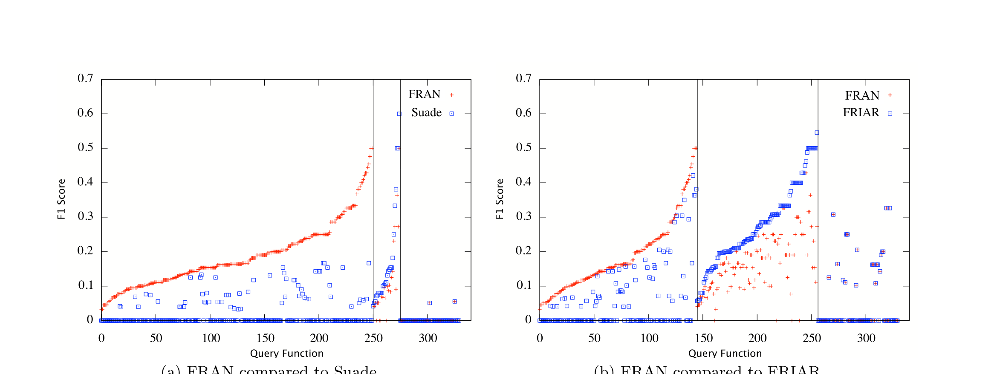

(a) FRAN compared to Suade (b) FRAN compared to FRIAR

Figure 3: Performance comparisons using the F1 measure and top-10 recommendation sets.

simply looks at the size of that function’s base set as generated by FRAN from the call graph, and if it is smaller than 45 (determined from Fig. 4(a) as the switch point) runs FRAN with that function and call graph as input, otherwise runs FRIAR. Fig. 4(b) gives the plot of the cumulative F-measure values for the three previous algorithms and CAR-B. It is apparent from the plot that both FRAN and FRIAR dominate Suade, but are complementary to each other. The advantage of CAR-B is obvious in that it benefits from and combines the advantages of both FRAN and FRIAR.

### Threats to validity

There are some potential threats to the validity of this study. First, our use of the Suade algorithm is restricted. The Suade algorithm is designed to accept a set of items as the input, but we only pass a set containing only a single item; this certainly helps account for the paucity of results returned by Suade. However, we argue that the problem of finding the set of functions related to a single function is just as important as the more general problem, especially to a developer new to the system, who will not be knowledgeable enough to build a good query set. Additionally, even with a larger query set Suade will still only select neighbors of the query set as potential results, ruling out the important sibling and spouse sets (which are not necessarily direct neighbors of the query nodes).

Also, the Suade algorithm can use several relations (not just the “calls” relation) to find related functions. However, we assert that the problem of finding related functions given only the call graph as input is important. There are numerous available tools to find a program’s call graph, while other relations may be more difficult to obtain.

Finally, the task that we have quantitatively evaluated, that of finding related functions from a given API, is a problem of limited scope. The case studies that we’ve presented on the broader problem of finding any related functions are only qualitative examples. In response, we first note that in spite of its limited scope, the API recommending problem is a very important one. Additionally, we contend that evaluating this type of algorithm is a difficult problem and that we contribute a methodology and an oracle to evaluate it quantitatively. Realistically, further review of the results of our algorithms by outside experts on Apache would be expensive and time consuming, and beyond the scope of this paper. Such a study is reserved for future work.

## 6. CONCLUSIONS

In this paper, we propose an approach to finding related functions, based on a random-walk approach. We find that this general, and rather brute-force approach, is surprisingly effective for finding related functions. We evaluated this purely structural approach using the Apache project, whose well-documented APIs provide a convenient evaluation target. The approach generalizes to object-oriented programs, which have many other types of relationships suitable for random walking. We hope in the future to build this into Eclipse.

In conclusion, we encourage readers to download our implementations of the FRAN and FRIAR algorithms and try them. The source code for our tools, and also the Apache callgraph data set, are available from http://macbeth.cs.ucdavis.edu/FRAN/. Also, the Suade algorithm is available from http://www.cs.mcgill.ca/~swevo/suade/.

## 7. ACKNOWLEDGMENTS

We thank the NSF Science of Design program for supporting this work. Further, we would like to thank the reviewers and Martin Robillard for their comments, but we wish to emphasize that we alone are responsible for the final content of this paper.

## 8. REFERENCES

[1] G. Ammons, R. Bodík, and J. Larus. Mining specifications. Proceedings of the 29th ACM SIGPLAN-SIGACT symposium on Principles of programming languages, pages 4–16, 2002.  
[2] Y. Benjamini and Y. Hochberg. Controlling the false discovery rate: a practical and powerful approach to multiple testing. Journal of the Royal Statistical Society B, 57:289–300, 1995.  
[3] W. Cohen. Inductive specification recovery: Understanding software by learning from example behaviors. Automated Software Engineering, 2(2):107–129, 1995.  
[4] T. Corbi. Program Understanding: Challenge for the 1990s. IBM Systems Journal, 28(2):294–306, 1989.