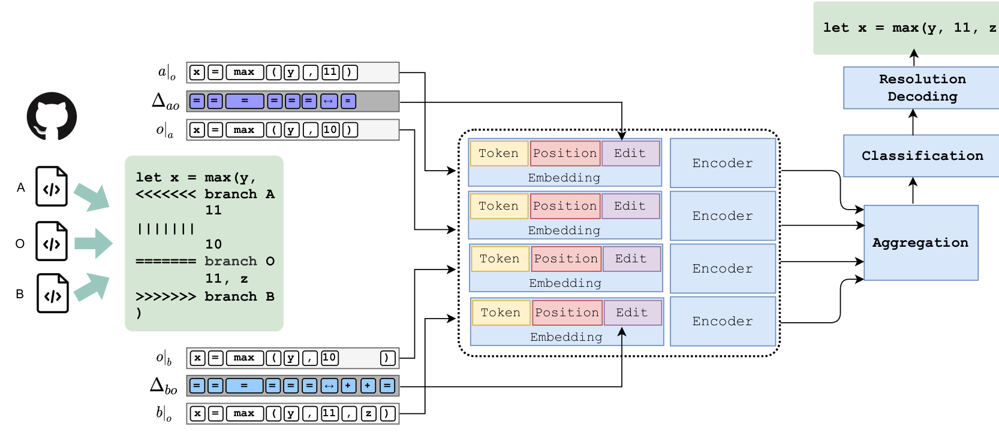
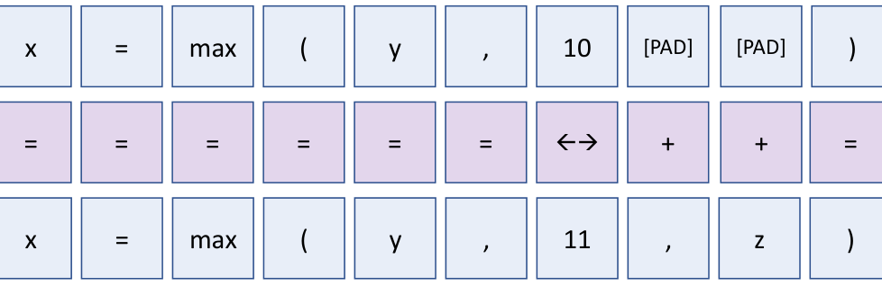
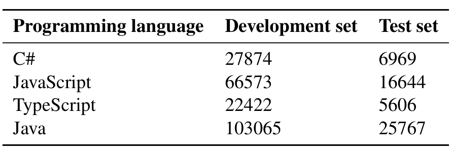
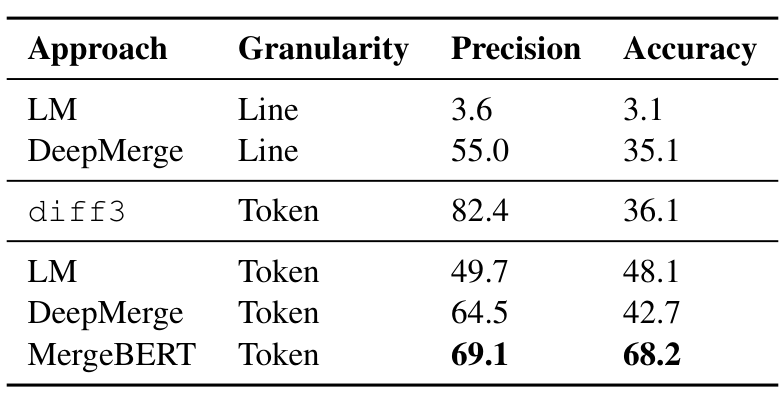
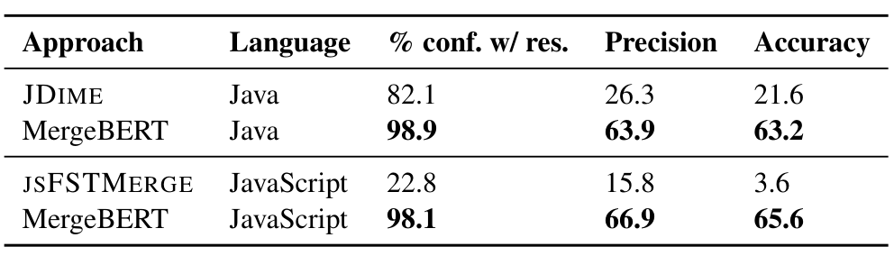
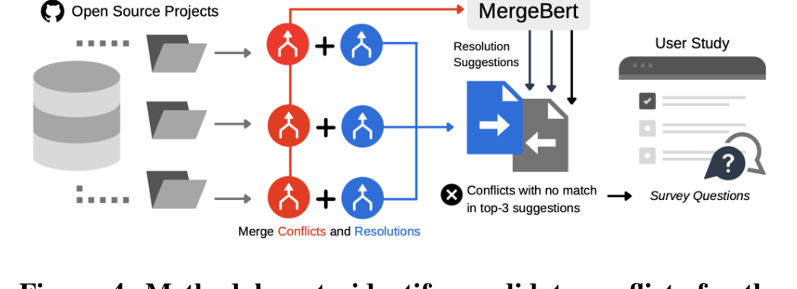

# Program Merge Conflict Resolution via Neural Transformers

Alexey Svyatkovskiy — Microsoft, Redmond, WA, USA  
Sarah Fakhoury — Washington State University, Pullman, WA, USA  
Negar Ghorbani — UC Irvine, Irvine, CA, USA

Todd Mytkowicz — Microsoft Research, Redmond, WA, USA  
Elizabeth Dinella — University of Pennsylvania, Philadelphia, PA, USA  
Christian Bird — Microsoft Research, Redmond, WA, USA

Jinu Jang — Microsoft, Redmond, WA, USA  
Neel Sundaresan — Microsoft, Redmond, WA, USA  
Shuvendu K. Lahiri — Microsoft Research, Redmond, WA, USA

## ABSTRACT

Collaborative software development is an integral part of the modern software development life cycle, essential to the success of large-scale software projects. When multiple developers make concurrent changes around the same lines of code, a merge conflict may occur. Such conflicts stall pull requests and continuous integration pipelines for hours to several days, seriously hurting developer productivity.

To address this problem, we introduce MergeBERT, a novel neural program merge framework based on token-level three-way differencing and a transformer encoder model. By exploiting the restricted nature of merge conflict resolutions, we reformulate the task of generating the resolution sequence as a classification task over a set of primitive merge patterns extracted from real-world merge commit data. Our model achieves 63–68% accuracy for merge resolution synthesis, yielding nearly a 3× performance improvement over existing semi-structured, and 2× improvement over neural program merge tools.

Finally, we demonstrate that MergeBERT is sufficiently flexible to work with source code files in Java, JavaScript, TypeScript, and C# programming languages. To measure the practical use of MergeBERT, we conduct a user study to evaluate MergeBERT suggestions with 25 developers from large OSS projects on 122 real-world conflicts they encountered. Results suggest that in practice, MergeBERT resolutions would be accepted at a higher rate than estimated by automatic metrics for precision and accuracy. Additionally, we use participant feedback to identify future avenues for improvement of MergeBERT.

> KEYWORDS  
> Software evolution, program merge, ml4code
>
> ACM Reference Format:  
> Alexey Svyatkovskiy, Sarah Fakhoury, Negar Ghorbani, Todd Mytkowicz, Elizabeth Dinella, Christian Bird, Jinu Jang, Neel Sundaresan, and Shuvendu K. Lahiri. 2022. Program Merge Conflict Resolution via Neural Transformers. In Proceedings of the 30th ACM Joint European Software Engineering Conference and Symposium on the Foundations of Software Engineering (ESEC/FSE ’22), November 14–18, 2022, Singapore, Singapore. ACM, New York, NY, USA, 12 pages. https://doi.org/10.1145/3540250.3549163

## 1 INTRODUCTION

Collaborative software development relies on version control systems such as git to manage and track changes across a codebase. In most projects, developers work primarily in a branch of a software repository, periodically synchronizing their code changes with the main branch via merges and pull requests [21]. When multiple developers make concurrent changes to the same line of code, a merge conflict may occur. Merge commits occur frequently, almost 12% of all commits are related to a merge [20], and up to 46% of those commits result in conflicts. Resolving merge conflicts is a time-consuming, complicated, and error-prone activity [6]. To resolve a conflict, developers must stop their workflow, understand conflicting changes, and identify a correct resolution. The ideal way to resolve a conflict is not always clear, and may require referring to project specification documentation or communicating with their peers about changes [6, 9, 13, 22, 33].

Modern version control systems such as git utilize the diff3 algorithm for performing unstructured line-based three-way merge of input files [42]. Thus, it is the de facto tool for merging and identifying merge conflicts in software development. This algorithm aligns the two-way diffs of two versions of the code, A and B, with the common base, O, into a sequence of diff “slots”. At each slot, a change from either A or B is selected. In cases where both A and B contain changes (relative to O) in the same slot (e.g., on the same line), there is a merge conflict. Standard merge algorithms cannot automatically determine the correct way to merge these conflicting changes. In these cases, developers must manually intervene in order to correctly resolve the conflicting code and complete the merge.

CCS CONCEPTS
- Software and its engineering → Software version control; Automatic programming.

Permission to make digital or hard copies of all or part of this work for personal or classroom use is granted without fee provided that copies are not made or distributed for profit or commercial advantage and that copies bear this notice and the full citation on the first page. Copyrights for components of this work owned by others than ACM must be honored. Abstracting with credit is permitted. To copy otherwise, or republish, to post on servers or to redistribute to lists, requires prior specific permission and/or a fee. Request permissions from permissions@acm.org.

ESEC/FSE ’22, November 14–18, 2022, Singapore, Singapore  
© 2022 Association for Computing Machinery.  
ACM ISBN 978-1-4503-9413-0/22/11...$15.00  
https://doi.org/10.1145/3540250.3549163

---

Over the past decade, several approaches have been proposed to improve the detection and automatic resolution of merge conflicts [4, 9, 10, 28, 30, 32, 45, 53]. Some approaches use the abstract syntax trees (ASTs) or other representations of the source code to improve conflict resolution [4, 49, 52]; others use a data-driven approach which uses deep learning to predict the correct merge [15]. Researchers have also developed tools to help developers visualize and navigate the merge conflict resolution process [41, 43, 44], and identified key needs of the developer community for effective tool support [33]. The sheer body of research dedicated to this problem represents a significant amount of time and effort. Despite these advancements, none of these approaches have been widely adopted into practice, and the git textual-based detection algorithm remains one of the most commonly used merging approaches [33].

In an effort to address this, we introduce MergeBERT: a neural program merge framework based on token-level three-way differencing and a multi-input variant of the bidirectional transformer encoder (BERT) model [14]. We formulate the task of generating a merge conflict resolution sequence as a classification task over a set of primitive merge patterns extracted from real-world merge commit data. MergeBERT encodes all inputs that a standard diff3 algorithm takes (two two-way diffs of input programs) as well as the edit sequence information, then aggregates them for learning. We train and then evaluate MergeBERT on 220,000 and 54,000 (respectively) real-world historical merge conflicts and their associated manual resolutions from 100,000 GitHub repositories in JavaScript, TypeScript, Java and C#, and find that it performs quite well, with precision and accuracy always over 60% (over 70% if the top three suggestions are considered). Further, we compare MergeBERT to existing state-of-the-art structured and semi-structured merge approaches (which are necessarily language-specific) and show that MergeBERT is able to provide resolution suggestions for more merge conflicts and the suggestions are correct (i.e., match the historical user manual resolution) more often.

To better evaluate the resolutions generated by MergeBERT from users’ perspective in practice, we also conduct a user study with 25 developers from large OSS projects. We ask participants to evaluate if MergeBERT resolution suggestions are acceptable on a set of 122 of their own real-world conflicts. Results show that MergeBERT merge resolutions would be accepted in practice despite not always being syntactically identical to the historical user resolutions, and we identify potential ways to improve MergeBERT and the merge conflict oracles used to evaluate neural program merge approaches.

We make available an online data package [19] containing the test dataset of conflicts and user resolutions, as well as the questions and responses gathered from our user study. We also provide an online Appendix with supplementary details and figures [18] (also uploaded with this submission).

We make the following contributions in this paper:
1. We introduce MergeBERT, a novel transformer-based program merge framework that leverages token-level three-way differencing and formulates the task of generating the resolution sequence as a classification task.
2. We evaluate MergeBERT against structured and semi-structured program merge tools like JSFSTMERGE and JDime, as well as neural program merge models [15]. We demonstrate that MergeBERT outperforms the state-of-the-art, achieving 2–3× higher accuracy on merge resolution.
3. We present an empirical evaluation of the perceptions of MergeBERT resolutions with 25 developers from large OSS projects, contributing the first user study in which developers use and evaluate an automatic merge conflict resolution tool on their own real-world conflicts.

## 2 MOTIVATING EXAMPLE

We use a number of terms, concepts, and ideas throughout this paper. To provide an intuition around how our approach works and concretely define terms and concepts, we begin with a motivating example of a small, but realistic merge conflict.

Fig. 1 provides an example merge conflict in JavaScript which shows the result of merging two concurrent changes to the same JavaScript file. Fig. 1(a) on the left shows the standard diff3 markers “<<<<<<< A.js”, “||||||| O.js”, “=======” and “>>>>>>> B.js”, which demarcate the conflicting regions introduced by programs A, base O, and B respectively. Here, O represents the lowest common ancestor of programs A and B in the version control history. We denote the program text of diff3 conflicting regions as A, B, O. The program text outside the conflicting regions — prefix and suffix — is common to all three program versions. Normally conflict files have the same name in different branches, but to avoid confusion, we name the original file in our example O.js, and the two concurrently edited versions of this file A.js and B.js. A.js changes “var x” to “let x” and the 10 to 11, while B.js changes the 10 to 11 and also adds an argument z.

MergeBERT attempts to automatically resolve merge conflicts in two phases. First, MergeBERT represents each line-level merge conflict instance at the token level which localizes conflicting regions. Intuitively, MergeBERT converts the three line-structured source texts into three sequences of tokens (including space and line delimiters), applies the standard diff3 algorithm to these token sequences, and then reconstructs the merged document at line level. Fig. 1(b) shows the result of applying this token-level merge on Fig. 1(a). As a result of token-level merge, the whole “let x = max(y,” string is cleanly merged, becoming a part of the program prefix, and “)” is prepended to the program suffix. Second, MergeBERT invokes an underlying neural model to suggest a resolution via classification for each token-level conflicting region and replaces the conflict region with the suggestion from the model (Fig. 1(c)).

Observe that the resolution does not consist of any single line from either A or B since both edits modify a common line in the base. Hence, earlier neural approaches such as DeepMerge [15] that are restricted to picking entire lines from the conflict region would not be able to provide the resolution. On the other hand, structured merge techniques (such as JSFSTMERGE by [50]) cannot resolve the conflict soundly as the conflict appears on a program statement, which leads to side effects (e.g. syntactically incorrect code).

A token-level merge can interleave edits within lines (i.e., tokens in which one edit does not conflict with another are trivially merged). Consider A’s edit of the var to let keyword. Such non-conflicting edits suffice to demonstrate the above. Token-level diff3 is a syntactic merge algorithm and therefore cannot guarantee semantic or

---

(a) Line-level conflict (b) Token-level conflict (c) Resolved merge

Figure 1: Example merge conflict represented through standard diff3 (left) and token-level diff3 (center), and the user resolution (right). The merge conflict resolution takes the token-level edit b.

Even syntactic correctness of the merged program. However, we observed that in practice, syntactic correctness is preserved the majority of the time (over 97%).

Likewise, consider the token-level conflict for the max function’s arguments: an appropriate model trained on JavaScript should easily deduce that taking the edit from B (i.e., "11, z") captures the behavior of A’s edit as well. The suggested resolution gives an intuitive demonstration of how MergeBERT turns a complex line-level resolution into a simpler token-level classification problem.

## 3 BACKGROUND: DATA-DRIVEN MERGE

Dinella et al. [15] introduced the data-driven program merge problem as a supervised machine learning problem. A program merge consists of a 4-tuple of programs (A, B, O, M), where

1. The base program O is the lowest common ancestor in the version history for programs A and B,
2. diff3 produces an unstructured line-level conflict when applied to (A, B, O), and
3. M is the merged program with the developer resolution, incorporating changes made in A and B.

A merge may have multiple unstructured conflicts, we define a merge tuple (A, B, O, M), where A, B, O correspond to the conflicting regions in (A, B, and O), respectively, and M denotes the resolution region. Given a set of merge tuples (A_i, B_i, O_i, M_i), i = 0...N, the goal of a data-driven merge algorithm is to learn a function, merge, that maximizes Σ_{i=0}^N merge(A_i, B_i, O_i) = M_i. Throughout the text, we will use notations (a, b, o, m) to refer to the token-level merge tuples.

Dinella et al. [15] also provide an algorithm for extracting the exact resolution regions for each merge tuple and define a dataset that corresponds to non-trivial resolutions; resolutions where the developer does not drop the changes from one side of the merge. Further, they provide a sequence-to-sequence encoder-decoder based architecture, where a bi-directional gated recurrent unit (GRU) is used for encoding the merge inputs comprising of (A, B, O) segments of a merge tuple, and a pointer mechanism is used to restrict the output to only choose from line segments present in the input. Their paper suffers from two limitations. First, given the restriction on copying only lines from inputs, their dataset did not consider merges where the resolution required token-level interleaving, such as the conflict in Figure 1. Second, their dataset consists of merge conflicts in a single language, namely JavaScript. Our approach addresses both of these limitations.

## 4 MERGE CONFLICT RESOLUTION AS A CLASSIFICATION TASK

In this work, we demonstrate how to exploit the restricted nature of merge conflict resolutions — compared to an arbitrary program repair — to leverage discriminative models to synthesize the merge resolution sequence. We have empirically observed that the application of diff3 at token granularity enjoys two useful properties over its line-level counterpart: (i) it helps localize the merge conflicts to small program segments, effectively reducing the size of conflicting regions, and (ii) most resolutions of merge conflicts produced by token diff3 consist entirely of changes from a or b or o or a sequential composition of a followed by b or vice versa. Here, and throughout the paper we will use lower case notations to refer to attributes of token-level differencing (e.g. a, b, and o are conflict regions produced by diff3 at token granularity). On the flip side, a token-level merge can introduce many small conflicts. To balance the trade-off, we start with the line-level conflicts as produced by the standard diff3 and perform a token-level merge of only the segments present in the line-level conflict. There are several potential outcomes for such a two-level merge at the line-level:

- A conflict-free token-level merge: For example, the edit from A about let is merged since B does not edit that slot as shown in Fig. 1(b).
- A single localized token-level merge conflict: For example, the edit from both A and B for the arguments of max yields a single conflict as shown in Fig. 1(b).
- Multiple token-level conflicts: Such a case (not illustrated above) can result in several token-level conflicts.

---

Figure 2: An overview of the MergeBERT architecture. From left to right: given conflicting programs A, B and O token-level differencing is performed first, next, programs are tokenized and the corresponding sequences are aligned (a|o and o|a, b|o, and o|b). We extract edit steps for each pair of token sequences (Δ_ao and Δ_bo). Four aligned token sequences are fed to the multi-input encoder neural network, while edit sequences are consumed as edit type embeddings. Finally, encoded token sequences are aggregated into a hidden state which serves as input to classification layer.

Token-level diff3 applied to a 4-tuple of programs (A, B, O, M), would usually result in a set of localized merge tuples ⟨a_j, b_j, o_j, m_j⟩. We empirically observe that 74% of such resolutions m_j are comprised of (i) exactly the tokens in a_j or (ii) exactly the tokens in b_j. Another 0.4% of the resolutions are (iii) just the tokens in o_j. In addition, 23% of the resolutions are the result of concatenating (iv) a_j and b_j or (v) b_j and a_j. Finally, 1.8% comprise another four variants, obtained by taking i, ii, iv and v above and removing the tokens that also occur in the base, o_j. In total, this provides nine primitive merge resolution patterns (see online Appendix [18] for more details about the primitive merge patterns).

We, therefore, treat the problem of constructing merge conflict resolutions m_j as a classification task to predict between these possibilities. It is important to note that although we are predicting simple resolution strategies at the token-level, they may translate to complex resolutions at the line-level. In addition, not all conflicts are resolved by breaking that conflict into tokens and applying these patterns—some resolutions such as those introducing new tokens or reordering tokens are not expressible as a choice at the token-level.

## 5 MERGEBERT: NEURAL PROGRAM MERGE FRAMEWORK

MergeBERT is a textual program merge model based on the bidirectional transformer encoder (BERT) model [14]. We refer the reader to CodeBERT [17] for a discussion on applying transformers to code. A transformer, like a recurrent neural network, maps a sequence of text into a high dimensional representation, which can later be decoded to solve downstream tasks. While not originally designed for code, transformers have found many applications in software engineering [11, 26, 47].

MergeBERT approaches merge conflict resolution as a sequence classification task given conflicting regions extracted with token-level differencing and surrounding code as context. The key technical innovation in MergeBERT lies in how it breaks program text into an input representation amenable to learning with a transformer encoder and how it aggregates various input encodings for classification.

In the standard sequence learning setting there is a single input and single output sequence. In the merge conflict resolution task, there are multiple conflicting input programs and one resolution. To facilitate learning in this setting, we construct MergeBERT as a multi-input encoder neural network, which first encodes token sequences of conflicting programs, then aggregates them into a single hidden summarization state.

An overview of the MergeBERT model architecture is shown in Fig. 2. Given conflicting programs A, B and O we first perform tokenization and then repeat the three-way differencing at token granularity. If a conflict still exists in this token-level three-way differencing, we collect the token sequences corresponding to conflicting regions a, b, and o, and compute pair-wise alignments of a and b with respect to the base o. Finally, for each pair of aligned token sequences we extract an "edit sequence" that represents how to turn the second sequence into the first. The resulting aligned token sequences are fed to the multi-input encoder neural network, while the corresponding edit sequences are consumed as type embeddings. Finally, the encoded token sequences are summarized into a hidden state which serves as input to the classification layer.

Given a 4-tuple of programs (A, B, O, M) which contains token-level merge tuples (a_j, b_j, o_j, m_j), j = 0...N, MergeBERT models the following conditional probability distribution:

p(m_j | a_j, b_j, o_j), (1)

and consequently, for entire programs:

p(M | A, B, O) = ∏_{j=1}^N p(m_j | a_j, b_j, o_j) (2)

---

Figure 3: An example edit sequence extracted between a pair of token sequences. Top row is o|b, bottom is b|o, and middle is ∆bo. Padding symbols [PAD] are introduced for alignment. In this case, the target token sequence is obtained by swapping a token and inserting two tokens.

Independence of token-level conflicts is a simplifying assumption. However, we observe that in our data set only 5% of merge conflicts result in more than 1 token-level conflict per line-level conflict.

### 5.1 Context Encoding

For a merge tuple (a, b, o, m) MergeBERT calculates two pair-wise alignments between the sequences of tokens of conflicting regions a (respectively b) with respect to that of the original program o: a|o, o|a, b|o, and o|b. For each pair of aligned token sequences we compute an edit sequence. These edit sequences — ∆ao and ∆bo — are comprised of the following editing actions (kinds of edits): = represents equivalent tokens, + represents insertions, - represents deletions, ↔ represents a replacement, and ∅ is used as a padding token. Overall, this produces four token sequences and two edit sequences: (a|o, o|a, and ∆ao) and (b|o, o|b, and ∆bo). Fig. 3 provides an example of an edit sequence. Each token sequence covers the corresponding conflicting region and, potentially, surrounding code tokens. We make use of Byte-Pair Encoding (BPE) unsupervised tokenization to avoid a blowup in the vocabulary size given the sparse nature of code identifiers [27]. To help the model learn to recognize editing steps we introduce an edit type embedding. We combine it with the standard token and position embeddings utilized in BERT model architecture via addition.

### 5.2 Merge Tuple Aggregation

We utilize transformer encoder model E to independently encode each of the four token sequences of token-level conflicting regions a|o, o|a, b|o, and o|b, passing corresponding edit sequences ∆ao and ∆bo as type embeddings. Finally, MergeBERT aggregates the resulting encodings into a single hidden summarization state h:

h = ∑_{x ∈ (a|o, o|a, b|o, o|b)} θ_x · E(x, ∆x)  (3)

where E(x, ∆x) are the encoded tensors for each of the sequences x ∈ (a|o, o|a, b|o, o|b), and θ_x are learnable weights. After aggregation a linear classification layer with softmax is applied:

p(m_j | a_j, b_j, o_j) = softmax(W · h + b)  (4)

The resulting line-level resolution region is obtained by concatenating the prefix, predicted token-level resolution m_j, and the suffix. Finally, in the case of a one-to-many correspondence between the original line-level and the token-level conflicts (see Appendix for more details and a pseudocode), MergeBERT uses a standard beam-search to decode the most promising predictions.

### 5.3 Implementation Details

We utilize a pretrained CodeBERT1 model with 6 encoder layers, 12 attention heads, and a hidden state size of 768. The vocabulary is constructed using byte-pair encoding [39] and the vocabulary size is 50,000. We transfer the weights of the pretrained transformer encoder into the MergeBERT multi-input neural network, and attach a randomly initialized linear layer with softmax. We then finetune the resulting neural network in a supervised setting for the sequence classification task. Input sequences for finetuning training cover conflicting regions and surrounding code (i.e., fragments of prefix and suffix of a conflicting region) up to a maximum length of 512 BPE tokens. The backbone of our implementation is HuggingFace’s2 RobertaModel and RobertaForSequenceClassification classes in PyTorch, which are modified to turn the model into a multi-input architecture shown in Fig. 2. We finetune MergeBERT with Adam stochastic optimizer with weight decay fix using a learning rate of 5e-5, 512 batch size and 8 backward passes per allreduce. The finetuning training was performed on 4 NVIDIA Tesla V100 GPUs with 16GB memory for 6 hours.

In the inference phase, the model prediction for each line-level conflict consists of one or more token-level predictions. Given the token-level predictions and the contents of the merged file, MergeBERT generates the code corresponding to the resolution region. The contents of the merged file include the conflict in question and its surrounding regions. Afterward, MergeBERT checks the syntax of the generated code with a tree-sitter3 parser and outputs it as the candidate merge conflict resolution only if it is syntactically correct.

## 6 RESEARCH QUESTIONS

We pose the following research questions to evaluate the effectiveness of utility of MergeBERT.

- RQ1: How effective is MergeBERT in producing merge conflict resolutions? We evaluate MergeBERT’s performance of producing resolutions in terms of precision and accuracy of matching the actual user resolution extracted from real-world merge resolutions. We also provide a comparison MergeBERT to baseline approaches (at both the line and token level) and state of the art merge resolution approaches.

- RQ2: How well does MergeBERT perform across different languages? One of our primary goals is to be able to work on multiple languages with minimal effort. The core approach of MergeBERT is fundamentally language agnostic (though a parser and tokenizer is required for each additional language). We evaluate performance of MergeBERT across four languages and also compare the results of using four language-specific models (each trained on just one language) to using one multi-lingual model trained on the data from all four languages.

1 https://huggingface.co/huggingface/CodeBERTa-small-v1
2 https://github.com/huggingface/transformers
3 https://tree-sitter.github.io/tree-sitter

---

RQ3: How do different choices of context encoding impact performance of MergeBERT? We conduct an ablation study of the edit type embedding to understand and evaluate the impact of our novel edit-aware encoding on model performance.

RQ4: How do users perceive MergeBERT resolutions? We conduct a user study involving a survey of real-world conflicts recently encountered by developers from large OSS projects. To understand how developers would use MergeBERT in practice, we provide them with an interface to explore MergeBERT’s conflict resolution suggestions in relation to their original conflicting code and ask them to evaluate suggestions and explain why they do or do not correctly resolve the merge conflict.

## 7 DATASET

The finetuning dataset is mined from over 100,000 open source software repositories in multiple programming languages with merge conflicts. It contains commits from git histories with exactly two parents, which resulted in a merge conflict. We replay git merge on the two parents to see if it generates any conflicts. Otherwise, we ignore the merge from our dataset. We use the approach introduced by Dinella et al. [15] to extract resolution regions—however, we do not restrict ourselves to conflicts with less than 30 lines only. Lastly, we extract token-level conflicts and conflict resolution classification labels (introduced in Section 4) from line-level conflicts and resolutions. Tab. 1 provides a summary of the finetuning dataset.

Table 1: Number of merge conflicts in the dataset.

The finetuning dataset is split into development and test sets in the proportion 80/20 at random at the file-level. The development set is further split into training and validation sets in 80/20 proportion at the merge conflict level.

## 8 EVALUATION

### 8.1 Evaluation Metrics

We evaluate MergeBERT’s performance of resolution synthesis in terms of precision and accuracy of string match (modulo whitespaces or indentation) to the user resolution extracted from real-world historical merge resolutions. This approach is rather restrictive as a suggested resolution might differ from the actual user resolution by, for instance, only the order of statements, being semantically equivalent otherwise. As such, this evaluation approach gives a lower bound of performance.

We evaluate MergeBERT and compare it to baselines and existing approaches using two metrics, precision at top-k and accuracy at top-k. Since MergeBERT is a neural approach, it may provide more than one suggestion, which we rank according to the associated prediction probabilities. In addition, because we filter out resolution

suggestions that are not syntactically valid, it may provide no suggestions in rare cases. Accuracy at top-1 indicates the percentage of total conflicts for which MergeBERT produces the correct resolution as its top suggestion. Precision at top-1 indicates how often (as a percentage) the top suggestion is correct when the MergeBERT provides any suggestions at all. As a concrete example, if a tool produces a resolution suggestion for 50 out of 100 conflicts and 40 of the suggestions matched the actual historical user resolution, then the precision would be 80% (40/50), but the accuracy would be 40% (40/100). Precision at top-k indicates how often the correct resolution is found in the top-k suggestions and Accuracy at top-k is analogous. When "top-k" is omitted from the metric name (e.g. just "Precision") then k is 1.

### 8.2 Baseline Models

#### 8.2.1 Language Model Baseline
Neural language models (LMs) have shown great performance in natural language generation [36, 38], and have been successfully applied to the domain of source code [17, 24, 48]. We consider the generative pretrained transformer language model for code (GPT-C) and appeal to the naturalness of software [1] to construct our baseline approach for the merge resolution synthesis task. We establish the following baseline: given an unstructured line-level conflict produced by diff3, we take the common source code prefix acting as user intent for program merge. We attempt to generate an entire resolution region token-by-token using beam search. As an ablation experiment, we repeat this for the conflicts produced with the token-level differencing algorithm (Fig. 1 shows details about prefix and conflicting regions).

#### 8.2.2 DeepMerge: Neural Model for Interleavings
Next, we consider DEEPMERGE [15]: a sequence-to-sequence model based on the bidirectional GRU summarized in section 3. It learns to generate a resolution region by choosing from line segments present in the input (line interleavings) with a pointer mechanism. We retrain the DEEPMERGE model on our TypeScript dataset.

#### 8.2.3 JDIME
Looking for a stronger baseline, we consider JDIME, a Java-specific merge tool that automatically tunes the merging process by switching between structured and unstructured merge algorithms [2]. Structured merge is abstract syntax tree (AST) aware and leverages syntactic information to improve matching precision of conflicting nodes. We use the publicly available implementation [25], and run JDime in semi-structured mode.

#### 8.2.4 jsFSTMerge
Trindade Tavares et al. [50] implemented JSFSTMERGE by adapting an off-the-shelf grammar for JavaScript to address shortcomings of FSTMERGE [3] and modify its algorithm. JSFSTMERGE allows for certain types of nodes to maintain their relative order (e.g., statements) while others may be order independent (e.g., function declarations) even when sharing the same parent node. For cases where JSFSTMERGE produces a resolution not matching the user resolution, we manually inspect the output for semantic equivalence (e.g., reordered import statements).

### 8.3 Results

RQ1: How effective is MergeBERT in producing merge conflict resolutions?

---

To evaluate MergeBERT we first compare it to other neural approaches and to diff3. To be comprehensive, we evaluate at both the token level and the line level. We then compare MergeBERT to existing state of the art structured and semi-structured merge language-specific merge approaches.

Table 2: Evaluation results for MergeBERT and various neural baselines calculated for merge conflicts in TypeScript programming language test set. The table shows top-1 precision and accuracy metrics.

As seen in Tab. 2, language model baselines’ performance on merge resolution synthesis is relatively low, suggesting that the naturalness hypothesis is insufficient to capture the developer intent when merging programs. This is perhaps not surprising given the notion of precision that does not tolerate even a single token mismatch.

MergeBERT is based on two core components: token-level diff3 and a multi-input neural transformer model. The token-level differencing algorithm alone gives a high top-1 precision of 82.4%, with a relatively low accuracy of only 36.1% (i.e., it doesn’t always generate a resolution suggestion, but when it does, it is very often correct). Combined with the neural transformer model, the accuracy is increased to a total of 68.2%. Note, as a deterministic algorithm token-level diff3 can only provide a single suggestion.

DeepMerge precision of merge resolution synthesis is quite admirable, showing 55.0% top-1 precision. However, it fails to generate predictions for merge conflicts which are not representable as a line interleaving. This type of merge conflict comprises only roughly one third of the test set, resulting in an accuracy of only 35.1% which is significantly lower than MergeBERT.

As an experiment, we also evaluate the DeepMerge model in combination with the token-level diff3. This enables DeepMerge to overcome the limitation of providing only resolutions comprised of interleavings of lines from the conflict region by interleaving tokens instead. As seen in Tab. 2 (DeepMerge with Token granularity) overall accuracy improves from 35.1% to 42.7%. However this still falls short of MergeBERT with precision that is 5% less (64.5% vs. 69.1%) and accuracy that is 25% less (42.7% vs. 68.2%).

We also compared MergeBERT to state of the art structured and semi-structured merge tools. Since both JDIME and JSFSTMERGE are language-specific, to compare against MergeBERT, we use our dataset’s corresponding language-specific subset of conflicts (leading to slightly different results for MergeBERT on Java and JavaScript). As can be seen from Tab. 3, JSFSTMERGE only produces a resolution for 22.8% of conflicts and when a resolution is produced by JSFSTMERGE, it is only correct 15.8% of the time, yielding a total accuracy of 3.6%. This is in line with the conclusions of the creators of JSFSTMERGE that semi-structured merge approaches may not be

Table 3: Comparison of MergeBERT to JDIME and JSFST-MERGE semi-structured merge tools. The table shows the percentage of conflicts in which the tool produces a resolution, the top-1 precision of produced resolutions, and the overall top-1 accuracy of merge resolution synthesis. JDIME evaluation is on a Java data set and JSFSTMERGE is on a JavaScript data set.

as advantageous for dynamic scripting languages [50]. Because JSFSTMERGE may produce reformatted code, we manually examined cases where a resolution was produced but did not match the user resolution (our oracle). If the produced resolution was semantically equivalent to the user resolution, we classified it as correct.

To compare the accuracy of JDIME to that of MergeBERT, we use the Java Test dataset introduced previously and complete the following evaluation steps: JDIME does not merge all conflicts and generates a resolution for 82.1% of conflicts. This is in line with related work reporting that as much as 21% of files cannot be merged [2]. Therefore, first, we identify the set of merge conflict scenarios where diff3 reports a conflict and JDIME produces a non-conflicted merge. When comparing the JDIME output to the actual historical user-performed merge conflict resolution, we do not use a simple syntactic match. As a result of its AST matching approach, code generated by JDIME is reformatted, and the original order of statements and other constructs are not always preserved. In an effort to accurately and fairly identify semantically equivalent merges, we use GumTree [16], an AST differencing tool, to identify and ignore semantically equivalent differences between JDIME output and the user resolution, such as reordered method declarations. When JDIME produces a resolution, it generates a semantically equivalent match 26.3% of the time, with an accuracy of 21.6%.

RQ2: How well does MergeBERT perform across different languages? One goal of our approach is to be able to handle multiple languages with minimal effort. For MergeBERT to be able to provide merge resolution suggestions for conflicts in a particular language, it needs three things. First, a tokenizer in that language, which allows us to split the source text into tokens for processing. Second, a parser in that language, which allows us to filter out syntactically incorrect merge resolution suggestions. Third, a dataset of merge conflicts and their user-resolutions to train MergeBERT. Fortunately, tokenizers and parsers for nearly any language are readily available (e.g., we use GitHub’s tree-sitter for this) and repositories that use a particular language can be easily identified (e.g., on GitHub) and mined for conflicts and resolutions.

We incorporated tokenizers and parsers into MergeBERT for JavaScript, TypeScript, Java, and C# and gathered merge conflict data for these languages as described previously. Note that both comments and strings in these languages are represented as single tokens and can be quite long. Therefore we further split these tokens on whitespace. Tab. 4 shows the detailed evaluation results of MergeBERT broken down by language. The top section of results

---

Table 4: Detailed evaluation results for (top) monolingual JavaScript, TypeScript, Java, and C# models, and (bottom) multilingual MergeBERT model trained on all four programming languages. The table shows precision and accuracy of merge resolution synthesis.

| Test (Train) Languages | Precision (Top-1) | Precision (Top-3) | Accuracy (Top-1) | Accuracy (Top-3) |
|---|---:|---:|---:|---:|
| JavaScript (JS) | 66.9 | 75.4 | 65.6 | 73.9 |
| TypeScript (TS) | 69.1 | 76.6 | 68.2 | 75.6 |
| Java (Java) | 63.9 | 76.1 | 63.2 | 75.2 |
| C# (C#) | 68.7 | 76.4 | 67.3 | 74.8 |
| JavaScript (JS, TS, C#, Java) | 66.6 | 75.2 | 65.3 | 73.8 |
| TypeScript (JS, TS, C#, Java) | 68.5 | 76.8 | 67.6 | 75.8 |
| Java (JS, TS, C#, Java) | 63.6 | 76.0 | 62.9 | 75.1 |
| C# (JS, TS, C#, Java) | 66.3 | 76.2 | 65.1 | 74.8 |

shows performance when MergeBERT is trained on data for that specific language. The bottom section shows performance for each language when MergeBERT is trained on a data set comprising data for all languages (we term this the multilingual model). Note that for the language specific models, performance is fairly consistent across all four languages with Top-1 precision ranging from 63.9% to 69.1% and Top-1 Accuracy ranging from 63.2% to 68.2%. We also find that over 97% of MergeBERT suggestions are syntactically correct across all programming languages.

We had no a priori expectations of the performance of the multilingual model, as it is trained on more data, which could lead to improvement, but it is not language specific, which could lead to poorer results. Overall, the multilingual variant of the model generates results that are just slightly below the monolingual versions. Thus performance on one language isn’t improved by adding more data in other languages. Thus, from a pragmatic perspective, if one chooses to simplify their use of MergeBERT by training just one model instead of one model per language, then the performance takes only a negligible hit.

RQ3: How do different choices of context encoding impact performance of MergeBERT?

We conduct an ablation study on the edit type embedding to understand the impact of edit-awareness of encoding on the model performance. As shown in Tab. 5, use of the edit type embedding improves MergeBERT from 63% to 68%.

Table 5: Evaluation results for MergeBERT and the model variant without edit-type embedding for merge conflicts in TypeScript programming language test set. The table shows top-1 precision and accuracy metrics.

| Approach | Precision | Accuracy |
|---|---:|---:|
| w/o edit type embeddings | 65.2 | 63.1 |
| MergeBERT w/ edit type embeddings | 69.1 | 68.2 |

Figure 4: Methodology to identify candidate conflicts for the user study.

Table 6: Summary of projects in user study, total number of conflicts per project, number of conflicts evaluated in the study, and the survey participants.

| Language | Project | Conflicts | Survey Conflicts | Participants |
|---|---|---:|---:|---|
| Java | Azure-Cosmosdb | 341 | 6 | P1 |
| Java | Azure-SDK | 997 | 14 | P2-4 |
| Java | ApplicationInsights | 313 | 10 | P5-6 |
| TS | MakeCode | 106 | 12 | P7-8 |
| TS | VSCode | 2256 | 48 | P9-17 |
| C# | AspNetCore | 567 | 11 | P18-19 |
| C# | EFCore | 397 | 7 | P20-21 |
| C# | Roslyn | 1894 | 14 | P22-25 |
| Total | 8 projects | 6871 | 122 | 25 |

## 9 USER EVALUATION

### 9.1 User Study Design

To better understand how MergeBERT performs in practice, we ask developers about conflicts that MergeBERT is unable to correctly resolve. Since MergeBERT’s resolution suggestions are evaluated against user resolutions using a verbatim string match (modulo whitespace), asking study participants to confirm identical resolutions predicted by MergeBERT is not informative. Therefore, we extract conflicts where MergeBERT suggestions are not a direct match to the user resolution to determine what the limitations of the suggestions are, and how they might be perceived in practice.

To build an oracle of merge conflicts and resolutions we identify 8 open source projects hosted on GitHub. The selected projects are active, with multiple contributors, and contain a large number of conflict scenarios in one of the languages supported by MergeBERT. Tab. 6 contains a list of projects chosen. For each project, we follow the same steps outlined in Section 7 to extract candidate conflicts and user resolutions to use in the survey.

Fig. 4 explains the methodology used to identify candidate merge conflicts. We identify the set of conflicts MergeBERT is unable to correctly merge (within the top-3 suggestions). From this set of conflicts, we identify candidate conflicts to use as part of the user study. We filter candidate files with the following criteria:

(1) Conflicts should have been recently resolved i.e., at most within the past 12 months. Participants may not retain the context needed to evaluate suggestions for older conflicts.

---

(2) Files must have at most 4 conflicts. Participants evaluate up to 3 suggestions per conflict. More conflicts may be too complex to evaluate within the interview time slot.

(3) Conflicts should be non-trivial. Trivial conflicts, such as those that only involve formatting changes or renames, are manually excluded. The determination of if a conflict was non-trivial was manual and subjective, informed by our belief that more substantive conflicts would lead to more insights in the user study.

For each candidate conflict identified, we use the GitHub API to identify authors for each of the conflicting branches and the resolved file. Authors with at least 3 candidate merge conflicts are identified as potential survey participants. Our final pool of candidate participants consists of 52 unique authors. We recruit participants via email, using contact information on GitHub. Out of the 52 contacted developers, 25 agreed to participate in the study. All participants were professional software developers with at least 2–8 years of experience working at large technology companies. We asked participants to evaluate MergeBERT resolution suggestions for their own merge conflicts. Tab. 6 contains the final number of participants and conflicts evaluated in our study. 122 conflicts were evaluated: 32 C# conflicts, 30 Java, and 60 Typescript.

### 9.1.1 MergeBERT Interface

We designed an online interface where participants can view their own conflicts and explore MergeBERT’s resolution suggestions. Participants are asked to evaluate their own recently resolved merge conflicts, and the corresponding generated resolution suggestions by MergeBERT. The interface is customized based on the signed-in participant and displays a list of their recently encountered merge conflicts. Participants can click through different resolution suggestions to evaluate if they are acceptable ways to resolve the merge conflict. They can view their original resolution on the same page, and if needed, participants can navigate to the conflicting commit on GitHub using a link if they need additional context. They can also view a diff between the conflict file and any of the selected options (resolution suggestion or user resolution). Participants use this interface to select one or more of the suggested resolutions, indicate if the suggested resolution is acceptable, and explain the reasons why or why not. Our online data package [19] and appendix [18] contain the questions, images of the interface, and participant responses.

### 9.1.2 Protocol

The user study was conducted as 30 minute interviews remotely over Microsoft Teams using the interface we built. First, participants watched a video explaining MergeBERT and how to navigate conflicts and evaluate resolution suggestions using the interface. Then, the participants evaluated a set of conflicts and submitted their responses. One of the authors was on the teams call to help participants navigate the interface and ask any clarifying questions based on their evaluation of the MergeBERT resolution suggestions. Questions were iteratively developed based on two pilot interviews. Each interview was recorded for transcription and analysis.

## 9.2 User Study Results

RQ4: How do users perceive MergeBERT resolutions?

Using the interface, participants evaluate the conflict resolution suggestions generated by MergeBERT and indicate if any of the suggestions were acceptable, and explain why or why not. There were no noticeable differences in the participants’ responses across different languages or projects so we do not break down our results by those dimensions. Participants’ evaluations of the merge suggestions generally fall into three categories: 1) the merge suggestion is correct and would be used to resolve the conflict 2) the merge is incorrect but the correct resolution would require an understanding of external context and 3) the merge is incorrect and no external context is needed.

### 9.2.1 Acceptable Merge Suggestions

Surprisingly, of the 122 conflicts included in the study, participants indicated that at least one of the 3 suggestions generated by MergeBERT was correct for 54% (66/122) of the examples. By design, the suggestions presented in the study are not syntactically equivalent to the participant’s original resolution, however, they still indicated that the suggestion was a correct merge. Using participant responses, we identify a few reasons why merge suggestions may be acceptable to a developer, even if it is not syntactically equivalent to their original resolution:

#### Semantically Equivalent Resolution (54 of 122 conflicts)

Semantically equivalent resolutions include scenarios where the statements are re-ordered, equivalent changes made to naming or documentation, and unneeded import statements or commented out code is preserved or removed.

One example in the study of conflicting changes that are both equally acceptable, and one is arbitrarily accepted by the resolving author is when authors of conflicting branches renamed the same variable with a slight variation:

`SPAN_TARGET_ATTRIBUTE_NAME` and `SPAN_TARGET_APP_ID_ATTRIBUTE_NAME`.

In these cases, either version selected by the merging algorithm might still be acceptable to the developer. MERGEBERT generated a suggestion to keep the variable name `SPAN_TARGET_ATTRIBUTE_NAME` whereas the user resolution originally kept the other. Participant P5 marked this resolution as acceptable and semantically equivalent, explaining that in this scenario they had ‘no preference as to which one is better’.

> Takeaway 1: Evaluating the performance of MergeBERT using strict syntactic approaches estimates a lower bound of performance. Survey results show almost 45% of MergeBERT suggestions are acceptable merges that are semantically equivalent to the participant’s original resolution. MergeBERT’s performance could be improved by considering semantic information, for example, to identify how changes related to naming or documentation should be merged.

### Tangled Code Changes in Oracle (10/122)

Resolutions for 10 of the conflicts contained additional “tangled” changes [23, 29] that were unrelated to the resolution. Examples include renaming a method and adding a variable in the conflict region that is then used later outside the conflict region. In all 10 instances, MERGEBERT generates a suggestion that does not include the additional tangled code, but is acceptable to the participant as a resolution of the conflict. Participants indicated that if they had

---

> Takeaway 2: When committing merged code, developers may introduce changes unrelated to the conflict which are inadvertently included in conflict resolution oracles. These changes can negatively impact model performance estimated with automatic metrics.

## 9.2.2 Merge Requires External Context
MERGEBERT did not generate an acceptable suggestion for 46% (56/122) of examples shown to survey participants. Participants were asked to indicate whether they resolved these examples using external context that cannot be inferred from the conflicting code regions and to explain what the external context was. Results indicate that 16% (20/122) of conflicts in the survey sample require external information not found in either conflicting file, in order to be correctly resolved. One example of external context is knowledge of linter rules enabled at a project level. Projects often require linter checks before code can be committed to the repository, as a step towards improving the quality and maintainability of the source code. One example is a merge conflict from Roslyn where the correct resolution was to remove a null check from the code. Participant P23 explained the decision to remove the check: "The previousResults parameter is non-nullable because C# nullability checking is now enabled at the project level. The null check is unnecessary". In this scenario, without specific knowledge of linter checks, an automatic approach is unable to predict an accurate merge.

Another example of external context is updates to language rules that have cascading effects on existing code. Participant P22 from the Roslyn project explained one such conflict: "Changes were due to updates in 'using' rules for the C# language". Language updates in C# version 8.0 introduced an alternative syntax for the using statement, and P22’s team had to adopt this syntax. P22 therefore updated this code (involved in the conflict) during the merge. Other examples of external context identified through the survey include: removal of global dependencies from non-conflicting files within a project, rolling back features that shouldn’t be included in a release branch, and project-level decisions to remove 'final' modifiers for variables.

> Takeaway 3: The local view of a conflict is sufficient to merge a majority of conflicts. Around 16% of the conflicts require external information to correctly resolve. One direction to improve MergeBERT is to consider external context as an additional information source for resolving conflicts.

## 9.2.3 Unacceptable Merge Suggestions
Survey results show that MERGEBERT suggestions were incorrect for 29% (36/122) of the conflicts. Participants indicated that none of the 36 conflicts required external context to be resolved. We manually analyze the conflicts looking to identify patterns that may explain the incorrect merges, for example, affected language construct [34] and type of conflict [40], but do not identify any consistent patterns. In summary, existing automatic evaluation strategies estimate a lower bound of approach performance: MergeBERT suggestions are correct for 54% of conflicts included in our sample, despite not being syntactically

Further, suggestions from MergeBERT helped two participants find bugs in their own recent merge conflict resolutions! This is in addition to those resolutions where MergeBERT does provide an exact match. This finding suggests that automatic evaluation techniques that rely on a strict syntactic comparison between the user resolution and merge suggestion might be estimating a much lower bound of performance. This highlights a discrepancy between how approaches are typically automatically evaluated, and how developers may evaluate an approach in practice. Researchers should consider conducting user studies to more accurately evaluate approaches when feasible. Tools like MergeBERT can reduce effort and bug proneness involved in manually merging conflicts. Future studies should investigate these potential benefits.

## 9.3 Related Work
There have been multiple attempts to improve merge algorithms by restricting them to a particular programming language or a specific type of applications [32]. Typically, such attempts result in algorithms that do not scale well or have low coverage. Syntactic merge algorithms improve upon diff3 by verifying the syntactic correctness of the merged programs. Several syntactic program merge techniques have been proposed [5, 52] which are based on parse trees or ASTs and graphs.

Apel et al. noted that structured and unstructured merge each has strengths and weaknesses. They developed FSTMERGE, a semi-structured merge, that alternates between approaches [4]. Tavares et al. implemented JSFSTMERGE by adapting an off-the-shelf grammar for JavaScript to address shortcomings of FSTMERGE and also modifying the FSTMERGE algorithm itself [49]. Cavalcanti et al. performed a large scale retrospective evaluation of semi-structure merge on over 30,000 merges and found that it can still suffer from false negatives, cases where there is actually a semantic conflict but the merge approach produces a (incorrect) resolution [10]. They improve FSTMERGE by adding “handlers” that check for common false negative cases (e.g. renames, added references to modified elements) that remove these cases completely. Leßenich noted that using AST representations works well for merge, but differencing is NP-hard due to renamings and shifted code. They propose an approach to improve performance of the JDIME algorithm at minimal cost [30]. Dinella et al. take a data driven approach to the merge conflict resolution problem and introduce DEEPMERGE, a deep neural network that uses a pointer network architecture to construct the resolution from lines in the different input versions of the code [15].

Finally, Sousa et al. [46] explore the use of program verification to certify that a merge obeys a semantic correctness criteria, but does not help synthesize resolutions. On the other hand, Pan et al. [35] explore using program synthesis to learn repeated merge resolutions within a project. However, the approach is limited to a single C++ project, and only deals with restricted cases of import statements.

### 9.3.1 Empirical Studies
Several empirical studies have investigated merge conflicts and challenges faced by developers in merge resolution. McKee et al. [31] and Nelson et al. [33] interviewed developers and performed a follow-up survey with 162 developers to build a detailed understanding of developer perceptions regarding merge conflicts in general. They found, among other things, that complexity of the conflicting lines of code and file as a whole, the

---

number of LOC in the conflict, and developers’ familiarity with the conflicting lines of code impact how difficult developers find a conflict to resolve. Brindescu et al. investigated the impact of merge conflicts and their resolutions on software quality [7, 8]. They found that 20% of code changes resulted in a merge conflict and the code in these conflicts were twice as likely to contain bugs as other changes. Further, if the changes included semantically interacting changes, the likelihood of a defect is 26 times that of non-conflicting changes.

Costa et al. presented TIPMerge, an approach for identifying and recommending developers to participate in merge sessions when resolving conflicts [12]. They evaluated it on 2,040 merges across 25 open source projects and found that TIPMerge can improve joint knowledge coverage by an average of 49% in merge scenarios [13].

Vale et al. [51] performed an empirical study to understand what makes merge challenging for developers. Through a large scale automated analysis and a survey of 140 developers, they identified factors that contribute to merge conflict resolution difficulty (e.g., number of chunks in the conflict and number of developers involved in the merge scenario). Seibt et al. [37] explore and evaluate merge algorithms on a suite of ten software repositories, paying attention to the amount of resolutions produced, size of conflict, runtime cost, and correctness. Interestingly, they use the test suites of each project as an oracle to assess correctness of code after the merge.

None of the existing studies evaluate automatic merge resolution tools with software developers on their own real-world conflicts. The participants in our survey have expertise to understand when MergeBERT resolution suggestions would be acceptable on their own real-world conflicts, providing rich explanations about when external context is required, or when tangled code changes are made.

## 10 THREATS TO VALIDITY

The choice of hyper-parameters in our model (Section 5.3) is based on prior work of others and generally accepted norms [14]. It's possible that exploring the hyper-parameter space could yield different results. The sample of conflicts and projects used in the study may pose a threat to the external validity of our work. We only considered public open-source projects hosted on GitHub; therefore, results may not generalize to closed source projects or repositories hosted on other platforms. To mitigate this threat, we select a diverse set of projects varying in size and language. Similarly, survey participants evaluate their own recently-merged conflicts and the set of conflicts used in the survey to answer RQ4 may not be a representative sample, as it was dependent on participant availability. We filtered out merge conflicts from the user study that we considered to be “trivial” conflicts. This was a subjective judgement, but we did aim to select substantive conflicts in the hopes that they would elicit more valuable and informative feedback from participants. The survey interface replicates the VSCode diff3 view. Participants not familiar with this view may have a harder time navigating the conflict view and answering survey questions; to mitigate this threat, we create an instructional video for participants to watch.

## 11 CONCLUSION

This paper introduces MergeBERT, a transformer-based program merge framework that leverages token-level differencing and reformulates the task of generating the resolution sequence as a classification task over a set of primitive merge patterns extracted from real-world merge commit data. MergeBERT exploits pretraining over massive amounts of code and then finetuning on specific programming languages, achieving 64–69% precision and 63–68% recall of merge resolution synthesis. Lastly, MergeBERT is flexible and effective, capable of resolving more conflicts than the existing tools in multiple programming languages.

To better evaluate the resolutions generated by MergeBERT from the perspective of users, we conduct a user study with 25 developers from large OSS projects. We ask participants to evaluate whether MergeBERT resolution suggestions are acceptable on a set of 122 of their own real-world conflicts. Results suggest, in practice, MergeBERT resolutions would likely be accepted at a higher rate than estimated by the performance metrics chosen. Using participant feedback we identify potential ways to improve MergeBERT by improving the oracle to remove tangled changes or considering external context — project or team level information that is not present in the conflicting files.

## REFERENCES

[1] Miltiadis Allamanis, Earl T. Barr, Premkumar Devanbu, and Charles Sutton. 2018. A Survey of Machine Learning for Big Code and Naturalness. ACM Comput. Surv. 51, 4, Article 81 (July 2018), 37 pages. https://doi.org/10.1145/3212695

[2] Sven Apel, Olaf Leßenich, and Christian Lengauer. 2012. Structured merge with auto-tuning: balancing precision and performance. In Proceedings of the 27th IEEE/ACM International Conference on Automated Software Engineering. 120–129.

[3] Sven Apel, Jörg Liebig, Benjamin Brandl, Christian Lengauer, and Christian Kästner. 2011. Semistructured Merge: Rethinking Merge in Revision Control Systems. In Proceedings of the 19th ACM SIGSOFT Symposium and the 13th European Conference on Foundations of Software Engineering (Szeged, Hungary) (ESEC/FSE ’11). Association for Computing Machinery, New York, NY, USA, 190–200. https://doi.org/10.1145/2025113.2025141

[4] Sven Apel, Jörg Liebig, Christian Lengauer, Christian Kästner, and William R. Cook. 2010. Semistructured Merge in Revision Control Systems. In VaMoS. 13–19.

[5] Ulf Asklund. 1999. Identifying Conflicts During Structural Merge.

[6] Christian Bird and Thomas Zimmermann. 2012. Assessing the value of branches with what-if analysis. In Proceedings of the ACM SIGSOFT 20th International Symposium on the Foundations of Software Engineering. 1–11.

[7] Caius Brindescu, Iftekhar Ahmed, Carlos Jensen, and Anita Sarma. 2020. An empirical investigation into merge conflicts and their effect on software quality. Empirical Software Engineering 25, 1 (2020), 562–590.

[8] Caius Brindescu, Yenifer Ramirez, Anita Sarma, and Carlos Jensen. 2020. Lifting the Curtain on Merge Conflict Resolution: A Sensemaking Perspective. In 2020 IEEE International Conference on Software Maintenance and Evolution (ICSME). IEEE, 534–545.

[9] Yuriy Brun, Reid Holmes, Michael D. Ernst, and David Notkin. 2011. Proactive detection of collaboration conflicts. In Proceedings of the 19th ACM SIGSOFT symposium and the 13th European conference on Foundations of software engineering. 168–178.

[10] Guilherme Cavalcanti, Paulo Borba, and Paola Accioly. 2017. Evaluating and improving semistructured merge. Proceedings of the ACM on Programming Languages 1, OOPSLA (2017), 1–27.

[11] Colin Clement, Dawn Drain, Jonathan Timcheck, Alexey Svyatkovskiy, and Neel Sundaresan. 2020. PyMT5: Multi-mode Translation of Natural Language and Python Code with Transformers. In Proceedings of the 2020 Conference on Empirical Methods in Natural Language Processing (EMNLP). 9052–9065.

[12] Catarina Costa, Jair Figueiredo, Leonardo Murta, and Anita Sarma. 2016. Tip-merge: recommending experts for integrating changes across branches. In Proceedings of the 2016 24th ACM SIGSOFT International Symposium on Foundations of Software Engineering. 523–534.

[13] Catarina de Souza Costa, Jose Jair Figueiredo, Joao Felipe Pimentel, Anita Sarma, and Leonardo Gresta Paulino Murta. 2019. Recommending Participants for Collaborative Merge Sessions. IEEE Transactions on Software Engineering (2019).

[14] Jacob Devlin, Ming-Wei Chang, Kenton Lee, and Kristina Toutanova. 2019. BERT: Pre-training of Deep Bidirectional Transformers for Language Understanding. In Proceedings of the 2019 Conference of the North American Chapter of the Association for Computational Linguistics: Human Language Technologies, Volume 1.

---

(Long and Short Papers). Association for Computational Linguistics, Minneapolis, Minnesota, 4171–4186. https://doi.org/10.18653/v1/N19-1423

[15] Elizabeth Dinella, Todd Mytcowicz, Alexey Svyatkovskiy, Christian Bird, Mayur Naik, and Shuvendu Lahiri. 2021. DeepMerge: Learning to merge programs. arXiv:2105.07569 https://arxiv.org/abs/2105.07569

[16] Jean-Rémy Falleri, Floréal Morandat, Xavier Blanc, Matias Martinez, and Martin Monperrus. 2014. Fine-grained and accurate source code differencing. In ACM/IEEE International Conference on Automated Software Engineering, ASE ’14, Västerås, Sweden - September 15 - 19, 2014. 313–324. https://doi.org/10.1145/2642937.2642982

[17] Zhangyin Feng, Daya Guo, Duyu Tang, Nan Duan, Xiaocheng Feng, Ming Gong, Linjun Shou, Bing Qin, Ting Liu, Daxin Jiang, and Ming Zhou. 2020. CodeBERT: A Pre-Trained Model for Programming and Natural Languages. In Findings of the Association for Computational Linguistics: EMNLP 2020. Association for Computational Linguistics, Online, 1536–1547. https://doi.org/10.18653/v1/2020.findings-emnlp.139

[18] Authors Elided for Review. 2022. Appendix to Program Merge Conflict Resolution via Neural Transformers. https://doi.org/10.5281/zenodo.6366877

[19] Authors Elided for Review. 2022. Online Data Set for Program Merge Conflict Resolution via Neural Transformers. https://doi.org/10.5281/zenodo.6366908

[20] Gleiph Ghiotto, Leonardo Murta, Márcio Barros, and Andre Van Der Hoek. 2018. On the nature of merge conflicts: a study of 2,731 open source Java projects hosted by GitHub. IEEE Transactions on Software Engineering 46, 8 (2018), 892–915.

[21] Georgios Gousios, Margaret-Anne Storey, and Alberto Bacchelli. 2016. Work practices and challenges in pull-based development: the contributor’s perspective. In 2016 IEEE/ACM 38th International Conference on Software Engineering (ICSE). IEEE, 285–296.

[22] Mário Luís Guimarães and António Rito Silva. 2012. Improving early detection of software merge conflicts. In 2012 34th International Conference on Software Engineering (ICSE). IEEE, 342–352.

[23] Kim Herzig and Andreas Zeller. 2013. The Impact of Tangled Code Changes. In Proceedings of the Working Conference on Mining Software Repositories (MSR). 121–130.

[24] Abram Hindle, Earl T. Barr, Zhendong Su, Mark Gabel, and Premkumar Devanbu. 2012. On the Naturalness of Software. In Proceedings of the 34th International Conference on Software Engineering (Zurich, Switzerland) (ICSE ’12). IEEE Press, 837–847.

[25] JDime. 2022. JDime Publicly Available Implementation. https://github.com/se-sic/jdime

[26] Aditya Kanade, Petros Maniatis, Gogul Balakrishnan, and Kensen Shi. 2020. Learning and evaluating contextual embedding of source code. In International Conference on Machine Learning. PMLR, 5110–5121.

[27] Rafael-Michael Karampatsis, Hlib Babii, Romain Robbes, Charles Sutton, and Andrea Janes. 2020. BigCode != BigVocabulary: Open-Vocabulary Models for Source Code. In Proceedings of the ACM/IEEE 42nd International Conference on Software Engineering (Seoul, South Korea) (ICSE ’20). Association for Computing Machinery, New York, NY, USA, 1073–1085. https://doi.org/10.1145/3377811.3380342

[28] Bakhtiar Khan Kasi and Anita Sarma. 2013. Cassandra: Proactive conflict minimization through optimized task scheduling. In 2013 35th International Conference on Software Engineering (ICSE). IEEE, 732–741.

[29] Hiroyuki Kirinuki, Yoshiki Higo, Keisuke Hotta, and Shinji Kusumoto. 2014. Hey! Are You Committing Tangled Changes?. In Proceedings of the International Conference on Program Comprehension (ICPC).

[30] Olaf Leßenich, Sven Apel, Christian Kästner, Georg Seibt, and Janet Siegmund. 2017. Renaming and shifted code in structured merging: Looking ahead for precision and performance. In 2017 32nd IEEE/ACM International Conference on Automated Software Engineering (ASE). IEEE, 543–553.

[31] Shane McKee, Nicholas Nelson, Anita Sarma, and Danny Dig. 2017. Software practitioner perspectives on merge conflicts and resolutions. In 2017 IEEE International Conference on Software Maintenance and Evolution (ICSME). IEEE, 467–478.

[32] Tom Mens. 2002. A state-of-the-art survey on software merging. IEEE Transactions on Software Engineering 28, 5 (2002), 449–462.

[33] Nicholas Nelson, Caius Brindescu, Shane McKee, Anita Sarma, and Danny Dig. 2019. The life-cycle of merge conflicts: processes, barriers, and strategies. Empirical Software Engineering 24, 5 (2019), 2863–2906.

[34] Rangeet Pan, Vu Le, Nachiappan Nagappan, Sumit Gulwani, Shuvendu Lahiri, and Mike Kaufman. 2021. Can Program Synthesis be Used to Learn Merge Conflict Resolutions? An Empirical Analysis. In 2021 IEEE/ACM 43rd International Conference on Software Engineering (ICSE). IEEE, 785–796.

[35] Rangeet Pan, Vu Le, Nachiappan Nagappan, Sumit Gulwani, Shuvendu K. Lahiri, and Mike Kaufman. 2021. Can Program Synthesis be Used to Learn Merge Conflict Resolutions? An Empirical Analysis. CoRR abs/2103.02004 (2021). arXiv:2103.02004 https://arxiv.org/abs/2103.02004

[36] Alec Radford, Jeff Wu, Rewon Child, David Luan, Dario Amodei, and Ilya Sutskever. 2019. Language Models are Unsupervised Multitask Learners. (2019).

[37] Georg Seibt, Florian Heck, Guilherme Cavalcanti, Paulo Borba, and Sven Apel. 2021. Leveraging Structure in Software Merge: An Empirical Study. IEEE Transactions on Software Engineering (2021).

[38] Thibault Sellam, Dipanjan Das, and Ankur Parikh. 2020. BLEURT: Learning Robust Metrics for Text Generation. In Proceedings of the 58th Annual Meeting of the Association for Computational Linguistics. Association for Computational Linguistics, Online, 7881–7892. https://doi.org/10.18653/v1/2020.acl-main.704

[39] Rico Sennrich, Barry Haddow, and Alexandra Birch. 2016. Neural Machine Translation of Rare Words with Subword Units. In Proceedings of the 54th Annual Meeting of the Association for Computational Linguistics (Volume 1: Long Papers). Association for Computational Linguistics, Berlin, Germany, 1715–1725. https://doi.org/10.18653/v1/P16-1162

[40] Bowen Shen, Cihan Xiao, Na Meng, and Fei He. 2021. Automatic Detection and Resolution of Software Merge Conflicts: Are We There Yet? arXiv preprint arXiv:2102.11307 (2021).

[41] Bo Shen, Wei Zhang, Haiyan Zhao, Guangtai Liang, Zhi Jin, and Qianxiang Wang. 2019. IntelliMerge: a refactoring-aware software merging technique. Proceedings of the ACM on Programming Languages 3, OOPSLA (2019), 1–28.

[42] R. Smith. 1998. GNU diff3. distributed with GNU diffutils package.

[43] Codice Software. 2021. SemanticMerge. https://www.semanticmerge.com

[44] Scooter Software. 2021. Beyond Compare. https://www.scootersoftware.com

[45] Marcelo Sousa, Isil Dillig, and Shuvendu K. Lahiri. 2018. Verified three-way program merge. Proceedings of the ACM on Programming Languages 2, OOPSLA (2018), 1–29.

[46] M. Sousa, I. Dillig, and S. K. Lahiri. 2018. Verified Three-way Program Merge. Proc. ACM Program. Lang. 2 (2018), 165:1–165:29.

[47] Alexey Svyatkovskiy, Shao Kun Deng, Shengyu Fu, and Neel Sundaresan. 2020. IntelliCodeCompose: Code generation using transformer. In Proceedings of the 28th ACM Joint Meeting on European Software Engineering Conference and Symposium on the Foundations of Software Engineering. 1433–1443.

[48] Alexey Svyatkovskiy, Shao Kun Deng, Shengyu Fu, and Neel Sundaresan. 2020. IntelliCodeCompose: Code Generation Using Transformer. In Proceedings of the 28th ACM Joint Meeting on European Software Engineering Conference and Symposium on the Foundations of Software Engineering (Virtual Event, USA) (ESEC/FSE 2020). Association for Computing Machinery, New York, NY, USA, 1433–1443. https://doi.org/10.1145/3368089.3417058

[49] Alberto Trindade Tavares, Paulo Borba, Guilherme Cavalcanti, and Sérgio Soares. 2019. Semistructured merge in JavaScript systems. In 2019 34th IEEE/ACM International Conference on Automated Software Engineering (ASE). IEEE, 1014–1025.

[50] Alberto Trindade Tavares, Paulo Borba, Guilherme Cavalcanti, and Sérgio Soares. 2019. Semistructured Merge in JavaScript Systems. In 2019 34th IEEE/ACM International Conference on Automated Software Engineering (ASE). 1014–1025. https://doi.org/10.1109/ASE.2019.00098

[51] Gustavo Vale, Claus Hunsen, Eduardo Figueiredo, and Sven Apel. 2021. Challenges of Resolving Merge Conflicts: A Mining and Survey Study. IEEE Transactions on Software Engineering (2021).

[52] Bernhard Westfechtel. 1991. Structure-oriented merging of revisions of software documents. In Proceedings of the 3rd international workshop on Software configuration management. 68–79.

[53] Fengmin Zhu and Fei He. 2018. Conflict resolution for structured merge via version space algebra. Proceedings of the ACM on Programming Languages 2, OOPSLA (2018), 1–25.