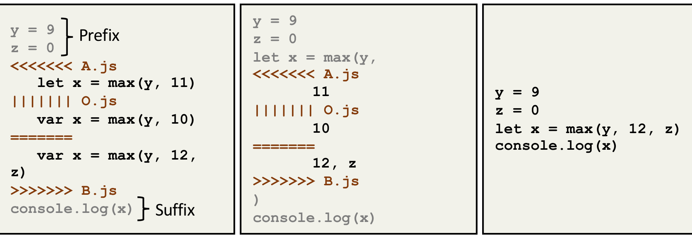

(a) Line-level conflict (b) Token-level conflict (c) Resolved merge

Figure 1: Example merge conflict represented through standard diff3 (left) and token-level diff3 (center), and the user resolution (right). The merge conflict resolution takes the token-level edit b.

Even syntactic correctness of the merged program. However, we observed that in practice, syntactic correctness is preserved the majority of the time (over 97%).

Likewise, consider the token-level conflict for the max function’s arguments: an appropriate model trained on JavaScript should easily deduce that taking the edit from B (i.e., "11, z") captures the behavior of A’s edit as well. The suggested resolution gives an intuitive demonstration of how MergeBERT turns a complex line-level resolution into a simpler token-level classification problem.

## 3 BACKGROUND: DATA-DRIVEN MERGE

Dinella et al. [15] introduced the data-driven program merge problem as a supervised machine learning problem. A program merge consists of a 4-tuple of programs (A, B, O, M), where

1. The base program O is the lowest common ancestor in the version history for programs A and B,
2. diff3 produces an unstructured line-level conflict when applied to (A, B, O), and
3. M is the merged program with the developer resolution, incorporating changes made in A and B.

A merge may have multiple unstructured conflicts, we define a merge tuple (A, B, O, M), where A, B, O correspond to the conflicting regions in (A, B, and O), respectively, and M denotes the resolution region. Given a set of merge tuples (A_i, B_i, O_i, M_i), i = 0...N, the goal of a data-driven merge algorithm is to learn a function, merge, that maximizes Σ_{i=0}^N merge(A_i, B_i, O_i) = M_i. Throughout the text, we will use notations (a, b, o, m) to refer to the token-level merge tuples.

Dinella et al. [15] also provide an algorithm for extracting the exact resolution regions for each merge tuple and define a dataset that corresponds to non-trivial resolutions; resolutions where the developer does not drop the changes from one side of the merge. Further, they provide a sequence-to-sequence encoder-decoder based architecture, where a bi-directional gated recurrent unit (GRU) is used for encoding the merge inputs comprising of (A, B, O) segments of a merge tuple, and a pointer mechanism is used to restrict the output to only choose from line segments present in the input. Their paper suffers from two limitations. First, given the restriction on copying only lines from inputs, their dataset did not consider merges where the resolution required token-level interleaving, such as the conflict in Figure 1. Second, their dataset consists of merge conflicts in a single language, namely JavaScript. Our approach addresses both of these limitations.

## 4 MERGE CONFLICT RESOLUTION AS A CLASSIFICATION TASK

In this work, we demonstrate how to exploit the restricted nature of merge conflict resolutions — compared to an arbitrary program repair — to leverage discriminative models to synthesize the merge resolution sequence. We have empirically observed that the application of diff3 at token granularity enjoys two useful properties over its line-level counterpart: (i) it helps localize the merge conflicts to small program segments, effectively reducing the size of conflicting regions, and (ii) most resolutions of merge conflicts produced by token diff3 consist entirely of changes from a or b or o or a sequential composition of a followed by b or vice versa. Here, and throughout the paper we will use lower case notations to refer to attributes of token-level differencing (e.g. a, b, and o are conflict regions produced by diff3 at token granularity). On the flip side, a token-level merge can introduce many small conflicts. To balance the trade-off, we start with the line-level conflicts as produced by the standard diff3 and perform a token-level merge of only the segments present in the line-level conflict. There are several potential outcomes for such a two-level merge at the line-level:

- A conflict-free token-level merge: For example, the edit from A about let is merged since B does not edit that slot as shown in Fig. 1(b).
- A single localized token-level merge conflict: For example, the edit from both A and B for the arguments of max yields a single conflict as shown in Fig. 1(b).
- Multiple token-level conflicts: Such a case (not illustrated above) can result in several token-level conflicts.