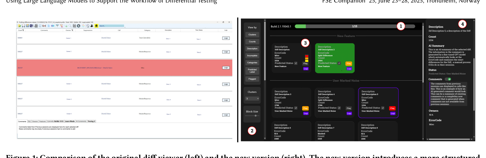

Figure 1: Comparison of the original diff viewer (left) and the new version (right). The new version introduces a more structured layout, improved visual indicators, and AI-generated summaries to enhance usability and streamline workflow.

Collected and analyzed information to label diffs accurately. We also observed which parts of the UI participants relied on most, providing insights into their workflows and decision-making. Additionally, we gathered direct feedback on the DiffViewer’s design and functionality, with many participants suggesting features to reduce cognitive load and manual effort, such as automation for information retrieval, predictive tools for error categorization, and organizational improvements to prioritize critical information.

The interview process revealed how software engineers used the DiffViewer, highlighting pain points, valuable features, and opportunities for improvement. By combining insights from both direct observations and feedback, we gained a comprehensive understanding of how to redesign the DiffViewer to provide a more intuitive, streamlined experience for developers at all levels. Key areas for enhancement included improved automation, streamlined workflows, and better tools for organizing and prioritizing information. Based on these findings, we created a prototype embodying ideas to make the DiffViewer more efficient, intuitive, and developer-friendly. The goal of the prototype is to elicit feedback from OCEs and team leaders.

## 2.3 Design Probe

The OCEs' work is both critical to the Azure service’s quality and full of time pressure. Even with its limitations, the existing DiffViewer tool is reliable and familiar to OCEs. To introduce a replacement tool or even to change the existing features requires retraining the OCEs and taking a risk that the change is more effective. Therefore, to get feedback while not disturbing the team’s ongoing work, we chose a design probe methodology [15]. We designed a prototype to demonstrate several possible enhancements to the existing work practice, with the goal of eliciting insights, reflections, and feedback from OCEs.

The redesigned DiffViewer interface introduces a block-based layout that prioritizes clarity, ease of access, and efficiency. Due to the sensitive nature of the information processed by the tool, certain details have been blurred out or replaced with placeholder text in the images presented here. However, the interface remains identical in structure and functionality for real-world users.

The redesigned DiffViewer UI (Figure 1 Right Side) is divided into distinct, intuitive panels. The top panel 1 displays the build number and progress bar, allowing users to track their progress within each session on the latest build. This feature gamifies the workflow while ensuring developers remain informed about the overall status of their work. In the left panel 2, users can efficiently organize their tasks, with options to filter, group, and sort Diffs based on various criteria. This panel enables quick navigation to specific areas of interest, significantly reducing the time required to locate and address key issues. The central block 3 forms the core of the UI, presenting the most important and immediate information to OCEs. Each block contains comprehensive details about a Diff, including predicted labels, descriptions, and log access, ensuring that all relevant information is readily accessible within the block. OCEs can also use this area to flag items for further review or use the checkmark to confirm the predicted label as their desired label for the diff. An example of this is shown in the image where the green block is a labeled Diff for New Feature. This labeling is also reflected in the Progress Bar 1 at the top where 1 of the 15 Diffs are labeled. On the right side panel 4, additional insights and summaries generated by the integrated AI are displayed. This feature provides contextual, AI-driven summaries and patterns extracted from the logs as well as comment generation and summary, providing more information about the Diff to the OCEs. By leveraging machine learning to offer proactive insights, the redesigned DiffViewer minimizes manual effort and enhances decision-making.

Overall, this prototype exemplifies a user-centric approach tailored to the high-stakes context of Microsoft’s security initiatives within Azure. By blending automation, organization, and intuitive design, the tool empowers OCEs to work more efficiently and effectively.

## 2.4 LLM-Based Diff Label Prediction

A central feature of the redesigned DiffViewer is its capability to automate diff labeling through the use of Large Language Models (LLMs). This builds on prior work by Krishna Vajjala et al. [32], which presented a robust approach for utilizing LLMs to classify differences between test and production builds. Fine-tuned on historical datasets with thousands of Diffs, the model achieves an overall accuracy of 97.38%, with low false-positive and false-negative rates, ensuring reliable predictions across categories such as User-Marked Noise, New Feature, and Regression. The fine-tuned model