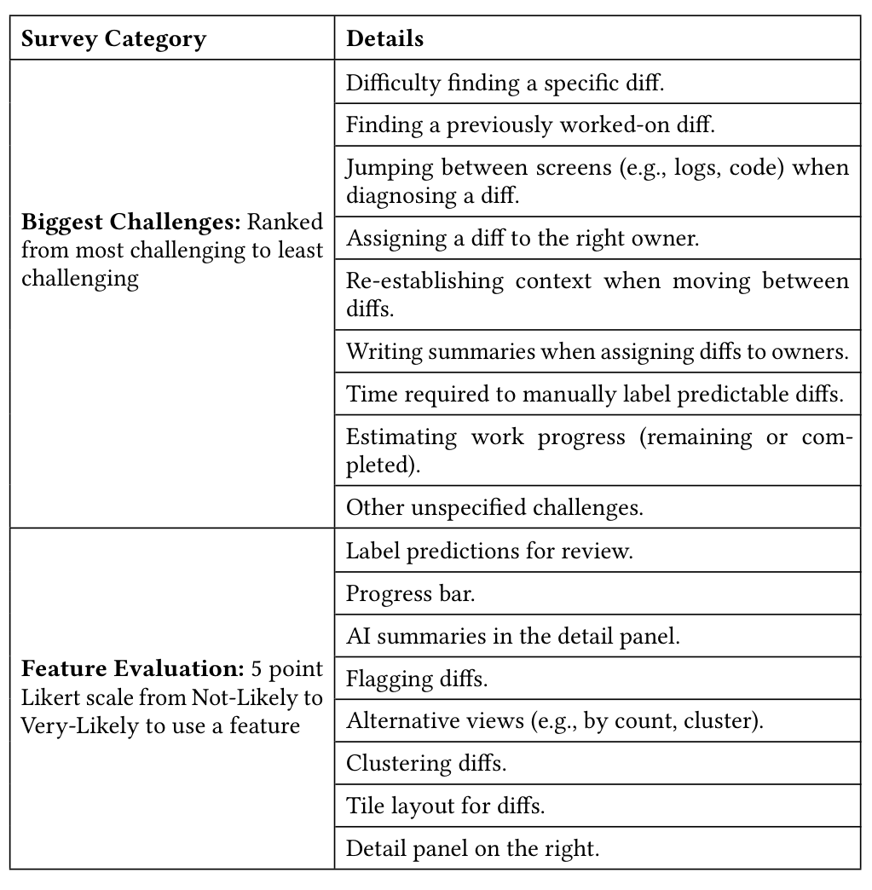

offered valuable insights for evaluating the tool’s effectiveness and identifying priorities for further development.

Survey questions were designed to address specific objectives. OCEs were asked about the ease of navigation and intuitiveness of the interface to assess whether the design met user expectations. Questions on functionality examined the relevance and accuracy of the tool’s features, providing insights into how well it supports essential tasks. Feedback on workflow impact explored how the tool influenced productivity and task efficiency. Open-ended questions invited participants to identify shortcomings or suggest additional features for enhancement. Overall satisfaction was measured using a Likert scale, offering a standardized metric for evaluation.

**Table 1: Challenges and Features Evaluated in the DiffViewer Study**

In designing the questionnaire, we used two complementary approaches — ranking and a 5-point Likert scale — to gather insights about OCEs’ workflows and the DiffViewer tool (Table 1). The "Biggest Challenges" section asked participants to rank challenges from most to least impactful, prioritizing areas where OCEs face the most friction. This approach forces participants to identify critical obstacles, such as whether locating specific diffs or re-establishing context poses a greater challenge, providing clear, actionable priorities for improvement.

The "Feature Evaluation" section employed a 5-point Likert scale to assess the perceived usefulness and likelihood of adoption of specific redesigned DiffViewer features. This method allowed us to capture detailed feedback on various features, from label predictions to clustering and alternative views, revealing the features participants are most likely to use and those requiring refinement. To encourage participation while collecting actionable feedback,

the questionnaire was kept concise. By balancing quantitative rankings with qualitative Likert-scale assessments, the study ensured a holistic understanding of the tool’s impact on OCE workflows.

### 3.5 Artifacts Collected

The evaluation process generated two primary types of artifacts, both of which provide valuable insights into the usability and functionality of the DiffViewer tool:

#### 3.5.1 Transcripts
Transcripts from interview sessions captured detailed interactions and participant feedback on the tool. They provide qualitative data on features, workflow impact, and suggestions for improvement, along with spontaneous comments that reveal participant impressions and help identify recurring themes or unique insights.

#### 3.5.2 Survey Responses
Post-session surveys collected structured feedback, including feature preferences, usability impressions, and prioritized functionalities. These responses combine quantitative ratings (e.g., Likert scale scores) with qualitative insights from open-ended questions, enabling a balanced analysis of the tool’s strengths, weaknesses, and areas for improvement.

By combining these two types of artifacts, the evaluation ensures a comprehensive understanding of participant feedback. The transcripts offer depth and context through rich qualitative insights, while the survey responses provide structured data to support quantitative analysis. These artifacts collectively serve as the foundation for evaluating the DiffViewer tool’s impact and guiding its iterative refinement.

## 4 Results

### 4.1 Ranking of Challenges

As part of our evaluation, we conducted a structured survey to better understand the challenges OCEs face in the Diff analysis workflow. This survey provided participants the opportunity to rank and prioritize the difficulties they encounter, offering a clear view of the most significant pain points in the process. The ranking information across the participants can be seen in Figure 2.

The results of our structured survey highlight significant challenges OCEs face during on-call workflows, with the most frequently cited issues being the difficulty of jumping between screens, finding specific diffs or those previously worked on, and manually labeling predictable diffs. These challenges reflect the fragmented and time-consuming nature of the original DiffViewer workflow, requiring OCEs to expend significant effort navigating multiple screens, interpreting logs, and revisiting prior work.

To address these issues, the redesigned DiffViewer introduces key improvements that significantly enhance the Diff analysis process. A consolidated block-based UI, combined with various filtering and display options, eliminates the need to jump between screens by presenting all relevant information in a single, intuitive layout. The integration of LLM-powered predictive Diff labeling further reduces the burden of manually labeling predictable diffs, while intelligent clustering and flagging features streamline the organization and revisiting of specific diffs. Additionally, the tool automates aspects of information extraction and summarization, addressing investigative challenges by providing actionable insights directly