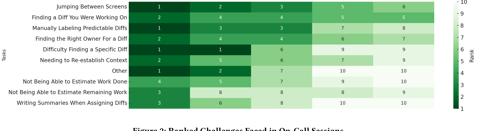

Figure 2: Ranked Challenges Faced in On-Call Sessions

Within the interface, features such as comment summarization and clustering also enhance communication and collaboration, enabling teams to seamlessly share and act on diff-related information.

Beyond addressing major challenges, the redesigned DiffViewer incorporates improvements targeting less critical yet impactful aspects of the workflow. For example, the introduction of a progress bar and an inbox-style view for incomplete Diffs enhances organization and gives OCEs a clear sense of progress during labeling sessions. Features like priority-based ordering, reduced mouse travel, and streamlined UI layouts tackle usability concerns, minimizing frustration during repetitive tasks.

By addressing both critical and secondary challenges, the redesigned DiffViewer delivers a smoother, more intuitive user experience that supports OCEs at every stage of the Diff analysis process, ultimately improving efficiency and reducing cognitive load.

Participants who reported "other" as a challenge mentioned the complexity of transferring Diffs, determining whether prior feedback could be reused with a new build, the investigative nature of analyzing code outside the tool, and the lack of efficient mechanisms for sharing Diff-related information across teams. Though the redesigned DiffViewer is not equipped with communication portals, we address the issue of context for Diffs via generative comments and summaries to aid the OCEs in making their decisions.

These results validate the redesigned DiffViewer and highlight key challenges OCEs face. By addressing these pain points, the tool improves efficiency, reduces cognitive load, and demonstrates strong alignment with real-world needs.

## 4.2 Feature Evaluation

Participants rated features of the prototype DiffViewer using a 5-point Likert scale, assessing their usability, relevance, and likelihood of adoption. The results provide a ranking of features, highlighting which enhancements appealed most to OCEs and why. The results of the findings can be seen in Figure 3. These findings also underscore the core motivation of this paper: leveraging AI and automation to address release engineering-specific tasks. The results reveal that software engineers want and need more intelligent tools to streamline workflows in the release engineering phase, and the features introduced in this study contribute to improved productivity and efficiency.

The feature allowing for alternative views, such as grouping and clustering Diffs by count, description, or cluster, emerged as the most likely to be adopted, receiving overwhelmingly positive feedback from participants. This reflects OCEs' strong preference for flexibility and customization in organizing and viewing Diffs, as these options enable them to adapt the tool to their specific needs.

By offering multiple ways to cluster and sort Diffs, this feature directly enhances workflow efficiency and adaptability.

Similarly, the ability to flag Diffs was highly rated by OCEs, who found it particularly useful for marking critical items for follow-up or prioritization. The ability to filter flagged diffs and visually distinguish them in the interface aligns with OCEs' need for better task organization during on-call sessions, addressing the challenge of efficiently revisiting and managing specific Diffs.

The tile-based layout for presenting diffs also received high praise, with OCEs appreciating the streamlined and consolidated presentation of information. By reducing the cognitive load associated with navigating between screens and providing all relevant details in a single, clear layout, this feature effectively addresses one of the core challenges identified in the survey and interviews.

The feature of Diff label predictions garnered significant interest among OCEs, with many acknowledging its potential to reduce manual effort and streamline the labeling process. However, some participants raised concerns about accuracy and explainability, emphasizing the need for transparency in AI-driven tools. Improving accuracy and providing clear justifications for predictions would provide an opportunity to build trust in predictive systems, facilitating broader adoption and seamless integration into workflows.

AI-generated summaries in the detail panel and the repositioned detail panel on the right also received positive feedback, though slightly lower than other features. OCEs appreciated the summaries for their ability to reduce manual effort in interpreting logs and synthesizing information, while the repositioned detail panel improved the clarity and accessibility of key details. Together, these features highlight the value of intuitive UI design and intelligent automation in streamlining the analysis process.

The progress bar, while receiving moderate ratings, was noted for its utility in tracking task completion during lengthy labeling sessions. Although it does not address a primary pain point, the