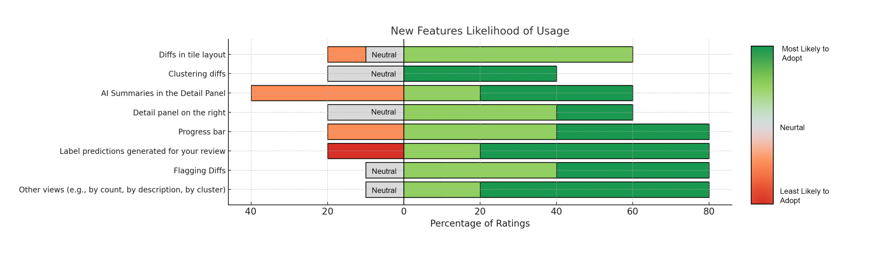

Figure 3: Survey of Likelihood of OCEs to Adopt New Features

In summary, the evaluation highlights a preference for features that offer flexibility, organization, and streamlined workflows, such as other views, flagging diffs, and the tile-based layout. These features significantly improve the efficiency and adaptability of the diff analysis process. By addressing both core challenges and secondary concerns, the redesigned DiffViewer demonstrates the potential of AI and automation in improving software engineering workflows and advancing the state of release engineering tools.

### 4.3 Qualitative Feedback Analysis

Qualitative feedback collected through open-ended survey responses and interviews provided valuable insights into user preferences, trust in AI, and areas for improvement. The key themes that emerged are outlined below:

**Usability.** Participants praised the intuitive layout of the redesigned DiffViewer, particularly the grouping feature. Grouping was noted as a significant improvement over the traditional linear workflow, reducing cognitive effort and minimizing "bouncing around" between unrelated tasks. One participant highlighted, "It would probably decrease the chance of us bouncing around with the same issue... this is a good, good approach." Another remarked on the utility of pivoting views, saying, "Having different pivots makes sense... it's a newer way to organize the data," demonstrating the need for flexibility in exploring diffs.

However, there was a recurring suggestion to add additional filtering options to complement clustering and pivoting. For example, a participant requested the ability to filter based on team ownership: "It would be very useful to filter based on teams or areas we own... this would help us focus only on what's relevant."

**AI Trust and Reliability.** While participants found AI predictions generally useful, many expressed a desire for greater transparency in how predictions were generated. A participant articulated this sentiment clearly: "I need to know what data led to the prediction... without that, I'd still have to do all the investigation myself."

The concept of supporting metadata or rationale was a recurring request. As one OCE put it, "If it told me the relevant code changes or logs that led to the label, it would save so much time." That is, the rationale should not just be the logic behind the prediction, but a set of links to relevant artifacts to allow an OCE to quickly double-check or overrule the prediction. Another emphasized the need to build trust gradually: "As I use the tool more and see that my results match its predictions, I'll grow to trust it more."

**Feature Suggestions.** Several OCEs suggested features, emphasizing the value of clustering and predictive labeling. One participant proposed incorporating common errors into the AI logic, such as automatically marking known caching issues as low priority for quick review. Another suggestion was to allow the direct transfer of diffs between teams within the tool, reducing back-and-forth communication. Participants also requested a richer display of metadata in the detail panel to improve decision-making and workflow efficiency.

These insights support the motivations and approach of this paper, showing that OCEs seek intelligent tools that enhance productivity while maintaining transparency and flexibility. The feedback has directly influenced the features of the DiffViewer, addressing existing challenges and emerging needs in release engineering.

### 4.4 Comparison of AI/ML vs Non-AI/ML Enhancements Based on User Feedback

The redesigned DiffViewer introduced both AI-driven and non-AI-driven features, with participants providing detailed feedback on each. This section compares their perceived benefits, limitations, and overall impact on the workflow.

AI-driven enhancements were praised for their time-saving potential, particularly predictive diff labeling, which automated repetitive tasks and allowed OCEs to focus on higher-priority work. AI-generated summaries also reduced cognitive load by providing immediate context for logs, with one participant saying, "The AI summaries are a great starting point—I don't have to dig through logs just to understand what's happening." The intelligent clustering feature, which grouped related diffs, was valued for improving prioritization and managing large data volumes. However, concerns about accuracy and explainability of AI-driven features were frequently mentioned. Transparency was crucial for trust, with one participant stating, "I trust the predictions more when I understand how they were made and what data was used." These concerns highlight the need for clear justifications behind AI predictions and outputs.