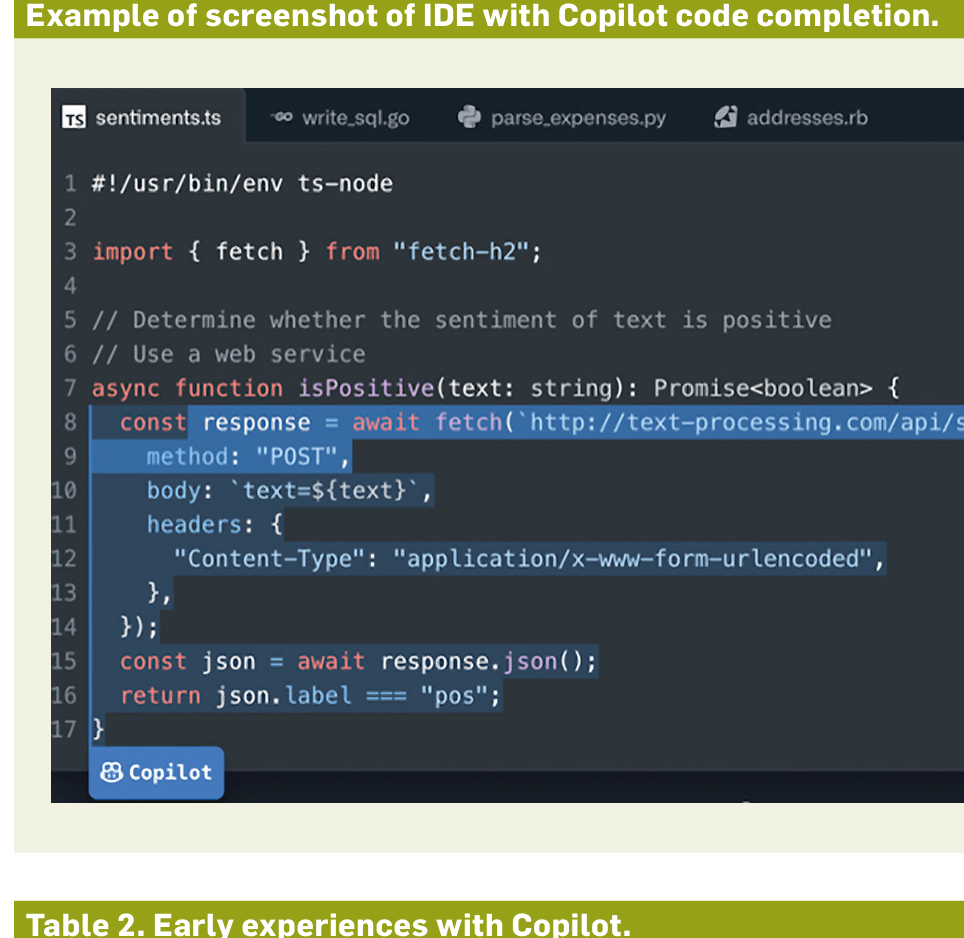

Table 1. Summary of studies included in this article.

| Study 1: Forum Analysis | Study 2: Case Study | Study 3: Survey |
|---|---|---|
| Oct/Nov 2021 | Dec/Jan 2022 | Feb/Mar 2022 |
| What are people using Copilot for? | How are first-timers engaging with Copilot? | How does Copilot impact productivity? |
| Approach: Reviewed and analyzed 279 GitHub Discussions forum posts | Approach: Conducted a think-aloud study with 5 expert Python developers | Approach: Analysis of 2047 survey responses from Copilot developers |
| Key Finding: Participants reported spending less time on Stack Overflow, but now have less of an understanding of how or why the code works. | Key Finding: Participants accept the suggestion for efficiency but give up a small bit of autonomy/control over the code they’re writing. We observed participants wrestle with this in real-time. | Key Finding: We were able to correlate 11 usage metrics to perceived productivity. Acceptance rate had the highest positive correlation to aggregate perceived productivity. |

We conducted three studies to understand how developers use Copilot:
1. An analysis of forum discussions from early Copilot users.
2. A case study of Python developers using Copilot for the first time.
3. A large-scale survey of Copilot users to understand its impact on productivity.

We will discuss each of these studies (summarized in Table 1).

### What Is Copilot and How Does It Work?

At its core, Copilot consists of a large language model and an integrated development environment (IDE) extension that queries the model for code suggestions and displays them to the user. You may already have interacted with such models when writing documents or text messages. These models have been trained on billions of lines of text and have developed the ability to predict, with high accuracy, what you are going to type next.

The important difference here is that Copilot uses Codex, a language model trained on source code instead of text (for example, email, text messages, websites, or documents). This source code came from a large portion of the public code on GitHub, the largest repository of source code in existence.

According to OpenAI, the team that built Codex, the model has been trained on more than 159GB of Python code alone, in addition to code from many other languages. As such, it’s quite common for code that a developer is writing to be like some combination of pieces of code that Copilot has seen before (during model training). Copilot recognizes these similarities and offers suggestions based on the similar pieces of code on which it was trained. Copilot, however, doesn’t make suggestions to developers by making copies of code that it has seen previously. Rather, Copilot generates new suggestions (some of which may not actually exist in any code base) by synthesizing what it has.

Example of screenshot of IDE with Copilot code completion.

Table 2. Early experiences with Copilot.

| The good | The bad | The mixed |
|---|---|---|
| users reported productivity improvements | users report Copilot gets into loops of suggesting the same thing | less coding but more reviewing |
| users compared Copilot to a human | Copilot does not write “defensive code” for example, check null pointers | less time on Stack Overflow, but now less understanding of how/why the code works |
| “Copilot removes the ceiling on creativity” | Copilot sometimes suggests inappropriate text | API discoverability is supported but does not provide enough information to select best solution |
| some said Copilot suggested something they would “ordinarily overlook” | Copilot at times leaks PII in header files |  |

We should note the models and technology used to develop Copilot are changing rapidly. This analysis was current as of January 2022. Although some features of the tool have evolved, the general themes discussed here still hold true at the date of publication. These highlights include:

- The diverse ways that developers are using Copilot, including things that worked great and things that very much didn’t.
- Challenges developers encountered when using the technical preview of Copilot, yielding insights into how to improve AI pair-programming experiences.
- How AI pair programming shifts the coding experience and reveals the importance of different skills — for example, the emerging importance for developers to know how to review code as much as to write code.