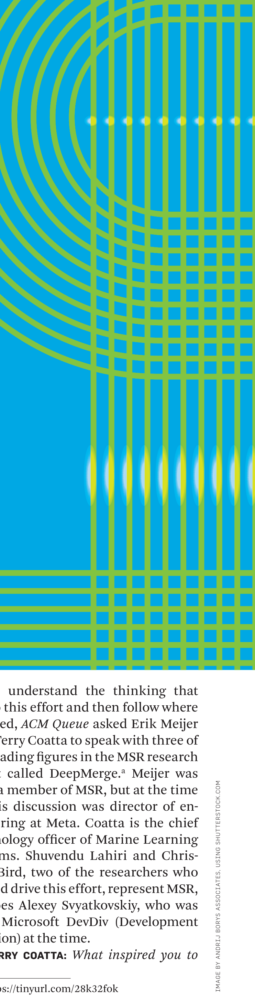

*Queue speaks with engineers from Microsoft Research about using machine learning to merge code.*

BY SHUVENDU K. LAHIRI, ALEXEY SVYATKOVSKIY, CHRISTIAN BIRD, ERIK MEIJER, AND TERRY COATTA

CHRISTIAN BIRD, ERIK MEIJER, AND TERRY COATTA

## Program Merge:

### What’s Deep Learning Got to Do with It?

IF YOU REGULARLY work with open-source code or produce software for a large organization, you are already familiar with many of the challenges posed by collaborative programming at scale. Some of the most vexing of these tend to surface as a consequence of the many independent alterations inevitably made to code, which, unsurprisingly, can lead to updates that do not synchronize.

Difficult merges are nothing new, of course, but the scale of the problem has gotten much worse. This is what led a group of researchers at Microsoft Research (MSR) to take on the task of complicated merges as a grand program-repair challenge—one they believed might be addressed at least in part by machine learning (ML).

> To understand the thinking that led to this effort and then follow where that led, ACM Queue asked Erik Meijer and Terry Coatta to speak with three of the leading figures in the MSR research effort called DeepMerge.a Meijer was long a member of MSR, but at the time of this discussion was director of engineering at Meta. Coatta is the chief technology officer of Marine Learning Systems. Shuvendu Lahiri and Christian Bird, two of the researchers who helped drive this effort, represent MSR, as does Alexey Svyatkovskiy, who was with Microsoft DevDiv (Development Division) at the time.
>
> TERRY COATTA: What inspired you to
>
> a https://tinyurl.com/28k32fok

IMAGE BY ANDRIJ BORYS, ASSOCIATES, USING SHUTTERSTOCK.COM