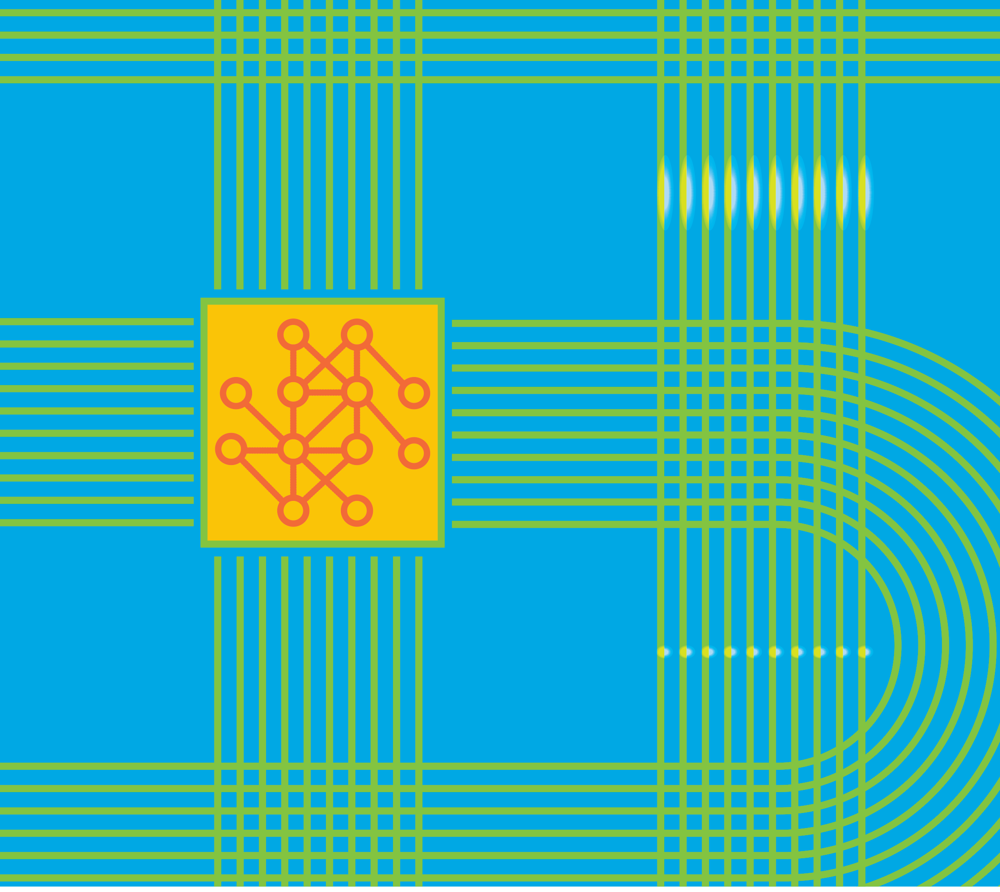

Focus on merge conflicts in the first place? And what made you think you’d be able to gain some advantage by applying AI techniques?

CHRISTIAN BIRD: Back in the winter of 2020, some of us started talking about ways in which we might be able to use machine learning to improve the state of software engineering. We certainly thought the time was right to jump into an effort along these lines in hopes of gaining enough competency to launch into a related research program.

We tried to identify problems other researchers weren’t already addressing, meaning that something like code completion — which people had been working on for quite some time — was soon dismissed. Instead, we turned to problems where developers didn’t already have much help.

Shuvendu [Lahiri] has a long history of looking at program merge from a symbolic perspective, whereas my own focus has had more to do with understanding the changes that occur in the course of program merges. As we were talking about this, it dawned on us that almost no one seemed to be working on program merge. And yet, that’s a problem where we, as developers, still have little to rely upon. For the most part, we just look at the diffs between different generations of code to see if we can figure out exactly what’s going on. But there just isn’t much current tooling to help beyond that, which can prove to be problematic whenever there’s a merge conflict to resolve.

So, we figured, “OK, let’s look at how some deep-learning models might be applied to this problem. As we go along, we’ll probably also identify some other things we can do to build on that.”

SHUVENDU LAHIRI: Yes, as Chris suggests, I’ve been thinking about the issues here for quite some time. Moreover, we found program merge to be appealing, since it’s a collaboration problem. That is, even if two skilled developers make correct changes, the merge itself may introduce a bug.

We were also keenly aware of the sort of pain program-merge problems can cause, having known about