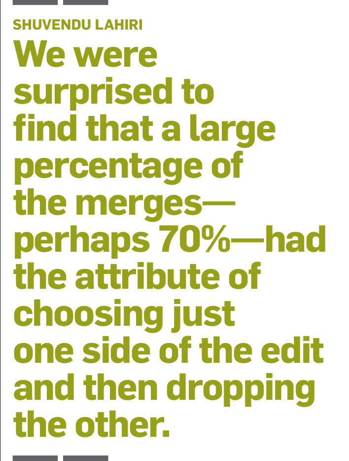

that data contained surprises—which is to say it proved to be both a blessing and a curse. Can you go into that a bit more?

LAHIRI: Yes, we were surprised to find that a large percentage of the merges—perhaps 70%—had the attribute of choosing just one side of the edit and then dropping the other. In some of those cases, it seemed one edit was superseding the others, but it can be hard to be sure whenever the syntax changes a little. In many instances, there were genuine edits that had been dropped on the floor. It was unclear whether that was due to a tooling problem or a social issue—that is, in some cases, perhaps some senior developer’s changes had superseded those that had been made by a junior developer. Another hypothesis was that, instead of a single merge, some people may have chosen to merge in multiple commits.

This sort of thing was so common that it accounted for a significant portion of the data, leaving us uncertain at first as to whether we should throw out these instances, ignore them, or somehow make an effort to account for them. That certainly proved to be one of the bigger surprises we encountered.

Another surprise was that we discovered instances where some new tokens had been introduced that were irrelevant to the merge. It was unclear at first whether those were due to a genuine conflict in the merge or just because somebody had decided to add a pretty-print statement while doing the refactoring. That proved to be another thorny issue for us.

COATTA: How did you resolve that? It sounds like you had some datasets you didn’t quite know how to interpret. So, how did you decide what should be classified as correct merges or treated as incorrect ones?

LAHIRI: We curated a dataset that did not include the “trivial” merge resolutions, with the goal of assisting users with the more complex cases first. As Alexey mentioned, users may not need tooling support for those resolutions that only require dropping one of the two edits.

SVYATKOVSKIY: And then, from user studies, we learned that some users still wanted to be able to use the approach that had been dismissed. We solved that problem by providing a “B option” that people could get to by using a drop-down menu.

LAHIRI: Which is to say we addressed the problem by way of user experience rather than by changing the model.

The other data problem we encountered had to do with new tokens that would occasionally appear. Upon closer examination, we found these tokens were typically related to existing changes. By going down to token-level merges, we were able to make many of these aspects go away. Ultimately, we built a model that excluded that part of the dataset where new tokens were introduced.

MEIJER: In terms of how you went about your work, I understand one of the tools you particularly relied on was Tree-sitter [a parser-generator tool used to build syntax trees]. Can you tell us a bit about the role it played in your overall development process?

BIRD: We were immediately attracted to Tree-sitter because it lets you parse just about anything you can imagine right off the shelf. And it provides a consistent API, unlike most other parsers out there that each come with their own API and work only with one language or another.

For all that, I was surprised to learn that Tree-sitter doesn’t provide a tokenizing API. As an example of why that proved to be an issue for us, we wanted to try Python, which basically lets everyone handle their own tokenizing. But, of course, Tree-sitter didn’t help there. We resorted to a Python tokenizing library.

Beyond that relatively small complaint, Tree-sitter is great in terms of letting you apply an algorithm to one language and then quickly scale that up for many other languages. In fact, between that capability and the Python tokenizing library, which made it possible for us to handle multiple languages, we were able to try out things with other languages without needing to invest a lot of upfront effort. Of course, there’s still the matter of obtaining all the data required to train the model, and that’s always a challenge. At least we didn’t need to write our own parsers, and the consistent interfaces have proved to be incredibly beneficial.

MEIJER: Once you finally managed to get all this deployed, what turned out to be your biggest surprise?

