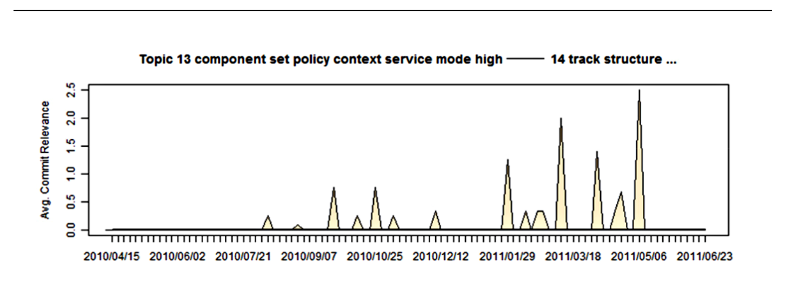

Fig. 4: Personal topic from 1 industrial developer. Topics and relevant revisions over time. X axis is time, Y axis is the average relevance per time window (greater is more relevant). The topic label provided is a non-expert label created by the authors.

Topic-plots. Figure 4 is an example of one of these personal topic-plots. These topic-plots are appropriate representations as they provide stakeholders with an overview of topic-relevant effort and would be a welcome addition to a project dashboard.

In this study we assume that commits are a reasonable proxy for effort. We recognize that commits could actually be months of work, expressed as a sole commit, or many commits could be created in the same hour. Thus we look to the prior work of Koch et al. [18] and Capiluppi et al. [6] who argue and provide evidence that commits are correlated with project activity and are both related and correlated with development effort. We argue that the topic relevance of a commit is relevant to the effort related to that topic and the associated documents that the topic was extracted from. While it might not be an exact measure, a strong relevance would indicate that potentially similar concepts are being expressed in the commit comments that are relevant to the topic at hand. Thus we argue that not only are commits relevant to effort, but that topic-relevant commits indicate topic-relevant effort.

Note that a single commit can be associated with multiple topics [13]. Figure 2 shows a topic-plot of 20 topics that show the focus on these topics by average commit relevance over time. We put the commits into bins of equal lengths of time and then plot their average relevance (a larger value is more relevant) to that topic. Bins will be of an equal length of time (such as 7 days) and thus they will not be equal size in terms of the number of commits. Some bins will have few or 0 commits, some will have 10s to 100s of commits depending on the project and how busy development was at that time. Then for the commits within a bin, their topic–document relevance values from the topic-document matrix, extracted by LDA inference, will be averaged together. The average relevancy of 0 commits is set to 0.

Note that — indicates a redaction; within this study we redacted some tokens and words that would disclose proprietary information. This is the