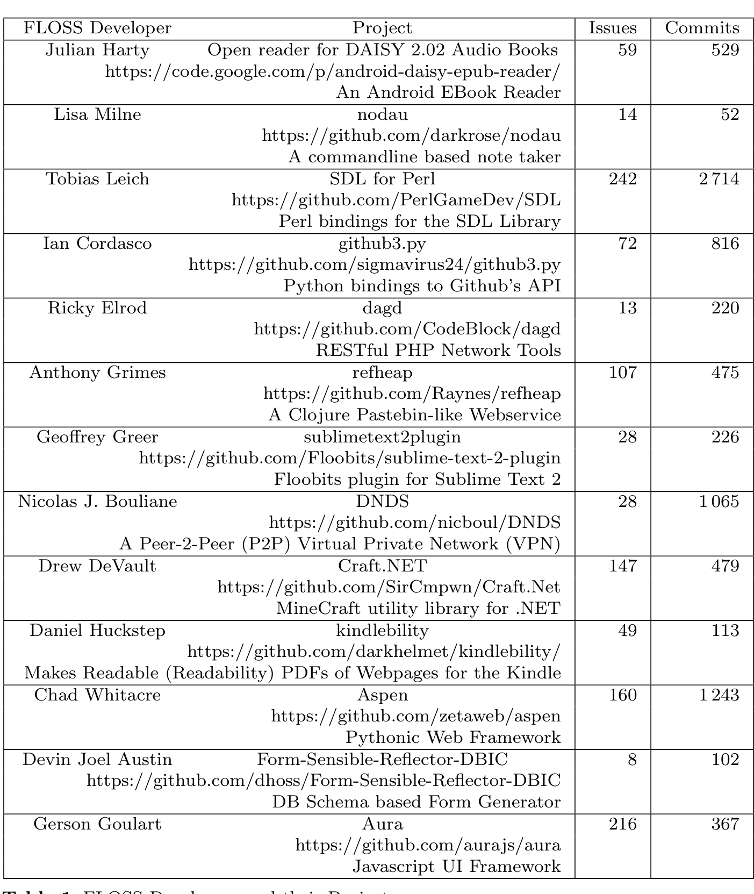

Table 1 FLOSS Developers and their Projects

most), in Figure 2 shows a lack of behaviour for the first 7 years followed by a distinct and constant increase in focus and importance. In Section 5.1.1 an interview with a program manager reveals that the spikes in the topic-plots 7 and 9 are relevant to actual changes (topic-plots 7 and 9, 4th and 5th rows in the first column of Figure 2). Another example of interesting behaviour includes the use cases and testing topics (8th and 10th topics, 4th and 5th in the second column) became less important, information that would be useful to a manager. Figure 2 is a global plot; while relevant to managers it might not be relevant to individual developers. Developers could be more interested in fine-