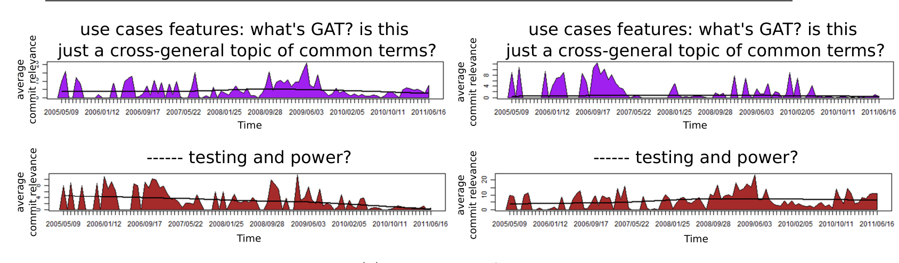
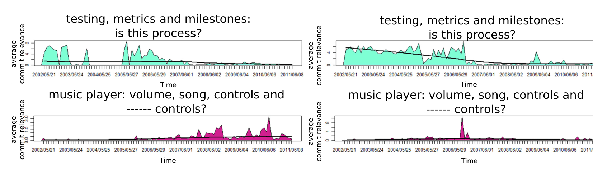

(a) topic-plots of 2 developers

(b) topic-plots of 2 teams

Fig. 5: Topic-plots of 2 topics for 2 different developers and teams. The topic labels provided are our non-expert labels. The topic labels shown are non-expert labels.

### 5.1.1 An Interview with a Program Manager

We interviewed a program manager at Microsoft and asked him to label 3 topics. He walked through each topic word by word and pieced together what he thought the topic was about. Program managers often write requirements and he immediately indicated the relationship of topics to requirements: "I know which specs this came from."

The program manager also indicated that a series of correlated spikes were most likely caused by a Design Change Request (DCR), shown in the topics 7 and 9 (first column on the 4th and 5th row of Figure 2). DCRs are management decisions about implementation. They are caused by management wanting a particular change or by external stakeholders, such as vendors, imposing limitations or requirements on certain product features. The particular peak he indicated had to do with Bluetooth support.

After the initial topics were labelled the PM voluntarily helped label some more topics. When shown a topic-plot (topic 3, 1st column, 2nd row of Figure 2) of a feature that he knew about, the program manager pointed to a dip and mentioned that the feature was shelved at that time only to be revived later, which he illustrated as the commits dipped for a period and then increased. This indicated that his perception of the topic and topic-plot matched reality: