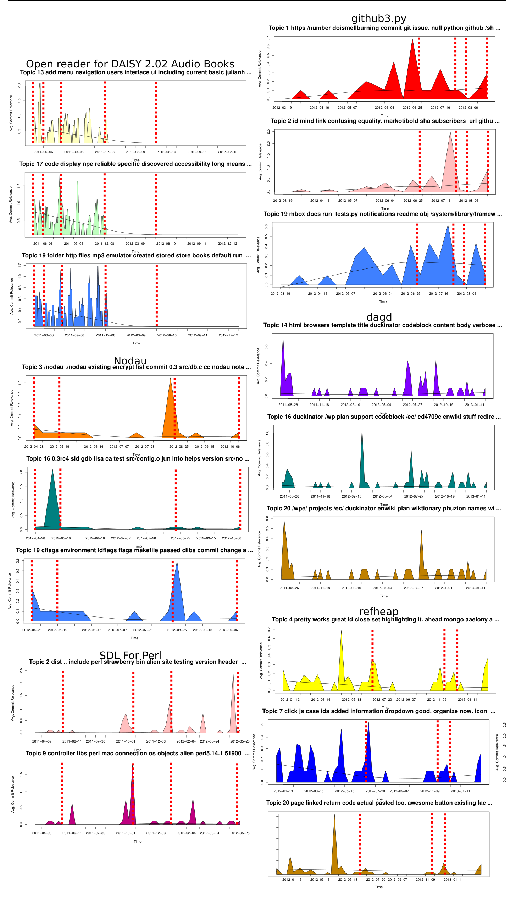

Fig. 6: Issue Report Topic-Plots presented to FLOSS Developers. Each shows the topic-plots that developers were asked to label in the survey in no particular order. See figure 7 for more. Red dashed lines indicate a release or milestone of importance (major or minor). The topic labels shown are the top ranked LDA topic words.