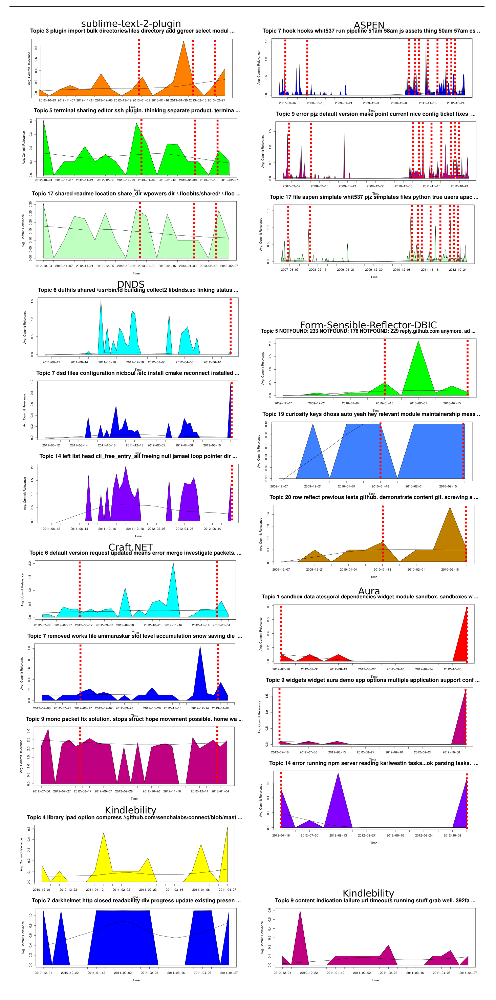

Fig. 7: Issue Report Topic-Plots presented to FLOSS Developers. Each shows the 2 to 3 topic-plots that developers were asked to label in the survey in no particular order. See figure 6 for more. Red dashed lines indicate a release or milestone of importance (major or minor). The topic labels shown are the top-ranked LDA topic words.