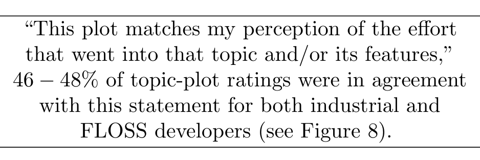

Other FLOSS developers were more positive: Ricky Elrod of dagd said, “I was able to match up some of the spikes in this one. Very neat!” of Topic 14 of dagd in Table 3. Lisa Milne of nodau said, “The plot shows the time leading up to a release, it quite clearly shows where a release candidate was pushed out, followed by the actions taken following feedback from users.” of Topic 3 of nodau in Figure 6.

The majority of topics were labelled by industrial respondents, and the mode score was 4 for agreement (rather than 5 for strongly agree) that the topic-plot matched the developer’s perception. Figure 8 displays the scores for the industrial administered survey: 3 not applicable, 3 strong disagree, 4 disagree, 3 neutral, 10 agree and 1 strongly agree. This gives us a median of 4 (agree) and an average of 3.09 (neutral to agree) from 21 topic ratings. Disagree versus agree, ignoring neutral, had a ratio of 7:11.

The FLOSS developers rated the topic-plots differently: 1 strongly disagree, 8 disagree, 10 neutral, 15 agree, and 3 strongly agree. This is a median of 3 (neutral), an average of 3.30 (neutral to agree), and a mode of 4 (agree) from 37 ratings. FLOSS developers also answered that for 6 of 36 topics the topics were not relevant to their project or development, while 30/36 were (83%). Disagree versus agree, ignoring neutral had a ratio of 1:2 (9 to 18), and were not statistically different from the industrial respondents (7:11) according to a X2 test (p > 0.94) of FLOSS Agree (18) and FLOSS Disagree (9) counts versus Industrial Agree (11) and Industrial Disagree (7). The X2 test run was the Pearson’s Chi-squared test with Yates’ continuity correction, resulting in 1 degree of freedom and an X2 value of 0.004.

After the surveys were administered to FLOSS developers we interviewed those who had volunteered for a follow up interview.

### 5.3 Interviews with FLOSS Developers

We interviewed the FLOSS developers as part of this extension to the original study, thus they were interviewed in February and March of 2013, 1.5 years after the initial Microsoft study. The FLOSS interviews occurred after they had been administered a survey.

Some of the FLOSS developers who answered our survey agreed to be interviewed. We interviewed the FLOSS developers after the Microsoft study; thus we focused more on issues of bug/issue report quality and topic coherency while talking with FLOSS developers.