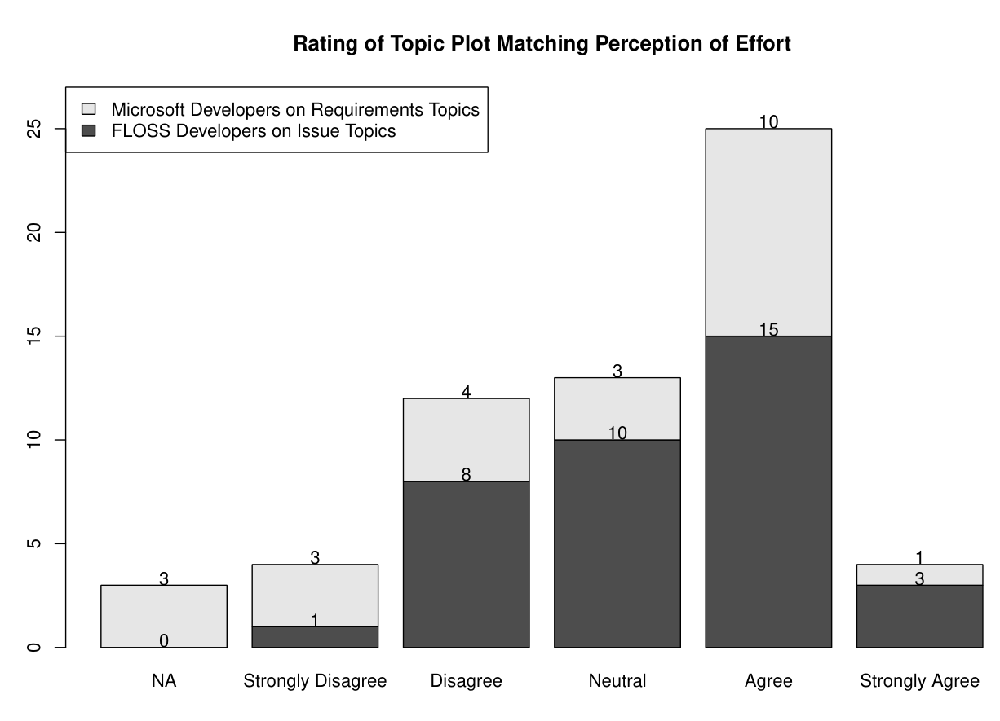

> Fig. 8: Distribution of topic-plot perceptual ratings performed by Industrial Participants (light grey) and FLOSS developers (dark grey). On this stacked bar-chart, the top number represents the count of Microsoft Developer ratings, the bottom number is the count of ratings from FLOSS developers. The total height indicates how many total ratings combined.

In total we interviewed 5 out of 13 FLOSS developers. Most interviews with FLOSS developers were executed using textual private messages on the FreeNode IRC Network (4 interviews) and one interview used voice over Skype (1 interview). The interview language used was English although one of the discussions started in French. IRC private messages were beneficial because they were transcribed. The Skype interview was recorded via note-taking.

When we asked FLOSS developers about how they felt labelling topics, Bouliane answered, "I was feeling happy, it's fun to see someone interested in what you're doing. But I felt at the same time confused a bit, by what I was supposed to realize by reading the keywords." Geoffrey Greer said he felt, "mostly confusion with a little bit of amusement". Ian Cordasco said that topics were easy to label, but the quality of the topic suffered due to the tokenization employed, "When listed in plain text separate from the image it was easy. I think the inclusion of punctuation also made it misleading because I unconsciously tried to read it as a sentence." Chad Whitacre pointed out punctuation causing issues in Topic 9 of ASPEN (2nd row, 2nd column of Figure 7), "Here we've got a username again, and a few cases where punctuation doesn't seem to be properly accounted for. The remaining terms don't really call to mind a coherent concept, issue, or feature, however." Tobias Leich said: