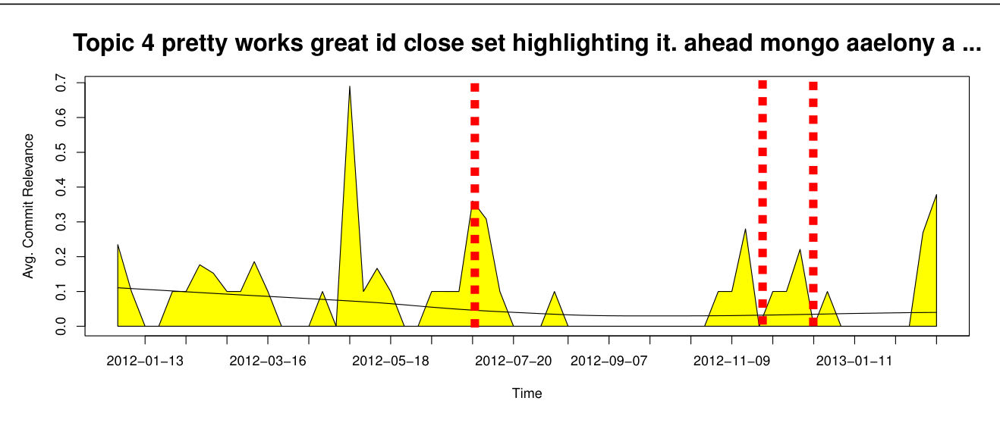

Time

Fig. 9: Topic-plot of Topic 4 from refheap with topic words: pretty works great id close set highlighting it. ahead mongo aaelony avoid issue. defined lein2 jquery.hotkeys implement query make site. Red dashed lines indicate a release or milestone of importance (major or minor). The topic label shown consists of the top ranked LDA topic words.

For Topic 5 (in Table 2), two of the respondents had agreed it was a user scenario “End user usage pattern” and “Functionality related network mode ——, allowing uses to select and their preferred network ——”. We cannot be sure that either interpretation is more accurate. This illustrates that there can be disagreement in terms of the meaning of a topic.

## 6 Discussion

### 6.1 Topic Labelling

We have demonstrated that stakeholders can indeed label topics. Furthermore we have demonstrated that many of these topics are relevant to the task at hand.

#### 6.1.1 Developers

Developers seemed to express difficulty labelling topics, but to be clear, many developers did not write the requirements or the design documents, or the issue reports that the topics were derived from. We argue that some of the difficulty of labelling topics derives from the experience one has with the topic’s underlying documents.

There was some expression of irrelevance of some of the topics from the FLOSS developers. Anthony Grimes of refheap gave Topic 4, depicted in Figure 9, this label:

> jquery.hotkeys is from when we were giving refheap keyboard shortcuts. Highlighting is probably related to highlighting a line number when you click it. The rest are way too vague to be of use.