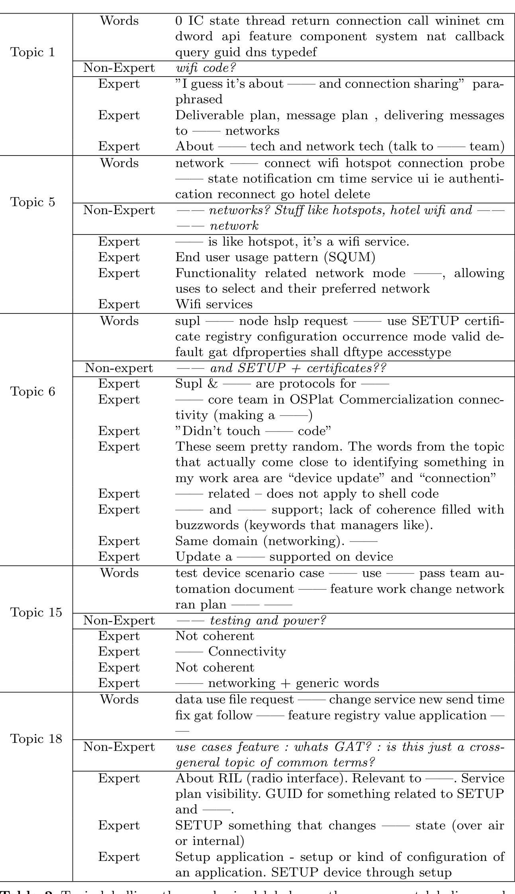

an application. SETUP device through setup

Table 2 Topic labelling: the emphasized labels are the non-expert labeling made by the authors. The first list of words is the top 20 words in the topic. The labels are from program managers and developers working on the project (both survey and interviews). —— indicate redactions.