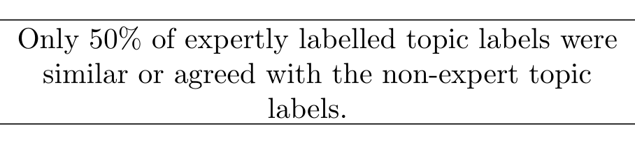

Some FLOSS developers, such as Julian Harty pointed out that some topics are indeed irrelevant and hard to label, “The terms you have collected are nonsensical and don’t really communicate much about the project at all.” Ricky Elrod also noticed that topics, such as Topic 20 shown in Figure 6, might be relevant to the project, but not exactly useful:
/wpe/ refers to a url route that an issue referenced, but was never used in the project (It was decided against – we used /ec/ instead). “duckinator” and “phuzion” are both usernames of contributors. Relevant to the project, but not to the logic of the project.

Table 3 depicts 1 topic from each participating FLOSS Developer. It also shows the associated discussion or label that the developer associated with that topic.

### 6.1.2 Managers

Managers seemed to have a higher level view of the project, as they had the awareness that there were other teams and other modules being worked on in parallel. This awareness of the requirements documents and other features suggested that topic labelling is easier if practitioners are familiar with the concepts. These plots are relevant to managers investigating who have to interpret development trends.

One manager actually gave the labelled topics a scope ranking: low, medium, or high. This scope related to how many teams would be involved; a cross-cutting concern might have a high or broad scope, while a single team feature would have a low scope. This implies that global awareness is more important to a manager than a developer.

### 6.1.3 Non-Experts

We consider ourselves to be experts in software, but not experts about the actual products that we studied. Thus we relied on the experts to help us label the topics. At the same time we also labelled the topics in the industrial case study. We examined all of the topic labels and checked to see if there was agreement between our labellings and theirs. If our label intersected the semantics or concepts of another label we manually marked it as a match. Of 46 separate industrial labellings (10 labellings from interviews, 12 labellings from email, and 24 labellings from face to face surveys), our labels agreed with the respondents only 23 times.

Furthermore, at a per-topic level, the average manual agreement between developer expert labels and non-expert labels was agreement with 40% of the