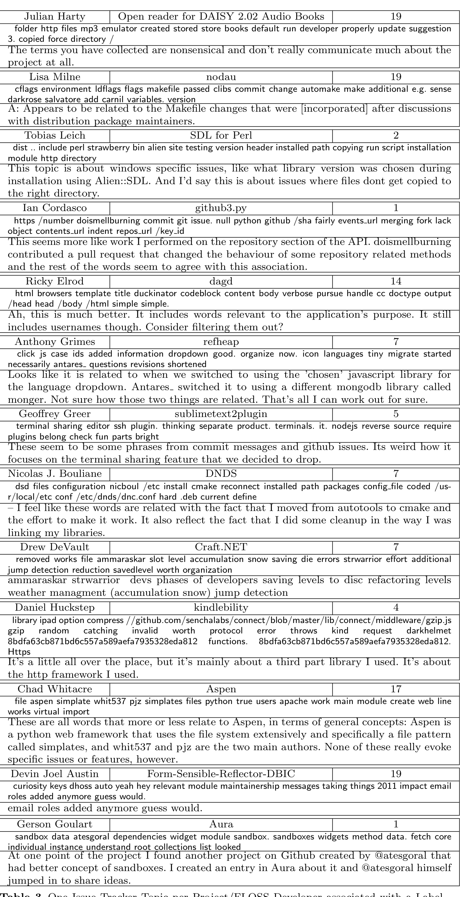

jumped in to share ideas.

Table 3 One Issue Tracker Topic per Project/FLOSS Developer associated with a Label by the FLOSS Developer. The first row consists of the Developer’s name, the project and the topic number (the identity of the topic) they labelled.