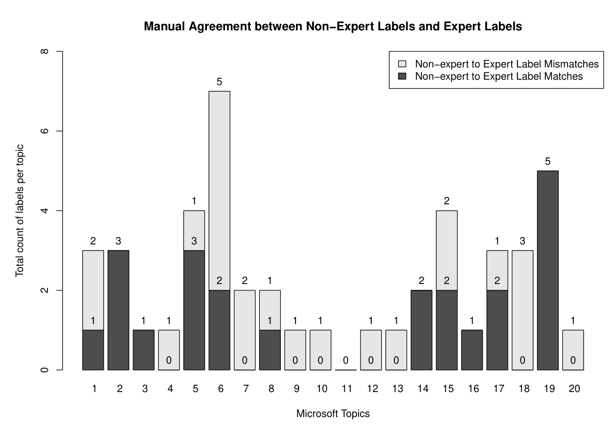

Fig. 10: Agreement between Expert Labels and Non-Expert Labels per each Industrial Requirement Topic. On this stacked bar-chart, the numbers on top of dark grey bars indicate the number of matches (agreement in labels), the numbers on top of light grey bars indicate the number of mismatches (disagreement in labels).

labels (the mean of agreement divided by total per topic). See Figure 10 for a chart of non-expert versus expert labels in terms of agreement. This indicates that while non-experts can label these topics, there is inherent value in getting domain experts to label the topics.

## 6.2 FLOSS Developers

All of the FLOSS developers who answered the survey required that their contribution be attributed to them. Perhaps this is because most FLOSS licenses, including the permissive BSD and MIT licenses, all require attribution as one of the main requirements of the license. Some of the motivation for participation might have been to promote their project to a wider community.

### 6.2.1 Did FLOSS Developers differ from Industrial Participants?

In order to address the question, “Did FLOSS Developers differ from Industrial Participants?” we compared the distributions of the two studies shown in Figure 8 using the X^2 test (Pearson’s Chi-Squared Test). We used both immediate and simulated tests X^2, and we included and excluded Not Applicable responses, but all our tests found that the FLOSS Developers and Industrial