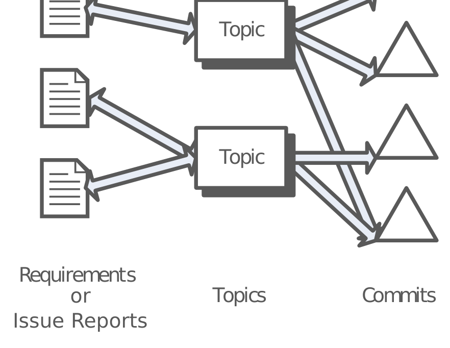

Fig. 1: Our data model. Topics are extracted from Requirements using LDA. Topics are related to requirements in a many-to-many relationship. Commits are related to topics via LDA document-topic inference.

survey. We then aggregated the results and compared. Thus the field work associated with the FLOSS survey was equivalent or larger in scale than the industrial case study.

In this paper, we added a comparison between the case studies and discussed the results of the FLOSS study in depth. For the sake of brevity we have combined the methodologies into one general description and included special cases for the FLOSS study when necessary.

## 2 Background and Previous Work

Our work fits into traceability, requirements engineering, issue tracker querying, and topic analysis [7,8,22,32,36].

### 2.1 Traceability and Requirements Engineering

Traceability is the linking of software artifacts and popular software engineering topics. Authors such as Ramesh et al. [30] and De Lucia [10] have provided excellent surveys of the literature and the techniques relevant to traceability.

In terms of information retrieval (IR) and traceability Antoniol et al. [1] first investigated linking documentation and source code together using IR techniques including the vector space model. IR traceability was extended by Marcus et al. [23] who first employed LSI for traceability of documentation to source code. Karl Wiegers [39] has argued for tagging commits with relevant requirements to aid traceability. Tillmann et al. [38] have discussed mining