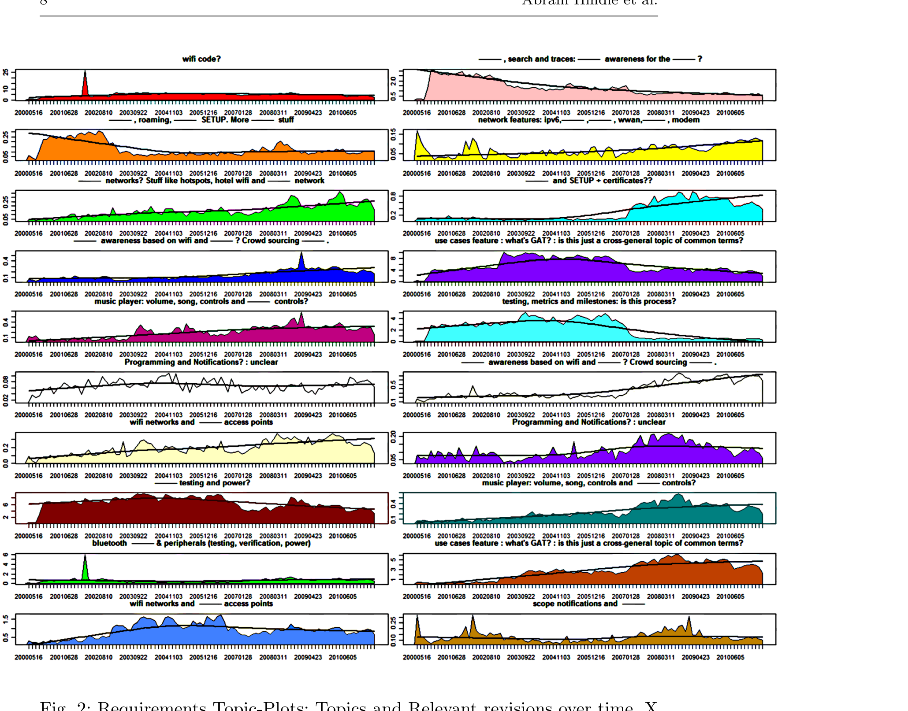

Fig. 2: Requirements Topic-Plots: Topics and relevant revisions over time. X axis is time, Y axis is the average relevance per time window (greater is more relevant). The topic-plots are labelled with our non-expert labels. They are non-expert labels because we were not involved in the project’s development. — indicate redactions.

### 3.2 Requirements Topic Mining

To apply LDA to requirements we had to preprocess the documents. We converted each specification to word distributions (counts of words per document) and removed stop words (common English stop words such as "at", "it", "to", and "the")1. We stemmed the English words using a custom Porter stemmer. We provided these word distributions to our implementation of the LDA al-

1 The set of stop words used: http://softwareprocess.es/b/stop_words