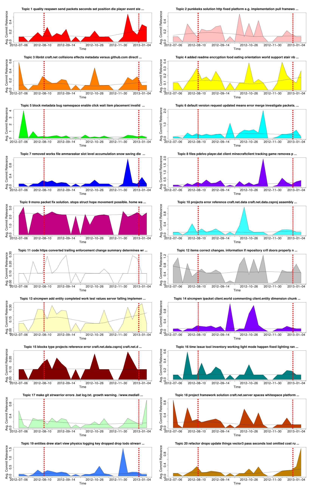

Fig. 3: Issue Topic-Plots of All FLOSS Developer authors of Craft.NET. X axis is time, Y axis the average per time window (greater is more relevant). Red dashed lines indicate a release or milestone of importance (major or minor). Topic Labels are the top ranked topic words from LDA.