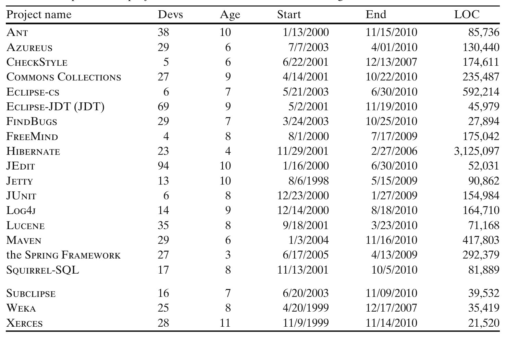

> features rather than acceptance by individual members. We would also expect our research question to have consistent answers for both generics and annotations:
>
> **Research Question 2:** Will project members broadly use new language features after introduction into the project?
>
> Finally, Java integrated development environments (IDEs) such as Eclipse, NetBeans, and IntelliJ IDEA all support features such as syntax highlighting and semantic analysis to provide auto completion and identify type errors interactively. These tools enable developers to be more productive, but not all IDEs supported generics when they were first introduced. Additionally, developers are often constrained by the platforms they are intended to deploy on. We expect that the choice to use new language features such as generics or annotations will in part depend on the tool support available and platform support for those features.
>
> **Research Question 3:** What factors influence adoption of new language features?

### 4.3 Projects Studied

To test our hypotheses and evaluate our research questions, we automatically analyzed 40 open source software projects.

For the first 20, we analyzed the top “most used” projects according to ohloh.net, selecting only projects with significant amounts of Java code. We chose to select projects from ohloh.net because the site contains the most comprehensive list of open source projects of which we are aware. The 20 selected projects can be seen in Table 1.

Table 1 20 open source projects that were established before Java generics existed

Project name Devs Age Start End

