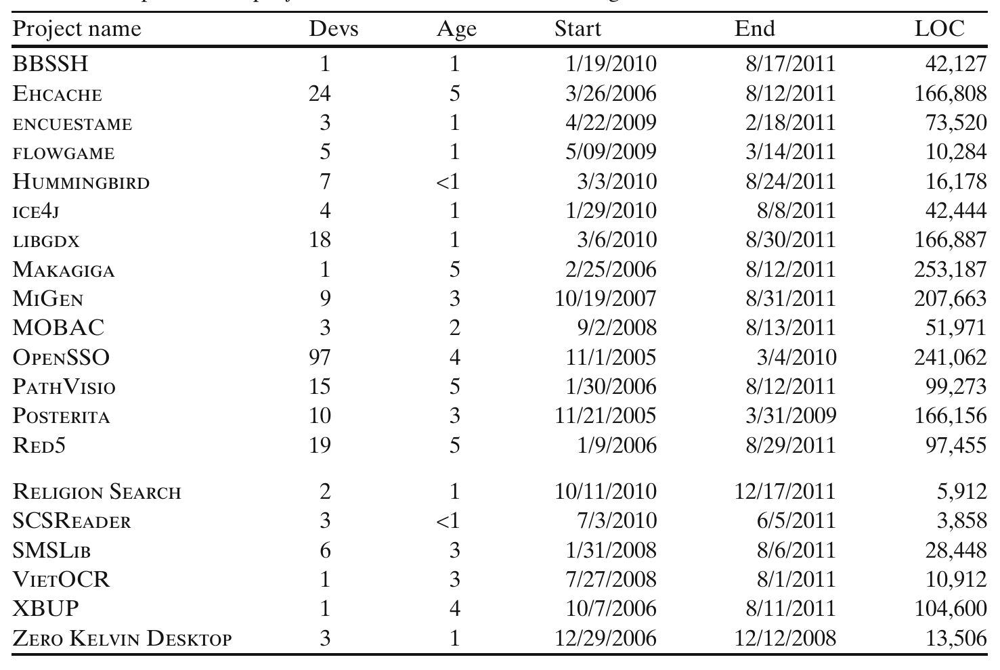

In mining the full version histories of these 20 projects, we analyzed the full content of each version of each Java source file, a total of 548,982,841 lines.

For the final 20 projects, we decided to use a different sampling methodology for two reasons. First, after examining the first 20 projects, we realized that the type of sampled projects tended to be skewed toward developer tools. Second, some of the first 20 projects appeared not to use generics to be backward compatible with clients who used Java environments that are not generics-compliant. To address these two limitations of the first data set, we sampled projects using two criteria. First, with each of the 20 categories of projects listed on sourceforge.net, we analyzed one Java project that was tagged on Ohloh with that category name. The categories are mobile, internet, text editors, religion and philosophy, scientific and engineering, social sciences, other, formats and protocols, database, security, printing, terminals, office and business, system, education, games and entertainment, desktop environments, communications, and multimedia. Second, we chose projects whose first commit appeared well after 2004, and tried to exclude projects whose first commit appeared to be a repository migration. The 20 selected projects shown in Table 2.

In analyzing the history of these projects, we analyzed 104,069,124 lines of code.

Throughout this paper, we will focus our discussion on three of the 40 projects: JEdit, Squirrel-SQL, and MiGen. We chose these specific projects because they are a fairly representative cross section of the 40 projects. JEdit, a text editor for programming, began development in 2000 and is the most mature project of the three. Squirrel-SQL, a graphical user interface for exploring databases, began development in 2001. MiGen, an educational program for teachers of mathematics, is the least mature of the three projects, beginning in 2007.

### Table 2 20 open source projects that were started after Java generics

