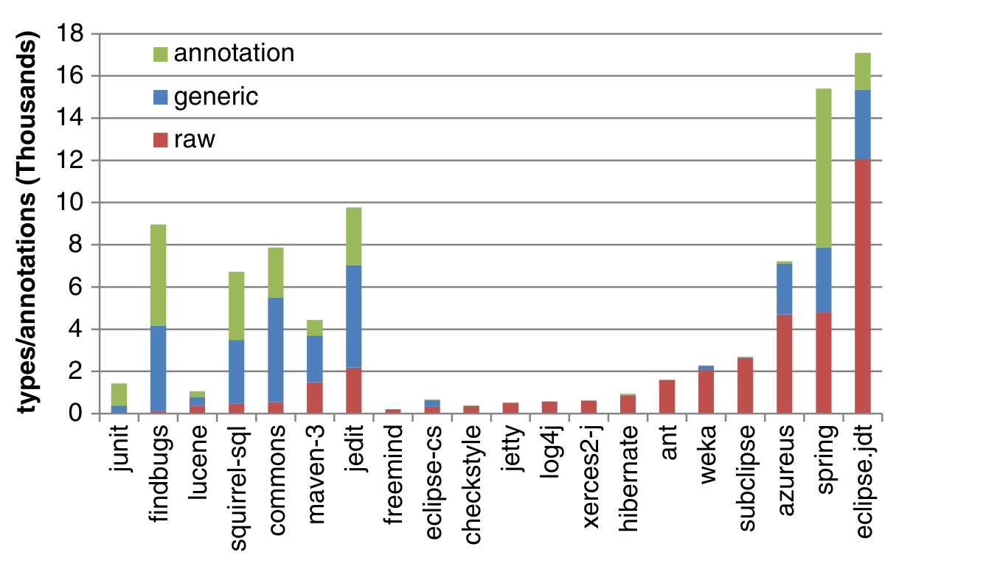

## 5 Data Characterization

To give insight into our collected data, we characterize several facets about our data. Specifically, we break down the use of generics and annotations by established and recent projects, developers, parameterization behavior, and advanced features usage such as wildcards. Finally, we relate some observations that arose from our examination of the data.

### 5.1 Projects

Did projects adopt generics or annotations? Specifically, we examined the latest snapshot of each project in our data and then noted the number of instances of parameterized types, raw types, and annotations. For generics, we equate the presence of parameterized types as adoption of generics and the presence of raw types as non-adoption. For annotations, we counted the number of annotations in the project. Note, these measures only provide a very broad view of adoption.

Established Projects Figure 1 compares the number of raw types, parameterized types, and annotations in the established projects. 13 projects out of 20 made more use of raw types than generics, with 4 of those not using generics or annotations at all. JEdit and Squirrel-SQL made prominent use of generics, whereas the Spring Framework and FindBugs made prominent use of annotations.

Recent Projects Figure 2 compares the number of raw types, parameterized types, and annotations in the recent projects. A different story emerges. Only 2 out of 20 projects had more raw types than generics. All projects used generics and all but one used annotations. There were 4 projects that did not have any raw types: FlowGame, Ice4j, ReligionSearch, and SCSReader.

While it is unsurprising that established projects continued to use raw types, we were surprised that raw types are still used in some recent projects. To get an idea

Fig. 1 Annotation, parameterized type, and raw type counts in 20 established projects