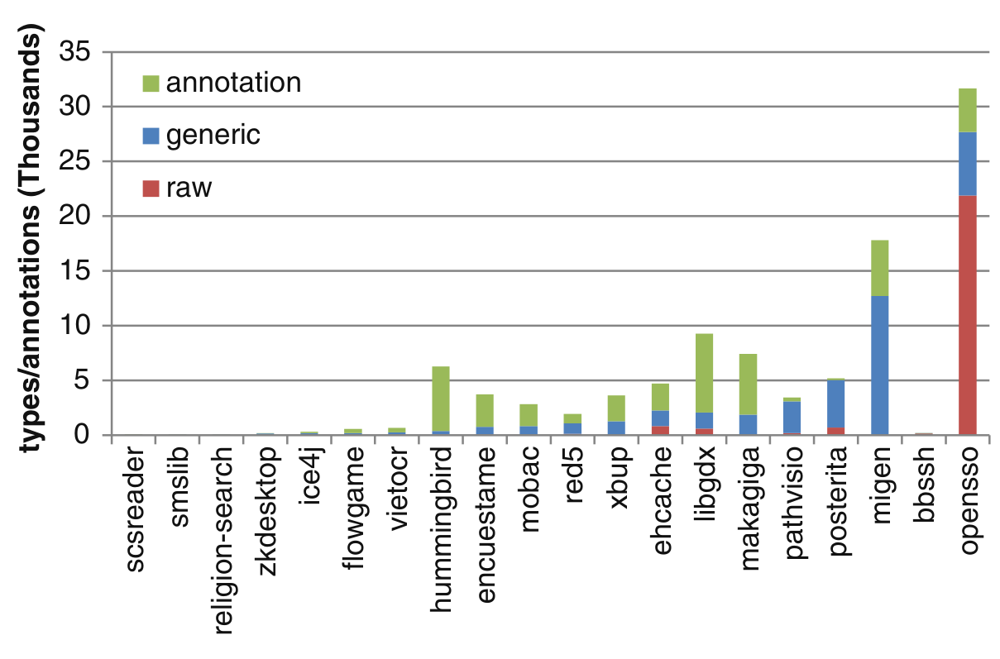

Fig. 2 Annotation, parameterized type, and raw type counts in 20 recent projects

We manually inspected a few raw types from the Ehcache and MiGen projects. In a few cases in Ehcache, use of raw types made sense, such as when a generic type parameter made no difference in the program. For instance, we observed that in a custom implementation of a dictionary, two dictionary entries were compared for equality; in this case, the type of those entries made no difference, since equality is defined for all Objects. In these cases, developers could have used the wildcard type with generics, but for some reason, chose not to do so. In most cases, we could discern no particular reason for usage of raw types over generics in Ehcache. For instance, in one class we observed the fully generic code:

```
List<Thread> requestThreads = new ArrayList<Thread>();
```

But then a few lines later, we observed generics mixed with raw types:

```
List<ThreadInformation> threads = new ArrayList();
```

In MiGen, the few raw types that did exist appeared to be either in test code or scrupulously commented. In one inline comment, a developer noted that he did not generify a raw type because he did not have time; in another, a developer noted that he tried to generify a collection but the generic version caused unexpected runtime behavior.

Overall, without systematic inspection and interviewing the developers, we can only speculate on why some projects adopted generics and annotations and other did not. We plan on conducting such inspection and interviews as part of future work.

### 5.2 Developers

Did developers widely embrace generics? How did this compare with annotations? We examined commits with creation or modification of parameterized types, generic type declarations, generic method declarations, or annotations.