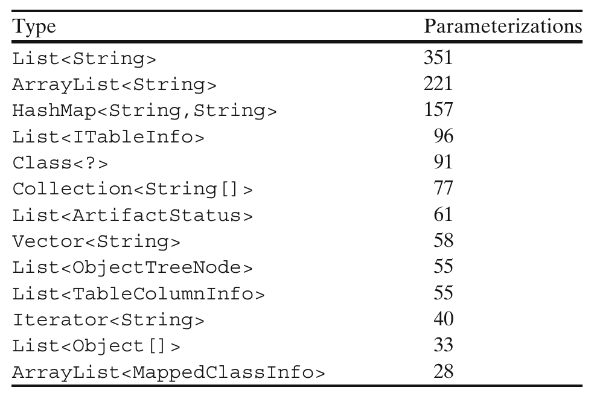
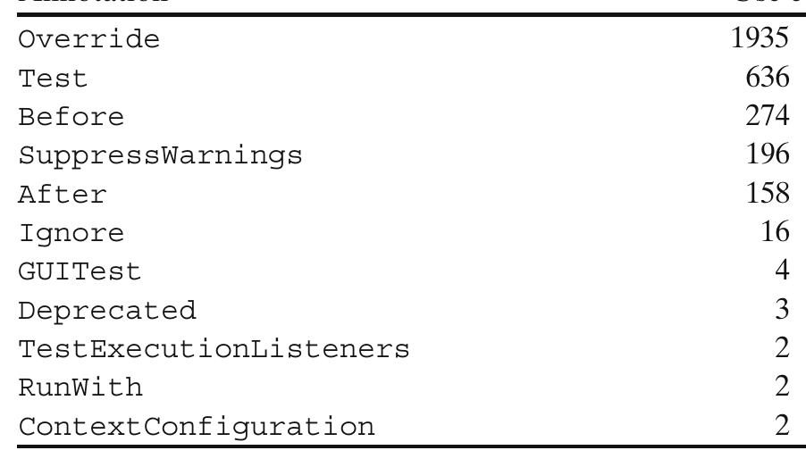

Table 3 Number of parameterizations of several generic types in Squirrel-SQL

### 5.3.2 Common Arguments

We also investigated which type arguments were used most frequently. Again, there was a very clear dominant usage pattern. Strings were by far the most common arguments. Table 3 shows the number of parameterized types of each kind of type argument in Squirrel-SQL for the most commonly used types. In fact, it appears that Lists and Maps of Strings account for approximately one quarter of parameterized types in Squirrel-SQL. We observed similar patterns in other projects with generics, with Collections of Strings being the predominant parameterized type in half of projects studied. This trend tended to be stronger in the established projects, which predominantly used String parameters in 78% of projects with generics, compared to recent projects in only 22%. The second most popular parameter was ? as an argument to the Class parameterized type, the most popular parameterized type in 14% of projects.

Overall, the most common usage of generics was to parameterize a collection of strings.

### 5.3.3 Generic Types versus Methods

We compared the number of user-defined generic types and methods across the established and recent projects.

Table 4 Number of uses of annotations in Squirrel-SQL

