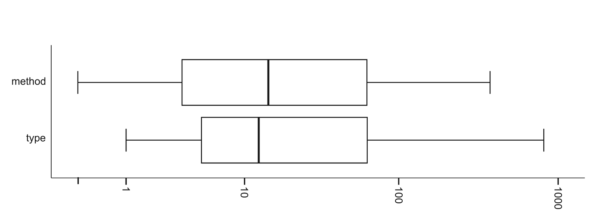

#### Established Projects

In the established projects, 979 generic methods and 1684 generic types existed during the lifetime of the projects. Out of the projects that used generics, 4 projects had fewer than 10 generic types, and 4 had more than 100 generic types. This trend was not necessarily a function of size; for example, FindBugs made extensive use of generic types (116) in comparison to JEdit (39) even though FindBugs is roughly half the size of JEdit. Figure 3 shows box plots depicting the number of type and method declarations across all projects. In all but 4 established projects there were more generic classes than generic methods, an almost 2-to-1 ratio.

#### Recent Projects

In the recent projects, 666 generic methods and 1234 generic types existed during the lifetime of the projects. Seven projects had fewer than 10 generic types, and 2 had more than 100 generic types. Only 3 projects had more generic methods than generic types, again matching the near 2-to-1 ratio also seen in the established projects. Overall, there were little differences between the established and recent projects.

A final observation we found was that introduction of generic types lagged behind the introduction of parameterized types, a tendency followed by most of the established projects that we studied. Exceptions include an early adopter of generics, FindBugs, which began using generic types and parameterized types at about the same time, and Ant and Subclipse, which never used any generic types. However, we did not observe this trend as strongly in recent projects. This lag suggests that adoption may grow in stages as developers become more comfortable with the new feature.

### 5.3.4 Unique Parameterizations

For generics to be advantageous, each type declaration must be parameterized by multiple types, otherwise a simple non-generic solution would suffice. But, for example, a generic type may be parameterized many times throughout the code but only have one unique parameter (e.g., String). In practice, how many unique parameterizations are made of type declarations? Is the number small or are generics preventing thousands of clones from being created? From our data, we counted user-defined type declarations and their parameterizations. Figure 4 shows box plots depicting the number of parameterizations of each user-defined type.

Fig. 3 Box plots displaying the number of method and type declarations in the projects under investigation