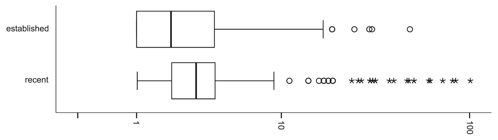

Fig. 4 Box plots displaying the number of parameterizations of each user-defined type in the established and recent projects

Established Projects In our established projects, 330 user-defined generic type declarations were instantiated in total 1,123 times. Of those, 38% had a single parameterization. The remaining 62% ranged from 2 to 49 parameterizations (mean = 4.8). The distribution was very positively skewed such that 80% of generic classes had fewer than 5 parameterizations.

Recent Projects In our recent projects, 332 user-defined generic type declarations were instantiated in total 2,027 times. Of those, 23% had a single parameterization. The remaining 77% ranged from 2 to 100 parameterizations (mean = 7.5). Still, 76% of generic classes had fewer than 5 parameterizations.

Overall, the lower portion of the distribution for both the established and recent projects were similar, differing on the tail-end in magnitude. This suggests that the cost savings envisioned by the language designers may not have been fully realized in practice.

### 5.3.5 Advanced Parameterizations

We examined several advanced uses of parameterization, including wildcard types, such as List<?>, where the type argument matches any type; bounded types, such as List<? extends Integer>, where the argument matches a certain set of types; nesting, such as List<List<String>>; and multiple type arguments such as Map<String, Double>.

Established Projects As a percentage of all parameterized types for the established projects, each advanced use made up the following percentages: nesting (1%), bounded types (4%), wildcards (11%), and multiple type arguments (22%).

Recent Projects The breakdown was similar for the recent projects, as a percentage of all parameterized types each advanced use made up the following percentages: nesting (1%), bounded types (2%), wildcards (15%), and multiple type arguments (14%).

The consistent levels of usage between established and recent projects suggests that there was an inherent difficulty or limited applicability in the more advanced features of generics, limiting their adoption.