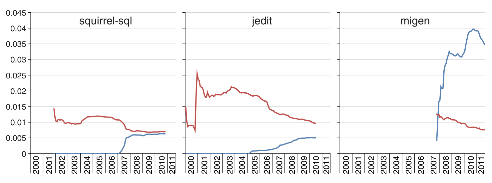

## 6 Investigating Claims

In this section, we examine Hypothesis 1 and Hypothesis 2. Here we do not specifically compare results for established projects against those for recent projects, as we did not find any substantial differences between the two project sets.

### 6.1 Generics Reduce Casts

An argument for introducing generics is that they reduce the number of runtime exceptions because they reduce the need to cast (Hypothesis 1). Thus, it is reasonable to expect that the addition of generics will reduce casts.

To test Hypothesis 1, we examined our data to determine if an increase in generics leads to a decrease in casts. However, comparing just the raw number of generics against the raw number of casts could be misleading, because an increase in generics may not actually cause a decrease in casts whenever new code containing parameterized types is added. To control for this, we calculated the density of program elements (parameterized types or casts) by dividing the number of program elements by Halstead’s program length (Halstead 1977). Halstead’s program length is the sum of the total number of operators (such as method calls) and the total number of operands (such as a variable). We used Halstead’s program length here because it measures program size, but also disregards code formatting, whitespace and comments, making it preferrable to a simple lines-of-code metric. Thus, Halstead’s program length allows us to more fairly compare projects that use different conventions for formatting, whitespace, and comments. This is important because, for example, Azureus has about half as many comments per line of code as Weka, according to ohloh.net.

Figure 5 plots the cast and parameterized type density for three projects. The x-axis represents time and the y-axis is the density of program elements. The number on the y-axis represents the number of program elements per unit program length. Red (top) lines represent the density of casts over time. Blue (bottom) lines represent the density of parameterized types over time. Because the density of parameterized types is small relative to that of casts, to improve the readability of the figure, the blue line is scaled by 10. Similar time series graphs are shown in the Appendix for all projects.

Fig. 5 Casts (red, top line) and parameterized type (blue, bottom line) density. Parameterized type density is scaled by a factor of ten to aid visual comparison.