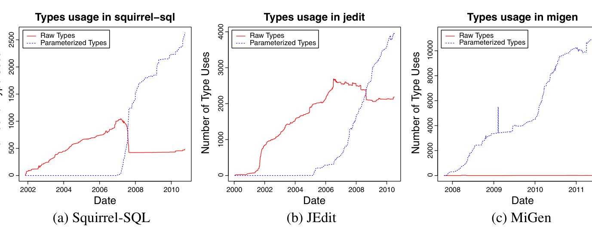

example, with a GenericHashKey that might be used by other generic types. Finally, we did not exclude generics that were introduced for testing purposes, such as in JDT, where some generics are used to test Eclipse’s Java language tools. As a consequence, projects that used generics for testing may not be representative of the average Java project.

## 7 Factors for Adoption

Risk, legacy code, backward compatibility, developer politics, feature complexity, and learning; these are several factors that may influence adoption. By comparing differences in adoption by established and recent projects of generics and annotations we attempt to tease apart some of these factors.

### 7.1 Do Developers Change Old Code to Use New Features?

Since generics supposedly offer an elegant solution to a common problem, we investigated how pre-existing code is affected by projects’ adoption of generics in an effort to answer Research Question 1. Conversely, for this research question, we did not examine annotations, as there was no corresponding old feature to “upgrade”. Is old code modified to use generics when a project decides to begin using generics? There are competing forces at play when considering whether to modify existing code to use generics. Assuming that new code uses generics extensively, modifying existing code to use generics can make such code stylistically consistent with new code. In addition, this avoids a mismatch in type signatures that define the interfaces between new and old code. In contrast, the argument against modifying old code to use generics is that it requires additional effort on code that already “works” and it is unlikely that such changes will be completely bug-free.

To address this question as presented in Research Question 1, we examined if and how old code is modified after generics adoption. Figure 6 depicts a gross comparison by showing the growth in raw types (solid red) and generic types (dashed

Fig. 6 Migration efforts in switching old-style collections was mostly limited in projects: old code remains. Solid lines indicate use of raw types (types such as List that provide an opportunity for generification) and dashed lines, generic types.