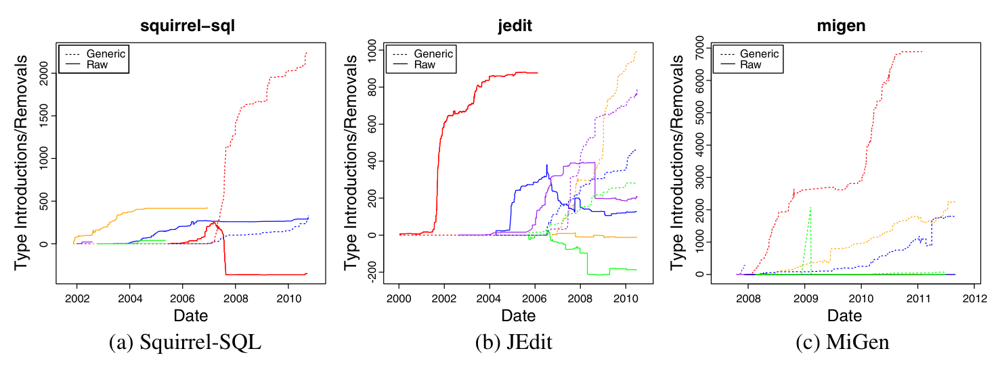

projects, where the newness of a feature may affect the dynamics of how community consensus occurs.

To answer Research Question 2, we first examined the introduction and removal of a feature by developers over time. We performed a Fisher’s exact test (Dowdy et al. 2004) of introduction of raw and parameterized types comparing the top contributor with each of the other contributors in turn (using Benjamini–Hochberg p-value correction to mitigate false discovery, Benjamini and Hochberg 1995) to determine if any one contributor uses a feature on average much more than the others. This test examines the ratio of raw types to parameterized types rather than the total volume, so that the difference of overall activity is controlled for.

To illustrate these results, we make use of several graphs detailing different author’s usage of a feature in a project. Figure 7 shows the introduction (and removal) of parameterized types by contributor for the five most active contributors to each project. A solid line represents the number of raw types, which are candidates for generification, and a dashed line, parameterized types. Pairs of lines that are the same color denote the same contributor. A downward sloping solid line indicates that a contributor removed raw types. For instance, Fig. 7a shows that in Squirrel-SQL, one contributor began introducing parameterized types in early 2007 while concurrently removing raw types. The Appendix contains similar graphs of all projects.

## Contributors’ Use of Generics

The most common pattern that we observed across projects was one contributor introducing the majority of generics. This pattern is illustrated in Squirrel-SQL (Fig. 7a) and similar phenomena were observed in Eclipse-cs, JDT, Hibernate, Azureus, Lucene, Weka, and Commons Collections. In established projects, one contributor dominates all others in their use of parameterized types to a statistically significant degree (α = .05).

In recent projects, we hypothesized that there may be different phenomena at work since there was no pre-existing non-generic code base that would make the decision to use generics a debated topic. Therefore, we expected broad community usage of generics. However, even in these newer projects, there was still a clear

Fig. 7 Contributors’ introduction and removal of type uses over time for the five most active contributors in each project. Solid lines indicate use of raw types (types such as List that provide an opportunity for generification) and dashed lines, parameterized types. Each color represents a different contributor.