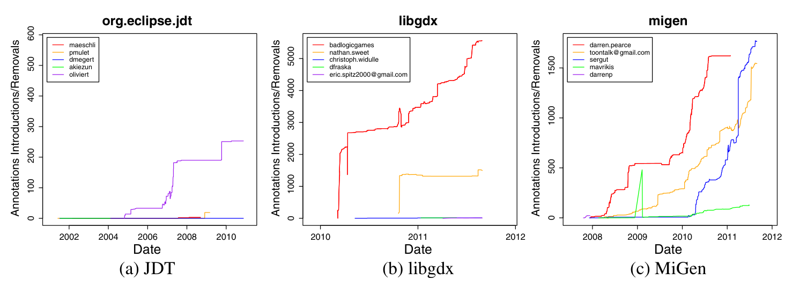

champion that accounted for most generics use in all but two projects (the contrary projects were PathVisio and SCSReader).

There were some outliers. JEdit (Fig. 7b) represents a less common pattern in that all of the active contributors began using generics at the same time (towards the end of 2006). This is more representative of the Spring Framework, JUnit, and Maven. Although our graph of JEdit shows that most contributors began using parameterized types, a Fisher’s exact test showed that one contributor (shown in yellow) still used parameterized types more often than raw types compared to all other contributors to a statistically significant degree. Lastly, FindBugs (not shown) is an outlier as the two main contributors began using generics from the very beginning of recorded repository history and parameterized types were used almost exclusively where possible; we found almost no use of raw types in FindBugs at all.

## Contributors Use of Annotations

As a contrast to our generic buy-in results, we also examined individual contributors’ adoption of annotations. Consistent with our results of analysis of individuals’ adoption of generics, we found that the majority of the projects that used annotations had a clear “champion” that used them more than the rest of the contributors to a statistically significant degree. Figure 8 shows the adoption graphs for the most active contributors in three projects. The graphs for the JDT and libgdx projects are representative of the vast majority of projects, as there is an obvious contributor that accounts for most annotations. The graph for MiGen is uncharacteristic, as there were a number of contributors that all actively added annotations to the codebase at roughly the same rate and time interval. Annotation graphs for all projects are shown in the Appendix.

The reader may notice that each of these graphs shows occurrences of steep increases over short time periods (e.g., the user sergut in MiGen in the early part of 2011). Interestingly, we also observed abrupt introductions of hundreds and sometimes even thousands of annotations in very short time periods. For instance, one contributor in the Lucene project added 2,182 annotations (across multiple files) in just one commit and one contributor added 16,019 to Hummingbird in just two days! We speculate that this level of activity may be indicative of use of an automatic technique for adding annotations. While not quite as extreme, we observed “bursts” of annotation introduction (usually on the order of hundreds in a short time period) in all projects that actually used annotations (36 out of 40) except for Makagiga,

Fig. 8 Contributors’ introduction and removal of annotations over time for the most active contributors in each project. Each color represents a different contributor