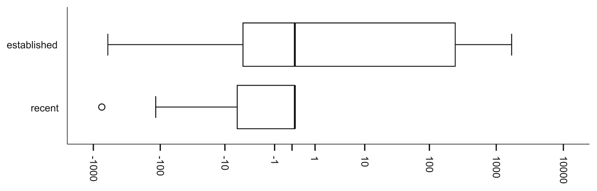

Fig. 9 Box plots displaying the number of days between when generics were introduced and when annotations were introduced in established and recent projects. Negative values indicate that annotations were introduced before generics.

This delay of 53 days is significantly shorter than the 296 days experienced by established projects (p < .02 by an unpaired 2-tailed t-test).

If compatibility was the sole important factor, we might have expected more simultaneous adoption. Still, we do believe compatibility plays a role. For example, we did see examples of people holding back code (e.g., List/*<String>*/) and a few projects adding in both features on the same day. Further, there is evidence of delay between the release of Java 5 and adoption of either annotations or generics. We found an average adoption lag of 500 days after the official release by the established projects. However, other factors delay adoption even further (an average 296 days).

Overall, from the data that we collected to answer if compatibility is the sole factor in Research Question 3, the results indicate that compatibility is an important, but not sole factor in adoption and other factors such as legacy code may contribute to even further delays.

### 7.3.2 IDE Support

To evaluate IDE support, we first had to determine which projects used which IDEs and were active prior to IDE support (the 20 established projects). We found evidence that IDEs were used for development for most of the projects that we studied. This evidence existed in the form of files created by IDEs (.project files in the case of Eclipse) or discussions on mailing lists. Eclipse was the most predominant IDE that we found evidence for, used by developers in Azureus, CheckStyle, Eclipse-cs, FindBugs, Jetty, JUnit, JDT, the Spring Framework, Squirrel-SQL, Subclipse, Weka, and Xerces.

Although Java 5 with generics was released in September of 2004, Eclipse did not support generics until the public release of version 3.1 in late June, 2005. NetBeans supported generics at the same time that they were introduced, making a study of the effects of support for this IDE difficult if not impossible. We therefore examined each of the eight established projects that use Eclipse as an IDE to determine if they adopted generics prior to the 3.1 release. Of these projects, CheckStyle, JUnit, JDT and FindBugs started using generics prior to generics support in Eclipse. The other four projects waited until after generics support appeared in Eclipse and did not