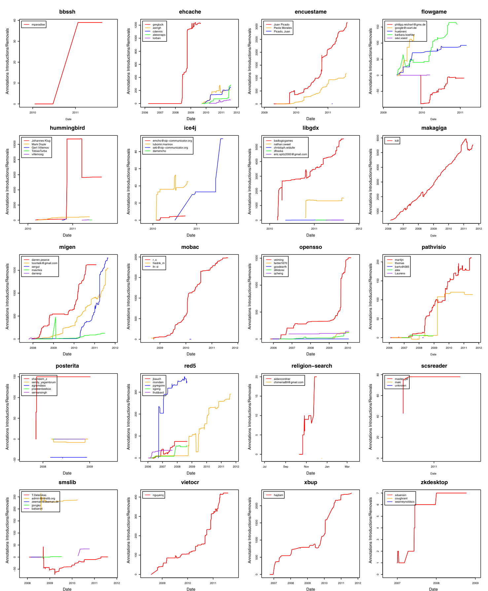

Fig. 17 Contributors' introduction and removal of annotations over time in recent projects

## References

Basit H, Rajapakse D, Jarzabek S (2005) An empirical study on limits of clone unification using generics. In: Proceedings of the 17th International Conference on Software Engineering and Knowledge Engineering, pp 109–114.

Benjamini Y, Hochberg Y (1995) Controlling the false discovery rate: a practical and powerful approach to multiple testing. J R Stat Soc B 57(1):289–300.