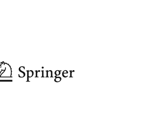

Bloch J (2008) Effective Java, 2nd edn. Prentice-Hall PTR

Bracha G (2005) Generics in the Java programming language. Web. http://java.sun.com/j2se/1.5/pdf/generics-tutorial.pdf. Accessed 1 Mar 2012

Bracha G (2012) Lesson: generics. Web. http://download.oracle.com/javase/tutorial/extra/generics/index.html. Accessed 1 Mar 2012

Donovan A, Kiezun A, Tschantz MS, Ernst MD (2004) Converting java programs to use generic libraries. In: OOPSLA ’04: proceedings of the 19th annual ACM SIGPLAN conference on object-oriented programming, systems, languages, and applications

Dowdy S, Wearden S, Chilko D (2004) Statistics for research, 3rd edn. Wiley, New York

Ducheneaut N (2005) Socialization in an open source software community: a socio-technical analysis. Comput Support Coop Work 14(4):323–368

Flanagan C, Leino KRM, Lillibridge M, Nelson G, Saxe JB, Stata R (2002) Extended static checking for Java. SIGPLAN Not 37:234–245

Fuhrer R, Tip F, Kiezun A, Dolby J, Keller M (2005) Efficiently refactoring java applications to use generic libraries. In: European conference on object oriented programming, pp 71–96

Geiger R, Fluri B, Gall H, Pinzger M (2006) Relation of code clones and change couplings. FASE 3922:411–425

Halstead MH (1977) Elements of software science (operating and programming systems series). Elsevier Science Inc., New York, NY, USA

Humphrey WS (1995) A discipline for software engineering. Addison-Wesley Longman Publishing

Java Language Guide: Annotations (2012). Web. http://download.oracle.com/javase/1.5.0/docs/guide/language/annotations.html. Accessed 1 Mar 2012

Liebig J, Kästner C, Apel S (2011) Analyzing the discipline of preprocessor annotations in 30 million lines of C code. In: Proceedings of the tenth international conference on aspect-oriented software development, AOSD ’11. ACM, New York, NY, USA, pp 191–202

Markstrum S (2010) Staking claims: a history of programming language design claims and evidence. In: Proceedings of the workshop on the evaluation and usability of programming languages and tools

Mockus A, Fielding R, Herbsleb J (2002) Two case studies of open source software development: apache and mozilla. ACM Trans Softw Eng Methodol 11(3):309–346

Monden A, Nakae D, Kamiya T, Sato S, Matsumoto K (2002) Software quality analysis by code clones in industrial legacy software. In: Proceedings of the 8th international symposium on software metrics

Naftalin M, Wadler P (2006) Java generics and collections. O’Reilly Media, Inc

O’Mahony S, Ferraro F (2007) The emergence of governance in an open source community. Acad Manage J 50(5):1079–1106

Pankratius V, Adl-Tabatabai A, Otto F (2009) Does transactional memory keep its promises?: results from an empirical study. Technical Report 2009-12, Universität Karlsruhe, Fakultät für Informatik

Papi MM, Ali M, Correa Jr TL, Perkins JH, Ernst MD (2008) Practical pluggable types for java. In: Proceedings of the 2008 international symposium on software testing and analysis, ISSTA ’08. ACM, New York, NY, USA, pp 201–212

Parnin C, Bird C, Murphy-Hill E (2011) Java generics adoption: how new features are introduced, championed, or ignored. In: Proceedings of the 8th working conference on mining software repositories, MSR ’11. ACM, New York, NY, USA, pp 3–12

Shi L, Zhong H, Xie T, Li M (2011) An empirical study on evolution of API documentation. In: Proceedings of the 14th international conference on fundamental approaches to software engineering: part of the joint European conferences on theory and practice of software, FASE ’11/ETAPS ’11. Springer, Berlin, Heidelberg, pp 416–431

Storey M-A, Ryall J, Bull RI, Myers D, Singer J (2008) Todo or to bug: exploring how task annotations play a role in the work practices of software developers. In: Proceedings of the 30th international conference on software engineering, ICSE ’08. ACM, New York, NY, USA, pp 251–260

The Advantages of the Java EE 5 Platform: A Conversation with Distinguished Engineer Bill Shannon (2012) Web. http://java.sun.com/developer/technicalArticles/Interviews/shannon_qa.html. Accessed 1 Mar 2012

The Java Tutorials: Annotations (2012). Web. http://download.oracle.com/javase/tutorial/java/java00/annotations.html. Accessed 1 Mar 2012

