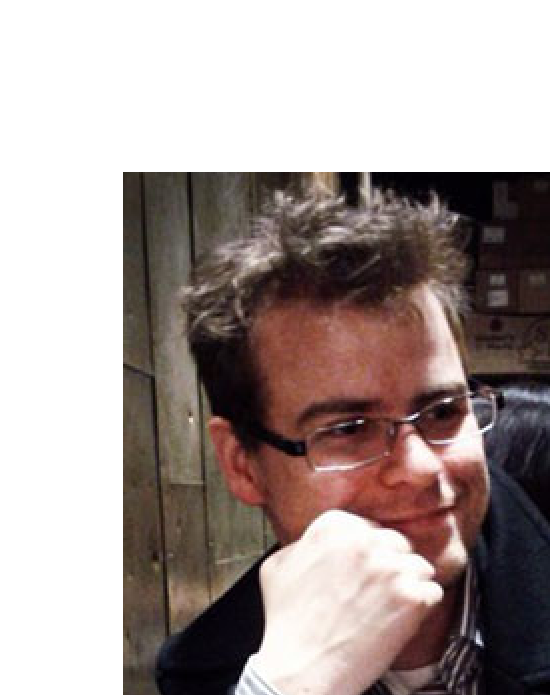

Van Emden E, Moonen L (2002) Java quality assurance by detecting code smells. In: Proceedings of the ninth working conference on reverse engineering (WCRE'02), pp. 97–106. IEEE Computer Society, Washington, DC, USA

Vandevoorde D, Josuttis N (2003) C++ templates: the complete guide. Addison-Wesley Professional

Zimmermann T (2006) Fine-grained processing of CVS archives with APFEL. In: Proceedings of the OOPSLA workshop on eclipse technology eXchange. ACM Press

> **Chris Parnin** is a PhD student at Georgia Tech. He walks the line between being a professional software developer and researching them. He specializes in empirical, cognitive studies, and user studies of software development. Contact him at chris.parnin@gatech.edu. http://www.cc.gatech.edu/~vector/.

> **Christian Bird** is a researcher at Microsoft Research in Redmond, Washington. His interests are in empirical studies of software engineering, predominantly examining the problems encountered in large software development projects. He received his Ph.D. from U.C. Davis. Contact him at cbird@microsoft.com. http://research.microsoft.com/people/cbird.