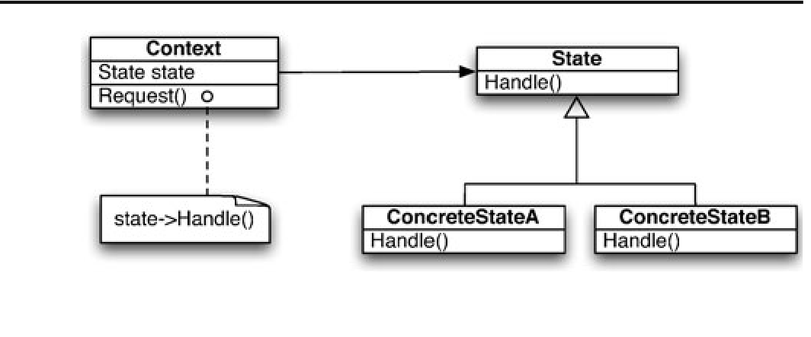
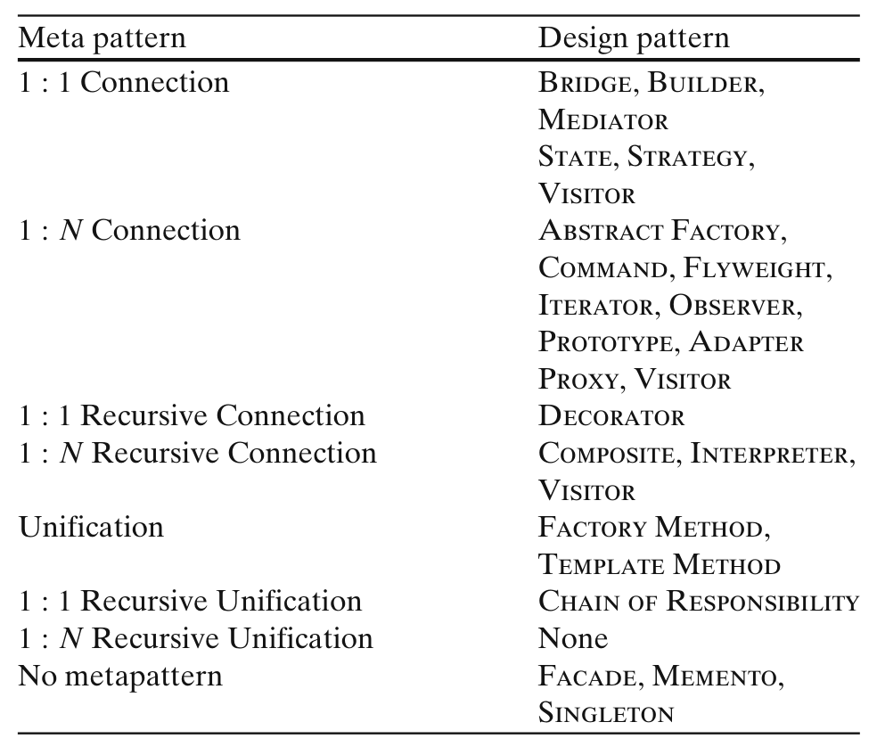
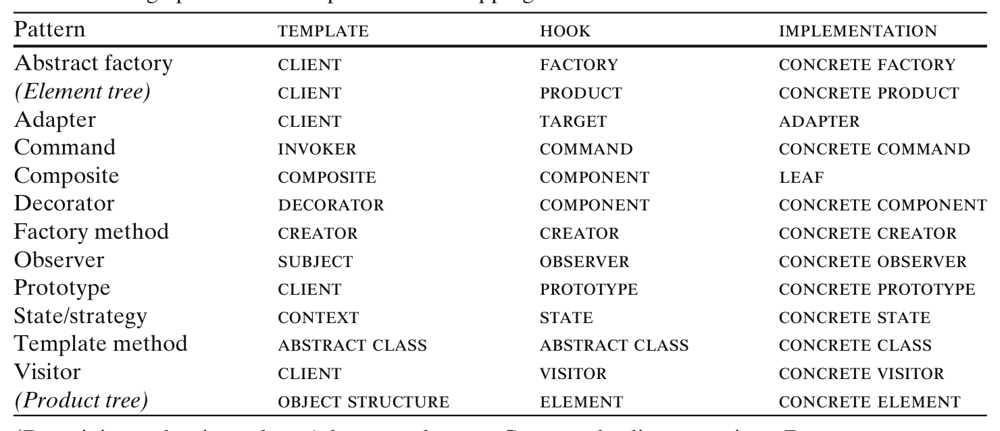
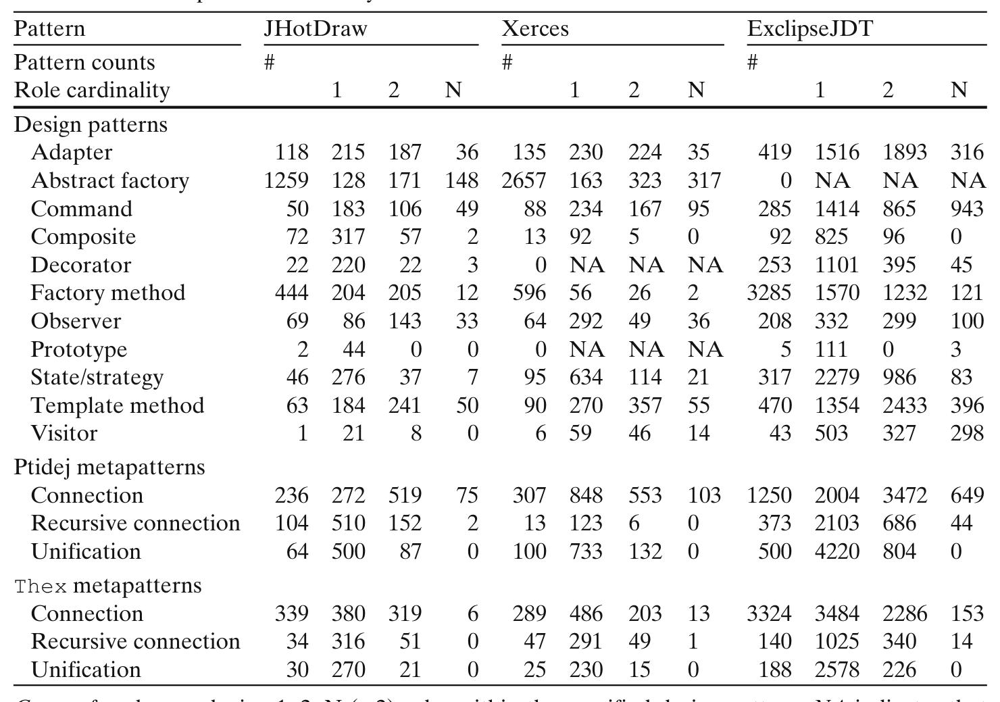
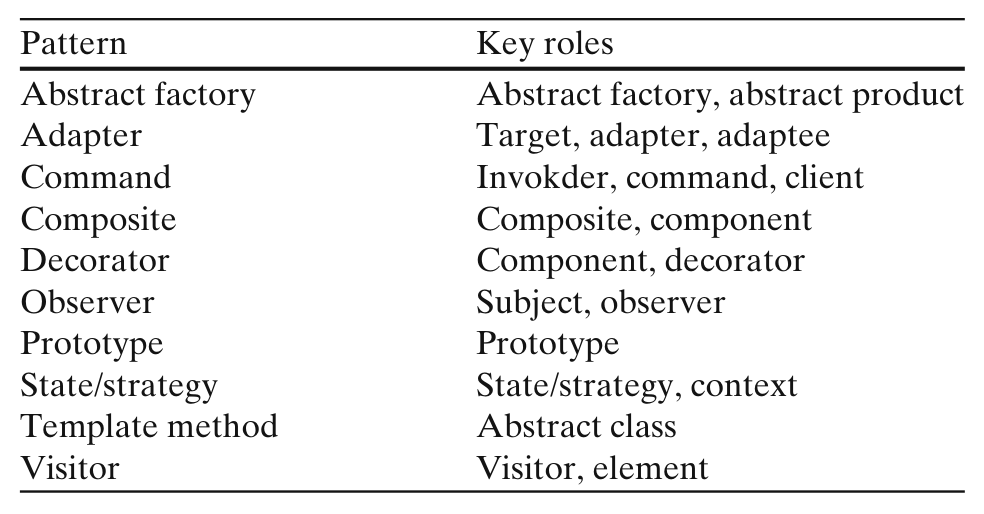
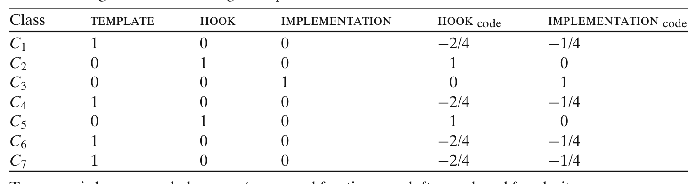
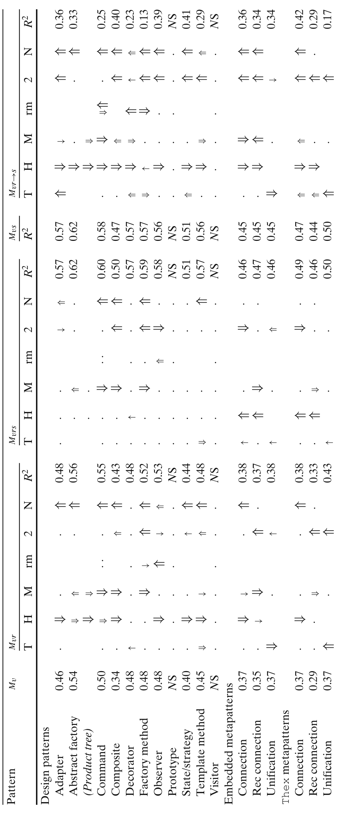
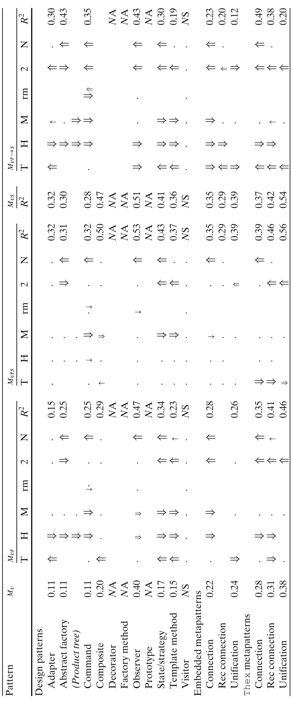
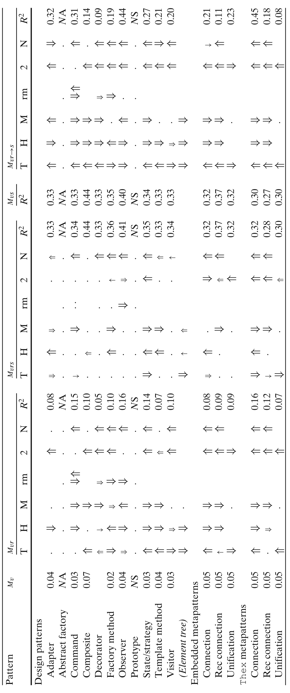

## An empirical study on the influence of pattern roles on change-proneness

Daryl Posnett · Christian Bird · Prem Dévanbu

Published online: 30 December 2010  
© The Author(s) 2010. This article is published with open access at Springerlink.com  
Editor: Massimiliano Di Penta

### Abstract
Identifying change-prone sections of code can help managers plan and allocate maintenance effort. Design patterns have been used to study change-proneness and are widely believed to support certain kinds of changes, while inhibiting others. Recently, several studies have analyzed recorded changes to classes playing design pattern roles and find that the patterns “folklore” offers a reasonable explanation for the reality: certain pattern roles do seem to be less change-prone than others. We push this analysis on two fronts: first, we deploy W. Pree’s metapatterns, which group patterns purely by structure (rather than intent), and argue that metapatterns are a simpler model to explain recent findings by Di Penta et al. (2008). Second, we study the effect of the size of the classes playing the design pattern and metapattern roles. We find that size explains more of the variance in change-proneness than either design pattern or metapattern roles. We also find that both design pattern and metapattern roles were strong determinants of size. We conclude, therefore, that size appears to be a stronger determinant of change-proneness than either design pattern or metapattern roles, and observed differences in change-proneness between roles might be due to differences in the sizes of the classes playing those roles. The size of a class can be found much more quickly, easily and accurately than its pattern-roles. Thus, while identifying design pattern roles may be important for other reasons, as far as identifying change-prone classes, sheer size might be a better indicator.

### Keywords
Design patterns · Empirical software engineering

D. Posnett (B) · C. Bird · P. Dévanbu  
University of California Davis, Davis, California, USA  
e-mail: dpposnett@ucdavis.edu

C. Bird  
e-mail: cabird@ucdavis.edu

P. Dévanbu  
e-mail: ptdevanbu@ucdavis.edu

---

## 1 Introduction

Change-proneness is often thought of as a proxy for maintainability. Classes that are more change-prone have been shown to require more maintenance effort (Günes¸ Koru and Liu 2007). Since reducing maintenance effort is a key goal of software engineering, it is important to understand the impact of software design choices on change-proneness. Design patterns (Gamma et al. 1995) promise to help make code easier to evolve. Specifically, patterns allow classes to be assembled into a design unit, or motif, where each class plays a specific pattern role. Patterns are thought to allow classes playing certain roles to evolve more easily than others. It is believed that this flexibility is partly responsible for avoiding reimplementation and client modification (Gamma et al. 1995). A recent study by Di Penta et al. tends to confirm intuitions about the change-proneness of class playing classic Gamma et al. design pattern roles (Di Penta et al. 2008).

A related question of interest is whether change-proneness is simply a consequence of the inheritance and association/aggregation structure of a design pattern, or if is related to other design pattern properties.

Object-oriented programming (OOP) has at its core the idea of programming to an interface, i.e. declaring objects of a parent interface type rather than a particular child class type. This practice decouples the clients of the parent interface and the indirectly referenced class hierarchy. Pree presented metapatterns, which can be viewed as a purely structural view of design patterns (Pree 1994). Metapatterns arise from this core OOP principle of object composition of the clients to the parent interface, and the class composition of the parent interface into the children.

Most design pattern motifs can be viewed as one or more instances of metapatterns; structurally similar design pattern motifs instantiate the same metapatterns. Gamma et al. assert that “designers overuse inheritance as a reuse technique and, designs are often made more reusable ... by depending more on object composition.” (Gamma et al. 1995) Consequently, we observe that metapatterns model a subset of design pattern properties that are believed to facilitate reuse and limit change-proneness.

The findings of Di Penta et al. suggest that observed differences in change-proneness in classes playing design pattern roles could be explained more simply, just by structure, viz., metapattern roles. We expect for example, a strategy role to change less often than a concrete strategy role because changes to the former may ripple through both the context hierarchies where overridden methods are defined and the strategy class hierarchies where these overridden methods are called. This intuition is not dependent on any property of design patterns that are not also captured by metapatterns. The intent of the Strategy pattern does not affect reported intuition regarding change-proneness; rather, the reported intuition is simply a consequence of the class and object relationships modeled by metapatterns.

Since metapatterns are defined by a subset of design pattern properties, they are more easily detected. With the exception of Singleton, Memento, and Facade, every Gamma et al. design pattern motif inherently contains a metapattern; thus, we will find at least one metapattern for each such design pattern. Furthermore, since metapatterns almost always have fewer detection requirements than design patterns, we typically find some additional metapatterns where no design pattern exists. Consequently, detected metapattern instances are usually at least as numerous as the design pattern instances that include metapatterns, up to any limitations in detection tools.

Earlier studies of change-proneness indicate that size influences change-proneness (Bieman et al. 2001, 2003) of classes that participate in design patterns.

---

The authors expected that classes involved in design patterns would be less change-prone; however, they observed that such classes were still more change-prone after accounting for size than those not participating in design patterns.

In a later study, Aversano et al. (2007) observed that classes participating in patterns that "play a very important role for a(n) ... application" are more change-prone and that classes not participating in patterns are often not key participants in the application's design. Consequently, their results support the work of Bieman but do not shed any further light on the question of whether the various design pattern roles actually offer the stability suggested by the literature.

In this paper we study classes playing pattern roles within the same pattern and application to shed further light on the question of the relationship between design patterns and class stability.

### 1.1 Outline

We present the following results:

1. We observe that differences in change-proneness of design-pattern roles reported by Di Penta et al. (2008) can also be explained by the purely structural notion of metapattern roles. We observe similar patterns of change-proneness among design patterns that employ the same metapattern model as well as in the independently measured metapatterns.
2. However, when controlling for the sizes of the classes playing these (pattern and metapattern) roles, we find that the roles add very little explanatory power.
3. We also find that sizes of the classes are strongly associated with the metapattern roles played by the classes; leading to the conclusion that while pattern and metapattern roles do partially explain change-proneness, the dominant effect is indirectly through size, i.e. classes playing certain metapattern roles are larger.

Our work is in the spirit of Basili and Elbaum (2006) and Perry et al. (2000) who point out that replications and integrating multiple studies are critical to gain confidence in empirical results. In addition, our findings suggest that some widely held intuition about the change-proneness of classes playing various roles in patterns can be explained by the simpler relationships of the underlying metapatterns.

We begin with a quick overview of metapatterns (Section 2), leading to a formulation of the main research questions. We then present a detailed review of metapatterns (Section 3) and discuss related work (Section 4). We describe (Section 5) our data extraction approach. We then present our results (Section 6), discuss threats, and conclude. Throughout this paper, we refer to the patterns introduced in the classic GOF (Gang of Four) Book (Gamma et al. 1995) as design patterns and the purely structural patterns presented by Pree as metapatterns.

## 2 Overview

Metapatterns capture the pure structure of design patterns. As an illustration, we describe the structural similarity between State and Strategy patterns. First,

---

Fig. 1 The STATE pattern

Consider the State design pattern (Fig. 1) with the context, state, and concrete state roles.1 Calls from clients (not shown) to Context.Request() are forwarded to the base-class method State.Handle() and then (e.g.) to the implementation ConcreteStateA.Handle() via the state instance variable.

The Strategy design pattern has an analogous structure, consisting of context, strategy and concrete strategy. Both State and Strategy have a stable part, and a changeable part. The context role in these patterns is used by clients of the pattern, and could change in response to changing client needs. The context role makes use of the state/strategy role, which defines an interface, and thus is relatively fixed. This interface is implemented by concrete state/concrete strategy roles, which provide varying implementations of the state/strategy roles. The class playing the state/strategy role, by remaining stable, effectively decouples the classes playing the other two roles. Pree noticed the structural similarity of these two patterns, and named the shared structure the 1-1-Connection metapattern (Fig. 2).

The context role in the State/Strategy pattern is named the template meta-role in the 1-1-Connection metapattern; the interface (state or strategy role) is named the hook meta-role; and the changeable roles (concrete state or concrete strategy) are called the implementation meta-roles.

Pree defines 7 structural metapatterns and shows that most design patterns have, at their core, an instance of one or more of these metapatterns (more details in Section 3).

### 2.1 Research Questions

A close reading of earlier results by Di Penta et al. (2008) on the relative change-proneness of classes playing different roles in a design pattern, suggests that the findings could be grouped by the underlying metapattern roles. Other studies of change-proneness in patterns suggest that size has a strong relationship to change-proneness (Bieman et al. 2001, 2003).

Size is an appealing, baseline phenomenon: the larger a component, the more likely some part of it changes. Moreover, we agree with Briand and Wust (2002) who assert that “the size of an artifact is a necessary part of any model predicting a property ... of this artifact.” If we are relating change-proneness to some property, we want to know that this property is telling us more than just that the larger classes are more change-prone. To this end it is often prudent to include size as a control in any models that relate properties potentially influenced by size to a particular outcome (El Emam et al. 2001). If our goal is to understand a phenomenon such as how design pattern roles affect change proneness, then it is necessary to determine

1 In this example, classes have been given the same name as the roles for clarity.

---

Fig. 2 The basic metapattern structures

If the role attributes that we are measuring are an artifact of the design pattern role, or simply a proxy for size, we ask: Do the observed differences in change-proneness hold up, even when accounting for the sizes of the respective classes playing the pattern or metapattern roles? We begin by studying the influence of size on the change-proneness of classes playing traditional design pattern roles.

> **Research Question 1:** To what extent does design pattern role explain the variation in change-proneness of classes, when controlling for class size?

Our second research question considers the same issue, with respect to metapatterns:

> **Research Question 2:** To what extent does metapattern role explain the variation in change-proneness of classes, when controlling for class size?

Next, we consider the relative explanatory power of pattern roles and metapattern roles:

> **Research Question 3:** When controlling for size, do metapattern roles explain as much of the variation in change-proneness as design pattern roles?

Finally, we consider the impact of design pattern and metapattern roles on the sizes of the classes playing those roles. If the roles explain a significant level of the variance in size, then the differences in change-proneness of roles might simply be an indirect, mediated effect of the relative size differences in the classes playing those roles.

> **Research Question 4:** Do (the purely) structural metapattern roles and pattern roles explain the variation in the sizes of classes playing those roles?

---

## 3 Phylogeny: Metapatterns and Patterns

Metapatterns are rooted in two structural roles, template and hook. A template is a class with a method t that calls a method h in the hook class (or interface). The template provides a “template” to accomplish a goal and the hook provides a way in, or a “hook,” into a flexible class hierarchy including the hook and its descendants. We use the same terms, without ambiguity, to refer to the template and hook methods, i.e. hook may refer to either a method or a class, depending on context. To make use of the hook class hierarchy, the template method must invoke the hook method through some variable or parameter f in the template class. This variable provides the link between the algorithm and the collection of classes available in the hook class hierarchy. The cardinality of f defines the cardinality of the instance relationship between the template and hook classes. When f is a container the template may invoke any number of hook instances and the relationship is 1:N. Alternatively, if f is a simple scalar instance of hook then template may invoke methods in only one hook instance and the relationship is 1:1. A subject may have to update many observers so this would indicate a 1:N relationship. On the other hand, a document formatting strategy may hold only a single document formatter reference even though it might choose one of several concrete formatters; this single object reference defines a 1:1 relationship.

In every case, the hook method in the hook class can be overridden by methods in one or more hook implementation (hereafter referred to as implementation) classes derived from the hook class. In the example above, the concrete strategies that implemented different document formatters would play the implementation roles.

The patterns are shown in Fig. 2 and are defined as follows:

1. If the hook to template relation is purely associative or aggregative, it is a 1:1 or 1:N Connection metapattern.  
2. If template inherits from hook, it is a 1:1 or 1:N Recursive Connection metapattern.  
3. If template and hook are the same class, this is a unification metapattern.  
4. If template and hook are the same class type, but template references or aggregates one or more instances of its own type, it is a 1:1 or 1:N Recursive Unification metapattern.

### 3.1 Connection Metapatterns

In the connection metapattern, the template method delegates a specific task to the hook method. The hook method is an “articulation point” allowing the implementation and template classes to change independently.

The first row of Table 1 lists the traditional design patterns that instantiate the 1-1-Connection metapattern. Because the hook serves as the base class for one or more implementations, we can expect that the hook role is relatively less change prone than the implementation or the template roles. This mirrors the intuition reported by Di Penta et al. across many design pattern roles such as those of the adapter, command, state, strategy, and observer patterns.

In general, given a pattern role, the corresponding meta-role is evident. For example, the builder pattern, a 1-1-Connection metapattern: the builder pattern role maps to a hook role, the director to the template role, and the concrete builder to the implementation role. We list the typical meta-roles for the canonical GOF structures in Table 2.

---

Table 1 Classifying design patterns into metapatterns

> All the metapatterns are presented for completeness

The 1-N-Connection metapattern is similar to the 1-1-Connection metapattern except that the template role may aggregate or reference multiple instances of the hook role objects. With respect to class structure and change-proneness we expect that 1-N-Connection and 1-1-Connection are similar: hook should change less than implementation or template. Instances of 1-N-Connection are shown in row 2 of Table 1.

### 3.2 Recursive Metapatterns

In the recursive metapatterns, the template class inherits from the hook class. This means that it calls into its own hierarchy, and typically must provide an implementation, as well as a “template”, for the hook class. Playing both implementation and template roles complicates the template class: it acts as both a client of an algorithm,

Table 2 Design pattern to metapattern role mapping

(Product tree) object structure element concrete element

(Remaining roles in order: Adapter: adaptee, Command: client, receiver; Decorator: concrete decorator; Factory Method: product; Observer: concrete subject)

---

and often as an implementation of parts of the algorithm. The template is more strongly linked to the hook than in the non-recursive variant.

In the Decorator pattern, the component class plays the hook role, providing the interface for both concrete component and decorator. The decorator plays the template role and often a default implementation role. The concrete component class also plays the implementation role. Because the decorator can be subclassed by a concrete decorator that must correctly invoke methods on the component classes that they decorate, the classes are more tightly bound than in many other patterns. The decorator class holds a reference to a concrete component that is also a descendant of the component (hook) and typically the decorator methods forward requests from one concrete decorator to the next. Changes in the base component role, and changes in forwarding logic, will induce changes across the decorator subtree. Thus, we expect the decorator, playing the template metapattern role, to be more change-prone than either its hook, or even the hook subclasses.

We expect the 1-N-Recursive-Connection metapattern to show a similar pattern of change-proneness to the 1-1-Recursive-Connection metapattern.

### 3.3 Unification Metapatterns

The Unification metapatterns combine template and hook both roles in a single class. Most patterns of this form do not contain an explicit hook reference and the hook call is made implicitly through the this reference. The recursive form of this pattern combines template and hook methods into a single recursive method. Since no design patterns employ the Recursive Unification metapattern structure (see Table 1), we ignore it. The (non-recursive) Unification metapattern may be found in the Factory Method and Template Method design patterns. There is no strict mapping between these patterns and the Unification metapattern, however, and both can also be implemented with the Connection metapattern.

## 4 Related Work

There has been significant research effort focused on the validation of design pattern claims. The earliest results focused on comparing development efforts both with and without design patterns. In a controlled paper and pencil experiment on the effectiveness of design patterns, Prechelt and Unger found that while Decorator had a positive effect on program maintenance as compared to a simpler non-pattern based design solution, Observer had a negative effect; the benefits of Abstract Factory were small, and, contrary to expectation, the Visitor was neither beneficial nor detrimental (Prechelt et al. 2001). Vokáč replicated this experiment in a real programming environment and found similar effects for Decorator and Abstract Factory, a very strong negative effect for Visitor and a positive effect for Observer (Vokáč et al. 2004).

Ng et al. found that the difficulty of performing maintenance tasks is dependent on whether the subjects are changing concrete participants, abstract participants, or client code (Ng et al. 2007) and that even inexperienced coders were more able to affect changes on a system re-factored to design patterns than on the original non-design-pattern-based system (Ng et al. 2006).

Bieman et al. studied change-proneness in design pattern instances within five systems comparing classes participating in design patterns to those that played no

---

role within any design pattern (Bieman et al. 2001, 2003). They theorized that, since design patterns support adaptability, classes instantiating design patterns should be more stable, and adaptations will occur via specialization of existing classes in preference to modification of existing classes. Contrary to their expectation, they found that classes participating in design patterns actually change more than classes not participating in design patterns. One interpretation of this result might be that design patterns do not lead to greater adaptability and lower change proneness. This interpretation does not, however, account for systematic differences between pattern and non-pattern classes. We do not find the Bieman et al. result surprising; in fact, we expect that design patterns would be deliberately used to make certain classes (perhaps playing critical roles) easier to change. By design, as the system evolves, these critical classes might well become the focal point for change. Consequently, a finding that design pattern classes change more than non-pattern classes does not imply that using patterns is bad: it is simply a reflection of the fact classes playing certain roles in certain patterns, by design and intention, change more often in response to normal software evolution. This leads naturally to the question of how pattern roles influence change-proneness, as we discuss below.

Aversano et al. (2007) studied patterns in several open source programs comparing change-proneness and co-change of classes participating in design patterns to an overall rate of change. They found that patterns change more frequently when they play a crucial role in the application. They also found that patterns make clients resistant to changes but that changes to the pattern interface reduce this resiliency. They concluded that overall class change frequency and quantity does not depend on pattern type but on the (design) role a pattern plays for the application. Their findings support the work of Bieman et al. in that they not only find pattern classes more change-prone, but that, in particular, classes in patterns at the core of an application's design are more change-prone, which, as with the work by Bieman et al., runs counter to expected intuition that design patterns promote stability. This apparent contradiction melts away when pattern roles are considered.

One often ignored aspect of class role membership is that classes frequently play multiple roles. Khomh et al. studied the impact on classes playing multiple roles within a system. Their work focuses on cross-motif roles and showed that while multiple roles cannot be ignored, a non-insignificant number of classes play a single role (Khomh et al. 2009). We can draw two key ideas from this work. First, since a statistically significant number of classes play single roles within a system it is reasonable to study the change proneness of patterns playing single roles; second, since we cannot ignore multiple roles, we must include this aspect in our models in some manner. A class playing multiple roles does not necessarily take on the characteristics of just one role and it would be erroneous to treat it as such.

One approach to control for between-pattern variation is to consider expected intuition within patterns. Recently Di Penta et al. (2008) studied change-proneness of specific roles within design patterns. They compared the change-proneness between groups of classes playing different design pattern roles. For each design pattern, the authors described their expected intuition regarding change-proneness of roles. In the state pattern, for example, the state role is an interface, and should be more stable. Likewise, for the Adapter, the target role both provides the interface that all adapters must implement as well as the external interface to the pattern via the client and hence should be relatively stable. We observe that their arguments could be abstracted into metapattern roles, in terms of the connection metapatterns.

---

The template role expects a stable hook interface through which it can call on the implementation classes that extend the hook interface. We see additional similarity in the intuition reported for the recursive connection based patterns. For both Decorator and Composite, the component pattern role is expected to remain stable as it provides the interface through which clients make use of the decorator pattern as well as the interface that must be implemented by all concrete components and decorators. A change to this class may have ripple effects both in the clients that use the pattern and the classes that implement the pattern. Di Penta et al. reported, contrary to their intuition, that the decorator and composite roles often change more than expected. The composite role implements a mechanism to build collections of concrete components and the decorator similarly contains the mechanism to add any number of concrete decorator implementations around each component. Hence, these roles are more than simple interfaces and we expect that their template role nature explains previously reported observations. Since these classes implement the elements that comprise the core algorithm of the pattern it is expected that the composite would be more change-prone and the concrete components less so.

In summary, while Di Penta et al. report distinct results for how the roles in different design patterns are change-prone, their results in our analysis can be more simply and consistently viewed in the light of metapattern roles. In other words, we expect to see in the Di Penta et al. data that classes playing hook roles change less than those playing implementation or template roles. Moreover, the reported intuition, although expressed in terms of design pattern roles, is specifically related to the structure modeled by metapatterns.

Our research is partly animated by this finding; we investigate whether design pattern roles that can be grouped into the same meta-pattern roles show similar change-proneness. As Di Penta et al., and unlike previous work, we compare roles within patterns. In addition, we control for size, multiple roles, and for between-release effects. This approach allows us to focus more clearly on the effect role membership has on class change proneness.

## 5 Data Gathering and Methodology

We gathered data from the same 3 projects used by Di Penta et al. (2008): JHotDraw (5.1–5.4b2), Xerces (1.0.0–1.4.4), and Eclipse JDT (1.0–2.1.2). We used the same approach to identify the pattern and metapattern instances that survived across multiple changes.

To gauge the effect of design pattern/metapattern roles on change-proneness, we identified pattern instances that remain stable, despite other changes, using the approach of Di Penta et al. A pattern instance is stable if its major roles are bound to the same class names in two consecutive releases. For metapatterns we require the template and hook and their associated template and hook methods to remain stable across two releases.

Given a class playing a stable pattern role between two releases R and R+1, we count the number of changes to that class in a series of snapshots between the releases. We identify transactions: multiple commits within a narrow time window made by the same developer are counted as an atomic commit, and thus a single change.

Previous results counted each unique commit as a single change. We identified change counts in a similar way, but used Fluri's Change Distiller (Fluri et al. 2007),

---

a more fine-grained change analysis tool. Commits that contain no actual source
code change, e.g. adding blank lines or rearranging methods in a class, are not
counted.

## 5.1 Design Pattern Detection

We use the DeMIMA approach of Di Penta et al. to identify occurrences of design
patterns (Guéhéneuc and Antoniol 2007). DeMIMA is built on the Ptidej toolset
which constructs static and dynamic models of Java source code.

Each pattern is defined as a set of logical constraints; an explanation-based
constraint solver (Jussien and Barichard 2000) is used to identify pattern
occurrences. We used pattern participation data generated by the Ptidej solver provided by
Guéhéneuc et al. to identify design patterns in JHotDraw, Xerces, and Eclipse
JDT.

## 5.2 Metapattern Detection

We identify metapatterns in two ways. First, we link design patterns with their asso-
ciated metapatterns, thus extracting metapattern instances from the DeMIMA
pattern data. We call these metapatterns embedded metapatterns. Thus, each design
pattern role is associated with its metapattern roles (Table 2). The number of
metapattern roles in each design pattern varies and metapatterns may also span
multiple design patterns. We consider only intra-pattern metapatterns and do not
classify any role as a meta-role unless we can identify all metapattern roles within the
design pattern. These canonical metapatterns are derived from the example pattern
motif structures presented in the GOF book (Gamma et al. 1995) and are presented
in recent work on design pattern detection (Hayashi et al. 2008). As an example, the
observer pattern has a canonical metapattern role where the (Subject, Observer, and
ConcreteObserver) roles correspond to (template, hook, and Implementation) meta-roles
respectively. The (Subject, ConcreteSubject) often correspond to (hook, implementation)
meta-roles with respect to some template (often referred to as the client) that lies
outside of the observer pattern. From this perspective the ConcreteSubject role plays
no meta-role within the Observer design pattern even though it often plays some
meta-role within some metapattern that is partially external to the Observer design
pattern. Since we cannot identify all meta-roles of this partial metapattern within
the observer pattern, we cannot label it as a stable metapattern, and hence, we do
not include it in our analysis. Thus we focus on the metapatterns that model design
pattern behavior within the design patterns detected by DeMIMA. This limitation
only applies to our analysis of embedded metapatterns inferred from the DeMIMA
data. It does not apply to the analysis of DeMIMA design patterns which include
all roles detected by DeMIMA, nor does it apply to metapatterns extracted directly
from code, as discussed below.

Our second approach to identifying metapatterns relies on our metapattern detec-
tion tool Thex, an abstract interpretation technique using the ASM library (Bruneton
et al. 2002) that directly identifies Template/Hook relations in Java class files (Posnett
et al. 2010). This approach does not make assumptions about which metapatterns
are associated with design patterns; nor does it distinguish between intra and
inter pattern metapatterns. If a set of classes meets the requirements for a stable
metapattern relationship, they are included in the results. This analysis is not possible

---

with the dilemma metapatterns because DeMIMA does not identify all of the classes that would comprise the inter-pattern metapatterns.

### 5.3 Tool Description

Here we present some details of how we define metapatterns in Java such that they can be detected by Tool. We begin with Tourwé and Mens (2003) formal definition of Template/Hook relationships, and metapatterns. Tool identifies methods as a Hook via inheritance and overriding.

Given a class M and a class or interface H such that either M is a subclass of H or M implements H, a method h ∈ H is a potential hook if there exists a method m ∈ M such that m and h share a common signature and h is protected or public. In other words there must exist at least one implementation m of a hook h in order to classify h as a hook method.

Then, we find template methods t in class or interface T such that t invokes h through some variable v of type H. We take the definition of v from Tourwé and allow it to be either a field, a parameter, or a local variable. Tool then performs an intra-procedural data flow analysis using abstract interpretation to trace the type of sources used for method invocations. If the type of the source trace is a subtype of H then we consider the triplet (T, H, M) a basic metapattern with no specific metapattern type. Tool uses some minimal heuristics to identify certain types of composition references in arrays and Java Collections. Heuristics are also used to identify hook variable getters. If the call from t to h is made through some method f ∈ T such that f simply returns the value of a local field y of type H, then we identify y as the hook variable. Once hook and template instances are identified, we use inheritance relationships as described above to identify metapatterns.

### 5.4 Pattern Counts

The number of pattern and metapattern motifs of each type are identified in Table 3. For each of these patterns we count only motifs that are stable over at least two releases. Whenever the same classes (identified by the same name) play the same key roles, as identified in Table 4 by Di Penta et al., in multiple releases, we count the motif only once.

For embedded metapattern instances, we consider two instances identical if the design pattern instances that they are derived from are identical across two releases as identified above. Thus the embedded metapattern instances are really a grouping of design pattern instances based on the expected underlying metapattern. The metapatterns are not associated with any design patterns so we use the template and hook roles as a basis for identification. Two Tool metapattern instances that have the same classes in template and hook roles across two releases are counted only once in the table.

The Visitor, Prototype, Decorator, and Composite patterns are found quite infrequently in several projects; they are excluded from later analysis when there are too few for analysis. The large number of Abstract Factory and Factory Method instances are most likely due to the simplistic nature of the patterns themselves. Although we derive the embedded metapatterns from the DeMIMA design pattern results, we do not see the same high numbers mirrored in the associated metapattern motif count. This is because we filter metapattern instances based on the template and hook roles as described above.

---

Table 3 Role and pattern cardinality counts

Unification 30 270 21 0 25 230 15 0 188 2578 226 0

> Counts for classes playing 1, 2, N (>2) roles within the specified design pattern. NA indicates that there were no patterns of that type in the project

### 5.5 Methodology

We use these data in multiple regression models to examine the relationships between pattern and metapattern role, size, and change-proneness. This common modeling technique has been used (e.g.,) to study the effect of coordination on bug resolution times (Cataldo et al. 2006) and the effect of distributed development on defects (Bird et al. 2009).

In our context, we use pattern roles played by classes, project release, and the size of classes in lines of code (LOC) as explanatory, or independent, variables and the number of distinct commits to a class as the response, or dependent, variable. We use Understand for Java by SciTools to compute LOC, which is taken to be the

Table 4 Key roles for identification of duplicate pattern motifs across releases

---

number of source lines that contain actual source code (Sci-Tools 2010). For every design pattern, we build several linear models using roles as explanatory variables. There is one tuple per revision per class for each project within a system. Models are built on a subset of these tuples based on pattern participation. For the majority of models our response variable is the number of commits made to the class prior to the release. For the models where size is the response variable, it is measured in LOC and log transformed as described in the next section where we discuss explanatory and response variables in greater detail.

Our interpretation is based on two key attributes of these models. First, the estimate of the coefficient for a particular role indicates the difference in change-proneness relative to the weighted mean change-proneness of all classes in the same pattern. Both the sign and the magnitude indicate the relative effect. This effect is not meaningful if not statistically significant. We consider these role coefficients both with and without size control. We always include release as a control and its interpretation is not significant in this study; we discuss it briefly in the next section and again in threats to validity. Second, the R2 value represents the explanatory power of the model, indicating the proportion of variance in the response variable that can be explained by variance in the explanatory variables.

Since we are interested in the difference in change-proneness between roles in the same pattern, we include only classes that play at least one role in one instance of the specified pattern. As Khomh et al. (2009) observed, many cases where a class played multiple roles. For example, a class may be a component in one instance of the composite pattern and a leaf in another. To compare the change-proneness of a class playing a particular role to the mean change of classes within the pattern, we have to code role membership as a mutually exclusive dummy variable. Although a non-mutually exclusive coding is possible, it complicates interpretation of the coefficients. One choice would be to encode all possible combinations of roles. Unfortunately, this encoding leads to many highly correlated and insignificant predictor variables, even when we build models for only a single pattern. The explosion of insignificant and correlated role combinations over multiple patterns precludes building a useful model over the entire system. Since a significant number of classes play only one role, we elect to use a binary predictor for these roles; we also include a binary predictor for classes playing two distinct roles, and a predictor for classes with n distinct roles (for n > 2). We are not concerned with a class that plays multiple instances of the same role. We consider a class that plays only the hook role in 10 different instances, for example, as playing a single role.

Since the role memberships are unbalanced, i.e., there are typically more implementation classes than hook classes, we use a weighted effects coding that facilitates a straightforward interpretation of the coefficients (Cohen et al. 1983). Each role membership coefficient indicates the relative effect of role membership on the dependent variable, compared to the weighted mean of the dependent variable across all classes participating in a pattern. For example, in the case where change-proneness is the dependent variable, a positive coefficient indicates that, on average, the class playing the role in question changes more often and a negative coefficient indicates that it changes, on average, less often.

The role predictors (component, etc.) take on a value of 1 if the class plays that role and 0 otherwise except as follows. For each model, one role is selected as the base role for the coding scheme and is coded as `-n_k/n_base` where n_base is the count of classes playing the base role and n_k is the count of classes playing role k. For example, to code the roles for the connection metapattern suppose we use a simple

---

### Table 5. Weighted effects coding example

C7  1  0  0  2/4  1/4

Template is base, encoded as -n_k / n_base, and fractions are left unreduced for clarity

Coding where 1 indicates that the class plays a role and 0 indicates that it does not. This coding is shown in the second through fourth columns of Table 5. We might choose template to be the base role and recode as shown in the two rightmost columns. It is necessary that the base coded role is left out of the model in order to avoid perfect collinearity. Since the model now includes only predictor variables for the hook and implementation classes, the model does not yield a coefficient for the template classes. To obtain this coefficient, each model is then repeated with a different base variable. This method produces the same coefficients for the non-base predictors and is the preferred method for obtaining coefficients for all coded predictors (Cohen et al. 1983).

Table 3 shows for each project and each pattern how many classes play a single role, two distinct roles, or more than two distinct roles within the same pattern. A class may play, for example, a concrete strategy role in one instance while also playing the client role for a second state/strategy pattern. As Di Penta et al., we do not include cross-pattern participation in this study as we are looking at relative change-proneness of classes playing roles within patterns. That is, we do not exclude classes playing roles across multiple patterns; however, we do not control for their multiple pattern membership either. We do consider within-pattern role multiplicity, i.e. classes which play multiple roles within the same pattern, as it is not reasonable to arbitrarily assign role membership to a class when it plays multiple roles within the same pattern. For example, if a class plays a hook role in three patterns and an implementation role in eight more, we cannot choose either role arbitrarily to represent the role participation for the class.

It has been shown that size often follows a log-normal distribution (Zhang and Tan 2007). We observe this distribution in all three projects and so we log-transform LOC to increase central tendency, reduce heteroskedasticity, and improve the model fit. In addition, due to skewness, we also log-transform the number of changes (Cohen et al. 1983).

There are potentially many reasons that a class may change including defect corrections, foreseen design changes, unforeseen design changes, etc. In addition, there is no reason to expect that the relative frequency of these changes is consistent across all releases. We might, for example, expect significant between-release variation as a project moves from a development phase into a maintenance phase. In order to include all releases in the models while controlling for between-release variation we treat release as a time-fixed effect so that we are only looking at within-release, within-pattern variation of change-proneness (Brooks 2008). The between-release variance is captured by the coefficient of the release control variable. We do not

---

## Table 6 JHotDraw in model labels: v = release, r = role, s = size

Read patterns across the rows and down the columns (see individual columns in Table 2 for the specific roles in the role labels (T/H/M/2/N/mr)). For design patterns see Table 2. Change is response for all except M_v->s where size is response. Role indicators (↑, ⇑, ⇑) indicate positive significance (levels 0.1, 0.05, 0.01 respectively), and negative indicators (↓, ⇓, ⇓) indicate significance (levels 0.1, 0.05, 0.01 respectively). · indicates not significant. Remaining roles (mr) in order: Adapter: adaptee, Command: client, Receiver: receiver, Decorator: concrete decorator, Factory Method: product, Observer: concrete subject. Patterns with two rows have more than one set of metapattern roles and numeric results are the same for both rows. Unification pattern indicates template/hook role in the template column.

---

Table 7 Xerces-J model labels: v = release, r = roles, s = size

> Read patterns across the rows and down the columns (see individual columns). Change in response is response for all except M_v→s where size is response. Model indicators (NA, NS) indicate that the model was not applicable or not significant for the patterns represented by the column. For the specific design pattern role see Table 2. Type role labels (T / H / M / 2 / N / rm) indicate the metapattern role represented by the column. Role indicators ↑, ⇑, ⇑ indicate positive significance at levels (0.10, 0.05, 0.01) respectively; ↓, ⇓, ⇓ indicate negative significance at those levels; · indicates not significant. Role group notation: mr = remaining roles, N = more than 2 roles, 2 = 2 roles. Unification pattern subject / concrete mappings: Observer = concrete subject, Factory Method = concrete product, Decorator = concrete decorator, Receiver = receiver, Command = client, Adapter = adapter. Patterns with two rows have more than one set of metapattern roles and numeric results are the same for both rows in the template column / hook role in template.

---

### Table 8 EclipseJDT in model labels: v = release, r = roles, s = size

> Read patterns across the rows and models down the columns. See Table 2 for the specific design pattern role represented by the column. Role labels (T/H/M/2/N/mr) indicate the metapattern represented by the column (type labels). Roles: mr = remaining roles, N = more than 2 roles, 2 = two roles. Significance indicators: ↑, ⇑, ⇑ indicate positive significance (p ≤ 0.01, 0.05, 0.10, respectively); ↓, ⇓, ⇓ indicate negative significance (p ≤ 0.01, 0.05, 0.10, respectively). Concrete roles: subject (concrete): Observer; product (concrete): Factory Method; concrete decorator: Decorator; receiver: Client; command: Command; adapter: Adapter. Patterns with two rows have more than one set of metapattern roles; numeric results are the same for both rows. Look for the template/hook role in the template column.

---

include any other within-release, within-pattern control variables, such as change type, in this study (See Section 8).

To check that multicollinearity isn’t a problem, we compute the variance inflation factor (VIF) of each dependent variable in all of the models. Although there is no particular value of VIF that is considered excessive, we use the commonly used conservative value of 5 (Cohen et al. 1983). We did not find any VIF values that exceeded 5 in any of the models and conclude that multicollinearity is not an issue.

We check for outliers through visual examination of the residuals vs. leverage plot for each model looking for both separation and large values of Cook’s distance. Because of the large number of models, we automatically eliminate points with Cook’s distance greater than the critical value of the F distribution with α = 0.5, and k + 1, n − k − 1 degrees of freedom, where k is the number of independent variables in the model and n is the number of data points (Cohen et al. 1983).

Because we want to compare nested models (i.e., a model which uses the same response variable, a subset of predictor variables, and the same set of data points) to demonstrate the explanatory power of additional variables, we must ensure that automatic variable elimination results in the same data points for each model. Since Cook’s distance is dependent on the choice of predictors, it varies across models. We find that by using the model Mv, which uses roles and release as predictors, as a basis, models with additional predictors do not eliminate any additional data points.

We compute models for three categories of data in each of the three projects JHotDraw, Xerces, and Eclipse JDT. We first examine design patterns as identified by DeMIMA. We also examine metapatterns as extracted from the DeMIMA design patterns following the description presented in Section 3. This set of metapatterns serves to group the design patterns by their expected underlying metapatterns. Finally, we analyze metapatterns identified by Thex presented earlier. The Thex metapatterns look at all found metapatterns independent of design patterns. By looking at the first set we can see if our expectations about metapatterns behavior hold when applied to known design patterns while the second set allows us to see if these same behaviors hold when we relax the detection requirements to only those required by metapatterns.

There are over 100 combinations of projects, categories of patterns, and particular patterns, making a detailed account of each model tedious and impractical (see summary in Tables 6, 7 and 8). In lieu of this we provide a detailed summary of role behavior and an overall summary of model behavior across each project.

## 6 Results

Here we present the results ordered from RQ1 to RQ4. First, we discuss the degree to which pattern roles explain variance in change-proneness, when considering the impact of size. Second, we discuss the influence of metapattern roles on change-proneness, when controlling for size. Third, we discuss whether pattern roles provide additional power, as compared to metapattern roles, in explaining change-proneness (when controlling for size). Finally, we present data indicating that design pattern and metapattern roles are associated with size to a significant extent.

For the following discussion we will be referencing Tables 6–8. There is one table for each project. The rows in the table present the change-proneness results for different design patterns. The columns present different models. There are four groups of columns, starting with Mv. The major columns correspond to models that

---

control for different effects (version Mv, version+roles Mrv, version+roles+size Mvrs
etc.) and are described in detail below. Under the major columns, the first three
sub-columns show the direction and significance for the template, hook, and implementation
roles respectively. The next column shows the significance and direction of
the remaining pattern roles that are not related to metapattern roles. The column
labeled 2 represents the effects code for a class that is playing 2 distinct roles and
the column labeled N indicates the effect when a class plays more than 2 distinct
roles. Finally, the column labeled R2 gives the variance explained by that particular
model.

Each row and major column represents a specific model and within each major
column (e.g., Mvrs), each sub-column represents a variable. The cell corresponding
to row and column gives the significance of the variable. Due to the large number of
models and the need to present the results somewhat succinctly we use symbols to
indicate both the strength and direction of each coded predictor. We visually code the
direction and significance of the p-values representing the role coefficient t-tests as
explained in the caption of the figures. For each model we adjusted model p-values
for multiple hypothesis testing using the Benjamini–Hochberg method (Benjamini
and Hochberg 1995). Models that were not statistically significant (p > 0.05) are
indicated with NS. Entries that contain NA had an insufficient number of classes
in one or more roles, or an insufficient number of pattern occurrences, such that
the model could not be fit. For each model we consider only the subset of classes
that play at least one role in the indicated pattern. We perform multiple hypothesis
correction on the coefficient t-tests for role predictors but also report the p-values to
three levels as indicated in the legend.

## 6.1 Models Mv

We first briefly discuss the baseline model for across-release change-proneness,
which is shown in the leftmost column headed Mv. This model, which uses only
the release identifier as a factor, captures the between-release change-proneness
variation. We later use the release predictor variable to control for the between-
release variation in other models. For JHotDraw, release alone accounts for sig-
nificant change-proneness across all patterns. For Xerces, the effect of release is
more moderate and for Eclipse JDT, significantly lower. In essence, this simple
model captures the degree to which releases are different with respect to change-
proneness. For the purposes of this work, however, release is a control and we are not
interpreting the coefficients other than to observe that its effect on change proneness
is project dependent.

## 6.2 Models Mvr

The models in the second major column labeled Mvr are most similar to results
by Di Penta et al.. These models show the relationship between roles and change-
proneness when not controlling for size. From this we can see that almost without ex-
ception, whenever classes playing the hook role are significant, they are, as expected
by reported intuition, less change-prone. For JHotDraw some roles are significant,
for Xerces about one half are significant and for Eclipse JDT most of the roles are
significant.

Looking at the results for Eclipse JDT, the roles reflect previously reported
intuition for many of the patterns. For example, the state/strategy pattern results

---

indicate that the state changes less often while the context changes more often than the mean change proneness for all classes participating in any occurrence of the state/strategy pattern. For the adapter pattern we see that the target role is less change-prone; however, our results do not indicate that the client and adapter roles change less often.

The difference from earlier results might be due to some difference in modeling. Di Penta et al. use a two sample test, that didn’t consider differences between releases (Di Penta et al. 2008). Another possibility is our choice of role coding. We are not comparing the roles directly with each other; rather, we are comparing each role with the mean change-proneness of all classes participating in the pattern. Nonetheless, the results in this table largely agree with earlier work, and with intuition. They indicate that, when we do not control for size, classes playing the hook role tend to change less often. For classes playing two distinct roles the results vary, but classes playing three or more distinct roles (in the same design pattern) are more change-prone across almost all patterns in all projects.

## 6.3 RQ1 and RQ2

In their study of the effect of design pattern role on change-proneness, Di Penta et al. (2008) did not examine the effect of size. We examine the effect of design pattern role on change-proneness when controlling for size by adding lines of code (LOC) as an additional predictor to the model. The results for these models are reported in the column labeled Mvrs. We do not report detailed coefficients for size as a predictor, but its effect can be easily summarized. Size is statistically significant and positively related to change proneness in every pattern in every project.

The models in the next column Mvs are also important to the following discussion. We note first that the R2 values for the models including size are larger in every case than the models using only roles as predictors. Adding even a random variable to a model can increase the R2 value, so we use adjusted R2 values that show an increase only if the additional terms improve the model more than would be expected by chance (Toutenburg 2002). Comparing Mvr and Mvrs directly, however, may be misleading as many predictors lose significance when including size as a predictor. Since size remains significant in every model whether we include roles or not, we can reasonably compare the R2 values for Mvs and Mvrs. Turning our attention to Mvs we can see that the reported R2 values are only slightly smaller than the R2 values for the Mvrs models. Adding roles to Mvs only increases the explanatory power of the model by a few percent. ANOVA tables of each model and model pair shows that either size or release is the dominant predictor in every model and every pattern, and that adding roles improves each model only minimally. We note that release is only dominant for some models in JHotDraw and that when release is dominant, size is always the second most significant predictor. This suggests that the simpler models, which do not include roles, are the more parsimonious models. We must also consider, however, the effect of the statistically significant roles.

When size is included as a control, many roles lose their significance. This effect is especially true with Xerces where very few roles remain significant. Focusing on Eclipse JDT, which contains the largest number of significant roles after controlling for size, we can observe an interesting phenomenon: although some roles are still significant, their direction is often reversed. This reversal is particularly true with implementation roles. Most classes playing implementation roles are less change-prone when we omit size control but are more change-prone after controlling for size.

---

Interfaces that should be stable change more often relative to their size than the classes that implement them.

The effect of participating in two distinct roles varies with project and pattern. When classes participate in three or more distinct roles the effect of that participation is fairly consistently positive. We might expect that classes playing many roles are going to be larger, but, even after controlling for size, classes that play more than two distinct roles in a particular pattern, e.g. a concrete strategy role in one instance may also be the context for another instance, are more change-prone. As Khomh points out, classes playing two distinct roles in the same pattern instance must be participating in a degenerate pattern (Khomh et al. 2009). It is not the case, however, that a class playing two distinct roles in the same pattern but different instances, as in the previous example, must be degenerate. A class playing more than two roles in the same pattern receives change pressure from multiple pattern instances so is likely to change more often. We note, however, that the multiple role predictors are included in the tiny improvement that roles contribute to the overall explanatory power of the model.

With respect to RQ1, which asks if roles are significant predictors of change-proneness when controlling for size, the answer is twofold. First, the explanatory power of roles is so small when controlling for size that too few roles remain statistically significant to support the expected intuition for the effect of roles on change-proneness. Second, when roles are significant, their effect often runs counter to reported intuition. That is, hook classes are often more change prone after controlling for size. When controlling for class size, the role that a class plays in a pattern has little effect on change-proneness unless the class plays three or more distinct roles. Thus, with respect to RQ1 and RQ2:

> Conclusion for RQ1 and RQ2
> 
> Size appears to be the strongest factor in explaining change-proneness. Beyond this, pattern and metapattern roles add very little additional explanatory power.

### 6.4 RQ3

Research question 3 is similar to RQ2 except that it pertains to the value of metapatterns in evaluating change-proneness. When controlling for size, do metapattern roles explain as much of the differences in change-proneness as well as pattern roles? In light of the answer to the first two research questions, the answer to the third becomes almost moot. However, we did contrast the effect of design pattern roles on change-proneness and metapattern roles when controlling for class size.

In this case, we quantify the effect of pattern role as the difference in R^2 between the model including only class size, M_vs, and the model with class size and pattern role, M_vrs. In general, design pattern roles do not consistently have a greater effect on the percentage variance in change proneness to classes than metapattern roles. Although the percentage varies slightly it is consistently less than 2% across all patterns in all projects. So although we cannot conclude that metapattern roles offer any quantitative advantage over design pattern roles in evaluating pattern properties, we can observe some qualitative properties.

First, whenever roles are significant after controlling for size we observe a similar trend in their associated design patterns. However, we observe that this trend is not particularly interesting, in short, hook classes change more often whereas template and

---

implementation classes change less often. Second, metapatterns derived from detected design patterns do not explain appreciably more or less than those detected by Thex. We also observe that there exist fewer opportunities to play more than two roles with metapatterns as we have at most three roles. As a consequence, greater than two roles are only significant across metapatterns in Eclipse JDT.

> **Conclusion for RQ3**  
> When explaining change-proneness, while controlling for size, there is very limited additional explanatory power provided by pattern or metapattern roles. Furthermore, there is very little difference in the additional power provided by metapattern roles, as compared to the explanatory power of pattern roles. Metapattern roles do, however, follow a similar pattern of change-proneness and size as their design pattern cousins.

## 6.5 RQ4

We now turn to RQ4, viz., the relationship of pattern and metapattern roles with size. Note that we use just the roles and release factor as predictors in the model: size is now the response variable. As before, weighted effects codes for the roles indicate the relative effect on size when a class plays the corresponding role and the chosen symbol indicates the direction and significance of the effect. The overall R^2 indicates how much of the variance is explained by the roles.

The most striking observation regarding size is the strong agreement (both direction and significance) of the role coefficients with the corresponding role coefficients in Mvr. With only a few exceptions, whenever a role is significant in both models the direction of significance coincides. In most models, for example, hook classes are predicted to be less change-prone, and similarly, in most models, hook classes are predicted to be smaller.

The previous models have shown that size is the dominant feature in change-proneness; these models complete the picture by demonstrating that the change-proneness relationships between roles are largely a function of the size of the roles. This model also explains, in part, why roles lose significance in the Mvrs models. Roles are, in fact, strongly correlated with size. That is, they are in part explaining the same phenomena; thus when we include size in the model, many roles become insignificant. From these results we might conclude that roles affect size in at least two ways: 1) directly, albeit minimally, and 2) indirectly through size.

Therefore, roles, in fact, do partially influence change-proneness. However, the amount of indirect change is related to the product of the variances through the mediation variable size. A significant portion of the size change-proneness relationship will not be accounted for by roles through this indirect path.

We summarize many of the intuitions about design patterns previously reported by observing that they are common across metapattern roles. Hence, based on the intuitions reported by Di Penta et al. and our summary from Section 3 we would expect that classes that play the hook role will be smaller, and consequently less change-prone, than classes that play the implementation, and (sometimes) template roles.

> **Conclusion for RQ4**  
> Pattern and metapattern roles have a significant relationship with size

---

> Summary Our summary from the results presented above is that design pattern roles (and meta-pattern roles) explain very little about change-proneness of classes, beyond what is explained by size.

## 7 Threats to Validity

Perry et al. (2000) identify three forms of validity that must be addressed in research studies. We now examine threats to each form of validity in our study and the methods used to mitigate these threats where possible.

The main threats to construct validity come from identification of patterns and our method of quantifying change-proneness and size. Perfect, automatic identification of design pattern instances in software remains unsolved. However, vast strides have been made, and we use data produced by a state-of-the-art detector (Guéhéneuc and Antoniol 2007).

Guéhéneuc and Antoniol report recall and precision: however recall is reported as 100% and precision ranging from 34% to 80%. This wide range of precision limits the accuracy of even state of the art approaches to pattern detection. Although the reported perfect recall implies that all patterns are measured, the low precision for some patterns ensures that any measurement will include many non-pattern classes. This tool has been used in prior studies examining properties of design patterns (Di Penta et al. 2008). Metapatterns are defined in purely structural terms and are much easier to detect using static analysis techniques.

We evaluated our tool, Thex, on several code-bases manually examining many identified instances of design patterns and metapatterns to verify their accuracy [citation omitted for anonymity]. We measure size using lines of code (LOC), which is an accepted standard of code size (Rosenberg 1997). We measure change-proneness of a class by counting the number of distinct commits to that class between releases. However, we also performed this analysis by using number of semantic changes as described in Fluri et al. (2007) with similar results.

Internal validity is the ability of a study to establish a causal link between independent and dependent variables regardless of what the variables are believed to represent. Our study is focused on examining a link between pattern role and change proneness. In our analysis, we limit our examination to changes made to stable pattern instances (instances that exist in at least two consecutive releases) and only count changes that occur after the instance comes into existence. The use of this criterion mitigates threats to internal validity, but does not completely remove them as we are not counting pattern roles that exist for only a single release. We control for release dependent effects on change-proneness by including release as a factor. This has an aggregation effect over each project and assumes an essentially static relationship between the change proneness of classes playing pattern roles.

In terms of model validity we assume that there exist release specific effects that affect all classes within a release in the same manner. This assumption limits our analysis to a change in intercept for role membership effects. The treatment of release as a time fixed effect captures the time dependent variance in a single control variable and is comparable to previous approaches that seek to capture differences in role or pattern behavior as a scalar measured over the life of the pattern or project.

Lastly, external validity refers to how these results generalize. Our study includes multiple projects and we find similar results among all projects studied. However, the

---

Sample size is only three projects, all of which are written in the Java programming language. While this gives evidence of the ability of our results to generalize, further study on more projects and different languages will increase our confidence in these findings as answers to the research questions on a broad level.

## 8 Conclusion

Our analysis of earlier papers on change-proneness of design pattern roles suggested that the differences in change-proneness of pattern roles might be explained by the simpler, purely structural metapattern roles. In fact, when we controlled for sizes, both pattern and metapattern roles showed only minor differences. Next, we also noted a significant association between both pattern and metapattern roles and size. We argue therefore that the previously reported association of pattern roles with change-proneness might, in fact, be due to the size variations in the classes playing the roles.

We believe that metapatterns can be useful in studying design pattern behaviors in software systems. We have shown that some beliefs about the intuition of design patterns can be captured by metapatterns. Metapatterns can yield interpretable results due to their abstract nature and smaller set of role behaviors.

E. B. Swanson identified three categories of maintenance: corrective, adaptive, and perfective (Swanson 1976). In this study, we do not distinguish between these different maintenance activities; hence, interpretation of our results may be dependent on the underlying distribution of change type. While the strength of this dependence is worthy of consideration, this is left as future work.

Measuring the size of a class is simple, fast, and accurate; finding its pattern roles (or even its meta-pattern roles) is substantially more difficult and error-prone. Therefore, pragmatically, if one is seeking to get an indication of which classes might be change-prone, our study suggests that it might be best to ignore pattern roles altogether, and just use size as an indicator.

However, pattern roles might be known early in the design process, and thus would be an early and useful indicator of the eventual future sizes of classes playing those roles. This expected future size, in turn, is a useful indicator of change-proneness.

### Acknowledgements

Our thanks to Yann-Gaël Guéhéneuc for allowing the use of the Ptidej toolset and pattern detection data, Beat Fluri for his change distiller tool, and to Sci-Tech corporation for providing academic use of Understand for Java.

### Open Access

> This article is distributed under the terms of the Creative Commons Attribution Noncommercial License which permits any noncommercial use, distribution, and reproduction in any medium, provided the original author(s) and source are credited.

## References

Aversano L, Canfora G, Cerulo L, Grosso CD, Di Penta M (2007) An empirical study on the evolution of design patterns. In: ESEC-FSE ’07: proceedings of the 6th joint meeting of the European software engineering conference and the ACM SIGSOFT symposium on the foundations of software engineering. ACM, New York, pp 385–394. ISBN 978-1-59593-811-4. doi:10.1145/1287624.1287680

Basili V, Elbaum S (2006) Empirically driven SE research: state of the art and required maturity. In: ICSE ’06: proceedings of the 28th international conference on software engineering. ACM, New York, pp 32–32. ISBN 1-59593-375-1. doi:10.1145/1134285.1134291

---

Benjamini Y, Hochberg Y (1995) Controlling the false discovery rate: a practical and powerful approach to multiple testing. J R Stat Soc B (Methodological) 57(1):289–300

Bieman J, Jain D, Yang H (2001) Design patterns, design structure, and program changes: an industrial case study. In: Proceedings international conference on software maintenance, pp 580–589

Bieman J, Straw G, Wang H, Munger P, Alexander R (2003) Design patterns and change proneness: an examination of five evolving systems. In: Software metrics symposium, 2003. Proceedings. Ninth international, pp 40–49

Bird C, Nagappan N, Devanbu P, Gall H, Murphy B (2009) Does distributed development affect software quality? An empirical case study of Windows Vista. In: Proc. of the international conference on software engineering

Briand L, Wust J (2002) Empirical studies of quality models in object-oriented systems. Adv Comput 56:98–167

Brooks C (2008) Introductory econometrics for finance. Cambridge University Press

Bruneton E, Lenglet R, Coupaye T (2002) ASM: a code manipulation tool to implement adaptable systems. Adaptable and extensible component systems. Grenoble, France. http://asm.objectweb.org/current/asm.eng.pdf

Cataldo M, Wagstrom PA, Herbsleb JD, Carley KM (2006) Identification of coordination requirements: implications for the design of collaboration and awareness tools. In: CSCW ’06: proceedings of the 2006 20th anniversary conference on computer supported cooperative work. ACM, New York, pp 353–362. ISBN 1-59593-249-6. doi:10.1145/1180875.1180929

Cohen J, Cohen P, West S, Aiken L (1983) Applied multiple regression/correlation analysis for the behavioral sciences. Erlbaum, NJ

Di Penta M, Cerulo L, Guéhéneuc Y‑G, Antoniol G (2008) An empirical study of the relationships between design pattern roles and class change proneness. In: 24th IEEE international conference on software maintenance (ICSM 2008). IEEE, China, pp 217–226

El Emam K, Benlarbi S, Goel N, Rai S (2001) The confounding effect of class size on the validity of object-oriented metrics. IEEE Trans Softw Eng 27(7):630–650. ISSN 0098-5589. doi:10.1109/32.935855

Fluri B, Würsch M, Pinzger M, Gall H (2007) Change distilling: tree differencing for fine-grained source code change extraction. IEEE Trans Softw Eng 725–743. doi:10.1109/TSE.2007.70731

Gamma E, Helm R, Johnson R, Vlissides J (1995) Design patterns: elements of reusable object-oriented software. Addison-Wesley, Reading, MA

Guéhéneuc Y, Antoniol G (2007) Demima: a multi-layered framework for design pattern identification. IEEE Trans Softw Eng 34(5):667–684

Güneş Koru A, Liu H (2007) Identifying and characterizing change-prone classes in two large-scale open-source products. J Syst Softw 80(1):63–73. ISSN 0164-1212. doi:10.1016/j.jss.2006.05.017

Hayashi S, Katada J, Sakamoto R, Kobayashi T, Saeki M (2008) Design pattern detection by using metapatterns. IEICE Trans Inf Syst 91(4):933–944

Jussien N, Barichard V (2000) The PaLM system: explanation-based constraint programming. In: Proceedings of TRICS: techniques for implementing constraint programming systems, a post-conference workshop of CP 2000, pp 118–133

Khomh F, Guéhéneuc Y, Antoniol G (2009) Playing roles in design patterns: an empirical descriptive and analytic study

Lindeman R, Merenda P, Gold R (1980) Introduction to bivariate and multivariate analysis. New York

Ng T, Cheung S, Chan W, Yu Y (2006) Work experience versus refactoring to design patterns: a controlled experiment. In: Proceedings of the 13th ACM SIGSOFT 14th international symposium on foundations of software engineering, pp 12–22

Ng T, Cheung S, Chan W, Yu Y (2007) Do maintainers utilize deployed design patterns effectively? In: 29th international conference on software engineering (ICSE 2007), pp 168–177. doi:10.1109/ICSE.2007.33

Perry D, Porter A, Votta L (2000) Empirical studies of software engineering: a roadmap. In: Proceedings of the conference on the future of software engineering. ACM, New York, pp 345–355

Posnett D, Bird C, Devanbu P (2010) THEX: Mining metapatterns from Java. In: Mining software repositories (MSR), 2010 7th IEEE working conference on. IEEE, pp 122–125

Prechelt L, Unger B, Tichy W, Brossler P, Votta L (2001) A controlled experiment in maintenance: comparing design patterns to simpler solutions. IEEE Trans Softw Eng 27(12):1134–1144

Pree W (1994) Metapatterns — a means for capturing the essentials of reusable object-oriented design. Lect Notes Comput Sci 821:150–162

---

Rosenberg J (1997) Some misconceptions about lines of code. In: Proceeding of the fourth international software metrics symposium, pp 137–142. doi:10.1109/METRIC.1997.637174

Sci-Tools (2010) Understand for Java 1.4

Swanson E (1976) The dimensions of maintenance. In: Proceedings of the 2nd international conference on software engineering. IEEE Computer Society Press, pp 492–497

Tourwé T, Mens T (2003) Automated support for framework-based software. In: Proceedings international conference on software maintenance (ICSM 2003). IEEE Computer Society Press, pp 148–157

Toutenburg H (2002) Statistical analysis of designed experiments, 2nd edn. Springer

Vokác M, Tichy W, Sjøberg D, Arisholm E, Aldrin M (2004) A controlled experiment comparing the maintainability of programs designed with and without design patterns — a replication in a real programming environment. Empir Software Eng 9(3):149–195

Zhang H, Tan HBK (2007) An empirical study of class sizes for large Java systems. In APSEC ’07: proceedings of the 14th Asia-Pacific software engineering conference. IEEE Computer Society, Washington, pp 230–237. ISBN 0-7695-3057-5. doi:10.1109/APSEC.2007.20

> Daryl Posnett received the BS and MA degrees in mathematics from Eastern Michigan University. He is currently a PhD candidate at the University of California Davis. His research interests are in empirical software engineering focusing on statistical modeling and software quality analysis.

> Christian Bird is a postdoctoral researcher at Microsoft Research in the Empirical Software Engineering group. He is primarily interested in the relationship between software design and social dynamics in large development projects, and the effects on productivity and software quality and

---

has pioneered a number of software mining techniques in an effort to empirically answer questions in that area. He has studied software development teams at Microsoft, IBM, and in the Open Source realm, examining the effects of distributed development, ownership policies, and the ways in which teams complete software tasks. He is the recipient of the ACM SIGSOFT distinguished paper award, and the “Best Graduate Student Researcher” at U.C. Davis where he received his Ph.D. under Prem Dévanbu. He has published in the top academic software engineering venues, has a Research Highlight in CACM, and was a National Merit Scholar at BYU, where he received his B.S. in computer science.

> **Prem Dévanbu** received his B.Tech from the Indian Institute of Technology in Chennai, India, before you were born, and his PhD from Rutgers in 1994. After spending nearly 20 years at Bell Labs and its various offshoots, he escaped New Jersey to join the CS faculty at UC Davis in late 1997. His research interests now are squarely in empirical software engineering.