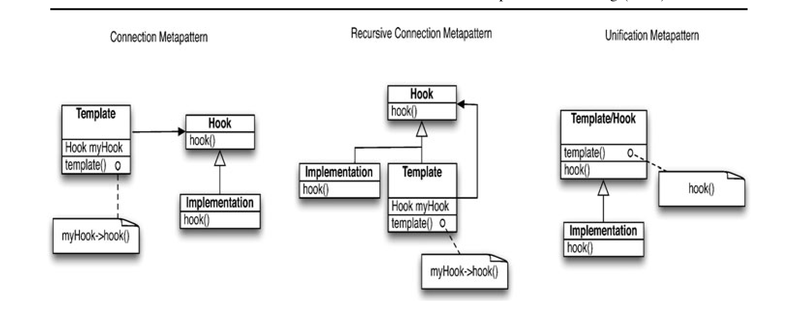

Fig. 2 The basic metapattern structures

If the role attributes that we are measuring are an artifact of the design pattern role, or simply a proxy for size, we ask: Do the observed differences in change-proneness hold up, even when accounting for the sizes of the respective classes playing the pattern or metapattern roles? We begin by studying the influence of size on the change-proneness of classes playing traditional design pattern roles.

> **Research Question 1:** To what extent does design pattern role explain the variation in change-proneness of classes, when controlling for class size?

Our second research question considers the same issue, with respect to metapatterns:

> **Research Question 2:** To what extent does metapattern role explain the variation in change-proneness of classes, when controlling for class size?

Next, we consider the relative explanatory power of pattern roles and metapattern roles:

> **Research Question 3:** When controlling for size, do metapattern roles explain as much of the variation in change-proneness as design pattern roles?

Finally, we consider the impact of design pattern and metapattern roles on the sizes of the classes playing those roles. If the roles explain a significant level of the variance in size, then the differences in change-proneness of roles might simply be an indirect, mediated effect of the relative size differences in the classes playing those roles.

> **Research Question 4:** Do (the purely) structural metapattern roles and pattern roles explain the variation in the sizes of classes playing those roles?