## Clones: what is that smell?

Foyzur Rahman · Christian Bird · Premkumar Devanbu

© Springer Science+Business Media, LLC 2011  
Editors: Jim Whitehead and Tom Zimmermann

### Abstract
Clones are generally considered bad programming practice in software engineering folklore. They are identified as a bad smell (Fowler et al. 1999) and a major contributor to project maintenance difficulties. Clones inherently cause code bloat, thus increasing project size and maintenance costs. In this work, we try to validate the conventional wisdom empirically to see whether cloning makes code more defect prone. This paper analyses the relationship between cloning and defect proneness. For the four medium to large open source projects that we studied, we find that, first, the great majority of bugs are not significantly associated with clones. Second, we find that clones may be less defect prone than non-cloned code. Third, we find little evidence that clones with more copies are actually more error prone. Fourth, we find little evidence to support the claim that clone groups that span more than one file or directory are more defect prone than collocated clones. Finally, we find that developers do not need to put a disproportionately higher effort to fix clone dense bugs. Our findings do not support the claim that clones are really a “bad smell” (Fowler et al. 1999). Perhaps we can clone, and breathe easily, at the same time.

**Keywords** Empirical software engineering · Software maintenance · Software clone · Software quality · Software evolution

F. Rahman (B) · P. Devanbu  
Department of Computer Science, University of California, Davis, Davis, CA, USA  
e-mail: mfrahman@ucdavis.edu

P. Devanbu  
e-mail: ptdevanbu@ucdavis.edu

C. Bird  
Empirical Software Engineering, Microsoft Research, One Microsoft Way, Redmond, WA 98052, USA  
e-mail: cbird@microsoft.com

---

## 1 Introduction

The software life cycle comprises two major parts: the initial development, followed by the active maintenance and evolution to adapt to user needs. For most other industries, development cost is the major part of the lifetime cost of a project. However, for software development it has been found that maintenance and evolution are also critical activities from the cost perspective and might comprise up to 80% of the overall cost and effort (Alkhatib 1992). Maintenance costs often can be inflated through poor software design, code incomprehensibility, sloppy and error-prone practices, inflexible design structures, bad assumptions, etc. Researchers have long sought to reduce maintenance costs. There has been quite a bit of work on improving process models, tool support, language support, etc., to improve development process and reduce bad attributes of code which might increase maintenance costs. Often, however, poor maintainability can be traced back to poor code which is difficult to understand, modify or more error prone. For a taxonomy of bad code attributes refer to Fowler et al. (1999) and Mäntylä and Lassenius (2006).

Fowler et al. (1999) suggest that code duplication or cloning is a bad smell and thus one of the major indicators of poor maintainability. Cloning is an easy, tempting alternative to the hard work of actually refactoring the code. Unfortunately, if a piece of code is buggy or has a latent bug, then a clone can replicate a bug silently. To aggravate the situation, developers may often perform the cloning hastily and without proper care about the context. This could mean that even bug-free code could become buggy after cloning (Jiang et al. 2007b). Furthermore, developers may even copy others’ code without fully understanding it. This may introduce another classic fault proneness through poorly understood code. For these reasons, the practice of cloning has been shunned for many years and a considerable body of research work has been devoted to automatically find clones; some even try to automatically refactor them (Balazinska et al. 1999; Higo et al. 2005; Komondoor and Horwitz 2003).

At the same time, another body of research presents evidence that clones improve productivity and they may not be as bad as some claim. Kim et al. (2005) argue that aggressive refactoring is not worth the effort, as most clones are short lived. Also, they suggest that long lived clones may not be refactorable due to language limitations. Kapser and Godfrey (2006) present evidence that clones are made deliberately and improve developer productivity. Thummalapenta et al. (2009) assert that developers are actually quite capable of remembering and updating clones consistently whenever required, even when they reside in very different parts of the system. However, prior research has not tried to establish a direct relationship between end product quality and cloning. We take the view that product quality is a major barometer of product success and if clones have much impact on product quality, we claim it a serious disadvantage for cloning proponents. One good approximation of product quality is the number of defects found in the product. More defects could make a system unusable and make its users unhappy. In this paper we try to assess clones' impact on defect occurrence of software products.

Considering the entire population of bugs, it would be interesting to determine how many of these are associated with cloned content. Do clones contribute a very small proportion of bugs, or the vast majority? This gives us an indication of how important clones are in overall project quality.

---

### RQ1: To what extent does cloned code contribute to bugs?

Next, we examine the converse question. Considering the code implicated in defect repair (“buggy code”), are clones unduly over-represented in this code? If buggy code contains many clones, then this suggests that we would do well to refactor out clones, or at least inspect all the clone code.

### RQ2: Do clones occur more often in buggy code than elsewhere?

Next, we’d like to know whether clones with many copies (“prolific clones”) are worse than clones with fewer copies (“non-prolific clones”). One can easily imagine that as copies proliferate, it is likely that the chance of accidentally introducing errors will increase.

### RQ3: Are prolific clone groups more buggy than non-prolific clone groups?

Next, we try to assess the impact of scattered cloning—clones that span multiple files/directories—on defect proneness. One would expect that scattered clones are more likely to span incompatible contexts, which could increase their error proneness. Moreover, such clones could be more likely to escape a possible bug-fixing change propagation.

### RQ4: Are scattered clones more buggy than collocated clones?

Finally, we try to answer whether fixing bugs with higher clone content requires more effort. One would expect that clone-related bugs would require propagation of fixes in multiple copies. This could require more effort to fix clone-related bugs, resulting in larger bug-fixing changes (as measured in number of lines changed). Alternatively, it is possible that cloned code is mostly good, and, if copied incorrectly, will require relatively smaller fixes to resolve naming issues, etc. These questions are considered in the final research question.

### RQ5: Do bugs with higher clone content require more effort to fix?

We try to answer our questions empirically by analyzing four major open source projects, namely: Apache, Evolution, Gimp and Nautilus. Our study casts doubt on the widespread belief that cloning leads to lower software quality. In all projects, we found that most bugs have nothing to do with cloned code (RQ1). Furthermore, we found buggy code is less likely to have cloned code when compared to the project overall (RQ2). We also found no evidence to support the claim that prolific clones have more buggy code than the non-prolific ones (RQ3). Moreover, our study does not support the claim that scattered clones may be more defect prone than collocated clones (RQ4). Finally, we find no evidence that bugs with higher clone content require larger bug-fixing changes (RQ5).

Our results might encourage researchers to put more effort on automatic clone maintenance (such as simultaneous editing or tools to track clones and their evolution, including inconsistent change flagging) than refactoring and eliminating them.

---

In addition, and rather surprisingly, one might conclude that bug-prediction tools could use cloned content as a negative indicator of defect-proneness!

The rest of the paper is organized as follows. Section 2 discusses related works, Section 3 defines common terms used in the rest of the paper, Section 4 discusses data sets, Section 5 discusses findings, Section 6 presents case study, Section 7 discusses threats to validity and finally we conclude in Section 8 with some recommendation and a summary of our findings.

## 2 Related Work

### 2.1 Automatic Detection of Clones

There has been quite a bit of research on automatic clone detection. Based on the similarity analysis, clone detectors can be classified in four categories:

### String Based Similarity
Baker’s Dup (Baker 1995) uses a line-based string matching algorithm. Dup removes all whitespace and comments and replaces identifiers with special parameters before analyzing similarity. String-based algorithms are less robust, and susceptible to code formatting and spurious code elements.

### Token-based Similarity
The token-based approach uses a lexer to tokenize and then finds whether the same series of tokens appear in two code fragments. It also renames identifiers and ignores whitespace, but is usually more robust than the string-based approach. CCFinder (Kamiya et al. 2002) and CP-Miner (Li et al. 2004) are two prominent examples of the token-based approach.

### AST Similarity
AST similarity-based clone detection tools first convert the program to an abstract syntax tree. Finding clones consequently amounts to finding similar ASTs. Baxter et al. (1998) propose an AST-based clone detector that detects clones by finding identical subtrees. Deckard (Jiang et al. 2007a) also uses the AST-based approach but instead of comparing subtrees directly it computes characteristic vectors to approximate structural information within the AST and then adapts Locality Sensitive Hashing (LSH) to efficiently cluster similar vectors. Similar code is clustered together and declared as clones. In our study, we used Deckard for clone detection.

### Semantics Aware Approach
Finding semantically similar code segments is undecidable in general; typically various approximation techniques are used. Komondoor and Horwitz (2001) use program dependence graphs (PDG) and program slicing to identify clones. Such techniques have not traditionally scaled for large programs. However, Gabel et al. (2008) were able to scale a PDG-based semantic clone detection approach for several million lines of code by reducing graph similarity to a simpler tree similarity problem.

For a survey on clone detection research, please refer to Roy and Cordy (2007). Note, there is no community-wide precise definition of what a clone is. Consequently, different tools will provide different sets of clones. This is a threat to validity that

---

we try to minimize by making use of Deckard, which represents the current state of the art in clone detection.

## 2.2 Clone Evolution

Several studies have investigated the extent and evolution of cloning in different software projects. These studies report between 5 to 50% of the source code being cloned (Baker 1995; Ducasse et al. 1999). Kim et al. (2005) investigate evolution of clones and build a clone genealogy. Their findings indicate that most of the clones are short lived, and therefore over-aggressive refactoring may be overkill. They also find that the long-lived clones diverge so much that they can no longer be refactored with existing language support. Geiger et al. (2006) examine whether clones in different files induce change coupling. Kim et al. (2004) study the copy-paste behavior of programmers and propose a taxonomy of clones in their paper. Kapser and Godfrey (2006) propose a categorization of patterns of clones, and analyze the motivation, maintenance impact, advantage, disadvantage and structural manifestation of the patterns. They conclude that cloning is a reasonable design decision and tools should be developed with long term maintenance of duplicates in mind. Kapser and Godfrey (2008) qualitatively classify clones as "good", "incidental", "harmless" and "harmful" and compare the relative presence of different categories of clones. Their findings suggest that majority of the clones are not harmful. In this study we classify the clones quantitatively based on their defect proneness and study their impact on overall software quality. Krinke (2007) studies consistent and inconsistent changes to clones and finds that only 50% of the clone groups undergo consistent changes; once made inconsistent, the groups remain inconsistent. Krinke (2008) study cloned code stability where he concludes that cloned code is more stable than non-cloned code. Cai and Kim (2011) study different clone, code and process related predictors and their impact on the clone survival time. They find that the size of the clone, the number of clones in a clone group and the number of methods the clones are located in (method-level dispersion) are not determining factors for the survival time of the clones. On the other hand, the more developers maintain the cloned code, the longer the clones survive. Also, the longer it has been since the last addition or deletion of a clone member in a group, the longer the clones survive. In this paper, we study clone dispersion at file-level and directory-level and its impact on defect proneness. Göde and Koschke (2011) study the extent of inconsistent changes to cloned code and find that most clones are rarely changed and the number of unintentional inconsistent changes to clones is small. While the infrequent inconsistent changes to clones could be a positive news for clone proponents, other researchers find that late propagation is significantly more defect prone (Barbour et al. 2011).

## 2.3 Tool Support

There has been quite a bit of research on tools for clone maintenance. Toomim et al. (2004) hypothesize that programming abstraction such as functions and macros have inherent cognitive cost which motivates developers to clone the code instead. However, such cloning could make change propagation difficult. They propose linked editing to edit multiple regions of code without much programmer intervention. They also compare functional abstraction with linked editing and find that their approach

---

could be orders of magnitude more efficient than traditional functional abstraction. In this study, we compare the effort (as measured in terms of number of lines changed) to fix a bug based on its clone content. Ekoko and Robillard (2007) propose a tool for tracking clones in evolving software. Their tool supports simultaneous editing of clones, along with notification to developer when one of the clones changes. A clone tracking tool could reduce possible bug-inducing inconsistent changes while allowing developers greater latitude. Bruntink et al. (2005) propose automatic aspect mining based on clone detection. SHINOBI (Kawaguchi et al. 2009) tries to identify clones in real time and is integrated with Microsoft Visual Studio to aid maintenance. Clever (Nguyen et al. 2009) integrates with SVN to facilitate better management of clones.

## 2.4 Clones and Bugs

Researchers have studied the effect of clones on software quality. Juergens et al. (2009) study inconsistent clones as detected by their tool. They use manual annotations by developers to determine faults in inconsistent clones, and conclude that unintentionally made inconsistent clones are more likely to contain defects. Statistical tests of significance are not presented. As described below, our approach relies on data mined from bug repositories, rather than manual annotation. Jiang et al. (2007b) propose an approach on detecting clone-related bugs based on context. Their approach tries to detect similar sections of clones, and then, based on their contextual difference, suggests whether a possible bug is lurking. Thummalapenta et al. (2009) study clone maintenance and their evolution pattern. They find that changes are consistently propagated when needed and developers actually seem to remember the clone locations that require such propagation. They also find cloning often being used as a templating mechanism. They find that clone characteristics such as clone granularity or clone radius have little impact on clone evolution. As a whole their study views clones positively. They argue that while better tool support for clone maintenance would help, aggressive refactoring to eliminate clones is probably not worthwhile. We complement their study by analyzing the impact of scattered clones on software defects. Śliwerski et al. (2005) studied source code changes that induce fixes. Their approach of determining fix-inducing change is similar to our buggy code determination approach. However, instead of finding the origination of a buggy code, we map the buggy code to some intermediate snapshot and analyze its properties at that point in time. Selim et al. (2010) study the impact of clones on software defects. They find that the relative defect proneness of clones vary across different systems. For some systems cloned methods could be more defect prone, while for others they could be less defect prone. In our earlier study (Rahman et al. 2010) we find that clones are actually less buggy than overall project code. We also find that frequently copied clones are less buggy than clones with fewer copies. In this paper, we extend that study by further examining the defect proneness of scattered clones and the required effort to fix clone-related bugs.

## 3 Terminology

In this section we will define all the terminology and background of our experiment.

---

### 3.1 Snapshot and Revision

Source code management systems (SCM) typically provide a rich version history of software projects. This information includes file history, such as when a file was added/removed/modified; author history, such as who wrote a particular line in a file; commit history, such as when a file was committed; commit log, such as the contribution of a commit etc. In our study we identify each of these commits as a revision, where a revision r = <A, T, f1, f2, ..., fn>. Here, A is the author of the revision who modified a set of files {fi} and committed the revision at time T.

Our study examines the impact of cloning throughout the project life cycle and thus must find clones in all the revisions committed into the SCM. Checking for clones on every revision of every file is not feasible. Instead we run clone detection only once a month from project inception to the end of available project history. We call each of these chosen monthly revisions a snapshot. So, we have a collection of snapshots S = <s1, s2, ..., sn>, where si is the first revision committed in month i, i.e., si = ri1, where <ri1, ri2, ..., rim> are the revisions committed in month i. Note that our months may not coincide with calendar months; we start monthly epochs from the first revision date of a project. For each such snapshot, we check out all the files extant at that time in the project history and run clone detection on them.

We used Git for our repository; for speed, we migrated other repositories (SVN and CVS) to Git.

### 3.2 Finding Clones

In this paper, the term clone refers to a code clone, i.e. similar fragments of code sections, as output by the clone detector. A clone detector’s output O typically consists of a set of clone groups; O = {g1, g2, ... , gn}, where each of the groups gi contains a set of code sections that are similar to each other, i.e., clone group gi = {c1, c2, ..., ck}, and each of the clones are defined as ci = <sj, fk, ls, le>. Here sj refers to the snapshot in which this clone was found, fk refers to the file that contains clone ci and ls and le indicate start and end line number.

We detect clones on all the snapshots si. For each of the snapshots, we ran Deckard (Jiang et al. 2007a) on that snapshot to get all the clone information. From Deckard output, we extract filename, line number, which clone a line belongs to and the sibling clones. For our study, we ran Deckard with a conservative and a liberal clone detection parameter setting. This is to reduce study bias towards a particular clone detector parameter setting and to understand system behavior as the clones become more dissimilar. For the conservative mode, we set the minimum token parameter for Deckard to 50 (clones must be at least 50 tokens in length) and similarity to 1.0 (clones must be nearly identical). In the liberal parameter setting, we set minimum token to 50 and similarity to 0.99 (to allow greater divergence). In both cases we set Deckard stride to 2. We also experimented with several other parameter settings such as <50, 1.0, 16> and <50, 0.95, 4>, <50, 1.0, Infinity> and <30, 0.95, Infinity> where they are represented as <MinToken, Similarity, Stride>, and found similar results. We chose Deckard as it is previously shown to be very scalable, and finds more clones than CCFinder or CP-Miner with few false positives (Jiang et al. 2007a). Our choice of Deckard parameter settings for this paper came from our observation (and also supported by the original Deckard paper) that a similarity

---

less than 0.99 could give an increasingly more false positive clones. Also, smaller token size such as 30 could detect a large number of uninteresting clones (e.g. very small clones which involve declaration or boilerplate looping definition). Moreover, we chose a stride size of 2, as Deckard detects highest amount of clones (for a given token and similarity setting) at this stride setting (Jiang et al. 2007a). Also, as Deckard detects only syntactically similar clones (including Type III clones), we do not study semantically similar clones—also known as Type IV clones (Roy and Cordy 2007)—in this paper.

We call the cardinality of the clone group g_i as its order. So, Order_i = |g_i|. We found that on the average clone groups contain around three members (Table 2). Moreover, the third quartile of the order of the clone groups is also around three. Therefore, we partition clone groups into two sets: prolific clone groups, with more than three members; and non-prolific clone groups, with up to three members.

### 3.3 Scattered and Collocated Clones

If all the members of a clone group belong to the same file, we call them collocated clones. On the other hand, if a clone group has members that span more than one file, we designate these members as scattered clones. We also define similar measure at directory level.

### 3.4 Copy and Unique

For this study, we flatten all the clones detected by Deckard and consider them at individual line level. So, for each of the lines in any of the file f_i of snapshot s, if that line is part of any of the detected clones by Deckard, we call that a copy; otherwise it is called unique. Note, occasionally Deckard may detect clones that overlap with each other. This could make a single line part of multiple clones but we declare a line “copy” whether it appears in one clone or many.

### 3.5 Bug Fixing History

For each of the systems that we studied, we focused only on bugs that had been discovered and recorded within the project’s issue tracking system. However, issue tracking systems, such as Bugzilla, are typically used to monitor both bug reporting/fixing as well as the implementation of new features, or “enhancements”. Consequently, we have ignored any entries marked as the latter. We define bug as B = <OD, FD, D>, where OD represents date when a bug was opened; FD as the date when the bug was fixed and marked in the system as fixed; and D as the description of the bug.

We link a fixed bug from issue tracker to a particular revision in the SCM. We call this a bug fixing revision. We identify a bug fixing revision based on several different heuristics. Various key words such as “bug”, “fixed” etc. in the SCM commit log typically indicate a bug fixing revision (Mockus and Votta 2000). Also, a numerical bug ID is typically mentioned in a bug fixing commit log, which can then be linked back to issue tracking system’s issue identifier (Fischer et al. 2003; Čubranić and Murphy 2003). We also crosscheck with the issue tracking system to see whether such an issue identifier exists and whether its status changes after fixing the bug.

---

Finally we use manual inspection to remove spurious linking as much as possible. Our approach uses Bachmann’s linking heuristics; in fact, we gratefully acknowledge the direct use of data derived by Bachmann and Bernstein (2009).

### 3.6 Buggy Code

In an ideal situation, a set of source code lines that introduced a bug can be defined as buggy code. However, it is very difficult to precisely find the culpable code, so we approximated the notion of buggy code. In this paper buggy code refers to a set of source code lines which were modified to fix a bug. So, buggy code for i-th bug fixed in revision r: BC_i = {L_{f,j}} where L_{f,j} is the j-th changed line in file f for fixing that bug (note: changed lines in a file may not be contiguous and buggy code for a single bug can span multiple files).

To determine buggy code, we first identify a revision that fixes a bug. If a bug is fixed in revision r we take the immediate preceding revision r−1 and then we identify all the files that were changed in revision r. We then find the lines changed in each of these files. {L_{f,j}} = Diff(f_r, f_{r−1}), where Diff is traditional Unix Diff tool and f_r is the version of the file f at revision r. For all changed files f the set of changed lines {L_{f,j}} comprises our buggy code for i-th bug. Note: we ignore any newly introduced lines at revision r as they, by definition, could not be the cause of the original bug.

### 3.7 Bug Staging Snapshot

We associate every bug with its closest preceding snapshot which we call its staging snapshot (ss_b). So, if a bug b is fixed in revision r and revision r−1 (the last revision prior to fixing that bug) occurs in month i of the project history, then i-th snapshot is its staging snapshot. The staging snapshot is where buggy code for a bug is analyzed. This is necessary because we do not have clone information available for some arbitrary revisions other than the chosen snapshots.

Due to possible intervening changes to buggy files between ss_b and r−1, each of the buggy lines in a buggy code at revision r−1 may have different line number at its staging snapshot. However, for our purposes we need the older line number at ss_b instead of the newer line number at r−1. To map a line at l_{r−1} to l_{ss}, we used Unix Diff utility to find all the changes made to that file during this time period. So, if n lines were added and m lines were deleted on top of a given line number l_{r−1} between releases ss_b and r−1, we adjust the overall difference to find l_{ss}. Also, if l_{r−1} was newly added sometime after revision ss_b (i.e., l_{r−1} was nonexistent in ss_b), then we ignore that line.

### 3.8 Buggy Cloned Code and Bug-Clone Ratio

Each of the lines in a buggy code fragment can be classified as either a copy or unique, based on whether that line is part of any of the clones recognized by Deckard. We called the copied lines of buggy code buggy cloned code. We then calculate the ratio of such copied code in the buggy code, which we call bug-clone ratio. Note, to determine any such partitioning of buggy code, we first mapped all the buggy code

---

**Table 1. Summary of studied systems**

| Name     | Max size | Total snapshots | Lines per snapshot | Number of linked bugs |
|----------|----------:|----------------:|--------------------:|----------------------:|
| Apache   | 208,388  | 155             | 124,462.62         | 453                   |
| Evolution| 531,342  | 129             | 324,487.14         | 1,440                 |
| Gimp     | 947,073  | 130             | 755,511.68         | 2,103                 |
| Nautilus | 366,894  | 116             | 131,062.94         | 747                   |

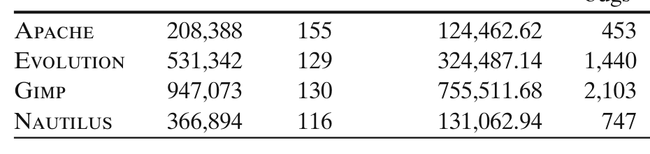

> **Image description:** A four-row table listing each studied project (Apache, Evolution, Gimp, Nautilus) with four columns: maximum code size (lines), total monthly snapshots analyzed, average lines per snapshot, and total number of linked bugs. Reported values are: Apache — max 208,388 lines, 155 snapshots, 124,462.62 lines/snapshot, 453 linked bugs; Evolution — 531,342; 129; 324,487.14; 1,440; Gimp — 947,073; 130; 755,511.68; 2,103; Nautilus — 366,894; 116; 131,062.94; 747. The table shows Gimp is by far the largest project in both maximum and average snapshot size and also has the most linked bugs, while Apache has the smallest average snapshot size and the fewest linked bugs.

to its staging snapshot and then determined intersection between buggy code and copied lines of that snapshot.

## 4 The Data Sets

We chose four different medium- to large-sized open-source projects for our study. All have a long development history, but are from different domains. All of the projects are written in C. We summarize our projects below.

1. APACHE httpd — Apache httpd is a widely used open source web server. We converted the repository from SVN to Git for ease of use.
2. NAUTILUS — Nautilus is the default file manager for the Gnome desktop. We were able to use their Git repository directly.
3. EVOLUTION — Evolution is the default email client for the Gnome desktop with support for integrated mail, address book and calendar functionality. We used their Git repository directly.
4. GIMP — Gimp is the most popular open source image manipulation program. We used their Git repository directly.

A summary of descriptive statistics of the projects studied is presented in Tables 1 and 2. They range in size from 124 k lines to about 755 k lines. The tables present details concerning the number of snapshots; average (computed over all snapshots) statistics on the average total number of clone lines; number of members (clone) per clone group; clone size in lines; number of cloned lines per snapshot; and total number of linked bugs (over the entire period).

For all the projects, we first identify monthly snapshots and then run Deckard to detect clones in those snapshots. We tag each of the lines of a snapshot as either a “copy” or a “unique” line. We then identify all the bug fix revisions. Buggy code is then identified by running Diff on the bug fix revision and its immediately preceding revision. We then map those buggy lines to their corresponding staging snapshots.

**Table 2. Summary of detected clones**

| Name     | Cloned lines per snapshot (conservative) | Clones per group (conser.) | Lines per clone (conser.) | Cloned lines per snapshot (liberal) | Clones per group (liberal) | Lines per clone (liberal) |
|----------|------------------------------------------:|---------------------------:|--------------------------:|------------------------------------:|---------------------------:|--------------------------:|
| Apache   | 13,817.02                                | 3.24                       | 14.79                    | 16,611.14                           | 3.25                      | 14.76                    |
| Evolution| 26,322.54                                | 2.49                       | 15.27                    | 33,011.09                           | 2.56                      | 15.34                    |
| Gimp     | 167,160.73                               | 3.38                       | 22.08                    | 176,090.99                          | 3.45                      | 22.04                    |
| Nautilus | 14,878.97                                | 2.20                       | 18.13                    | 17,495.76                           | 2.24                      | 17.85                    |

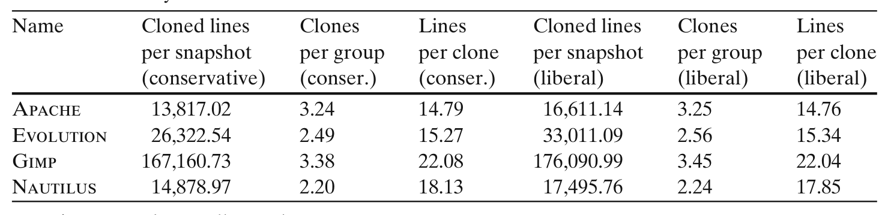

> **Image description:** Table summarizing clone detection results averaged per monthly snapshot for four C projects (Apache, Evolution, Gimp, Nautilus) under conservative and liberal Deckard settings. It reports cloned lines per snapshot (conservative: Apache 13,817.02; Evolution 26,322.54; Gimp 167,160.73; Nautilus 14,878.97; liberal: Apache 16,611.14; Evolution 33,011.09; Gimp 176,090.99; Nautilus 17,495.76). The table also shows clones per group (≈2.2–3.4 members: conservative Apache 3.24, Evolution 2.49, Gimp 3.38, Nautilus 2.20; liberal 3.25, 2.56, 3.45, 2.24) and average lines per clone (≈15–22 lines: conservative 14.79–22.08, liberal 14.76–22.04), indicating Gimp has by far the largest volume of cloned code while clone group sizes and clone lengths are similar across projects and detector settings.

Data is averaged over all snapshots.

---

A simple set intersection is performed to classify each of the buggy lines as either "copy" or "unique". We then find the buggy cloned code and calculate the clone ratio in the bugs. We stored all of our information in a PostgreSQL database before processing them.

In one specific Apache snapshot, we found abnormal (4 fold) increase of source code line count and a corresponding spike in the clone ratio. We believe this was due to some accidental copying of major project elements, and we therefore ignored that snapshot. All the bugs that have that snapshot as their staging snapshot were mapped back to the immediate preceding snapshot.

## 5 Findings

### RQ1 To what extent does cloned code contribute to bugs?

For each bug in the project, we consider how much cloned code contributes to that bug, viz., its bug-clone ratio. Now we can consider cumulative bug-clone ratio distribution for all the bugs in a given project. So for example, if the cumulative distribution indicates that most of the bugs have a clone ratio (defined earlier, in Section 3.8 above) between 80 and 100%, we can conclude that clones contribute heavily to bugs; alternatively, if most of the bugs have 1% or lower clone ratio, then we know that clones contribute almost no bugs.

Figure 1 shows the cumulative bug coverage at different clone ratios. We show only Apache and Gimp as they are representative. The plot shows the fraction of bugs that have a clone ratio ≤ a given clone ratio. So, if b bugs have a clone ratio ≤ r, and there are total t bugs, then the plot shows b/t on the Y axis against r on the X axis. 1 − b/t portion of bugs have higher clone ratio than r. As is evident from the plot, most of the bugs in both liberal and conservative clone detector settings contain hardly any cloned code. In fact, besides Gimp, 80% or more bugs in the other projects contain no cloned code at all. Even for Gimp, this threshold is close to 80%. The vertical lines depict the average clone ratio across all snapshots for different clone

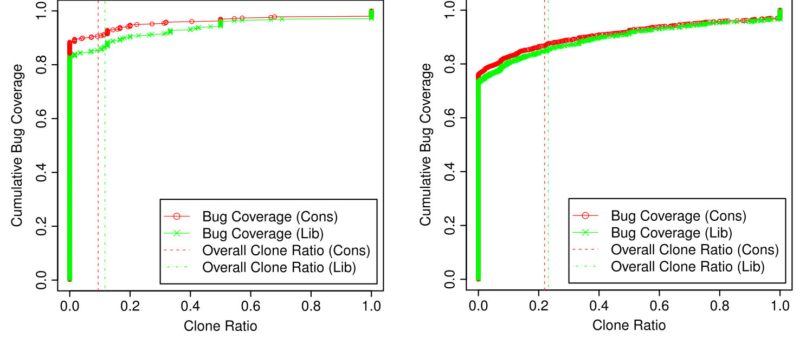

> **Image description:** Two side-by-side cumulative plots (left: Apache, right: Gimp) show the fraction of bugs whose buggy code has clone ratio ≤ r (y-axis) as a function of clone ratio r (x-axis, 0–1). Red circles plot bug coverage using the conservative Deckard setting and green crosses the liberal setting; vertical dashed red and green lines mark the project-wide average clone ratio for conservative and liberal settings respectively. Both plots rise very steeply at clone ratios near zero, reaching roughly 0.8–0.85 cumulative coverage, which indicates that about 80% (or more) of bugs contain little or no cloned code; the project-average clone-ratio lines lie to the right of this steep rise, showing that typical buggy code has a lower clone content than the project average. The conservative and liberal curves are close, demonstrating the result is robust to detector sensitivity.

Fig. 1 Cumulative coverage of bugs at a given clone ratio (a) Apache (b) Gimp

---

detector settings. So, e.g., we can say that for Gimp about 85% of bugs have lower clone ratio than overall project clone ratio. This finding suggests that only a small number of bugs are attributable to cloning.

### RQ2 Do clones occur more often in buggy code than elsewhere?

We compare all the bugs' clone ratio (proportion of cloned code, in all bugs, taken together) against the overall clone ratio in the project at the time that bug is fixed. So, if a bug is fixed at the r-th revision, and x% of the total code of the project, in the (r − 1)-th revision, was from clones, we ask if the buggy code in that revision has a bigger or smaller proportion of cloned code, compared to the overall project code. Since we do not have clone information for all possible revisions, we just project each line number back in the history to its staging snapshot and see whether a line is a clone or not. We then compare the staging snapshot's clone ratio against all the bugs' combined clone ratio that pertain to that staging snapshot. So, if a staging snapshot ss_b has n different bugs that include a combined total m lines, of which c total lines are contributed by clones, we compare c/m against clone ratio of ss_b. We consider two samples: each

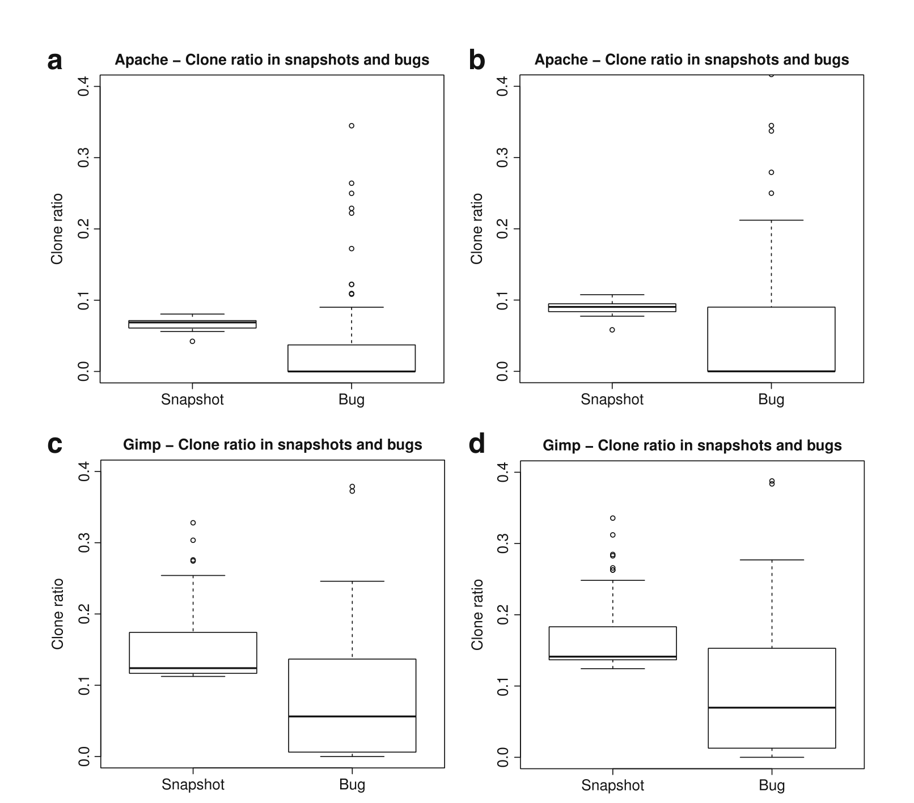

> **Image description:** Four boxplot panels (a–d) compare clone ratios (y-axis, 0–0.4) measured on monthly project snapshots (“Snapshot”) against the combined clone ratio of buggy lines fixed in those snapshots (“Bug”). Panels a and b show Apache under conservative and liberal Deckard settings, and panels c and d show Gimp under the same settings. In all panels the median clone ratio in buggy code is visibly lower than the median clone ratio in the corresponding snapshots (the effect is especially pronounced for Apache in the conservative setting), and the bug distributions show a larger spread with several high outliers. These visual differences match the paper’s statistical finding: buggy code has significantly lower clone ratio than the project background (paired Wilcoxon tests reported in the text).

Fig. 2 Clone ratio in bugs and snapshots for a Apache (Conservative) b Apache (Liberal) c Gimp (Conservative) d Gimp (Liberal)

---

Table 3 Comparison of clone ratio for conservative setting in buggy code and snapshot


> **Image description:** This table reports median clone ratios for project snapshots and for buggy code under the conservative Deckard settings, along with median differences and adjusted Wilcoxon p-values. For Apache the snapshot median is 0.0688 vs bug median 0.0000 (difference 0.0688, p=3.777e-05); Evolution 0.0741 vs 0.0274 (diff 0.0467, p=1.291e-04); Gimp 0.1240 vs 0.0562 (diff 0.0678, p=6.482e-06); Nautilus 0.0393 vs 0.0000 (diff 0.0393, p=3.394e-06). All median differences are positive and the very small adjusted p-values (one-sided test with alternative “snapshot clone ratio > bug-clone ratio”) indicate that buggy code contains significantly less cloned content than the overall snapshot code in these projects.

Nautilus 0.0393 0 0.0393 3.394e-06

Alternative hypothesis set to "snapshot clone ratio > bug-clone ratio". All p-values have been adjusted using the Benjamini–Hochberg procedure

staging snapshots’ clone ratio and the corresponding coalesced clone ratio for all the bugs attributed to that snapshot. We then compare them visually using boxplots, and test if they are drawn from the same distribution (null hypothesis) using a paired Wilcoxon test. The null hypothesis is that both of these distributions should be the same. Note: in some cases, there may not be any bug projected to a particular snapshot and we ignore that snapshot as that is not a staging snapshot for any bug.

Figure 2 shows boxplots of clone ratio in staging snapshots and corresponding clone ratio in bugs that were fixed in those staging snapshots. For all the projects, the boxplots clearly indicate a lower clone ratio in buggy code. For Apache with the conservative clone detector setting, the difference between the two boxplots is dramatic. Even with the liberal clone detector setting, the median of bug-clone ratio is well below the median of snapshot clone ratio. This phenomenon is repeated in all the other projects. The non-parametric paired Wilcoxon rank sum test (with continuity correction) in all cases conclusively rejects the null hypothesis that the two samples (clone ratios in buggy code and clone ratios in the entire snapshot) are drawn from the same distribution. Corresponding effect size (difference of medians) and p-values after Benjamini–Hochberg adjustment are presented in Tables 3 and 4. As we mentioned earlier, we also experimented with several other clone detector parameter settings. We found that as the similarity value is decreased and set to a very low value, such as 0.95, along with smaller token size, such as 30, clone ratio in bugs increases and the gap in median with the background distribution closes. However, a Wilcoxon rank sum test shows that the overall clone ratio remains significantly higher than clone ratio in buggy code. These robust statistical results, that were observed across all 4 projects, suggest that clones are not a major source of bugs.

### RQ3 Are prolific clone groups more buggy than non-prolific clone groups?

We compare prolific clone groups’ bugginess with non-prolific clone groups’ bugginess.

Table 4 Comparison of clone ratio for liberal setting in buggy code and snapshot


> **Image description:** A 4-row table (Apache, Evolution, Gimp, Nautilus) reporting median clone ratios for staging snapshots and for buggy code, the median difference, and Wilcoxon p-values. Snapshot medians are: Apache 0.0904, Evolution 0.0971, Gimp 0.1412, Nautilus 0.0591; corresponding bug medians are lower: Apache 0.0000, Evolution 0.0437, Gimp 0.0697, Nautilus 0.0119. The median differences (0.0904, 0.0534, 0.0716, 0.0472) and very small p-values (3.3e-04, 9.4e-05, 2.2e-05, 1.1e-03) indicate that, across all four projects, the proportion of cloned code in buggy regions is significantly lower than the overall snapshot clone ratio.

Nautilus 0.0591 0.0119 0.0472 1.1e-03

Alternative hypothesis set to "snapshot clone ratio > bug-clone ratio". All p-values have been adjusted using the Benjamini–Hochberg procedure

---

We define defect density as the fraction of cloned lines of that group that contribute to a bug. We compare defect density (number of buggy cloned lines per line of cloned code) in lines that are part of prolific clone groups against lines that are part of non-prolific clone groups. Since the total volume of buggy code mapped to a staging snapshot is a tiny fraction of the overall project code (and thereby many clone groups may not contribute any buggy code), we only consider those clone groups that contribute at least one line in some buggy code. Also, by normalizing contributed buggy cloned lines by the number of lines in that clone group we control for the disparity of total cloned lines contributed by clone groups of different sizes.

One might expect that by dint of sheer size, prolific clone groups with more code, and more copying will be associated with more defects than non-prolific clone groups. As the copies proliferate, the defects will replicate in the copies, and thus we would naively expect that the defect density (buggy lines / total lines) would remain a constant. Figure 3 depicts our findings for Apache and Gimp. The rest of the projects are

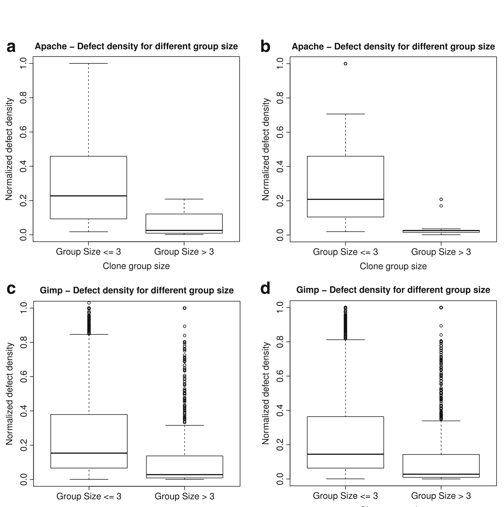

> **Image description:** Four side-by-side boxplots (panels a–d) compare normalized defect density (buggy cloned lines per cloned line) for clone groups partitioned by size (Group Size ≤ 3 vs Group Size > 3). Panels a and b show Apache under conservative and liberal Deckard settings; panels c and d show Gimp under the same two settings. In every panel the median and interquartile range for small groups (≤3 members) are noticeably higher, with many high outliers (values near 1.0), whereas prolific groups (>3 members) have much lower medians, smaller IQRs and few extreme values. This visual pattern supports the paper’s RQ3 finding that larger (more prolific) clone groups tend to have lower defect density than smaller groups.

Fig. 3 Defect density in clone groups of different sizes for different projects (a) Apache (Conservative) (b) Apache (Liberal) (c) Gimp (Conservative) (d) Gimp (Liberal)

---

### Table 5 Comparison of defect density for conservative setting in non-prolific and prolific clone groups

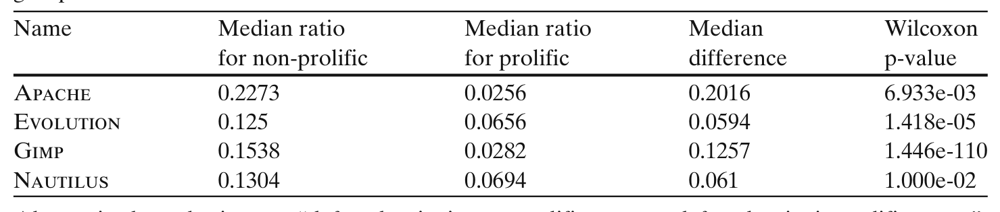

> **Image description:** This table reports median defect densities (fraction of cloned lines implicated in bugs) for non-prolific (≤3 members) and prolific (>3 members) clone groups under the conservative Deckard setting, along with the median differences and Wilcoxon p-values. For Apache the medians are 0.2273 (non-prolific) vs 0.0256 (prolific), median difference 0.2016, p=6.933e-03; Evolution: 0.1250 vs 0.0656, difference 0.0594, p=1.418e-05; Gimp: 0.1538 vs 0.0282, difference 0.1257, p=1.446e-110; Nautilus: 0.1304 vs 0.0694, difference 0.0610, p=1.000e-02. In all four projects non-prolific clone groups have higher median defect density than prolific groups, and the Wilcoxon tests (one-sided, alternative that non-prolific > prolific) show these differences are statistically significant.

Nautilus 0.1304 0.0694 0.061 1.000e-02  
Alternative hypothesis set to “defect density in non-prolific group > defect density in prolific group”. All p-values have been adjusted using the Benjamini–Hochberg procedure

very similar and thereby we omitted them for brevity. Note that the bug density may occasionally go above 1.0. This is due to clone groups that contribute multiple bugs to the same buggy code. In these cases, some lines will be counted more than once, making the number of buggy lines greater than the total number of lines in a clone group. We find that prolific clone groups have a lower defect density than non-prolific clone groups. Tables 5 and 6 shows the effect size (difference of medians) and adjusted p-values (using Benjamini–Hochberg method) of Wilcoxon one-sided rank sum test with continuity correction. The alternative hypothesis is set to “defect density in non-prolific group is greater than defect density of prolific group”. All the p-values are statistically significant; thus we reject the null hypothesis. Clearly, there is a strong signal observed in all the studied projects; more copies does not mean more defects. In fact, the more copies, the lower the observed defect density.

We hasten to point out that others, for example (Göde and Koschke 2011; Kapser and Godfrey 2006, 2008; Kim et al. 2005; Krinke 2008; Thummalapenta et al. 2009) have argued that the fear of clones is perhaps overstated. To our knowledge, however, this is the first study to use data mined from version-control repositories and reported bug-fixes to provide quantitative evidence that clones are not necessarily to be feared. While Thummalapenta et al. (2009) study the clone evolution pattern and their relation with bug-fixing change sets, we mine data from source code management systems and issue tracking systems to identify buggy code and their association with cloned code. We also study the impact of quantitatively classified clones (based on their defect proneness) and complement the research of Kapser and Godfrey (2008), which study the relative presence of qualitatively classified clones. Also, to our knowledge, ours is the first study to indicate that larger clone groups are different from smaller clone groups with respect to defect attribution.

### Table 6 Comparison of defect density for liberal setting in non-prolific and prolific clone groups

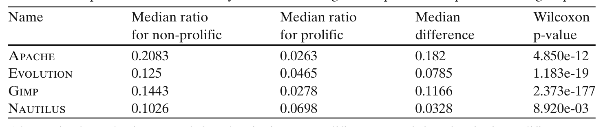

> **Image description:** Table 6 reports median defect density (buggy cloned lines divided by cloned lines) for non-prolific (≤3 members) and prolific (>3 members) clone groups using the liberal Deckard detection setting. For Apache the medians are 0.2083 (non-prolific) vs 0.0263 (prolific), median difference 0.182 (p=4.85e-12); Evolution 0.125 vs 0.0465, diff 0.0785 (p=1.183e-19); Gimp 0.1443 vs 0.0278, diff 0.1166 (p=2.373e-177); Nautilus 0.1026 vs 0.0698, diff 0.0328 (p=8.92e-03). The consistently higher medians for non-prolific groups and the very small Wilcoxon p-values (Benjamini–Hochberg adjusted) indicate non-prolific clone groups are significantly more defect-prone than prolific groups across all four projects under this detector setting.

Nautilus 0.1026 0.0698 0.0328 8.920e-03  
Alternative hypothesis set to “defect density in non-prolific group > defect density in prolific group”. All p-values have been adjusted using the Benjamini–Hochberg procedure

---

However, there could be another possible explanation of the observed phenomenon in RQ3. Prolific clone groups by definition have many members. A developer may fix the same bug in multiple copies, but do so in multiple commits; he may not identify every commit as a fix of a bug and/or present the bug ID in the commit log. In such situations, our linking algorithm may miss some of the delayed fixes altogether. This will deflate bug density in prolific clone groups and poses a significant threat to RQ3 findings. However, Thummalapenta et al. (2009) found that developers are able to remember location of clone copies and propagate changes consistently. In only a small percentage of cases, usually less than 16%, they actually underwent late propagation. Similar findings were reported by Göde and Koschke (2011).

We however want to stress that the above-mentioned threat to validity does not affect our findings in RQ1 and RQ2. In RQ1, we consider cloned code in buggy code, which is immune to the above-mentioned bug linking problem. Unless there is any systematic bias in bug linking that only links non-cloned bugs while leaving out others, our result is robust and statistically sound. Even if only one copy is linked with a bug, we adjust both numerator and denominator when calculating clone ratio.

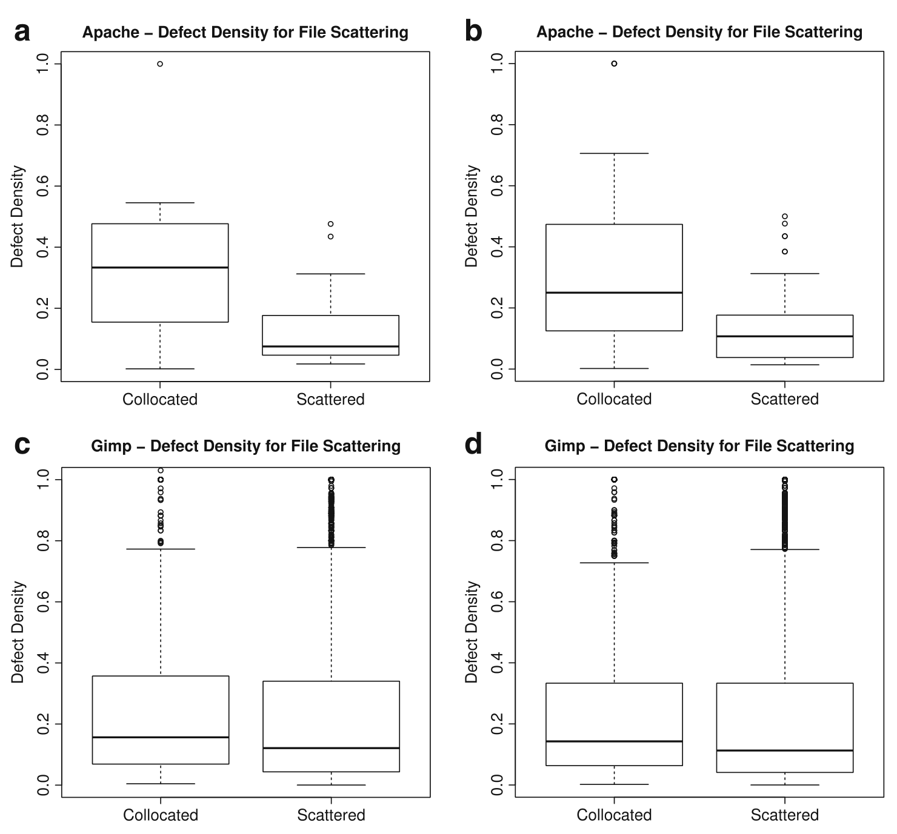

> **Image description:** Four side-by-side boxplots compare defect density (buggy cloned lines / cloned lines, y-axis 0–1) for collocated versus file-scattered clone groups: (a) Apache conservative, (b) Apache liberal, (c) Gimp conservative, (d) Gimp liberal. For Apache (panels a and b) the median and interquartile range are visibly higher for collocated clones than for scattered clones, indicating higher and more variable defect density in collocated groups. For Gimp (panels c and d) the median defect densities for collocated and scattered groups are similar and relatively low, but both show many high-value outliers approaching 1.0. Overall the plots illustrate that file-scattered clones are not more defect-prone than collocated ones and, in Apache’s case, tend to have lower defect density.

Fig. 4 Defect density in clone groups of different file scattering for different projects (a) Apache (Conservative) (b) Apache (Liberal) (c) Gimp (Conservative) (d) Gimp (Liberal)

---

### Table 7 Comparison of defect density for conservative setting in file-scattered and file-collocated clone groups

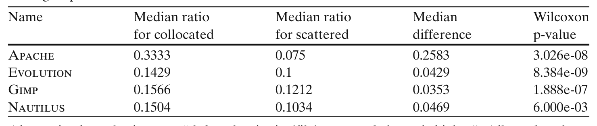

> **Image description:** This table reports median defect-density ratios for collocated and file-scattered clone groups using the conservative Deckard setting, with median differences and Wilcoxon p-values. In all four projects collocated clone groups show higher median defect density than scattered groups: Apache 0.3333 vs 0.075 (diff 0.2583, p=3.026e-08); Evolution 0.1429 vs 0.1000 (diff 0.0429, p=8.384e-09); Gimp 0.1566 vs 0.1212 (diff 0.0353, p=1.888e-07); Nautilus 0.1504 vs 0.1034 (diff 0.0469, p=6.000e-03). The uniformly small p-values indicate these median differences are statistically significant after adjustment.

Name  Median ratio for collocated  Median ratio for scattered  Median difference  Wilcoxon p-value

Nautilus 0.1504 0.1034 0.0469 6.000e-03

> Alternative hypothesis set to “defect density in (file) scattered clones is higher”. All p-values have been adjusted using the Benjamini–Hochberg procedure

In RQ2 we again work with clone ratio which is robust against the mentioned linking problem. We ignore bugs that are not linked and consider clone ratio in linked bugs. As long as there is no systematic bias in linking process to leave out bugs that have cloned code in them, our results of RQ1 is also robust and statistically sound.

### RQ4 Are scattered clones more buggy than collocated clones?

For this research question, we consider two different granularities. First, we try to find the impact of file scattering on defect proneness; and next, we assess the impact of directory scattering on defect proneness. We partition clone groups based on the number of files (or directories) they span. Clone groups whose members reside in the same file (or directory) are considered collocated. Scattered clone groups comprise the rest. We assess the impact of scattering on defect proneness by comparing the defect density (number of buggy lines per cloned line, buggy lines / total lines) for scattered and collocated clone groups. Like RQ3, we only consider clone groups that contribute at least one line in some buggy code.

Figure 4 compares the defect densities for collocated and scattered clone groups at file level. We also test for statistical significance of the difference of mean defect density across these two sample sets using the one tailed (alternative hypothesis set to “defect density in (file) scattered clones are lower”) Wilcoxon signed rank test with continuity correction. The results are shown in Tables 7 and 8. As is apparent from the figure and the corresponding p-values, file-scattered clones may not induce more defective code. Indeed file-scattered clones seem to have lower defect density.

The above result invited further study, particularly at a higher analysis granularity. A logical extension is to do the same for directory scattering. We therefore partition clone groups based on their directory scattering. The result is depicted in Fig. 5. As

### Table 8 Comparison of defect density for liberal setting in file-scattered and file-collocated clone groups

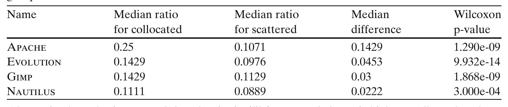

> **Image description:** The table compares median defect density (buggy cloned lines per cloned line) for file-collocated and file-scattered clone groups under the liberal Deckard detection setting across four projects. In every project the collocated median is higher than the scattered median (Apache 0.25 vs 0.1071; Evolution 0.1429 vs 0.0976; Gimp 0.1429 vs 0.1129; Nautilus 0.1111 vs 0.0889), with median differences of 0.1429, 0.0453, 0.03 and 0.0222 respectively. Wilcoxon test p-values (ranging from 9.932e-14 to 3.000e-04) show these differences are statistically significant, indicating file-scattered clones do not exhibit higher defect density in this liberal-setting analysis.

Name  Median ratio for collocated  Median ratio for scattered  Median difference  Wilcoxon p-value

Nautilus 0.1111 0.0889 0.0222 3.000e-04

> Alternative hypothesis set to “defect density in (file) scattered clones is higher”. All p-values have been adjusted using the Benjamini–Hochberg procedure

---

**Table 10 Comparison of defect density for liberal setting in directory-scattered and directory-collocated clone groups**

| Name     | Median ratio for collocated | Median ratio for scattered | Median difference | Wilcoxon p-value |
|----------|-----------------------------:|----------------------------:|------------------:|-----------------:|
| Apache   | 0.2083                       | 0.0885                      | 0.1199            | 5.280e-07        |
| Evolution| 0.1250                       | 0.0909                      | 0.0341            | 5.280e-07        |
| Gimp     | 0.1250                       | 0.1176                      | 0.0074            | 0.003            |
| Nautilus | 0.1111                       | 0.0714                      | 0.0397            | 0.001            |

*Alternative hypothesis set to “defect density in (directory) scattered clones is higher”. All p-values have been adjusted using the Benjamini–Hochberg procedure.*

The difference, we present the effect size (difference of medians) and p-values from the one-tailed (alternative hypothesis set to “defect density in (directory) scattered clones is lower”) Wilcoxon signed-rank test with continuity correction in Tables 9 and 10. All the p-values except Nautilus in conservative settings are significant at the 5% significance level, thereby rejecting the null hypothesis.


> **Image description:** Figure shows four boxplots (panels a–d) comparing the number of lines changed to fix bugs (y-axis: log10 scale) for bugs with high clone content versus low clone content, for Apache and Gimp under conservative and liberal Deckard settings. In every panel the median for the “High Clone Ratio” group is lower than for the “Low Clone Ratio” group (for example, Apache conservative medians are roughly 1.0 vs 2.4 on the log10 scale), indicating that bugs with more cloned code tend to require smaller fixes. The Gimp panels show the same trend but with more extreme outliers; the paper’s statistical tests (Tables 11–12) report this difference as significant.

Fig. 6 Number of lines changed to fix bugs with high and low clone content (a) Apache (Conservative) (b) Apache (Liberal) (c) Gimp (Conservative) (d) Gimp (Liberal)

---

Table 11. Comparison of number of lines changed (Log10) for conservative setting in bugs with high and low clone ratio


> **Image description:** The table compares median Log10(number of lines changed) to fix bugs with high versus low clone content under the conservative clone-detection setting for four projects (Apache, Evolution, Gimp, Nautilus). In every project the median Log10(lines) is lower for high-clone-ratio bugs: Apache 1.0792 vs 2.3981 (≈12 vs ≈250 lines), Evolution 1.2304 vs 1.8129 (≈17 vs ≈64), Gimp 1.4771 vs 2.0531 (≈30 vs ≈113), and Nautilus 1.3116 vs 1.7118 (≈20 vs ≈52). Median Log10 differences range from 0.4002 to 1.3189 and all Wilcoxon p‑values reported are highly significant (adjusted p ≤ 0.0012), supporting the paper's finding that bugs with higher clone content tend to require smaller code changes to fix.

Nautilus 1.3116 1.7118 0.4002 9.000e-04

Alternative hypothesis set to “Bugs with higher clone content require smaller bug fix change”. All p-values have been adjusted using the Benjamini–Hochberg procedure.

We note that RQ4 also suffers from the same threat to validity of RQ3. If developers cannot propagate bug fixing changes to diverse locations in a clone group, then scattered clones could show lower defect density. Thus, failure of a developer to link a bug to multiple copies present in multiple files could also result in the same phenomenon.

RQ5 Do bugs with higher clone content require more effort to fix? As is evident from RQ1, most of the bugs (more than 80%) have no cloned code and around 90% of bugs have clone ratio less than project average. However, although a few clone-related bugs (i.e., bugs that have at least some cloned code) have clone content more than the project average, they might as well require very large change to fix, thereby belying their apparent non-significance. We therefore try to see whether fixing bugs with more clone content (higher than the project average) requires significantly more effort than fixing bugs with lower clone content (less than the project average). It is difficult to quantify precisely the effort that it takes to fix a bug. Therefore, we approximate effort with the size of the changes (measured in terms of lines of code) to fix a bug.

To compare the relative effort required to fix bugs with higher and lower cloned content we discard all non-clone bugs (bugs with no cloned code) and then partition the remaining bugs based on whether they have a higher clone ratio than project average. “High clone ratio” partition contains bugs that have clone ratio more than project average. We then compare number of lines changed to fix bugs with high and low clone ratio. The resulting boxplot is shown in Fig. 6. All the boxplots clearly indicate that bugs with high clone ratio require smaller bug fixing changes. We also present the effect size (difference of medians) and p-values from Wilcoxon signed rank test in Tables 11 and 12 to compare the mean number of lines changed in high

Table 12. Comparison of number of lines changed (Log10) for liberal setting in bugs with high and low clone ratio


> **Image description:** This table reports median Log10(lines changed) to fix bugs under the liberal clone-detector setting for four projects (Apache, Evolution, Gimp, Nautilus), comparing bugs with high clone content to those with low clone content. For each project the median Log10 values are: Apache 0.8451 (high) vs 1.7634 (low) — roughly 7 vs 58 lines changed (median difference 0.9183, p = 4.564e-07); Evolution 1.2041 vs 1.8062 — ≈16 vs 64 lines (difference 0.6021, p = 1.378e-11); Gimp 1.4472 vs 1.9685 — ≈28 vs 93 lines (difference 0.5213, p = 6.768e-17); Nautilus 1.1901 vs 1.7404 — ≈15.5 vs 55 lines (difference 0.5503, p = 7.851e-06). In all four systems the one-sided Wilcoxon tests (p-values adjusted) strongly support the reported alternative hypothesis that bugs with higher clone content require smaller code changes to fix than bugs with lower clone content.

Nautilus 1.1901 1.7404 0.5503 7.851e-06

Alternative hypothesis set to “Bugs with higher clone content require smaller bug fix change”. All p-values have been adjusted using the Benjamini–Hochberg procedure.

---

and low clone ratio bugs. The alternative hypothesis is set to "bugs with high clone ratio require smaller bug fix change". All the p-values are very low, thereby clearly rejecting the null hypothesis.

## 6 Case Study

To gain further insights as to why clones appear less buggy, we did a case study of 20 good quality (has very few bugs) clones (3 from conservative and 2 from liberal for each of the 4 projects). In Listing 1, we show one very good quality (no buggy code) clone which comes from a group of 2 clone members. Both of the members come from the file "libnautilus-private/nautilus-file.c" in a snapshot taken on 20th November, 2000. This code tries to set a file’s owner and before doing that it checks to see whether the user has required privileges or whether the user is same as the current file owner. If everything goes well, then the code proceeds to change the owner of the file. A very similar role of a file manager is to change the group of the

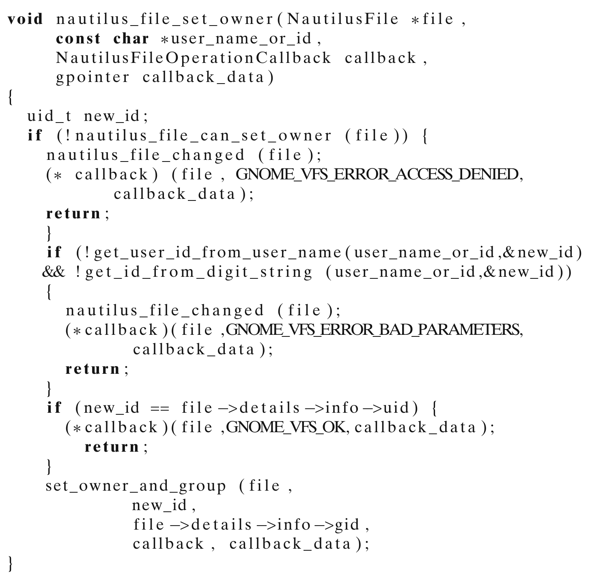

> **Image description:** A C function snippet for void nautilus_file_set_owner(...) that performs permission and parameter checks before changing a file’s owner: it declares uid_t new_id, returns an ACCESS_DENIED error via the callback if nautilus_file_can_set_owner(file) fails, attempts to resolve user_name_or_id with get_user_id_from_user_name or get_id_from_digit_string and returns BAD_PARAMETERS on failure, returns OK if the resolved ID equals the current owner, and otherwise calls set_owner_and_group(...). The paper presents this as a “very good quality” clone (one of a two-member clone group) from libnautilus-private/nautilus-file.c (snapshot 20 Nov 2000). In that snapshot the file contained 4,552 lines with 2,779 lines detected as cloned by Deckard, and the authors report that of 58 linked bug fixes (798 lines changed) none involved cloned code in this file.

Listing 1 Example Clone in Nautilus

---

file. Another clone from the same group achieves that and copies the above code exactly, but the sequence of helper method calls are different (e.g., instead of calling get_user_id_from_user_name, it calls get_group_id_from_group_name; instead of calling nautilus_file_can_set_owner, it calls nautilus_file_can_set_group). This file has 4,552 lines of code in that snapshot, of which 2,779 lines were identified as cloned code by Deckard. Also, our linked bug data shows that a total of 58 bugs were fixed during the project lifetime and a total of 798 lines were modified during bug fixing, but not a single bug has any cloned code in them.

In Listing 2, we show another clone from one of the largest clone groups, with 27 members totaling 775 lines of cloned code. All the clones come from different files, so this group spans 27 different files. Interestingly, all these clones share a common API protocol, a clone pattern documented by Kapser and Godfrey (2008).

All of these clones first check whether some option is set, allocate an object, set some properties, and then return that object. The code shown creates a ColorBalance object. Other clones likewise create different types of objects such as HueSaturation, BrightnessContrast, ByColorSelect etc. Our linked bug data indicates that a total of 50 bugs were fixed in all the files containing these clones during project lifetime, of which only 1 bug has trace of cloned code. This buggy cloned code came from some other clone in one of these files, but not from the above mentioned 27 member group.

We also did a case study on 800 randomly picked clone groups, 100 from each of the projects and clone detector settings (liberal and conservative) to assess quality of

```c
Tool* tools_new_color_balance ()
{
    Tool * tool;
    ColorBalance * private;
    if (!color_balance_options)
        color_balance_options = tools_register_no_options
            (COLOR_BALANCE, "Color Balance Options");
    tool = (Tool *) g_malloc (sizeof (Tool));
    private = (ColorBalance *) g_malloc (sizeof (ColorBalance));
    tool->type = COLOR_BALANCE;
    tool->state = INACTIVE;
    tool->scroll_lock = 1; /* Disallow scrolling */
    tool->private = (void *) private;
    tool->auto_snap_to = TRUE;
    tool->button_press_func = color_balance_button_press;
    tool->button_release_func = color_balance_button_release;
    tool->motion_func = color_balance_motion;
    tool->arrow_keys_func = standard_arrow_keys_func;
    tool->cursor_update_func = color_balance_cursor_update;
    tool->control_func = color_balance_control;
    return tool;
}
```

Listing 2 Example Clone in Gimp

---

Table 13 Number of false positives in 100 randomly chosen samples for different clone detector settings


> **Image description:** A four-row table (one row per project) reporting the number of false-positive clone groups found in 100 randomly sampled clone groups under two Deckard parameter settings. For the conservative setting the counts are: Apache 0, Evolution 1, Gimp 0, Nautilus 1 (0–1%); for the liberal setting: Apache 0, Evolution 3, Gimp 1, Nautilus 3 (0–3%). The liberal (more permissive) configuration yields slightly more false positives for Evolution and Nautilus, but overall false-positive rates remain very low (≤3%), supporting the paper’s claim of up to ~3% false positives in their samples.

clones detected by Deckard and to understand clone patterns. We used PostgreSQL random() function to pick random samples and found up to 3% false positives (Table 13). All false positive clone groups have similar ASTs, but a careful look indicates that they are unlikely to be clones. A great many of our observed clone groups contain direct copy/paste, or embody protocols for carrying important, common operations. Arguably, programmers copying from well-written code, or regurgitating familiar programming logic from memory are less likely to produce error-prone code. Others were an artifact of the C language, and could be avoided using object oriented techniques. For example, in one Gimp clone group, members create different type of drawing objects (e.g., brush editor, gradient editor, palette editor) with slight change of code. This could have been avoided using a Factory Method or Builder pattern. Clearly, the availability of bounded polymorphism would have avoided code bloat; however, it appears, at least in this case, developers can manually generate bloated code to mimic bounded polymorphism without unduly impacting quality.

On the other hand, some clones simply cannot be avoided. For example, in Nautilus, one clone group has two member functions for handling going back/forward in the file browser. Based on the action performed, these methods reorder two linked lists (in different directions) and perform other actions on those lists. A forced refactoring using linked lists and function abstraction could render the code overly unintuitive. We also found some duplicate files in the projects.

In summary, all our evidence points to one conclusion: Clones do not really need to be considered a "bad smell".

## 7 Threats to Validity

### 7.1 Construct Validity

Bugs were collected from the Bugzilla databases for each project, and thus may not represent the complete set of all bugs. As the primary method by which users report problems, per community norms, and as they are reported manually and confirmed, we claim that project databases represent an important class of bugs which are indicative of aberrant behavior.

We used an automated bug linking process which may not be completely accurate. As a result, there may be both false positives and false negatives in the linked set. As discussed in Section 5 under RQ3, this does not pose an undue threat to RQ1 and RQ2, but some plausible failures to link might especially threaten the validity of our conclusion for RQ3 and RQ4. In a prior study (Bird et al. 2009) we evaluated the false positive and false negative rates and found the upper bounds on 95% confidence intervals to be less than 1% for bugs which were indeed linked by developers. Moreover, our bug introduction identification algorithm uses the Diff

---

tool. It is entirely possible that some of the changes in a revision marked as a bug fix are not, in fact, fixing lines which caused the bug. In our prior study (Bird et al. 2009), we also found that less severe bugs are more likely to get linked by the developers. Such linking bias could introduce imprecision as we may end up studying the impact of cloning on less severe bugs more than the more severe bugs. In lieu of these problems we use an approach used by well known prior studies (Śliwerski et al. 2005). Accuracy in identifying bug-introducing changes may be increased by using advanced algorithms (Kim et al. 2006, 2008) and we are currently involved in additional studies assessing the quality of such data.

We use monthly snapshots instead of running analysis on every revision. This may introduce some imprecision as some of the buggy lines may not be mapped back to its staging snapshot because of their introduction into the system after their staging snapshot. We ignore such lines, but given the life of the projects (an average age of 132 monthly snapshots) and the level of significance observed in our findings, the results presented are robust. Also, our choice of monthly snapshot may not capture some late propagation of changes in different clone members (we do not build a clone genealogy, so once they have different staging snapshots, they are considered to affect different clone groups). However, we evaluated our datasets to determine the effect of such late propagation and found that on an average only 3.3% of bugs have fixes with late propagation that have different staging snapshots. So, this should not pose a significant threat to the validity of RQ3 and RQ4. Note however, that RQ1, RQ2 and RQ5 are not affected by this threat. In addition, although clone identification is not a sound and precise type of analysis (indeed, the very definition of a clone remains fuzzy and up for debate to some degree), we benefit by making use of Deckard, which represents the current state of the art in clone detection.

### 7.2 Internal Validity

We have presented strong evidence that clones occur less frequently in buggy code than in the entire body of code. While strong correlation exists, the stringent requirements for causality have not been shown (Kan 2002). Despite this, our results do indeed cast doubt on the belief that code clones actually cause more bugs than non-cloned code, and provide support for further research examining why cloned code is decidedly less buggy.

### 7.3 External Validity

In an attempt to address the generalizability of our findings, we have studied four real software projects that represent varying software processes and governance styles (Berkus 2007), with fairly consistent results across the different projects. However, while it is reasonable to believe that our results are representative of open source software, it is unclear how well they generalize to commercial software.

All of our projects are written in C which is a procedural language. While C is a very popular language, it is remarkably different from object-oriented languages like Java. Given the rich encapsulation support of OOP it is entirely possible that the cloning trend would be different, thereby influencing our results. Again, we have provided evidence that clones may in fact benefit code and plan to evaluate the relationship of clones with software quality in more diverse contexts.

---

## 8 Conclusion

We have studied several medium to large projects to verify whether cloning is really a “bad smell”. We took an empirical approach, based on actual bug-fix data to evaluate the extent to which clones are associated with code implicated in bug fixes. We find that 1) most bugs have very little to do with clones; 2) cloned code, in fact, contains less “buggy code” (viz., code implicated in bug fixes) than the rest of the system; 3) larger clone groups do not have more bugs than smaller clone groups, and in fact, making more copies of code does not introduce more defects; and furthermore, larger clone groups have lower bug density per line than smaller clone groups; 4) scattered clones across files or directories may not induce more defects; and 5) bugs with high clone content may require less effort to fix (as measured in number of lines changed to fix a bug). While others have made the argument before that clones are not to be feared, our study is the first to quantitatively validate this claim using data mined from version control and bug repositories. In addition, to our knowledge ours is the first study to consider differences between smaller and larger clone groups.

> Acknowledgements  We would like to thank Adrian Bachmann and Avi Bernstein for the Univ. of Zurich bug linking data. We also thank Lingxiao Jiang, Ghassan Mishergi, Zhendong Su and Stephane Glondu for providing us DECKARD. We extend our gratitude to anonymous reviewers for valuable comments on this paper. We acknowledge support from an IBM Faculty Fellowship, and a gift from Microsoft Research. Most of all we acknowledge with gratitude support from the NSF Science of Design Program, grant No. SoD-TEAM 0613949. Any opinions, findings, and conclusions or recommendations expressed in this material are those of the authors and do not necessarily reflect the views of the National Science Foundation.

## References

Alkhatib G (1992) The maintenance problem of application software: an empirical analysis. J Softw Maint: Res Pract 4(2):83–104. doi:10.1002/smr.4360040203

Bachmann A, Bernstein A (2009) Data retrieval, processing and linking for software process data analysis. Technical report, University of Zurich. http://www.ifi.uzh.ch/ddis/people/adrian-bachmann/pdq/. Accessed May 2009

Baker BS (1995) On finding duplication and near-duplication in large software systems. In: WCRE ’95: proceedings of the 2nd working conference on reverse engineering. IEEE Computer Society, Washington, pp 86–95. http://portal.acm.org/citation.cfm?id=836911

Balazinska M, Merlo E, Dagenais M, Lague B, Kontogiannis K (1999) Partial redesign of java software systems based on clone analysis. In: WCRE ’99: proceedings of the 6th working conference on reverse engineering. IEEE Computer Society, Washington, pp 326–336. http://portal.acm.org/citation.cfm?id=837061

Barbour L, Khomh F, Zou Y (2011) Late propagation in software clones

Baxter ID, Yahin A, Moura L, Sant’Anna M, Bier L (1998) Clone detection using abstract syntax trees. In: Proceedings of the international conference on software maintenance, pp 368–377. doi:10.1109/ICSM.1998.738528

Berkus J (2007) The 5 types of open source projects. http://www.powerpostgresql.com/5_types. Accessed 20 March 2007

Bird C, Bachmann A, Aune E, Duffy J, Bernstein A, Filkov V, Devanbu P (2009) Fair and balanced?: bias in bug-fix datasets. In: ESEC/FSE ’09: proceedings of the the 7th joint meeting of the European software engineering conference and the ACM SIGSOFT symposium on the foundations of software engineering. ACM, New York, pp 121–130. doi:10.1145/1595696.1595716

Bruntink M, van Deursen A, van Engelen R, Tourwé T (2005) On the use of clone detection for identifying crosscutting concern code. IEEE Trans Softw Eng 31(10):804–818. doi:10.1109/TSE.2005.114

Cai D, Kim M (2011) An empirical study of long-lived code clones. Fundamental approaches to software engineering, pp 432–446

---

Čubranic D, Murphy GC (2003) Hipikat: recommending pertinent software development artifacts. In: ICSE ’03: proceedings of the 25th international conference on software engineering. IEEE Computer Society, Washington, pp 408–418. http://portal.acm.org/citation.cfm?id=776816.776866

Ducasse S, Rieger M, Demeyer S (1999) A language independent approach for detecting duplicated code. In: Proc. IEEE Int. Conf. on Software Maintenance 1999 (’99). Oxford, UK, pp 109–118

Ekoko ED, Robillard MP (2007) Tracking code clones in evolving software. In: ICSE ’07: proceedings of the 29th international conference on software engineering. IEEE Computer Society, Washington, pp 158–167. doi:10.1109/ICSE.2007.90

Fischer M, Pinzger M, Gall H (2003) Populating a release history database from version control and bug tracking systems. In: ICSM ’03: proceedings of the international conference on software maintenance. IEEE Computer Society, Washington, pp 23–32. http://portal.acm.org/citation.cfm?id=943568

Fowler M, Beck K, Brant J, Opdyke W, Roberts D (1999) Refactoring: improving the design of existing code, 1st edn. Addison-Wesley Professional. http://www.amazon.com/exec/obidos/redirect?tag=citeulike07-20&path=ASIN/0201485672

Gabel M, Jiang L, Su Z (2008) Scalable detection of semantic clones. In: ICSE ’08: proceedings of the 30th international conference on Software engineering. ACM, New York, pp 321–330. doi:10.1145/1368088.1368132

Geiger R, Fluri B, Gall H, Pinzger M (2006) Relation of code clones and change couplings. In: Baresi L, Heckel R (eds) Fundamental approaches to software engineering. Lecture notes in computer science, vol 3922, chap 31. Springer, Berlin/Heidelberg, pp 411–425. doi:10.1007/11693017_31

Göde N, Koschke R (2011) Frequency and risks of changes to clones. In: Proceeding of the 33rd international conference on software engineering. ACM, pp 311–320

Higo Y, Kamiya T, Kusumoto S, Inoue K (2005) Aries: refactoring support tool for code clone. SIGSOFT Softw Eng Notes 30(4):1–4. doi:10.1145/1082983.1083306

Jiang L, Misherghi G, Su Z, Glondu S (2007a) Deckard: scalable and accurate tree-based detection of code clones. In: ICSE ’07: proceedings of the 29th international conference on software engineering. IEEE Computer Society, Washington, pp 96–105. doi:10.1109/ICSE.2007.30

Jiang L, Su Z, Chiu E (2007b) Context-based detection of clone-related bugs. In: ESEC-FSE ’07: proceedings of the 6th joint meeting of the European software engineering conference and the ACM SIGSOFT symposium on the foundations of software engineering. ACM, New York, pp 55–64. doi:10.1145/1287624.1287634

Juergens E, Deissenboeck F, Hummel B, Wagner S (2009) Do code clones matter? In: ICSE ’09: proceedings of the 2009 IEEE 31st international conference on software engineering. IEEE Computer Society, Washington, pp 485–495. doi:10.1109/ICSE.2009.5070547

Kamiya T, Kusumoto S, Inoue K (2002) CCFinder: a multilinguistic token-based code clone detection system for large scale source code. IEEE Trans Softw Eng 28(7):654–670. doi:10.1109/TSE.2002.1019480

Kan S (2002) Metrics and models in software quality engineering. Addison-Wesley Longman Publishing Co., Inc., Boston

Kapser C, Godfrey M (2008) Cloning considered harmful considered harmful: patterns of cloning in software. Empir Software Eng 13(6):645–692

Kapser C, Godfrey MW (2006) "Cloning considered harmful" considered harmful. In: Working conference on reverse engineering, pp 19–28. doi:10.1109/WCRE.2006.1

Kawaguchi S, Yamashina T, Uwano H, Fushida K, Kamei Y, Nagura M, Iida H (2009) Shinobi: a tool for automatic code clone detection in the IDE. In: Working conference on reverse engineering, pp 313–314. doi:10.1109/WCRE.2009.36

Kim M, Bergman L, Lau T, Notkin D (2004) An ethnographic study of copy and paste programming practices in OOPL. In: International symposium on empirical software engineering, pp 83–92. doi:10.1109/ISESE.2004.1334896

Kim M, Sazawal V, Notkin D, Murphy G (2005) An empirical study of code clone genealogies. SIGSOFT Softw Eng Notes 30(5):187–196. doi:10.1145/1095430.1081737

Kim S, Zimmermann T, Pan K, Jr J (2006) Automatic identification of bug-introducing changes. In: ASE ’06: proceedings of the 21st IEEE/ACM international conference on automated software engineering. IEEE Computer Society, Washington, pp 81–90. doi:10.1109/ASE.2006.23

Kim S, Whitehead E, Zhang Y (2008) Classifying software changes: clean or buggy? IEEE Trans Softw Eng 34(2):181–196

Komondoor R, Horwitz S (2001) Using slicing to identify duplication in source code. In: Cousot P (ed) Static analysis, lecture notes in computer science, chap 3, vol 2126. Springer, Berlin, pp 40–56. doi:10.1007/3-540-47764-0_3

---

Komondoor R, Horwitz S (2003) Effective, automatic procedure extraction. In: IWPC ’03: proceedings of the 11th IEEE international workshop on program comprehension. IEEE Computer Society, Washington, pp 33–42. http://portal.acm.org/citation.cfm?id=857023

Krinke J (2007) A study of consistent and inconsistent changes to code clones. In: WCRE ’07: proceedings of the 14th working conference on reverse engineering. IEEE Computer Society, Washington, pp 170–178. doi:10.1109/WCRE.2007.7

Krinke J (2008) Is cloned code more stable than non-cloned code? In: 2008 8th IEEE international working conference on source code analysis and manipulation, pp 57–66. doi:10.1109/SCAM.2008.14

Li Z, Lu S, Myagmar S, Zhou Y (2004) CP-Miner: a tool for finding copy-paste and related bugs in operating system code. In: OSDI ’04: proceedings of the 6th conference on symposium on operating systems design & implementation. USENIX Association, Berkeley, p 20. http://portal.acm.org/citation.cfm?id=1251274

Mäntylä M, Lassenius C (2006) Subjective evaluation of software evolvability using code smells: an empirical study. Empir Software Eng 11(3):395–431. doi:10.1007/s10664-006-9002-8

Mockus A, Votta LG (2000) Identifying reasons for software changes using historic databases. In: Proceedings international conference on software maintenance, 2000. IEEE Computer Society, Los Alamitos, pp 120–130. doi:10.1109/ICSM.2000.883028

Nguyen TT, Nguyen HA, Pham NH, Al-Kofahi JM, Nguyen TN (2009) Clone-aware configuration management. In: ASE ’09: proceedings of the 2009 IEEE/ACM international conference on automated software engineering. IEEE Computer Society, Washington, pp 123–134. doi:10.1109/ASE.2009.90

Rahman F, Bird C, Devanbu P (2010) Clones: what is that smell? In: Proceedings of the 7th working conference on mining software repositories. IEEE Computer Society

Roy C, Cordy J (2007) A survey on software clone detection research. Queens School of Computing TR 541:115

Selim G, Barbour L, Shang W, Adams B, Hassan A, Zou Y (2010) Studying the impact of clones on software defects. In: 2010 17th working conference on reverse engineering (WCRE). IEEE, pp 13–21

Śliwerski J, Zimmermann T, Zeller A (2005) When do changes induce fixes? In: MSR ’05: proceedings of the 2005 international workshop on mining software repositories. ACM, New York, pp 1–5. doi:10.1145/1083142.1083147

Thummalapenta S, Cerulo L, Aversano L, Di Penta M (2009) An empirical study on the maintenance of source code clones. Empir Software Eng 15(1):1–34. doi:10.1007/s10664-009-9108-x

Toomim M, Begel A, Graham SL (2004) Managing duplicated code with linked editing. In: VLHCC ’04: proceedings of the 2004 IEEE symposium on visual languages—human centric computing. IEEE Computer Society, Washington, pp 173–180. doi:10.1109/VLHCC.2004.35


> **Image description:** Color head-and-shoulders portrait photograph of a smiling adult man used as an author biography image in the paper. The subject has short dark hair, a short full beard and mustache, and noticeable ears, and is wearing a light-blue collared shirt; a blue sky and a coastal/water scene appears softly in the background. The image is centered and tightly cropped, showing the subject facing the camera with a friendly, approachable expression appropriate for an author bio.

Foyzur Rahman is a Ph.D. Candidate in the Department of Computer Science at the University of California, Davis. He works with Professor Prem Devanbu. He finished his MS in Computer Science from UC Davis in 2010, and obtained his BS in Computer Science and Engineering from Bangladesh University of Engineering & Technology (BUET). Prior to joining the graduate group at UC

---

> Davis, he spent nearly 8 years developing large software solutions such as Online Banking Software and ERP Solutions along with some artificial intelligence projects for implementing intelligent multilingual input method. He studied many open source projects along with a few corporate projects at Cisco and published papers in top Software Engineering venues. His primary research interest is in Empirical Software Engineering which includes software process, product and people.


> **Image description:** Close-up color portrait photograph showing a smiling man from the shoulders up. He has short dark hair, light facial stubble, and is smiling with teeth visible; he wears a light-colored collared shirt with thin dark stripes. The background consists of wooden panels with diagonal dark stripes and the photo is tightly cropped around the face. In the paper this image appears among the author biographical portraits on page 28.

> Christian Bird is a researcher in the empirical software engineering group at Microsoft Research. He is primarily interested in the relationship between software design, social dynamics, and processes in large development projects. He has studied software development teams at Microsoft, IBM, and in the Open Source realm, examining the effects of distributed development, ownership policies, and the ways in which teams complete software tasks. He has published in the top software engineering venues and is the recipient of the ACM SIGSOFT distinguished paper award. Christian received his Ph.D. from U.C. Davis under Prem Devanbu and was a National Merit Scholar at BYU, where he received his B.S. in computer science.


> **Image description:** A color head-and-shoulders photograph from the paper’s author biographies showing a man looking over his left shoulder and smiling. He has short dark hair, medium-brown skin, and is wearing thin-framed glasses perched low on his nose and a blue shirt; the background is a light wood panel. The image functions as an author portrait accompanying the paper’s author information rather than depicting any study data or results.

> Prem Devanbu received his B.Tech in Electronics Engineering from the Indian Institute of Technology in Chennai, India, before you were born, and his PhD in Computer Science from Rutgers University in 1994. After spending nearly 20 years at Bell Labs and its various offshoots, he escaped New Jersey to join the CS faculty at UC Davis in late 1997. His primary research interests are in empirical software engineering.