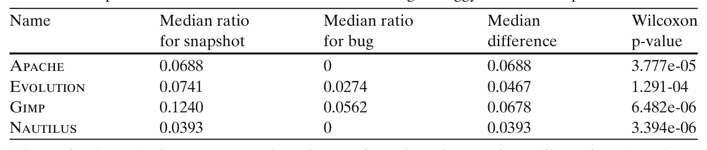
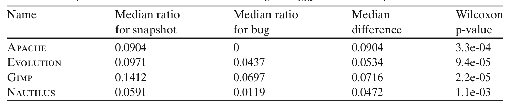

Table 3 Comparison of clone ratio for conservative setting in buggy code and snapshot

Nautilus 0.0393 0 0.0393 3.394e-06

Alternative hypothesis set to "snapshot clone ratio > bug-clone ratio". All p-values have been adjusted using the Benjamini–Hochberg procedure

staging snapshots’ clone ratio and the corresponding coalesced clone ratio for all the bugs attributed to that snapshot. We then compare them visually using boxplots, and test if they are drawn from the same distribution (null hypothesis) using a paired Wilcoxon test. The null hypothesis is that both of these distributions should be the same. Note: in some cases, there may not be any bug projected to a particular snapshot and we ignore that snapshot as that is not a staging snapshot for any bug.

Figure 2 shows boxplots of clone ratio in staging snapshots and corresponding clone ratio in bugs that were fixed in those staging snapshots. For all the projects, the boxplots clearly indicate a lower clone ratio in buggy code. For Apache with the conservative clone detector setting, the difference between the two boxplots is dramatic. Even with the liberal clone detector setting, the median of bug-clone ratio is well below the median of snapshot clone ratio. This phenomenon is repeated in all the other projects. The non-parametric paired Wilcoxon rank sum test (with continuity correction) in all cases conclusively rejects the null hypothesis that the two samples (clone ratios in buggy code and clone ratios in the entire snapshot) are drawn from the same distribution. Corresponding effect size (difference of medians) and p-values after Benjamini–Hochberg adjustment are presented in Tables 3 and 4. As we mentioned earlier, we also experimented with several other clone detector parameter settings. We found that as the similarity value is decreased and set to a very low value, such as 0.95, along with smaller token size, such as 30, clone ratio in bugs increases and the gap in median with the background distribution closes. However, a Wilcoxon rank sum test shows that the overall clone ratio remains significantly higher than clone ratio in buggy code. These robust statistical results, that were observed across all 4 projects, suggest that clones are not a major source of bugs.

### RQ3 Are prolific clone groups more buggy than non-prolific clone groups?

We compare prolific clone groups’ bugginess with non-prolific clone groups’ bugginess.

Table 4 Comparison of clone ratio for liberal setting in buggy code and snapshot

Nautilus 0.0591 0.0119 0.0472 1.1e-03

Alternative hypothesis set to "snapshot clone ratio > bug-clone ratio". All p-values have been adjusted using the Benjamini–Hochberg procedure