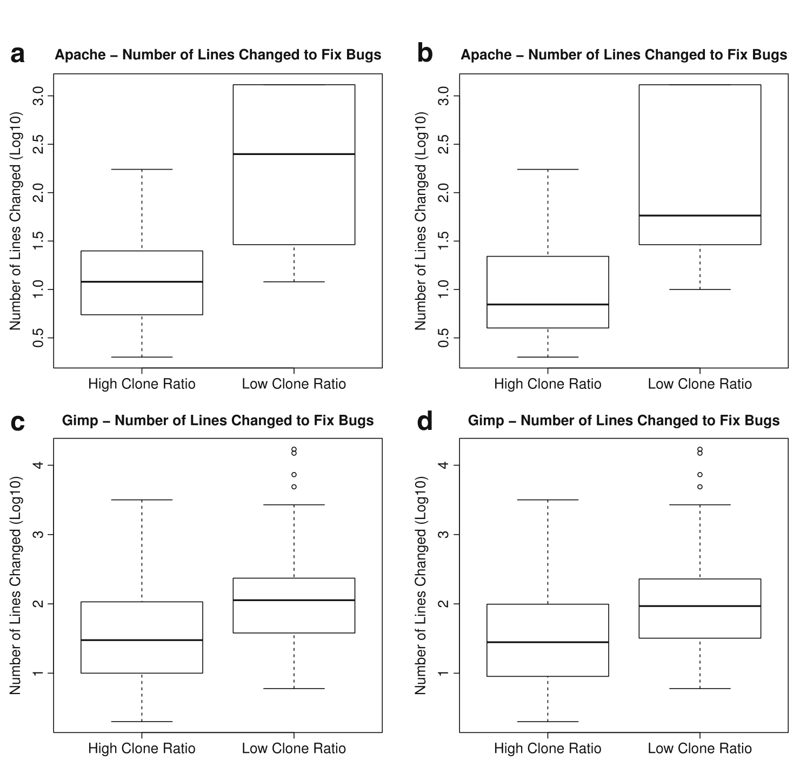

**Table 10 Comparison of defect density for liberal setting in directory-scattered and directory-collocated clone groups**

| Name     | Median ratio for collocated | Median ratio for scattered | Median difference | Wilcoxon p-value |
|----------|-----------------------------:|----------------------------:|------------------:|-----------------:|
| Apache   | 0.2083                       | 0.0885                      | 0.1199            | 5.280e-07        |
| Evolution| 0.1250                       | 0.0909                      | 0.0341            | 5.280e-07        |
| Gimp     | 0.1250                       | 0.1176                      | 0.0074            | 0.003            |
| Nautilus | 0.1111                       | 0.0714                      | 0.0397            | 0.001            |

*Alternative hypothesis set to “defect density in (directory) scattered clones is higher”. All p-values have been adjusted using the Benjamini–Hochberg procedure.*

The difference, we present the effect size (difference of medians) and p-values from the one-tailed (alternative hypothesis set to “defect density in (directory) scattered clones is lower”) Wilcoxon signed-rank test with continuity correction in Tables 9 and 10. All the p-values except Nautilus in conservative settings are significant at the 5% significance level, thereby rejecting the null hypothesis.

Fig. 6 Number of lines changed to fix bugs with high and low clone content (a) Apache (Conservative) (b) Apache (Liberal) (c) Gimp (Conservative) (d) Gimp (Liberal)