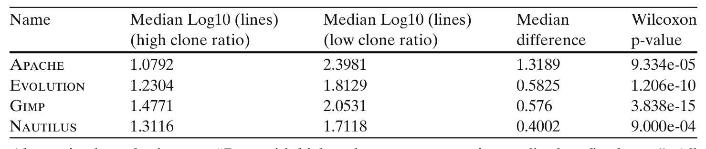
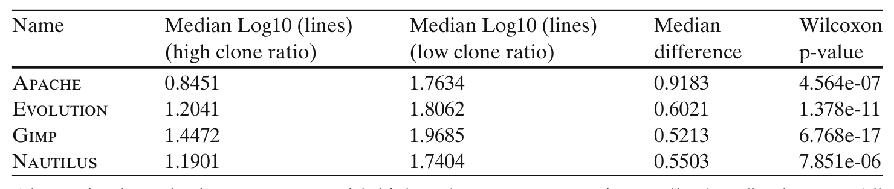

Table 11. Comparison of number of lines changed (Log10) for conservative setting in bugs with high and low clone ratio

Nautilus 1.3116 1.7118 0.4002 9.000e-04

Alternative hypothesis set to “Bugs with higher clone content require smaller bug fix change”. All p-values have been adjusted using the Benjamini–Hochberg procedure.

We note that RQ4 also suffers from the same threat to validity of RQ3. If developers cannot propagate bug fixing changes to diverse locations in a clone group, then scattered clones could show lower defect density. Thus, failure of a developer to link a bug to multiple copies present in multiple files could also result in the same phenomenon.

RQ5 Do bugs with higher clone content require more effort to fix? As is evident from RQ1, most of the bugs (more than 80%) have no cloned code and around 90% of bugs have clone ratio less than project average. However, although a few clone-related bugs (i.e., bugs that have at least some cloned code) have clone content more than the project average, they might as well require very large change to fix, thereby belying their apparent non-significance. We therefore try to see whether fixing bugs with more clone content (higher than the project average) requires significantly more effort than fixing bugs with lower clone content (less than the project average). It is difficult to quantify precisely the effort that it takes to fix a bug. Therefore, we approximate effort with the size of the changes (measured in terms of lines of code) to fix a bug.

To compare the relative effort required to fix bugs with higher and lower cloned content we discard all non-clone bugs (bugs with no cloned code) and then partition the remaining bugs based on whether they have a higher clone ratio than project average. “High clone ratio” partition contains bugs that have clone ratio more than project average. We then compare number of lines changed to fix bugs with high and low clone ratio. The resulting boxplot is shown in Fig. 6. All the boxplots clearly indicate that bugs with high clone ratio require smaller bug fixing changes. We also present the effect size (difference of medians) and p-values from Wilcoxon signed rank test in Tables 11 and 12 to compare the mean number of lines changed in high

Table 12. Comparison of number of lines changed (Log10) for liberal setting in bugs with high and low clone ratio

Nautilus 1.1901 1.7404 0.5503 7.851e-06

Alternative hypothesis set to “Bugs with higher clone content require smaller bug fix change”. All p-values have been adjusted using the Benjamini–Hochberg procedure.