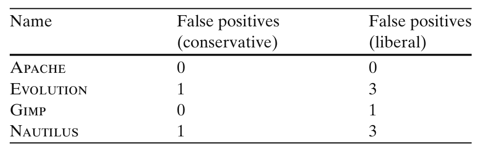

Table 13 Number of false positives in 100 randomly chosen samples for different clone detector settings

clones detected by Deckard and to understand clone patterns. We used PostgreSQL random() function to pick random samples and found up to 3% false positives (Table 13). All false positive clone groups have similar ASTs, but a careful look indicates that they are unlikely to be clones. A great many of our observed clone groups contain direct copy/paste, or embody protocols for carrying important, common operations. Arguably, programmers copying from well-written code, or regurgitating familiar programming logic from memory are less likely to produce error-prone code. Others were an artifact of the C language, and could be avoided using object oriented techniques. For example, in one Gimp clone group, members create different type of drawing objects (e.g., brush editor, gradient editor, palette editor) with slight change of code. This could have been avoided using a Factory Method or Builder pattern. Clearly, the availability of bounded polymorphism would have avoided code bloat; however, it appears, at least in this case, developers can manually generate bloated code to mimic bounded polymorphism without unduly impacting quality.

On the other hand, some clones simply cannot be avoided. For example, in Nautilus, one clone group has two member functions for handling going back/forward in the file browser. Based on the action performed, these methods reorder two linked lists (in different directions) and perform other actions on those lists. A forced refactoring using linked lists and function abstraction could render the code overly unintuitive. We also found some duplicate files in the projects.

In summary, all our evidence points to one conclusion: Clones do not really need to be considered a "bad smell".

## 7 Threats to Validity

### 7.1 Construct Validity

Bugs were collected from the Bugzilla databases for each project, and thus may not represent the complete set of all bugs. As the primary method by which users report problems, per community norms, and as they are reported manually and confirmed, we claim that project databases represent an important class of bugs which are indicative of aberrant behavior.

We used an automated bug linking process which may not be completely accurate. As a result, there may be both false positives and false negatives in the linked set. As discussed in Section 5 under RQ3, this does not pose an undue threat to RQ1 and RQ2, but some plausible failures to link might especially threaten the validity of our conclusion for RQ3 and RQ4. In a prior study (Bird et al. 2009) we evaluated the false positive and false negative rates and found the upper bounds on 95% confidence intervals to be less than 1% for bugs which were indeed linked by developers. Moreover, our bug introduction identification algorithm uses the Diff