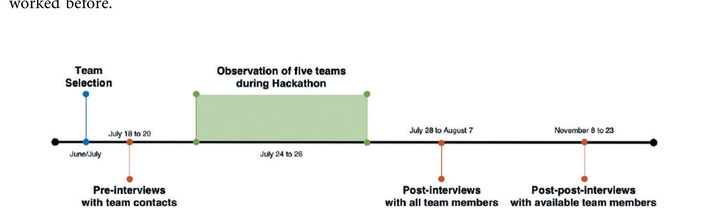
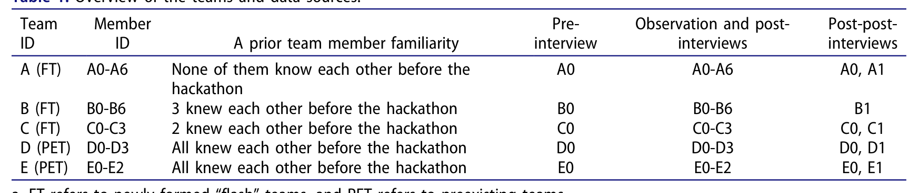

## Corporate hackathons, how and why? A multiple case study of motivation, projects proposal and selection, goal setting, coordination, and outcomes

Ei Pa Pa Pe-Than a, Alexander Nolte b, Anna Filippova c, Christian Bird d, Steve Scallen e, and James Herbsleb a

a Institute for Software Research, Carnegie Mellon University, Pittsburgh, Pennsylvania, USA; b Institute for Software Research, Institute of Computer Science, University of Tartu, Tartu, Estonia; c Data Science GitHub Inc., San Francisco, California, USA; d Empirical Software Engineering, Microsoft Research, Redmond, Washington, USA; e Microsoft Garage, Redmond, Washington, USA

> ABSTRACT  
> Time-bounded events such as hackathons, data dives, codefests, hack-days, sprints or edit-a-thons have increasingly gained attention from practitioners and researchers. Yet there is a paucity of research on corporate hackathons, which are nearly ubiquitous and present significant organizational, cultural, and managerial challenges. To provide a comprehensive understanding of team processes and broad array of outcomes of corporate hackathons, we conducted a mixed-methods, multiple case study of five teams that participated in a large scale corporate hackathon. Two teams were “pre-existing” teams (PETs) and three were newly-formed “flash” teams (FTs). Our analysis revealed that PETs coordinated almost as if it was just another day at the office while creating innovations within the boundary of their regular work, whereas FTs adopted role-based coordination adapted to the hackathon context while creating innovations beyond the boundary of their regular work. Project sustainability depended on how much effort the team put into finding a home for their projects and whether their project was a good fit with existing products in the organization’s product portfolio. Moreover, hackathon participation had perceived positive effects on participants’ skills, careers, and social networks.

### ARTICLE HISTORY
Received 12 October 2019  
Revised 22 April 2020  
Accepted 22 April 2020

### KEYWORDS
coordination; time-bounded event; hackathon; collocated work; team familiarity; goal setting; mixed-methods; case study

## 1. Introduction

In recent years, time-bounded events such as hackathons, data dives, codefests, hack-days, sprints, or edit-a-thons have experienced a steep increase in popularity. During these and similar events people form teams – often ad hoc – and engage in intense collaboration over a short period of time. Collegiate events that are organized by the largest hackathon league alone attract over 65,000 participants among more than 200 events each year (e.g., https://mlh.io/about). But it is not collegiate events alone. Hackathons have become a global phenomenon (Taylor & Clarke, 2018) covering a variety of contexts ranging from corporations (Frey & Luks, 2016; Rosell et al., 2014) to higher education (Kienzler & Fontanesi, 2017) and civic engagement (Baccarne et al., 2015; Hartmann et al., 2019; Henderson, 2015).

These events vary along several dimensions: whether teams know each other beforehand (Möller et al., 2014), whether the event is structured as a competition with prizes, whether the event is open only to members of a single organization, whether the participants are students or the public addressing civic issues (Carruthers, 2014; Porter et al., 2017; Taylor & Clarke, 2018), and whether

---

The desired outcome is primarily a product innovation (Henderson, 2015; Rosell et al., 2014), learning a new skill (Decker et al., 2015; Fowler, 2016; Lara & Lockwood, 2016; Nandi & Mandernach, 2016), forming a community around a cause (Möller et al., 2014), advancing a technical work that requires intensive focus by a group (Pe-Than & Herbsleb, 2019), or just having fun.

Corporate hackathons are a special kind of time-bounded event and often aim at broadening participation in the corporate innovation network, in much the same spirit as IBM’s “Innovation Jam” (Bjelland & Wood, 2008; Gibson et al., 2014; Rosell et al., 2014) (cf. section 2.1). The participants have their own goals for participation, such as learning (Nandi & Mandernach, 2016) and networking (Möller et al., 2014), which may or may not be the same as the organizers’ goals. Although there has been a growing body of work around hackathons, very few studies to date have examined corporate hackathons, with a few notable exceptions (Komssi et al., 2015; Nolte et al., 2018; Pe-Than et al., 2018). Some of them examined the potential outcomes of corporate hackathons, such as project sustainability (Komssi et al., 2015; Nolte et al., 2018), while others presented different ways that corporate hackathons could be designed (Pe-Than et al., 2018). Yet it is unclear how different outcomes are achieved and what conditions favored achieving various outcomes.

Prior work on traditional teams regards team familiarity as an important dimension which has been consistently found to influence team coordination (Espinosa et al., 2007; Hinds & Cramton, 2013). As hackathons afford several ways of organizing teams, including both self-selected and moderated teams (Trainer et al., 2016), teams may consist of members with varying levels of familiarity. Although coordination seems straightforward for preexisting teams, collaboration in teams with members who had not worked together before is challenging due to the lack of existing knowledge about their team members (Goodman & Leyden, 1991). The hackathon setting amplifies such challenges for newly formed teams as they need to work together effectively in an extremely compressed timescale, typically 2–5 days, with no or very little time to get familiarized with other members. Prior work also suggests that working under such intense time pressure requires teams to set realistic expectations and goals (Henderson, 2015; Porter et al., 2017), which is more important for ad hoc teams with members who otherwise would not work together (Komssi et al., 2015; Möller et al., 2014). Hence, hackathon teams are faced with a major coordination challenge, particularly for teams whose members are not familiar with each other (or teams formed just for the hackathon or “flash” teams (FTs)). In contrast, teams with members who have worked together before (or preexisting teams (PETs)) possess existing knowledge about their members that they may leverage to coordinate.

Corporate hackathons differ from the sorts of hackathons usually studied in the literature, which typically exist outside any stable organizational context and bring together people who generally have not worked together—or even met each other—before. In corporate hackathons, participants may know each other well, or be relative strangers, but they share a corporate culture and overall purpose. This can be expected to influence how they work, and the opportunities that arise for continuing a project after the event. Their enduring role as corporate employees can also be expected to help shape their perceptions of the value they place on the different influences the event had on them.

This paper aims to address the following research questions in the context of a corporate hackathon: what were the team processes, and how did they differ between PETs and FTs? (RQ1), what were the conditions that contributed to sustaining the projects after the event? (RQ2), and what impacts did participants believe the event had on them? (RQ3). To address these questions, we conducted a mixed-methods, multiple case study of five teams that participated in the 2017 Microsoft OneWeek Hackathon. The OneWeek Hackathon is one of the largest corporate hackathons in the world with more than 18,000 employees working on more than 4,700 projects worldwide. We focused on the largest site where we selected five teams based on team size, familiarity among team members, and the relationship between their hackathon project and their everyday work. Three of the teams we selected are FTs, and two are PETs. We observed the selected teams for

---

The entire course of the hackathon, and conducted interviews of team members before, immediately after, and 4 months after the hackathon.

Our paper contributes several new insights about how hackathons operate in a corporate context. Our analysis revealed that FTs and PETs adopted different styles of coordination, with PETs working in their accustomed style while FTs adopted a role-based coordination strategy, based on standard corporate roles, but modified to fit the hackathon context and often executed uncertainly, as many participants were trying out roles they had not experienced before. PETs and FTs also worked on different types of projects, with PETs developing nearly fully functional products immediately useful for their current work situation, while FTs tended toward lightly engineered prototypes while aiming their efforts at a wider audience, as they sought a permanent home for their project. The sustainability of projects after the hackathon, for both FTs and PETs, was enhanced when members took on tasks where they were already highly skilled, and focused their learning efforts on the specific skills needed for their project. Sustainability was also enhanced if leaders were career-oriented, and focused on meticulous preparation and execution of their project rather than learning or innovation outside their areas of expertise. Our results also suggest that the perceived benefits to FT members from participation in the hackathon did not all derive from the project itself, and the attention it received, but also involved skill development, networking, trying on new roles, and greater organizational knowledge. The benefits to PETs, on the other hand, mainly derived from demonstrating skills and creating something of value within their existing chain of command.

## 2. Background

### 2.1. A brief history of hacking

“Hackathon” is a portmanteau of the term “hack” and “marathon” to indicate a phenomenon in which small radically collocated teams work together to solve problems within a short time frame, generally 2–5 days. The term “hackathon” was coined around the turn of the century while their rise in popularity took place during the mid to late 2000s. During that time, they were mostly organized as competitive events for which young developers formed small ad-hoc teams and engaged in short-term intense collaboration on software projects for rewards as small as pizza, or sometimes the larger reward of the prospect of a future job (Briscoe, 2014). Given their self-directed nature, hackathons are a good match for open source communities, which hold an ideology that the open network of collaborators can accomplish work faster than a traditional top-down organizational structure (Bailey & Horvitz, 2010; Henderson, 2015; Taylor & Clarke, 2018; Trainer et al., 2016).

In the corporate context, hackathons are a type of special internal event used to broaden participation in innovation work, similar in purpose to R&D labs and internal incubation teams (Bailey & Horvitz, 2010). One example is IBM’s “Innovation Jam” (Bjelland & Wood, 2008), where IBM employees and stakeholders participated in two three-day online events to generate business ideas. The most innovative projects were funded to turn their ideas into shippable products. Hackathons not only have become an integral part of major tech companies such as Google, Facebook, and Microsoft but also have entered into other domains addressing specific issues around technology (Briscoe, 2014; Möller et al., 2014; Porter et al., 2017).

Over the past few years, hackathons have spread across various domains ranging from large corporations (e.g., Hoang et al., 2016; Nolte et al., 2018; Pe-Than et al., 2018), and small-medium size enterprises (Komssi et al., 2015) to student events (e.g., Nandi & Mandernach, 2016; Ruiz-Garcia, Subirats, & Freire, 2016; Tandon et al., 2017), and civic engagement (Almirall et al., 2014; Shiramatsu, Tossavainen, Ozono, & Shintani, 2015; Porter et al., 2017). This adoption has broadened the focus of hackathons from creating innovative ideas or software products (e.g., Briscoe, 2014; Cobham, Hargrave et al., 2017; Cobham, Jacques et al., 2017; Hjalmarsson & Rudmark, 2012) to covering themes such as informal and collaborative learning (e.g., Fowler, 2016; Lara & Lockwood,

---

2016; Nandi & Mandernach, 2016), expanding or creating communities (e.g., Farzan et al., 2016; Möller et al., 2014), supporting civic open data innovation (Almirall et al., 2014; Kitsios & Kamariotou, 2019), and tackling social (e.g., Porter et al., 2017) and environmental issues (e.g., Zapico et al., 2013). Digital innovation contests and open data hackathons are peripherally related, but rather different in purpose and activities from the hackathon we observed. The corporate hackathons are embedded in an organization, and the participants share corporate norms and culture.

## 2.2. Coordination, project selection, and goal setting in collocated work

Team coordination is an important activity that integrates a collective set of interdependent tasks, actions, and knowledge to achieve goals (Espinosa et al., 2007; Lee et al., 2017; Lodato & DiSalvo, 2016). The coordination process is smoother for teams whose members have worked together beforehand (Adams et al., 2005; Espinosa et al., 2007; Goodman & Leyden, 1991; Hinds & Cramton, 2013; Ladouceur et al., 1986), and it is better yet for teams who are collocated and worked together for an extended period because they learned other members’ capabilities (Cramton, 2001; J. E. Mathieu et al., 2000; Hinds & Cramton, 2013; J. Mathieu et al., 2008).

The benefits of collocation have been well documented (e.g., Christensen et al., 2014; Herbsleb & Mockus, 2003; Olson & Olson, 2000; Trainer et al., 2016). For example, Teasley et al. (2000) conducted a field study with six software development teams working on four-month-long projects and examined how radical collocation enhanced productivity. Radical collocation refers to a situation in which team members are collocated in a single physical location. For the teams that Teasley et al. (2000) studied, the work was time boxed at a four-month duration, meaning it had to be accomplished within this time interval. The authors found that the spatial proximity afforded by radical collocation increased members’ awareness of what was happening in the team, in turn enabling them to direct their attention to necessary areas by, for example, organizing spontaneous meetings, switching between meetings, giving advice, and teaching or learning from other members. Taking advantage of affordances offered by radical collocation, including both verbal and non-verbal cues, teams in this situation were found to have increased productivity. Moreover, Hinds and Cramton (2013) found that site visits – workers collocating with their distant colleagues in their work context – allowed them to observe how their colleagues work, interact, and network with others. This resulted in better understanding about each other’s work and communication style, capabilities and interests, personalities, and work and social roles, all of which facilitated post-visit communication.

In general, most of the research on collocation focuses not only on the physical arrangements but also on the practices, norms, and familiarity that develops among team members over time, and which allows them to take better advantage of what the environment affords. However, most previous studies conducted their study within the participants’ regular work setting or in extended collocated periods. For example, in situated coworker familiarity studied by Hinds and Cramton (2013), the benefits derived from one team being able to experience the other team in context, in their regular work setting. Hackathons are generally set away from any participant’s setting, e.g., in giant tents in the case of Microsoft Hackathon. In the case of radical collocation (Teasley et al., 2000), the teams were together for 4 months, enough time to develop norms and familiarity with each other’s expertise and work processes, and quite different from a typical hackathon’s 2–5 days. Despite the brevity, Trainer et al. (2016) found that hackathon teams were able to take advantage of affordances offered by the hackathon environment, but tradeoffs existed between how teams are formed, projects are selected, and the advancement of technical work and building social ties. However, Trainer et al.’s study did not provide a detailed account of team member familiarity and its role in selecting projects and coordinating their activities, and in influencing the sustainability of the hackathon projects. In this study, PETs and FTs, which differ greatly in familiarity, may experience hackathons very differently. With the advantages of proximity but, for FTs, little

---

familiarity to build on, and little time to establish new norms or practices, coordination is a potentially serious challenge.

In hackathons, teams are generally self-directed, i.e., free to work on anything they want, with few constraints other than time (Trainer et al., 2016). Selecting projects and setting goals have, consequently, become critical processes requiring coordination, and enabling the team to work together effectively (Filippova et al., 2017). Selecting projects is even more challenging for hackathons at scale (e.g., Microsoft OneWeek Hackathon) because the size makes pitching ideas at the event impossible. Further, PETs, who had worked together before as a team in an organization, possess shared norms and practices as well as shared job concerns. While PETs may select their hackathon projects based on shared norms and concerns, FTs which lack familiarity may choose projects on other bases. Looking at another context in which people voluntarily contribute effort, open-source software development (OSS), Roberts et al. (2006) found that people choose to contribute to different projects based on motivations such as self-use, reputation enhancement, or external reward. For example, some contributors with utilitarian motivations were found to choose tasks that might not be inherently interesting but have value for the community.

Goal-setting is also key for hackathon teams. Having clear goals can motivate teams to plan their activities and develop strategies to coordinate their work in a way that favors achieving their goals. The teams should challenge themselves in order to perform as well as possible (Anslow et al., 2016; Kristof-Brown & Stevens, 2001; Locke, 1968), but with time so limited, it would be easy to adopt goals that are unattainable, leading potentially to frustration and poor performance (Bryan & Locke, 1974; Kristof-Brown & Stevens, 2001). Therefore, it is worthwhile to examine on what basis PETs and FTs select projects, set goals, coordinate their work, and choose activities to produce and sustain their hackathon outcomes.

## 2.3. Project sustainability and perceived impacts

Existing research points toward a disparity between the intention to continue projects after a hackathon and their actual continuation (Carruthers, 2014). The lack of follow-up has been attributed to different factors depending on the goal and context of the respective hackathon. Several researchers pointed out that creating sustainable products and services in the context of civic innovation requires future stakeholders to be involved in the planning of a hackathon project (Ciaghi et al., 2016; Baccarne et al., 2014). Cobham, Jacques et al. (2017) found the same for student hackathons that were conducted with the goal of creating start-up companies. Working in the field of computational biology, Lapp et al. (2007) pointed out that the sustainability of hackathon projects depends on their fit to other existing projects. Finally, multiple studies found that in order for hackathon projects to be sustained it is necessary to identify suitable individuals that are willing and capable to continue a project after a hackathon has ended (Cobham, Hargrave et al., 2017; Guerrero et al., 2016). These studies were conducted in the context of hackathons that aim at supporting the creation of start-up companies. Our work adds to the aforementioned findings by providing a rich description of how various activities combined with individual attitudes toward hackathon participation and project continuation can contribute to the sustainability of projects.

Researchers also identified several benefits of hackathons for individual participants. They found tangible learning outcomes in student hackathons (Nandi & Mandernach, 2016; Tandon et al., 2017) in addition to an increased interest in technology and an increased confidence in dealing with technology in general. Both these findings were confirmed for student hackathons (Ruiz-Garcia et al., 2016) as well as hackathons that were conducted in the context of civic innovation (Leclair, 2015). Finally, multiple researchers found that participants were able to expand their social networks during a hackathon. This effect was observed in student hackathons (Cobham, Hargrave et al., 2017) as well as in community hackathons in the context of computational biology (Busby & Matthew, 2016). Our study expands on those findings in the context of corporate hackathons.

---

Taken together, existing literature points to a lack of research around outcomes of corporate hackathons. Only very few studies have been conducted in this setting (Nolte et al., 2018; Pe-Than et al., 2018; Komssi et al., 2015), while the majority of studies around hackathon outcomes focuses either on student hackathons (Cobham, Hargrave et al., 2017; Cobham, Jacques et al., 2017; Guerrero et al., 2016; Nandi & Mandernach, 2016; Tandon et al., 2017; Ruiz-Garcia et al., 2016) or civic events (Carruthers, 2014; Ciaghi et al., 2016; Leclair, 2015; Baccarne et al., 2014). Our work addresses this gap.

Furthermore, existing studies dealing with hackathon outcomes focus on singular outcomes such as the sustainability of projects (Carruthers, 2014; Ciaghi et al., 2016; Cobham, Hargrave et al., 2017; Cobham, Jacques et al., 2017; Guerrero et al., 2016; Lapp et al., 2007; Baccarne et al., 2014) or individual learning outcomes (Leclair, 2015; Nandi & Mandernach, 2016; Ruiz-Garcia et al., 2016; Tandon et al., 2017). Our work, however, aims at examining a broader spectrum of potential outcomes related to projects and individuals and team member familiarity and its role in team processes.

In previous work by Nolte et al. (2018), the authors conducted a case study of teams participating in a corporate hackathon and reported a detailed account of the processes used by five hackathon teams, and identified activities contributing to the continuation of projects and the perceived impacts that hackathon participation had on the participants. This work, however, did not consider the potential effects of a priori familiarity among members on team processes and outcomes. This study therefore makes novel contributions by examining the potential differences in decision-making between PETs and FTs in the context of corporate hackathons.

## 3. Research questions

This study aims to address the following research questions in the context of a corporate hackathon:

**RQ1a: What were the team processes?**

**RQ1b: How did the processes of flash teams differ from those of preexisting teams?**

In order to answer RQ1a, we identified activities before, during, and after the hackathon conducted by teams and individual team members with an emphasis on proposing and selecting projects, goal setting, preparation, coordination, and promoting projects after the hackathon. To address RQ1b, we contrasted these activities between flash and preexisting teams.

**RQ2a: What factors influence the sustainability of projects?**

**RQ2b: How did the influence of these factors differ across flash and preexisting teams?**

In order to answer RQ2a, we identified the relationships between activities before, during, and after conducted by teams and individual members and continuation of the projects. We again contrasted these identified relationships between flash and preexisting teams to address RQ2b.

**RQ3a: What impacts did participants believe a corporate hackathon had on them?**

**RQ3b: How did such perceived impacts differ across flash and preexisting teams?**

To address RQ3a, we examined any perceived change on individual attitudes and work environment which they attributed to participation in a hackathon, and contrasted the findings of flash teams with preexisting teams which answered RQ3b.

---

## 4. Methods

To answer the study’s research questions, we adopted a mixed-methods, multiple case study research design, and studied five teams that participated in the 2017 Microsoft OneWeek Hackathon. We chose the case study approach because it is particularly suited for studying a phenomenon that cannot be studied separately from the context (Yin, 2014). This approach has been successfully applied to examine collaboration practices in OSS development (Howison & Herbsleb, 2011; Mockus et al., 2002), suggesting it is appropriate for this topic. In this study, we regarded each team as one case, and our case/team selection process was guided by the literal and theoretical replication strategy suggested by Yin (2014), which we describe in the following sections. In the following sections, we will elaborate on the study context, our methods for data collection, and our means for analysis in more detail.

### 4.1. The research setting: Microsoft OneWeek Hackathon

Microsoft OneWeek Hackathon is an annual 4-day event that started in 2014. These events are held during regular working hours on regular workdays; employees are paid as usual and can get away from their regular work by participating in it, so long as they can be spared from their regular job. During the first 3 days of OneWeek Hackathon (Monday to Wednesday), employees of Microsoft engage in intense collaboration to create any product or to work on any project they are interested in. The last day (Thursday) is reserved for a presentation session. During this so-called science fair, each hackathon team can present their project to the wider Microsoft public. Participation in the hackathon and the science fair is entirely voluntary. OneWeek Hackathon is global in nature and takes place at different locations around the world.

In order to propose projects and form teams for such a large-scale hackathon, Microsoft uses an online tool called Hackbox. Hackbox requires every participant to register either by joining an existing project or proposing their own project before the hackathon. Participants can also register as teams and/or search for additional team members that cover certain skills or fill certain roles which they perceive to be beneficial for their project. This allows, e.g., a team of developers to find marketing experts or a team of content designers to find individuals with technical expertise. Hackbox is also used to register for the science fair by uploading a video for the project. The video also serves as a means to distribute the project to the wider Microsoft community since every Microsoft employee has access to Hackbox.

Registration began 2 months prior to the event, which enabled potential participants to propose and/or choose projects that they were interested in, and usually formed teams prior to the event. This registration procedure allowed employees: 1) to take on roles which may or may not have been the same as their current roles at the company; 2) to choose projects that may or may not be related to their regular work projects; and 3) to team up with others with whom they may or may not have worked before.

> **Image description:** A horizontal timeline showing the study's data-collection steps before, during, and after the Microsoft OneWeek Hackathon. Team selection occurred in June/July; pre-interviews with team contacts were conducted July 18–20. The hackathon observation of the five selected teams is highlighted as a green band spanning July 24–26. Follow-up data collection included post-interviews with all team members from July 28 to August 7 and post-post (four-month) interviews with available members from November 8 to 23; the paper reports 5 pre-interviews, 25 post-interviews, 9 post-post-interviews and ethnographic observation (about 15–24.5 hours per team).

Figure 1. Data collection points before, during, and after hackathon.

---

Table 1. Overview of the teams and data sources.

> **Image description:** The table summarizes the five case teams (A–E) used in the study, showing member ID ranges, prior familiarity among team members, and which participants were included in pre-interviews, observation/post-interviews, and post‑post interviews. Teams A–C are flash teams (FT) and D–E are preexisting teams (PET); team sizes are A:7 (A0–A6), B:7 (B0–B6), C:4 (C0–C3), D:4 (D0–D3), and E:3 (E0–E2), with prior familiarity reported as “none” for A, three known ties for B, two for C, and “all knew each other” for D and E. The table also shows the study’s longitudinal interview design: pre-interviews were conducted with each team leader only (A0–E0), observation and immediate post-interviews included all listed team members, and the 4‑month post‑post interviews typically involved the leader plus one additional member (e.g., A0,A1; D0,D1). This layout makes explicit the deliberate contrast in the sample (three FTs vs two PETs) and the interview/observation coverage that supports the paper’s comparisons of coordination, preparation, and project continuation.

a. FT refers to newly formed “flash” teams, and PET refers to preexisting teams.  
b. A0, B0, C0, D0, and E0 are the leaders of respective teams.

Our study focuses on the largest hackathon site at Microsoft corporate headquarters in Redmond. This site, in 2017, hosted more than 6,700 participants working on more than 1,800 projects in two large tents. In order to have a better understanding about this hackathon, we conducted interviews with three hackathon organizers. These interviews focused on understanding what motivated them to organize such an event, how they designed the event, and what they expected to achieve from it. These interviews enabled us to better understand the event setup and interpret our results within this context. Around the event itself, we conducted an extensive data collection that included interviews and ethnographic observations. Figure 1 shows an overview of the data collection procedure. In the following, we will elaborate on the data sources that were used for this particular study including the respective setup as well as the methods for analysis.

## 4.2. Data sources

We collected data from two main sources: semi-structured interviews and ethnographic observations. We conducted three sets of interviews: 1) before with team contacts which were part of the team selection process described below (pre-interviews); 2) immediately after the event with all team members (post-interviews); and 3) 4 months after the events with at least one member (post-post-interviews). Table 1 summarizes an overview of the data sources and the degree of familiarity among members of each team.

### 4.2.1. Case/team selection and pre-event interviews

We selected five hackathon teams which participated in the 2017 Microsoft OneWeek Hackathon and regarded each team as a case. Although there is no ideal number of cases to be selected, we chose to study five teams and this number falls under the range of 4 to 10 cases recommended for multiple case study research (Eisenhardt, 1989; Sarker et al., 2013). First, a few days before Microsoft OneWeek Hackathon, we first analyzed team profiles, and initially identified 10 potentially appropriate teams, based on two main criteria: 1) Team size – we selected teams which consisted of three to seven (3–7) members. This size was typical of teams participating in the hackathon and small enough that we could observe all of their activities; and 2) Familiarity/diversity – we used the following dimensions as a proxy: current role, organizational unit, and the extent of prior experience of working together, all of which varied together. We wanted teams which were either high and low in these dimensions, and to have at least two teams in each category in order to observe similarities and differences between and within teams.

Next, we contacted the leaders of these teams via e-mail to inquire about participating in our study. We then conducted semi-structured interviews (pre-interviews) with the team leaders who responded to our e-mail showing their willingness to participate in our study. A total of five pre-interviews were collected. The aim of these pre-interviews was to get an understanding about the team (e.g., “How did you find your team and when?”), their project and motivations (e.g., “Can you start by explaining what your project is about?”) as well as potential activities that had already taken place in preparation for the hackathon (e.g., “How much preparation did you do as a team?”)

---

Based on these interviews, we selected five teams for our study. These pre-interviews lasted between 22 and 28 minutes.

Among the five teams we selected, two were preexisting teams (PETs) that were low on all the familiarity/diversity dimensions, and three were flash teams (FTs) that were high on all of these dimensions. In other words, for PETs we selected, all members knew each other, worked together on a daily basis, and had similar organizational roles (see Table 1). For FTs, most members did not know each other, represented a variety of roles, and had not worked together before except team C in which two out of four members knew each other.

In the selection of these cases/teams, we adopted both literal replication strategy, in which very similar teams are expected to produce similar results, and a theoretical replication strategy, in which teams that are as similar as possible in all respects except for a known difference may produce different results. We followed these replication strategies, based on Yin’s (2014) seminal case study methodology, to accomplish two things. First, observing more than one team at each familiarity/diversity level (literal replication) helped us avoid the risk that any single case we selected was atypical. Second, observing both high familiarity/diversity teams and low familiarity/diversity teams (theoretical replication) allowed us to reason about how differences between PETs and FTs may be due to this difference in familiarity/diversity, since the teams were highly similar (e.g., company culture, time constraints, etc.) in most other respects.

### 4.2.2. Ethnographic observation

We tried in our observation activity to be as unobtrusive as possible, taking the role of non-participant observer, meaning that we agreed not to take part in or disturb the activities of the team we observed (Blomberg et al., 2017). We did ask occasional questions to team members but had agreed not to interrupt the flow of work. In order to minimize the variation due to experimenter bias, all members of the research team discussed and agreed on a set of activities to observe during the hackathon and developed a one-page observation guide. Example activities include how teams make decisions and who participated in the discussions. During the hackathon, one member of the research team was assigned to each hackathon team. This researcher stayed with the assigned team for the entire duration of the hackathon, and observed their activities, and took detailed field notes, and made audio recordings. When the team was divided into multiple work-groups during the hackathon, we made sound recordings when the level of background noise and relatively close proximity of team members to each other made that possible. Teams A, B, C and E worked in the tents comprising the main hackathon site, while team D chose to work in a conference room near their offices. The five teams we studied mainly worked together on their hackathon projects during regular working hours between 9:00 am and 6:00 pm. Observation times varied between about 15 and 24.5 hours per team.

### 4.2.3. Post-event interviews

Immediately after the hackathon, we conducted post-interviews with all team members, and collected 25 interviews, each lasted between 15 and 44 minutes. Our interview participants worked in various organization units of Microsoft including Research, Office, HR, Sales and marketing, and Cloud and Enterprise, and they held various positions ranging from UX designer, software engineer of various levels, tech evangelist, product marketing manager, and project manager. During these interviews, we asked them to elaborate on their experience starting with their motivations (e.g., "Why did you decide to participate in the hackathon and work on this project?"), activities they conducted before the hackathon (e.g., "How did you prepare for the hackathon?"), their satisfaction with the outcome (e.g., "How do you perceive the outcome of your project?"), and their satisfaction with the way the outcome was achieved (e.g., "How effectively did you think you worked together?").

---

### 4.2.4. Post-post-event interviews

In order to assess the longer-term outcomes of their hackathon project, we conducted additional interviews (post-post-interviews) with team leaders and team members 4 months after the hackathon. A total of nine (9) interviews were collected, and these interviews focus on satisfaction with their project progress if any (e.g., “Are you satisfied with the current progress? Which potential obstacles prevent you from continuing to work on your project?”), their relationship with their hackathon team members (e.g., “Are you still in contact with members of your hackathon team? With who? About what?”), perceived effects of the hackathon on their career (e.g., “Do you think participation in the hackathon has helped your career in any way?”), communication about the hackathon and their hackathon project (e.g., “With whom did you talk about the hackathon or your hackathon project?”), and their perspective on the hackathon itself (e.g., “What is your most vivid memory about the hackathon?”). These interviews lasted between 13 and 29 minutes each.

We attempted to conduct post-post-interviews with all team members but could not reach them all. We did, however, interview the leaders of all teams except Team B, and one member of every team. All interviews were transcribed for analysis. The interview protocol used in this study is available at https://eipapa.github.io/files/hcij-hackathon-interview-protocol.pdf.

## 4.3. Data analysis

Our data analysis was based on 39 interviews (5 pre-interviews, 25 post-interviews, and 9 post-post-interviews), and observation data. The collected data were analyzed using open and axial coding procedures (Corbin & Strauss, 2014), and sensitizing concepts (Bowen, 2006). In the first step of our analysis — open coding, the authors analyzed the interview data to identify initial categories, and they were then reviewed and discussed the similarities and differences in their interpretations of these initial categories. The categories were modified and combined based on these discussions. After this, we used axial coding to cluster the categories hierarchically, and as a result, we created categories and subcategories. Finally, the first author performed a cross-case analysis by constructing a comparison table where each row represents a code and each column represents a team/case. This comparison table enabled us to identify the similarities and differences across all five teams as well as across FTs and PETs. During our analysis, we also distinguished between the team leaders and team members since they reported different experiences, based on their respective roles during the hackathon. To present our results, we synthesized our results to construct a comprehensive case narrative of each team by identifying key activities taken by the team leaders and members before, during, and after the hackathon. In the following paragraphs, we describe the detailed data analysis process with respect to the three research questions.

To answer RQ1 which sought to identify differences in hackathon team processes between FTs and PETs, we first analyzed the pre-interviews and post-interviews since they contained information about the project, team formation, motivations to participate, and activities taken by the teams and individual members before and during the hackathon. In the pre-interviews, we focused on the origins of the project idea, the team leaders’ motivations for participating in the hackathon and proposing the projects, and preparation activities as a team and an individual. In the post-interviews, we focused on team members’ motivations for participating in the hackathon and working on their chosen projects, preparation activities, the process of selecting their projects and working together during the hackathon, and individual continuation intentions and plans. For these two sets of interviews, we used the following sensitizing concepts: project origin, motivations, project selection, goal setting, preparation, coordination, and continuation plans. Example open codes are work-related projects, doing something different, get the work done, tech of interest, meet new people, task distribution based on skills, and task distribution based on interest.

To answer RQ2 which sought to identify the factors that can potentially lead to the continuation of a hackathon project and how such factors differ across FTs and PETs, we first analyzed the post-post-interviews, since they contained information about the continuation of the hackathon project as

---

well as aspects that potentially led to the continuation or discontinuation of a project. In the analysis of these interviews, we used project continuation and potential antecedents of project continuation as sensitizing concepts. Example open codes resulting from this analysis include promoting projects, presentations to different groups, and leveraging one’s own network.

To answer RQ3, which sought to identify the perceived impacts of hackathon participation on individuals, we mainly focused on post-post interviews, since they were most directly related to our research questions. When coding these interviews, we used perceived individual outcome as a sensitizing concept. We also used the observation data as well as pre-interviews and post-interviews to provide additional insight into individual team members’ activities. Example open codes include learn new tech, refresh skills, people skills, promotions, meet new people, and connect the old and new ties.

## 5. Results: team narratives

In this section, we provide a narrative of each of the five teams we studied as we traced them from birth to 4 months after the hackathon. Teams A, B, and C are FTs while teams D and E are PETs.

### 5.1. Flash teams: team A

The initiator and leader of this team (A0) is a marketing expert who had the idea to develop a tool to support career development (“was thinking about […] career planning,” A0). A0’s motivation to turn this idea into a hackathon project was to “broaden my depth and try new things out,” “get work done,” and to further their career (A0). A0 purposefully assembled a diverse group of developers (A2, A4, A6), UX (A5), and human resource (HR) experts (A1, A3) for this project. The eventual team members mainly got interested in this project because of its theme “project that I’m interested in” (A6), the opportunity to meet new people (“meet new people,” A5), learn (“expand my own knowledge,” A1), and technology (“tackle something with AI,” A4). The resulting team consisted of members who had not known each other before participating in this hackathon project, and the project was not directly related to any of their respective work tasks since the focus of aforementioned HR experts was not on internal career counseling.

The team conducted “weekly meetings before the hackathon” (A3) during which they ran through “a lot of iterations” (A2) to scope the project and develop a list of tasks. A0 also “talked to people about the project” beforehand in order to identify a suitable scope and to disseminate the project idea (“created a list of friends of [project name],” A0). Most team members also engaged in individual preparation activities before the hackathon. These were mainly related to specific technologies that the developers among the team members would use during the hackathon (“I was looking at those APIs,” A2; “I was working on how I was gonna implement it,” A4).

During the hackathon, the team worked in parallel on developing a software prototype and a video. Team members selected and conducted tasks based on their respective skill set (A2, A4, and A6 focused on development, and the others mainly worked on the video). A3, who was currently at the HR department, said: “I was responsible for the presentation and just like the business impact and so on. [Another member who currently held HR position] was working on design” (A3). During the first day, minor changes were conducted based on discussions around the story of their video. At the midpoint of the hackathon, the team had a working prototype and a video script. They spent the rest of the hackathon time on polishing the prototype and creating the video. On the last day, they discussed strategies of how to get a larger audience interested in their project, provided an update about their progress during the hackathon to those that they already contacted before the hackathon, and prepared for the science fair. During the science fair, the team had a meeting with a senior manager.

Our interview responses indicated a strong intention for the project initiator and all team members to continue the project after the hackathon (“I’ll definitely go and work on that project,”

---

A2). Immediately after the hackathon, A0 engaged in dissemination activities by “present[ing] the project to multiple groups” (A0). One of their conversation partners subsequently advertised the project to a group that had already planned to create a similar product (“X told to Y: I think these guys [i.e. team A] have built what you [i.e. Y] are trying to build,” A0). A0 had a meeting with this group which led to a definite commitment to the continuation of the project by that group (“we found the right team and the funding seems to be there,” A0). This development however led to the project being taken over by this team which in turn meant that none of the original team members were involved in its continuation. A0 generally felt positive about the continuation of the project by that other group (“I am excited about the product,” A0) although this statement reveals that the participant might be emotionally invested in the project. It is unclear how the other team members reacted to the project being taken over since this decision was taken after they were interviewed.

## 5.2. Flash teams: team B

This project was initiated by a marketing expert with a developer background who found it “extremely hard to meet people” (B0) in Microsoft. B0’s desire to get connected with people motivated the participant to propose this idea as a hackathon project. The goal of their project was to develop a software that facilitates employees to meet others from different parts of the company. The team leader’s (B0) main interest in the hackathon was to “meet people” and to “share experiences.” The leader assembled a group of interested developers (B6), engineers (B1), marketing experts (B1, B3, B5) and project managers (B2, B4) without any particular focus on their skill set. Two other members (B1 and B5) joined the team partly because the idea was initiated by the project initiator (“it was [B0’s] idea,” B1). They also chose this project because they had an interest in the theme of the project (“[the project] was closest to what [the participant] was thinking about,” (B1); “the intersection of cool technologies and real world problem” (B5)). The other team members were mainly interested in learning (“learning new technology skills,” B2) and networking (“meeting people,” B6). B0, B1, and B5 had worked together before but none of the other team members knew each other before and the project was not directly related to any of their respective work tasks.

B0 organized a meeting before the hackathon to which “only […] two people show[ed] up” (B0). During this meeting, the participants talked about the “vision for the project, and the roles” (B2). In addition, B0 created “a little one page type of spec of the technology and what my thought process was” (B0) which the participant distributed via e-mail. Two of the team members engaged in individual preparation activities before the hackathon. B5 “set up the laptop” (B5) and B1 prepared “just a little like the weekend before,” (B1). Other participants did not mention any particular preparation activities because of their perception that they did not entirely understand the project goals (“[I] didn’t know what expectations [B0] had,” B3).

At the beginning of the hackathon, the group came together and started developing a project plan “completely from scratch” (B6). B0, B2, and B5 discussed the design of the software and came up with an initial plan. The work itself was then divided based on individual interest. During the rest of the day, the plan was adjusted multiple times and the team members frequently formed new subgroups to adjust to the changing requirements. In the morning of day 2, the focus shifted toward creating a story for a video which would be presented at the science fair. Most team members subsequently worked on a story for the video and on a fitting UI for most of the remainder of day 2. Two developers continued working on back-end code until the end of the hackathon. This code was never integrated. All team members except B3 and B4 participated in the science fair.

The team leader had a strong intention to continue working on the project while the intentions of other team members were mixed. Neither the project initiator nor any team member engaged in any continuation activities despite some team members expressing interest to continue working on it as “a side project” (B6). B0 mentioned that the participants did not feel comfortable showing the prototype to others at this point because they “would still have to explain [that] there’s a lot of marked up data” (B0).

---

## 5.3. Flash teams: team C

The idea for this project originated from a developer (C0) who had an interest in board games. Together with a friend who was also a developer (C3), they formed a hackathon team with another developer (C2) and a UX designer (C3). The main interest of C0 was to “get work done”, meet new people (“networking”) and work on a “cool idea” (C0). The rest of the team mainly joined because they were interested in the idea (“I’m a big fan of board games,” C2), wanted to “share their experience” and do something that is “different than my day-to-day job” (C1), and that they “feel passionate about” (C3). C0 and C3 knew each other before the hackathon but did not work together. None of the other team members knew each other before the hackathon and the project was not related to any work tasks of any of the team members.

C0 and C3 met before the hackathon and discussed prototypes that C0 had created in advance. C0 had also “developed tools to make [game elements] etc.” (C0), and created a “todo list” (C0). C1 participated virtually in those meetings and prepared for the hackathon by “looking at some other games” (C1) while C2 and C3 did not prepare at all. C2 joined the team late in the afternoon on day 1 after the hackathon had already started.

During the hackathon, the group mainly worked on the details of the game and gameplay such as labels for game elements, time limits, and victory conditions. They also played multiple versions of the game during the hackathon to assess its quality. Tasks were distributed based on interest. In the afternoon of day 1, the group started to develop a script for a video. The team drew interest by scouts who were searching for interesting projects. This resulted in the team being visited by a senior manager in the morning of day 3 to whom they presented the game. After the visit, the team developed a plan on how to promote their project at the science fair. At the science fair, they received positive feedback (“people were really, really excited,” C3).

C0 had an interest in continuing the project but also stated that the participant’s “objective has been completed” (C0) and that “even if we stop here, [the participant] will say that it was a success” (C0). The other team members voiced similar intentions in that they would continue “if [we] get executive support” (C1). None of the team members engaged in any specific dissemination activities apart from one “meeting […] where we had a bunch of demos from teams that participated in the hackathon and [they] demoed [their] project” (C0).

## 5.4. Preexisting teams: team D

The aim of this project was to develop software that supports the everyday work of a specific organizational unit within Microsoft to address requests from internal customers more efficiently. The idea was circulated among this unit since the beginning of the year and D0 suggested to work on this during the hackathon at a meeting for which the participant received “positive feedback” (D0). The main motivations for D0 to participate in the hackathon were to “get work done,” “to advance the participant’s career,” and to experience what it is like to “lead a project” (D0). Three developers who participated in the aforementioned meeting and were part of the same organizational unit as D0 joined them for the hackathon (D1, D2, and D3). Their motivations were to “get work done” and to “share experience[s]” while they also acknowledged that the project was “something that we needed” (D1).

The group had a meeting “on Friday before the hackathon” (D2) to “kind of hash things out” (D0). Before this meeting, D0 had already “spent 2–3 weeks getting libraries set up” (D0), and had “learn[ed] more about the infrastructure” (D0). D0 also asked “another PM” (D0) for feedback about the project prior to the hackathon and got a “promise [for] developers” (D0) to continue the project after the hackathon. The other hackathon participants either did “no prep at all” (D3), or prepared for potential technical challenges by, for example, revisiting “some of the schemes that I wrote” (D1).

At the beginning of the hackathon, the team first discussed their overall strategy and divided the project into tasks. The discussions were on a high technical level since all participants were familiar

---

with the domain. The tasks were then distributed according to interest but the team had difficulties assigning UI related tasks because no one had the required experience in this field. D2 finally agreed to work on them. They spent most of the time during the hackathon with coding and only modified the plan when they hit a technical barrier. A first version of the software was ready in the afternoon of day 2. Afterward, the team discussed making a video but decided to rather spend the remaining time on polishing the software.

After the hackathon D0 mentioned that the participant was "surprised by how much we got done" (D0), and they voiced a definite intention to continue the project. The other team members did not have any particular intention to continue the project: "I probably won’t have any involvement, which is kind of okay," (D1). One week after the hackathon D0 presented the software at the "big team meeting" (D0) which is also attended by their "[second level] manager" (D0). During the meeting, they discussed that "[the project] needs a month to make it really usable" (D1), and that there currently "is not enough bandwidth for us to work on it" (D0). Leadership also stated a fear that "the project will create a new business case that we are not ready for" (D0), which in turn would only exacerbate the lack of resources.

## 5.5. Preexisting teams: team E

The aim of this project was to develop software that augments user experience of one of the Microsoft services using a newer technology that the team did not use for their day-to-day project. The eventual leader of this hackathon team (E0) developed a number of ideas for new projects for their everyday work because the participant felt a "lack of interesting projects" (E0). E0 discussed these ideas with other developers in their organizational unit and they decided to develop software that is inspired by but not directly related to their everyday work. Two of the three developers in this unit joined the team (E1 and E2) early and became "co-founders" (E0) of the project. The motivations of E0 apart from the project theme as such were mainly to "get work done," "learn," and advance their "career." The team shared their interest in the project as well as the motivation to "learn" ("learn more about something outside what I usually do," E1) and to advance their "career."

The team started to conduct meetings three weeks before the hackathon "every Monday, Wednesday and Friday, like half an hour" (E2). During these meetings, they discussed the details of the project such as the design of the UI "two-screen approach" (E0) and "pick[ing] the right technology" (E0). During these meetings, they "create[d] a project plan" (E0) which included a list of "six different tasks that [they] need[ed] to get [the project] done" (E0). Tasks were distributed based on skill if possible ("I will call out [E2] because [E2] has the experience of doing [technology]," E0). Other tasks were distributed based on interest ("who is interested in doing that?," E0). Each team member also engaged in individual preparation activities ("I started studying some of the stuff that I needed," E1). E0 also engaged in dissemination activities before the hackathon. The participant "talked to [direct manager] and [second level manager]" (E0) but received no immediate feedback.

During the hackathon, the team spent most of the time executing their respective tasks with small interruptions to help each other when necessary. The basic functionality was realized by the end of the second day. They spent the last day with polishing their prototype, adding small features, and producing a short video. The video production was triggered by the information that their direct manager would unexpectedly participate in the science fair on the next day. They participated in the science fair and received positive feedback by their manager ("It's good," E0).

After the hackathon, E0 created promotional material and "sent it out" (E0) to leadership. The participant also tapped into their personal networks within the company ("[our group leader] has connections on the [second level] and everything," E1) and presented "the idea to leadership [...] two levels up or three levels up" (E2). These presentations subsequently led attendees to think about adopting this project because "they really liked the idea [and] they have a fairly similar App" (E0) and because "they have a budget to take in this idea" (E0). This project will thus also be taken over by a different group with no involvement of its original creators. The team however "[has] so many

---

> exciting projects right now […] so we are OK with passing the project over to the other organization” (E0). The rest of the team would have liked to see the project to be continued but they were not particularly emotionally invested in the project (“if they say no, then it’s no; if yes, then we’ll continue,” E1).

## 6. Results: comparisons

In this section, we discuss how PETs differ from FTs in terms of how they proposed and selected projects, what goals they set, what and how much preparation they did, how they worked together during the hackathon, and how they promoted their projects after the hackathon. Table 2 summarizes the similarities and differences across FTs (teams A, B, and C) and PETs (teams D and E). The results are organized with respect to three research questions we asked in the following sections.

### 6.1. Impacts on team processes

#### 6.1.1. Before the hackathon: motivation, proposing, and selecting projects

One major difference between PETs and FTs is whether the project they chose to work on was creating innovation within the boundary of the regular work context, or creating innovation outside of the regular work context. Put succinctly, both PETs and FTs produced innovations but in different forms or contexts.

##### 6.1.1.1. Innovation within the boundary of the regular work.

PETs used the hackathons to create innovation within the boundary of the regular work context either by means of getting the needed work done or as a means to impress management. In particular, team D participated to get the needed work done. The project that team D worked on during the hackathon reflected this motivation as it was a high priority, needed, but involved non-routine work from the task list of their regular project. In particular, their project aimed to add new functionality to an existing tool to partially automate the manual work that team was often asked to do on an ad hoc basis. The members of team D shared the same motivation with their leader (D0) as many of them saw the hackathon as a dedicated time to get needed work done. Example statements supporting this assertion include: “we never had the time to really get to it [… and] were just doing that on ad hoc basis” (D1) and “something that we wanted to work on for a long time, but we never actually find in the normal [workday] project” (D2). Another evidence for team D using the hackathon to get the needed work done was found when D1 said that the participants aimed to apply their existing skills to their project: “this is my knowledge base, here’s how I can help you, and let’s apply that to the problem that we have — instead of going to learn a new thing and then finding a way to use that” (D1).

The other PET (team E) used the hackathon as a means to impress management, or to show their readiness to take a lead role or start a new project. This was evident in the statement by the leader of team E (E0): “we are talking about what are the fun projects that potentially the team can do, and propose to management, hopefully they approve one of them” (E0). The same motivation was shared by other members, for example, “have a basic prototype to show the management, see if they like it, and we can continue pursuing it” (E1). Another member of team E expressed the wish to acquire new tech skills which they hoped would be a good career move: “learn more about something outside what I usually do” (E1). Looking into the theme of the project of team E, we found that their project aimed at assessing the feasibility of a new technology to develop or enhance existing products or services. In particular, the project of team E was to create a prototype that enhances an existing Microsoft product, which was not directly related to, but inspired by, their everyday work, using “cool” technologies.

Both PETs registered as a team with their projects. For team D, the project idea was initially proposed by D0 and later discussed with other team members before registering as a team. Unlike

---

## Table 2. A comparison between preexisting teams (PETs) and flash teams (FTs) in a corporate hackathon.

> Teams
> E
> D
> C
> B
> A
> (PET)
> (PET)
> (FT)
> (FT)
> (FT)
> Dimensions
> Career, get work done
> Career, get work done
> Fun, get work done
> Meet new people,
> Career, curiosity, get work
> Leader
> Motivation
> share experiences,
> done
> learning
> learning, Project
> Project, get work done
> Project
> Learning
> learning, Project
> Members
> To create innovations within the boundary of the regular work context
> To create innovations beyond the boundary of the regular work context
> Motivation
> Projects
> To show management
> To get a high priority, needed, but non-routine work done
> Personal interest
> Getting people in
> Personal need for career
> the team's readiness to take
> routine work done
> gaming
> the organization
> development
> leader or role starts a new project
> well-connected
> The idea was there but the leader...
> The leader
> The leader
> The leader
> The leader
> Proposer
> Tool that is not collectively defined by the team but dispersed by
> Tool that could help them during their
> A game (Non-
> Tool is not that
> Tool that is not related to their
> About
> directly related to their everyday
> everyday work
> (software project)
> related to their
> everyday work
> work
> everyday work
> Engaged in extensive preparation
> Engaged in activities such as feedback
> Developed project
> Established project
> Engaged in extensive preparation
> Before the hackathon:
> and activities such as feedback and
> and dissemination, concrete plan by the
> plan by the leader
> vision
> and activities such as feedback and
> Preparation
> dissemination, common plan and
> leader
> dissemination, common plan and
> shared understanding
> shared understanding
> To produce artifact which had
> To produce artifact that were
> To produce lightly-engineered artifacts like demos and videos
> Before the hackathon:
> sufficient functionality in a new
> complete enough and functionality
> Goal Setting
> technical direction
> to be useful most immediately in the
> context of existing work team
> Just– Regular work processes
> Just– Regular work processes
> Role-based
> Role-based
> Role-based coordination with
> Style
> During the
> another day at the office
> another day at the office
> with coordination
> with coordination
> minor adaptation to the
> During the hackathon:
> to minor adaptation
> to minor adaptation
> hackathon context
> Coordination
> the hackathon
> the hackathon
> context
> context
> Available skills and preparation
> Available skills and preparation
> Interest
> Interest
> Available skills
> Task
> distribution
> Development – polishing after
> Share-plan – development – polishing
> Rapid prototyping
> Ideation – project
> Development – polishing after
> Process
> 2 days
> after 2 days
> – planning
> 1.5 days
> development
> Science fair and additional
> Presentation of the project within the
> Science fair but no
> Science fair but no
> Science fair and additional
> After the hackathon:
> promotional activities outside of
> organizational unit
> follow-up activity
> follow-up activity
> promotional activities outside of
> Promoting projects
> the hackathon context
> hackathon context
> and respective work
> A and B were projects whose teams continued.
> b FT refers to newly formed "flash" teams and PET refers to "preexisting" teams.

---

Team D and Team E perceived their project idea as a collective effort although E0 initiated and led the team’s effort of brainstorming ideas.

PETs relied entirely on their own social network to recruit team members for other needed roles or skills. Team E consisted entirely of members of an existing team while Team D had one member from another team who reported to the same manager. This recruitment strategy had the advantage of reducing risk by bringing in only people already known to the team. However, relying only on the existing network limited potential members, and hindered the PET's ability to find members with all the skills required to complete the project. One of our interview respondents (D3) said: “We struggled a lot with the UI and we didn’t get where we wanted to, but that probably required more preparation on our side, either recruiting people that had experience in that area or kind of provisioning resources and getting up to speed with UI because no one actually had experience with UI” (D4).

### 6.1.1.2. Innovations beyond the boundary of regular work.

In contrast to PETs which aimed at creating innovation within their regular work context in the hackathon, FTs used the hackathon to create innovations beyond the boundary of their regular work and for needs they perceived as unmet. The projects FTs proposed were also grounded in their personal needs or interests which were revealed when we closely looked at the motivation of the project leaders/proposers. For example, we found that the leader of team A (A0) was motivated by career and curiosity (“try new things out” (A0)), which in turn prompted A0 to seek a project which dealt with a tool to support career development. The leader of team B (B0) experienced difficulty in meeting with people from different organizational units, which in turn motivated the participant to propose a project aiming at getting people well-connected. B0 described how the idea of their project came about: “The company is just too big; it’s extremely hard to meet people and if you can become well-connected, it doesn’t matter what the big company is.” (B0). Taking inspiration from the participant’s personal interest in gaming, the leader of team C (C0) proposed a project that creates a game-based marketing strategy for an existing Microsoft product.

All leaders of FTs (A0, B0, and C0) attributed their hackathon participation mainly to networking, or meeting new people outside of their existing social networks, for example, C0 said: “to work with people from different organizations […] and explore different cool ideas” (C0), while B0 mentioned rapid prototyping (“to develop something very quickly and get inputs from a variety of people” (B0)) as another reason for participation.

Similar to the leaders of FTs, the majority of FT members noted networking as a main motivation, but they also mentioned a variety of other motivations important for their participation, for example, B4 said: “I was trying to find a group that was diverse enough that didn’t have anybody that I knew, right. I’ve only been with Microsoft since October, so my goal was to meet new people, first and foremost” (B4). Some members participated to have fun while doing something new (C1) while others mentioned learning new things that they did not get a chance to do during their regular workday as another important motivation. We found learning new technology (A1, A2, A6, B1, B2) was an important driver of participation for the majority of FT members. Example statements from our interview respondents include: “What I wanted to utilize the Hackathon for was mostly around the tech. Like, I wanted to be part of a project in a technology that I’m interested in, and clearly Bot and some flavor of machine learning and the end effect, was very interesting to me” (B2); “I actually learned some energy framework. I had always wanted to do something with that and I learned how to create a project that would create the code operations” (A2). Picking up new technology seems to be somewhat related to career-related motivation, “ultimately, I would like to start transitioning to another role at some point doing more of the bot, more of the conversational UX, that kind of thing” (B4).

Learning new things also involves learning skills related to their specific area of expertise (A1, A3) and learning about other organizational units such as development, design, and analytics (A3,

---

A5, B6). As one FT member (A3) put it, “I [now] know people in all of these areas and a little bit what kind of work they do. So I think the exposure was something that I was looking for as well” (A3). The FTs leveraged both the leaders’ existing social network and automated matchmaking to fill in their teams with people who possessed relevant skills.

The leaders of FTs first reached out to a few members who they knew in order to validate if there was any interest in their ideas (B0, C1). Most members of FTs were recruited when they looked for roles needed for the projects listed on HackBox such as developer, designer, marketing expert, content publisher, etc., and the interested individuals joined the team. FT members also mentioned that they considered how thoughtfully written the project proposal was as well as the size of project in selecting their hackathon projects (e.g., B1, C3). A4 described how they found the project as follows: “I started looking at the HackBox projects. And there were a lot of interesting ones that I want – personally, I wanted to tackle something with AI. You know, I won’t get the skills that I need for AI here unless I was in a team that’s actively working on that” (A4). As a result, team B consisted of three members who were in the same work team, and team C consisted of two members who were in the same organization unit and had participated together in the previous hackathon. However, the team A is an entirely newly-formed flash team since none of its members had known each other before the hackathon.

One benefit of crowdsourcing teammates was that the joiners (or potential team members) could choose projects and roles that they are interested in, which in turn allowed them to acquire new skills, refresh existing skills, and prepare for future career opportunities. For instance, C3 described how the participant took on a new role (i.e., UX designer) in the hackathon, “I didn’t really want to work on something Azure-related, which is what I would normally do. So I thought the board game seemed really appealing because I would get to focus more on my illustration skills, which is not something I normally get to do” (C1).

Taken together, the leaders and members of FTs were attracted by the lure of demonstrating new ideas which they perceived to have value for them and for the company while working together with a variety of people from different parts of the company. This was not the sole reason for the participation of FT members, and they expressed their interest in learning new technologies and skills related to specific area of expertise, as well as exploring things that interest them. However, the leaders and majority of PET members stated that their participation in the hackathon was related to their regular work context. To them, the hackathon was primarily just slack time they could use to fulfill a need they had experienced but never found the time to address. The projects of PETs were firmly grounded in their regular work.

## 7. Before the hackathon: goal setting

Another difference that we found between PETs and FTs is the degree to which they aimed to produce complete and functional enough artifacts and the audience to whom they aimed their efforts in finding a home for their projects.

### 7.1. Artifacts that are complete and functional enough to be used immediately

PETs aimed at producing artifacts that were complete enough and functional enough to be useful almost immediately in the context of their existing work team. For example, team D used the time freed up by the hackathon to develop a relatively complete and complex implementation of a feature that could later be incorporated into their existing tool. Similarly, team E aimed at developing a prototype which had sufficient functionality in a new technical direction both to demonstrate its value and also to show that the team was capable of quickly learning and doing something with the technology, to gain their leadership’s confidence in their ability to use it in an actual product. E2 described: “[the team] wanted to get experience that the leadership see we have experience with MR [Mixed Reality]” (E2).

Lightly engineered artifacts like demos and videos. FTs aimed at creating lightly engineered artifacts like demos and videos, to illustrate their proposed solutions in hopes that the idea would

---

find support somewhere in the company. We observed that team C started talking and preparing the video demonstrating their project on the second day of the hackathon, and team A discussed their project demo video very early on during the group meetings before the event. Team B also sought to produce a prototype as B5 said: “I always felt like we’re the starting layer. We’re like the foundation and then from here on out it just builds” (B5).

## 7.2. Audience

We found that neither PET (teams D and E) was concerned with any of the prizes, or with the opportunity to show off their projects at the science fair or in a video. Their audience was not Microsoft at large, and they were not seeking attention from some as-yet unknown project group that would take over the work after the hackathon. They were directly aiming their efforts at their own leadership. Although team E attended the science fair, their motivation in part was due to the information that the team received during the event that the manager who they aimed to reach out to was attending this event. Their goal reflected this, requiring them to actually use the new technology in a way that convinced management of its value, but also of their capabilities.

However, the primary reason for FTs being focused on demos and videos was that they intended to find the right audience – a place or person in the company who would get excited about their idea and push it forward. Perhaps because of this, FTs we observed all attended the science fair and showcased their demos to a larger audience (teams A, B, C).

## 8. Before the hackathon: preparation

As PETs joined the hackathon with their regular work team, enabling team members to collaborate with others who they had worked together with before, they did not have to spend much effort in organizing activities before the hackathon compared to FTs. Both teams D and E had found opportunities to do considerable preparation. Both PETs had organized pre-meetings after the weekly meetings for their regular work project, and generated a task list and set milestones for each hackathon day as a group out of these meetings. Both teams D and E briefly discussed their projects with their own managers, but team E organized multiple pre-meetings where the whole team engaged in extensive preparation activities and during which the leader and members jointly developed a concrete plan for their project.

Since FTs are ad-hoc teams specifically organized for the hackathon and they mainly consisted of members who had not known or worked together before, they seemed to require more effort in organizing pre-hackathon activities. Among three hackathon teams we studied, only team A had managed to have multiple pre-meetings in the weeks before the hackathon where the majority of team members attended and they engaged in extensive preparation activities. These meetings seemed to have enabled the team to familiarize themselves with other team members and set the group goals and expectations up front as we observed that the coordination between team members went smoothly during the hackathon which we discuss in the following sections. Similar to teams D and E (PETs), team A also discussed their projects with employees from other organizational units that could become potential customers. The aim of those discussions was both to assess the overall interest in their project and to ask for feedback about the theme and direction of the project prior to the hackathon.

## 9. During the hackathon: coordination

We found that PETs and FTs organized their activities differently during the hackathon. PETs took advantage of the coordination style dictated by a priori familiarity among team members while FTs relied on role-based coordination guided by the hackathon to perform in a coordinated manner.

---

### 9.1. Regular work process – just another day at the office

PETs brought their regular ways of working into the hackathon, with only minor adjustments. For example, D3 said: “when I’m writing code for the real project that I actually work on, there is a lot more process that is involved, and I, myself, am more careful about what I’m checking in. With Hackathon, it’s more ad hoc, like we could check in pretty much anything, like not much of testing” (D3).

We found other evidence supporting this assertion. Similar to how a traditional software team organized their project activities, during the hackathon, PETs executed their pre-developed plans for each day which was either written down on whiteboards or projected on the monitor, and the team executed their plans. Team E was led by the current leader of their regular project while the team D was led by the participant who wanted to experience leading a project. Both leaders kept track of their team’s progress throughout the course of the hackathon. Moreover, PETs distributed tasks based on skills since several members of teams D and E stated that they uniformly picked out tasks that they were familiar with or where they could leverage their existing skills or knowledge (D0, E0).

### 9.2. Role-based coordination

Our analysis revealed that FTs which consisted of members with little or no a priori familiarity divided tasks based on the roles they signed up for their chosen projects. These roles were loosely based on standard team roles at Microsoft such as developer, UX designer, marketing expert, product manager, etc., and the members of FTs performed activities expected for these roles. For instance, C1 was the developer at the time of this hackathon but enrolled as a UX designer in team C, and this participant described how they imagined and prepared for their new role: “since my role was as the designer, I wanted to have a mood board – it’s just something for collecting inspiration. I just figured that my role would be whatever a designer would have – would be the strength of a designer, which would probably be illustrations or video editing ‘cause that’s probably the skills that a designer can do best” (C1).

During the hackathon, FTs also used whiteboards to record software architecture, task assignment, storyboarding, and other various ideas resulting from their discussions. Unlike PETs, however, FTs had not enacted these roles with the other individuals on the team before, and since the roles were somewhat fluid and open to interpretation, mismatched expectations were not unusual, as we describe in the next section.

### 9.3. Modifying roles, responsibilities, and expectations

Compared to PETs, FTs were prone to a problem of expectation mismatch, which sometimes caused conflict or slowed down the work. FTs, therefore, had to modify the standard or traditional team roles to be compatible with the constraints and goals of the hackathon. Our analysis of three FTs revealed two cases where mismatched expectations occurred among members of FTs.

The first case is related to newcomers who sometimes set high or unrealistic expectations on hackathon outcomes while hackathon veterans tended to focus exclusively on making a convincing demo with little regard to the engineering behind it. In the hackathon context, developers had to lower their engineering standards since a carefully engineered solution simply cannot be produced in 3 days. This was sometimes quite uncomfortable for some of the newcomers, sometimes causing a conflict. For example, as when one developer (B6), new to hackathons, was working long hours to design and implement a well-engineered Application Programming Interface (API) so that other Microsoft products could interoperate with the team’s project. This developer was unhappy with the rest of the team that was not showing a similar level of dedication. Since the API was not going to be used during the demo, the team leader eventually discouraged this developer from this, causing some conflict over appropriate professional behavior and engineering standards. It thus appears that this member (B6) did not share the goal of the project with other members as B5 mentioned what they envisioned their project outcome: “The end product in which it was in a demoable state” (B5). Despite acknowledging the necessity of taking shortcuts, a member of team B (B1) was clearly

---

embarrassed at faking the data used in the team’s demo. B2 told us how one of the team members described their take on the correct attitude: “Don’t try to put out this solution and try to demo this solution” (B2). The second case was related to members putting their personal goals first, e.g., by taking a new role. This new role could be associated with a particular technology while having insufficient skill and experience to do what was needed by the team. This sometimes resulted in the elimination of important features in the team’s demo. This new role could also be associated with a participant acting as a project manager for the first time, and they were not sufficiently familiar with the role responsibilities and neglected to follow up with appropriate actions when needed. This ability to experiment in a low-risk environment was the primary reason for participation for some, but for others with higher team performance expectations, it was disappointing.

## 10. After the hackathon: promoting projects

We found differences in the ways that the teams used to find a home for their hackathon projects between PETs and FTs. We also found that the promotional activities taken by the teams were related to the specific audience who they were aiming at and perceived maturity of the project for promotion.

### 10.1. Official hackathon venue

PETs did not pay much attention to the official hackathon venue (i.e., the science fair). Team D did not attend the science fair. After the hackathon, team D presented their project but only within their organizational unit. Although team E initially had not had a plan to present their project at the science fair, they attended the event after they had discovered that their skip manager (the person to whom their manager reported) was planning to attend. They hastily put together a demo, purely to reach this manager.

Unlike PETs, all FTs (teams A, B, and C) attended the science fair and showcased their project videos or demos to a larger audience, hoping to find a home for their projects. The leader of team A said: “our [second level manager] came by and I showed her/him our project [during the science fair]” (A0).

### 10.2. Within and out of group presentation after the hackathon

After the hackathon, both PETs (team D and E) presented their projects to their respective leadership. In addition, team E engaged in additional promotional activities outside of the context of the hackathon and their respective work context. In other words, team E presented their hackathon project to different groups including their own leadership as well as interested groups connected through the team member’s own social networks within the company. Example statements used by our interview respondents include (“we presented the same slides again to this group [the manager to whom they presented their project at the science fair]” (E0); “[our group leader, E0] has connections on the [second level] and everything” (E1); “we presented to their GPM and multiple PMs” (E0)). Those presentations organized by team E subsequently led attendees of the presentation to think about adopting their project or how well their project could fit into an existing project: “they really liked the idea [and] they have a fairly similar App” (E0). Team D also presented their project only to their own leadership.

After participating in the official hackathon venue (i.e., science fair), only one FT (team A) engaged in additional promotional activities outside of the context of the hackathon: “we presented our project to multiple groups” (A0). Those presentations organized by team A subsequently led attendees to connect the team to potentially interested people from other parts of the organization: “we pitched this idea to X and X met with Y and told Y that we have something that Y might be interested in” (A0). Neither teams B nor C disseminated their project results after the hackathon although team C received interest by a senior manager as this manager dropped by. One

---

of the reasons for this lack of dissemination was that the leader did not perceive the project as mature enough.

## 10.3. Impacts on project continuation

In order to answer our second research question (RQ2), we first identified the teams whose projects got continued through an analysis of interviews conducted four months after the hackathon (post-interviews). We contrasted teams with projects that got continued (teams A and E) with those that did not (teams B, C, and D), which revealed factors influencing project continuation.

### 10.3.1. Career-oriented leadership

This refers to the motivations of the project leader of getting work done and advancing their career. Having this style of leadership led the hackathon teams to focus on meticulous preparation and execution of their project to ensure a presentable outcome, as well as actively engage in promoting their project before and after the hackathon. Among the five teams we studied, team A (a FT) and team E (a PET) got their projects continued. Both teams were found to have leaders (A0 and E0) who participated in the hackathon for getting work done and career advancements.

The leaders of the other two FTs (team B and C) did not mention these motivations as their reasons for participation; they instead mentioned networking and fun as important motivations. The leader of another PET (team D) shared the same motivation with team E, but their project did not sustain which could be attributed to a fatal attraction which we discuss below. It thus appears that having career-oriented leadership is important for hackathon teams to have their project continued, but depending on how the team was assembled (i.e., PETs or FTs), we found the leader practiced different coordination strategies which will also be discussed in the following sections.

### 10.3.2. Expertise-focused learning

This refers to the motivations of respective project members about learning something new related to their domain of expertise combined with an interest in the project idea. This allowed them to efficiently carry out their respective tasks during the hackathon. The members of both teams whose project got continued (teams A and E) were motivated mainly by the project ideas and learning. Looking deeper into the aspect of learning revealed that members of these teams aimed at learning new skills related to their specific area of expertise. It thus appears that a motivation for expertise-focused learning can positively influence the continuation of a project.

With regards to PETs, the members of both teams D and E showed interest in their respective projects. The members of team E indicated that they were interested in learning new technology while working on their project (e.g., E1, E2), in turn showing their leadership that the team was capable of quickly learning and doing something. However, the members of another PET (team D) were motivated mainly by getting their project done while utilizing their existing skills.

For FTs, the members of teams A and C showed an interest in the project idea they selected, but the motivation of the members of team B was rather diverse. The lack of a priori familiarity among members combined with diversity in motivation caused difficulty for team B in organizing their teamwork effectively as we discussed above. In addition to showing an interest in their project idea, the members of team A were mainly motivated by learning new technology as well as learning about other organizational aspects (e.g., learning about HR (A1)) while collaborating with team members from different organizational units which was what FTs afforded. The members of team B, however, were mainly interested in learning about other subject areas such as B2 being a project manager aiming to improve the participant’s technical skills and C1 being a developer aiming to refresh their wireframing skills.

For PETs, learning new technology contributed to project continuation, and for FTs, learning about skills related to the participants’ specific area of expertise, including new technology and other organizational aspects such as HR, positively influenced project continuation. This appears

---

reasonable since learning new skills that are outside of an individual’s area of expertise can be expected to negatively influence the efficiency of the respective individual during a hackathon.

### 10.3.3. Project-focused preparation
This refers to the fact that team leaders assessed interest in their project and asked for feedback before the hackathon and that they conducted multiple team meetings before the hackathon during which they discussed the project idea and jointly developed a project plan with the team. Based on these meetings, team members could get to know each other and engage in specific preparation activities that fit to their future tasks during the hackathon.

All five teams we studied engaged in preparation activities either individually or as a group. However, in those organized by two FTs (team B and C), only very few members took part and they could not engage in specific planning activities as a team. In the other three teams A, D, and E, which we considered successful in organizing preparation activities, we found differences in activities that they engaged in. In particular, teams A, D and E engaged in extensive preparation activities which were initiated and led by respective leaders. As part of those activities, the leaders of these teams discussed the project with employees of other organizational units that could become potential customers before the hackathon. The aim of those discussions was both to assess the overall interest in their project and to ask for feedback about the theme and direction of the project prior to the hackathon. In addition, teams A and E also conducted multiple meetings in the weeks before the hackathon during which the team leader and members jointly developed a concrete plan for the project. The leader of teams C and D engaged in individual planning activities.

Hence, jointly engaging in such project-focused preparation activities in turn allowed the members of teams A and E to study specific technologies that they knew they would need prior to the hackathon while the members of teams C, B and D either engaged in high level preparation activities, for example, “looking at some other games” (C1), “set[ting] up the laptop” (B5) or “no prep at all” (D3). These preparation activities appear to have positively influenced the performance of teams A and E during the hackathon.

### 10.3.4. Matching skills and tasks
This refers to task distribution during the hackathon based on the skills of the team members. If specific skills were not available, the team found a team member that possessed related skills combined with an interest to acquire the skills required to complete their respective tasks. We found that both PETs (teams D and E) distributed tasks based on the skills of the respective team members if possible, with some members of teams D and E engaging in tasks that included technologies they were not familiar with. This effect, however, was mitigated in the case of team E by aforementioned preparation activities; for example, E1 said: “study some of the stuff that [the participant] needed” (E1). Among three FTs, only team A distributed tasks based either on the skills or the team members’ interest in learning new technology. Teams B and C, however, distributed tasks based solely on the members’ interest which in turn negatively affected the team coordination since the members taking on new roles or unfamiliar tasks did not have enough skills to take necessary actions when needed as we discussed previously. It thus appears that matching skills and tasks can improve team efficiency during the hackathon which in turn can be expected to positively influence project continuation.

### 10.3.5. Hit the ground running and freeze the project before the end
This refers to the fact that teams effectively executed their project plan with minor modifications if necessary. The teams whose projects got continued were done with an initial prototype and corresponding promotional materials after a maximum of two days. They spent the remainder of the hackathon polishing these artifacts.

Comparing the process during the hackathon subsequently revealed that among two PETs we studied, team E basically executed the initial plan of their software tool with minor modifications but

---

Team D could not start straight away since they first had to develop a shared understanding about the project plan that D0 had prepared prior to the hackathon. Team A, despite being an FT, was able to execute the storyline of the video with only minor modification. Team A finished an initial version of their software tool and video around noon on day 2 while both PETs (teams D and E) finished their tools at the end of day 2. The teams then used the remaining time for polishing (teams A and E) and adding minor features (teams D and E).

Team C engaged in a process of rapid prototyping by repeatedly testing and altering their game while team B started with a design phase before developing a plan that was adjusted multiple times during the hackathon. It thus appears that being able to hit the ground running and freeze the project before the end of the hackathon can positively influence the continuation of hackathon projects. This might be based on the possibility to develop a mature prototype when following the previously described approach.

### 10.3.6. Finding a home

This refers to attendance in the official hackathon venues for promoting their projects (i.e., science fair) combined with engaging in other promotional activities outside of their respective organizational units. Participation in such promotional activities allowed people in the organization who had an interest to become aware of the team’s hackathon project, leading to its continuation. Our analysis revealed that teams whose projects got continued to put more effort into finding a home for a project than teams whose projects did not get continued. As we discussed above, both teams A and E participated in the science fair and actively engaged in promotional activities after the hackathon leveraging the team leaders’ social networks within the company. Both teams also discussed their projects with people who were outside of their respective organizational units. Hence, participation in the science fair can be considered as a potentially benefiting aspect for project continuation but teams also needed to take additional measures for a project to be continued.

### 10.3.7. Evolution not revolution

We found that the projects of teams who worked on ideas that were similar to existing or planned products or could be perceived as suitable extensions of such were more likely to be continued than those who developed radically new ideas unrelated to the existing product portfolio.

Our analysis revealed that the projects of team A (a FT) and team E (a PET) were expected to be taken over by an organizational unit that was either already planning to create a similar product: “X told to Y: I think these guys [i.e., team A] have built what you [i.e., Y] are trying to build” (A0) or that perceived the project to be a suitable addition to their existing products: “they have a fairly similar App” (E0). Another PET (team D) also created an extension for an existing product but it did not get continued. Apart from team A, the projects of other two FTs (teams B and C) did not get continued. The reason for this was not clear for team B since they did not promote their project after the hackathon, making it hard for us to judge if it could be perceived as fitting into one of the products in Microsoft’s extensive portfolio. Team C worked on a completely new idea – a board game – which did not get continued despite strong interest from senior managers. It thus appears that creating an evolution not revolution of existing projects can potentially benefit project continuation.

Throughout our analysis, it always appeared as if the project of team D should have been continued after the hackathon. Team attitudes and processes are very similar to those of teams whose projects got continued (see Table 2). We thus asked ourselves why this project did not get continued even though the leader had received positive feedback and even a “promise [for] developers” (D0) from the leadership prior to the hackathon. Looking deeper into the case of team D to identify potential reasons for the discontinuation of this particular project, we found hints that the project had developed something like a fatal attraction toward potential future customers. This indicates that the hackathon showed potential application scenarios for the project which were not directly apparent prior to the hackathon, as evident in the post-interview with the leader of team D (D0) immediately after the hackathon: “[the participant] was surprised by how much [they] got”

---

done” (D0). These application scenarios were identified by leadership who noticed based on the presentation of the project: “[the project] would create a new business case that [they] are not ready for” (D0). The project would have potentially attracted larger amounts of customers than leadership initially anticipated, which led them to decide not to continue the project at this point.

It should, however, be noted that covering the aforementioned aspects still is no guarantee for the continuation of a project. Factors that are outside of the control of the respective team may hinder the continuation of a project. A project’s fatal attraction in the case of team D can serve as an example for that.

## 10.4. Perceived impacts on hackathon participants

We found three main impacts that hackathon participation had on the participants’ perceptions. These are perceived impacts on individual skills, individual career paths, and individual networks. In the following sections, we discuss the differences in perceived impacts between the members of PETs and FTs. We also discussed the perception differences between the team leaders and members as our results indicate the different experience between them.

### 10.4.1. Perceived impacts on individual skills

The majority of our interview respondents reported that they perceived themselves to have gained additional skills through participating in the hackathon. These skills were related to different technologies (e.g., Mixed Reality, 3D, and MVC), project management, and collaboration. Example statements supporting this assertion include: “I learned a lot about how MVC works” (D0); “how to better describe the work needed for a feature, and how to split them into tasks” (E0); “I learned how the 3D stuff works” (E1); “how it is like to lead a big project” (D0) and “collaboration skills in diverse teams” (A1).

We also found a noticeable difference between the leaders and other team members. The leaders of different hackathon teams mainly mentioned that they gained skills related to project management (e.g., D0 and E0). They also reported perceiving the hackathon as a suitable testing ground to run their own projects, e.g., “I had the opportunity to organize something from start to finish” (D0). The team members mentioned garnering either technical skills and general collaboration skills as they worked together with others in FTs. It thus appears that the perceived impact on individual skill development is different between team leaders and participants.

Looking deeper into attitudes toward skills gained from PETs and FTs, we found that the members of FTs mentioned their perceived benefits gained from the sheer exposure to different people and different skills. Example statements supporting this assertion include: “sparked an interest to develop other skills” (B2), “I feel more equipped now that I have a background in those [technical] topics” (B2), and “expand my own knowledge” (A1). The members of FTs also perceived that hackathon participation had refreshed their existing skills and boosted confidence in their ability to quickly acquire new skills if needed, e.g., “reignited [the participant] passion for coding” (B1). The members of PETs, however, mentioned that their perceived benefits gained mainly from learning things required to get their projects done.

We, however, did not find any clear difference between these teams in our data with respect to whether they perceived that their skills gained were directly applicable to their everyday work. Two of our interview respondents (one each from a PET and FT) reported that the skills they gained during the hackathon were directly applicable in their everyday work while some interview respondents did not see a direct applicability of the acquired skills in their everyday work, e.g., “I use some of the skills I learned” (A0); “the hackathon helped me in the role change [towards management]” (E0); “I cannot do AR in my current job” (E1). Gaining skills that might or might not be directly applicable for everyday work is, however, only one part of the impact that participants perceived the hackathon had on them. Many of our interview respondents reported that they intentionally engaged in projects

---

that were not directly related to their everyday work: “I wanted to do something that was very different than my day-to-day job” (C1).

### 10.4.2. Perceived impacts on individual career paths

Our analysis revealed that hackathon participation had either direct or indirect impact on individuals' career paths. Both leaders of team A and E (A0 and E0) as well as one member of team B (B1) got promoted to different positions shortly after the hackathon. They attributed this promotion to their participation in the hackathon, e.g., “success in the hackathon shows creativity and capability” (E0) and “I told my team that I came here because after the hackathon someone asked me to come [here] because I can talk and code” (A0).

Further investigation revealed that the promotions received were different between PETs and FTs. In particular, we found vertical career growth of the leader of a PET (E0) as they got promoted to a leadership position within the same organization unit. E0 was appointed as the team leader for the team that they originally were a part of and that participated in the hackathon together. The previous team leader remained in their position and has now become a peer of E0. Each of them now oversees different parts of the team. E0 attributed this partly to the opportunity for them to acquire and showcase project management skills during a hackathon (see previous statement by E0).

In contrast, we found that the leader and a team member of FTs (A0 and B1) experienced a horizontal career growth as they moved across the company rather than in a more traditional way of climbing the career ladder. In particular, A0 and B1 did not get promoted to a leadership position but changed to a different part of the company. While A0 moved to a marketing-related position (see previous statement by A0), B1 moved to a development position in a part of the company that works on functionalities which are similar to the ones they worked on during the hackathon project: “I moved to an engineering org. to work on a similar project” (B1). They, thus, consequently perceived that the hackathon allowed them to showcase critical skills for their respective new positions.

In addition to direct promotions, we found that a member of FT (C1) perceived that their hackathon participation has changed the perception of management toward them, e.g., “[the participant] mentions [their] participation in the hackathon in [their] annual progress report” (C1) and “[the participant regularly receives] positive feedback by [their] manager” (C1). This member of team C also reported that hackathon participation had changed their own perception of the company in a positive way: “I am very happy that Microsoft does hackathons and […] if I ever change companies I would probably look for a company that does hackathons […], it has become something important to me” (C1). Finally, multiple interview respondents mentioned that they perceived hackathon participation to have an impact on the way other employees perceived them. One example of this is mentioned by A0: “saying I did a [tech project] during the hackathon, wow, gives me credibility for my current role” (A0).

### 10.4.3. Perceived impacts on individual networks

Hackathon participants also perceived that the hackathon supported them to expand their individual networks within the company. The members of FTs perceived that hackathon participation affected their respective networks both directly and indirectly. The members of FTs expressed a direct effect of hackathon participation on their respective networks, e.g., “I met fantastic people” (B2) and “my network basically exploded” (A0). The findings related to a direct effect that FT members experienced are expected, given that being part of teams with people who they had not worked together with before in the hackathon enabled them to meet and collaborate with new people.

With regards to PETs, we found that the leader of PET (E0) perceived that attending the official hackathon venue (i.e., science fair) and various presentations after hackathons to promote their projects had helped them expand their networks within the company. E0 recounted: “we presented to their GPM and multiple PMs” (E0).

---

In addition to having such a direct effect, the members of FTs reported having kept implicit ties with their respective teams, which they could re-activate if deemed necessary. This was supported by the following statements in which our interview respondents from FTs mentioned that they had connected the members of their respective hackathon team with people in their existing network, e.g., “connected [my team] members to my network” (C0) and “connected with some folks individually to tap into their skills for [the participant]’s current job” (A1). We did not find similar statements by the other participants, but the two members of FTs who mentioned that they bridged their hackathon connections with their existing networks (see the above statements by C0 and A1). It, therefore, appears in our data that the ways that an individual’s social network expanded is different between FTs and PETs.

## 11. Discussion

In this section, we discuss both the research and practical implications of our work, as well as limitations of our study.

### 11.1. Research implications

#### 11.1.1. PETs and FTs coordinate differently, and familiarity gives PETs a major advantage

PETs and FTs adopted different styles of coordination. In particular, PETs took on coordination practices used for their regular work. Being able to take advantage of the familiar norms and practices, perhaps aided by smaller relative size, the PETs set a goal to produce complete artifacts. Due to the lack of familiarity among team members, FTs we studied adopted role-based coordination, taking advantage of shared corporate culture including typical roles within the company, which provided a basis for coordination among non-familiar teams (Bechky, 2006). Yet, unlike the film projects studies by Bechky (2006), the roles had to be adapted to the hackathon context. For example, engineers had to lower expectations and work in ways that would violate their professional standards for real products. Nevertheless, the roles served to define the kinds of activities team members took ownership of, and how they interacted.

Since many participants were trying out new roles, and roles were often interpreted somewhat differently by different team members from different parts of the company, they did not achieve the smooth coordination reported in the literature for complex and high-stakes work such as surgical teams (Valentine and Edmonson, 2015) or film crews (Bechky, 2006). Mismatched expectations occurred with some frequency. This also relates to the work of Taylor and Clarke (2018), who suggest that hackathons centered around civic issues open up participation to less technically oriented individuals and enable them to collaborate with developers, but such benefits come at the expense of coordination, as one would expect when participants do not benefit from role expectations from shared corporate or even disciplinary culture.

#### 11.1.2. Using existing skills rather than focusing on acquiring new ones increases the sustainability of projects

Most prior research on hackathons focuses on FTs that are formed specifically for the hackathon. PETs differed not only in their ability to coordinate but also in their choice of projects and goals for the hackathon. They retained their team’s position, embedded in a pattern of relationships and expectations, unlike FTs, which had no prior existence. PETs treated the hackathon basically as slack time, appropriating it for project-related work they otherwise would not have had time to accomplish. It allowed them to work quickly, outside management priorities, processes, and direction. They also tended to produce more complete artifacts that would immediately serve some productive purpose in their everyday context, rather than the prototypes and videos that were the focus of FTs.

Prior work has shown that site visits by members of distributed teams give rise to situated coworker familiarity (Hinds & Cramton, 2013) that supports more effective collaboration after the

---

In the corporate hackathon, all FT members were removed from their normal context, so they did not have the benefit of immersion in their colleagues' daily work. Yet the brief exposure did produce some apparently lasting results, such as learning about the roles, activities, and functions in other parts of the company and expanding their internal networks beyond their local group. An important question for future work is the extent to which this familiarity actually has durable impacts on social networks and even serves to reduce stovepiping within the company. Our preliminary evidence suggests this may be a real possibility.

### 11.1.3. Hackathons can enhance efforts to broadly tap corporate innovation

Hackathons can support the assessment of ideas and the decision whether or not a project is worth pursuing. The assessment of ideas has been reported as one of the main challenges in corporate innovation (Helander et al., 2007) which is commonly based on the discussions of ideas, e.g., large scale brainstorming events such as idea jams (Bjelland & Wood, 2008). Hackathons can support this decision by creating prototypes that provide additional information that goes beyond theoretical discussions. Such prototypes, as well as the process that leads to their creation, can yield important information about the feasibility of a product as well as about potential difficulties and pitfalls that might occur during its development. Corporate hackathons can, thus, provide a ground for a more informed discussion and decision on potential innovations.

### 11.1.4. Hackathons let participants gain new skills and help them advance their careers

In addition to the important outcome of prototypes that can become products or new features, corporate hackathons have other potentially important outcomes. Our study also revealed that participants perceived themselves to have gained new skills during the hackathon, expanded their overall tech-literacy, and improved their confidence to acquire new skills if required. These findings reflect those reported in other studies around student and civic tech hackathons (Tandon et al., 2017; Nandi & Mandernach, 2016; Ruiz-Garcia et al., 2016; Leclair, 2015). Student hackathons are, however, commonly designed with the aim to foster specific skills (Nandi & Mandernach, 2016; Tandon et al., 2017). The corporate hackathon we studied was not specifically geared toward that outcome, yet participants nonetheless reported similar positive effects on their respective skills. Moreover, some participants believed that building those skills, and having the opportunity to demonstrate them in the hackathon, helped them move to new positions within the company.

## 11.2. Practical implications

### 11.2.1. Pursuing individual goals and new ideas in a team reduces project sustainability

Given the factors that contributed to project sustainability in our study, there appears to be a tradeoff between developing a product that will continue after the hackathon and achieving some kinds of individual goals. Trying out completely new roles and skills, being motivated by the desire to have fun and network with colleagues, and working outside project priorities might improve the odds of fulfilling many personal goals, but lead to projects that are less complete and less likely to be continued. While pursuing individual goals is considered a completely legitimate use of hackathon time, it is important for participants and organizers to be aware of this tradeoff. Our findings also pointed toward another potential tradeoff between working on radically new ideas that do not fit any existing product lines, and project continuation. Radical new ideas might attract attention and result in a big payoff, but failing that, they can suffer from discontinuation while projects that can be considered evolutions of existing projects might be more likely to get continued.

### 11.2.2. Preparatory team work enhances project sustainability

Our results suggest the teams should swing into action weeks before the event to prepare appropriately and to make sure the team has the right skills. This preparation includes the involvement with stakeholders as suggested by prior work (e.g., Ciaghi et al., 2016; Cobham, Jacques et al., 2017;

---

Lapp et al., 2007; Baccarne et al., 2014) and organizing teams to have the career-oriented leaders and expertise-focused learners (Nolte et al., 2018). Moreover, sustainability was enhanced when teams engaged in dissemination of their projects to find homes for them. The company could pave the way for project sustainability by facilitating contacts between teams and potential product homes before the event so the teams can become more familiar with the company’s relevant product lines and markets. It can be surprisingly difficult in a large company to know how to search for product groups that might be interested in a new feature, or how to make contact with a group once identified. While it would clearly not be a complete solution, one could imagine something like Q&A websites where product managers could answer hackathon-related queries to help teams find a starting place in their search for relevant products.

### 11.2.3. A tool that helps in forming FTs before the event is beneficial for hackathons at scale

Forming flash teams, especially at the scale of the Microsoft OneWeek Hackathon, is a challenging exercise in brokering, and it is, therefore, very helpful to have tools that help to match up projects with potential participants who are interested in the functionality, the team, the roles, or the skills required. We speculate that such tools could be enhanced to address some of the flash teams issues we identified by explicitly identifying mentoring opportunities. It could, for example, specify in a project description that the end result will be a service running in the Azure cloud environment. It could optionally provide two slots for an Azure developer, one for "expert" and one for "apprentice," with the understanding that if both slots are filled, a mentorship relationship will be established. This could be valuable for both parties (Trainer et al., 2017) and could support both the learning objectives of the apprentice and also avoid frustrating team members who are primarily focused on the outcome.

### 11.2.4. Small or large events

The flash teams we studied benefit from the current scheduling strategy that frees up all participants company-wide at the same time, to give the best chance of good matches of people with projects. The preexisting teams, however, only require that the team be freed up together so that they could set aside their day-to-day work for that approved period and complete some needed work that they would not otherwise have an opportunity to do. There is no great need for scheduling this as part of a company-wide event. In fact, giving them, say, 4 days a year for such projects might allow them to schedule the work more optimally, at times less busy for them.

## 11.3. Limitations and future work

The goal of our study was to achieve an in-depth understanding of how individual attitudes as well as activities before, during, and after a hackathon can contribute to project continuation in a corporate setting. Furthermore, we aimed to gain an overview of potential perceived impacts of hackathon participation on individuals. These phenomena have received limited attention in research so far. It thus seems appropriate to conduct an in-depth case study for the given research context (Yin, 2014). There are, however, limitations associated with our study design. We studied five teams over a limited period of time in a single company with a specific size, a particular product portfolio, and company culture. While we made theoretically motivated case selections, as with any case study, a longer study time frame, different settings, different teams, and different types of products might yield different results. Next, there is potential bias in that PETs were in general smaller than FTs we studied, and this may have contributed to the relative ease of coordination we observed. The magnitude of familiarity might have clouded the PET/FT comparison, because two of the FTs (teams B and C) had some members who had known each other before. While these teams appeared to coordinate similarly to the "pure" flash team A, in order to accommodate the unfamiliar members, it would be worthwhile to conduct future studies with various combinations of team size and familiarity to further explore the differences. In addition, this study relied on two qualitative data sources — observations and interviews — of five teams/cases. Future research should

---

consider including additional data sources such as online activity traces, and quantitatively examining more cases using findings of this study as a base for hypotheses that could be tested statistically.

There is also a range of potentially interesting effects of corporate hackathons that could profitably be explored in future research. These include a careful evaluation of the overall contributions of hackathons to new products and features, as compared to an equivalent investment of non-hackathon effort; the contribution hackathons may make to employee morale, creativity, and the corporate image; and an examination of the potential benefits of the numerous new social ties created at hackathon events. It has been rather startling to us that given the ubiquity of hackathons in tech companies, so little is currently known about their impact.

## Funding

The authors gratefully acknowledge support by the Alfred P. Sloan Foundation, "Enhancing Scientific Software Sustainability Through Community Code Engagements" and the National Science Foundation under award number 1901311. Also thanks to our study's participants, the organizers of Microsoft OneWeek Hackathon, and the reviewers and editors.

## Notes on contributors

**Ei Pa Pa Pe-Than** is a postdoctoral associate at the Institute for Software Research in the School of Computer Science at Carnegie Mellon University. Her research seeks to investigate collaboration and coordination in the production of software and non-software artifacts and the novel way of organizing work such as globally distributed sociotechnical systems and hackathons, using empirical research methods. Pe-Than received a Ph.D. and M.Sc. from the Nanyang Technological University in Singapore, and B.Sc. (Hons) in computer science from University of Computer Studies, Yangon, Myanmar. Contact her at eipapapt@cs.cmu.edu

**James Herbsleb** is the Director of the Institute for Software Research and Professor in the School of Computer Science at Carnegie Mellon University. His research interests include the many ways in which software development work is organized and coordinated, including geographically distributed teams, open source ecosystems, and hackathons. He has a Ph.D. in psychology and a JD in law from the University of Nebraska - Lincoln, and a MS in computer science from the University of Michigan. Contact him at herbsleb@cmu.edu.

**Alexander Nolte** is a lecturer at the Institute of Computer Science at the University of Tartu and an adjunct assistant professor at the Institute for Software Research at Carnegie Mellon University. His research interests include understanding how individuals collaborate and supporting them by designing and evaluating sociotechnical approaches that spark creativity, foster innovation, and improve collaboration. Nolte received a Ph.D. in information systems from the University of Duisburg-Essen in Germany. Contact him at alexander.nolte@ut.ee.

**Anna Filippova** is a senior manager, data science at GitHub. Her research interests include fields of communications, organizational behavior, social psychology, and information systems, using both qualitative and quantitative methods. Filippova received a Ph.D. in communication and new media from the National University of Singapore. Contact her at annafil@gmail.com.

**Christian Bird** is a principal researcher in Empirical Software Engineering at Microsoft Research. His research interests include empirical software engineering and focusing on ways to use data to guide decisions of stakeholders in large software projects. Bird received a Ph.D. in computer science from the University of California, Davis. Contact him at Christian.Bird@microsoft.com.

**Steve Scallen** is a principal design researcher at Microsoft Garage. His research interests include the development of tools and resources for hackathons, hackers, hack teams, and hack projects. Scallen received a Ph.D. from the University of Minnesota. Contact him at sscallen@microsoft.com.

## ORCID

Ei Pa Pa Pe-Than http://orcid.org/0000-0003-0614-3507

---

## References

Adams, S. J., Roch, S. G., & Ayman, R. (2005). Communication medium and member familiarity: The effects on decision time, accuracy, and satisfaction. Small Group Research, 36(3), 321–353. https://doi.org/10.1177/1046496405275232

Almirall, E., Lee, M., & Majchrzak, A. (2014). Open innovation requires integrated competition-community ecosystems: Lessons learned from civic open innovation. Business Horizons, 57(3), 391–400. https://doi.org/10.1016/j.bushor.2013.12.009

Anslow, C., Brosz, J., Maurer, F., & Boyes, M. (2016, February). Datathons: An experience report of data hackathons for data science education. In Proceedings of the 47th ACM Technical Symposium on Computing Science Education (pp. 615–620). Memphis, Tennessee, USA: ACM.

Baccarne, B., Mechant, P., Schuurman, D., Colpaert, P., & De Marez, L. (2014). Urban socio-technical innovations with and by citizens. Interdisciplinary Studies Journal, 3(4), 143. http://hdl.handle.net/1854/LU-4365378

Baccarne, B., Van Compernolle, M., & Mechant, P. (2015). Exploring hackathons: Civic vs. product innovation hackathons. In I3 Conference 2015: Participating in innovation, innovating in participation. Paris, France.

Bailey, B. P., & Horvitz, E. (2010, April). What’s your idea?: A case study of a grassroots innovation pipeline within a large software company. In Proceedings of the SIGCHI Conference on Human Factors in Computing Systems (pp. 2065–2074). Atlanta, Georgia, USA: ACM.

Bechky, B. A. (2006). Gaffers, gofers, and grips: Role-based coordination in temporary organizations. Organization Science, 17(1), 3–21. https://doi.org/10.1287/orsc.1050.0149

Bjelland, O. M., & Wood, R. C. (2008). An inside view of IBM’s “innovation jam.” MIT Sloan Management Review, 50(1), 32. https://sloanreview.mit.edu/article/an-inside-view-of-ibms-innovation-jam/

Blomberg, J., Giacomi, J., Mosher, A., & Swenton-Wall, P. (2017). Ethnographic field methods and their relation to design. In Participatory Design (pp. 123–155). CRC Press.

Bowen, G. A. (2006). Grounded theory and sensitizing concepts. International Journal of Qualitative Methods, 5(3), 12–23. https://doi.org/10.1177/160940690600500304

Briscoe, G. (2014). Digital innovation: The hackathon phenomenon.

Bryan, J. F., & Locke, E. A. (1974). Goal setting as a means of increasing motivation. In P. W. Conway (Ed.), Development of Volitional Competence, 51(3), 184–187.

Busby, B., & Matthew, L. (2016). Closing gaps between open software and public data in a hackathon setting: User-centered software prototyping. F1000Research, 5:672, 1–7. https://doi.org/10.12688/f1000research.8382.2

Carruthers, A. (2014). Open data day hackathon 2014 at Edmonton public library. Partnership: The Canadian Journal of Library and Information Practice and Research, 9(2), 1. https://doi.org/10.21083/partnership.v9i2.3121

Christensen, L. R., Jensen, R. E., & Bjørn, P. (2014). Relation work in collocated and distributed collaboration. In COOP 2014 - Proceedings of the 11th International Conference on the Design of Cooperative Systems, 27–30 May 2014, Nice (France) (pp. 87–101). Springer, Cham.

Ciaghi, A., Chatikobo, T., Dalvit, L., Indrajith, D., Miya, M., Molini, P. B., & Villafiorita, A. (2016, May). Hacking for Southern Africa: Collaborative development of hyperlocal services for marginalised communities. In 2016 IST-Africa Week Conference (pp. 1–9). Durban, South Africa: IEEE.

Cobham, D., Hargrave, B., Jacques, K., Gowan, C., Laurel, J., & Ringham, S. (2017). From hackathon to student enterprise: An evaluation of creating successful and sustainable student entrepreneurial activity initiated by a university hackathon. In 9th Annual International Conference on Education and New Learning Technologies. 3–5 July 2017, Barcelona, Spain. http://eprints.lincoln.ac.uk/id/eprint/25872/

Cobham, D., Jacques, K., Gowan, C., Laurel, J., & Ringham, S. (2017). From appfest to entrepreneurs: Using a hackathon event to seed a university student-led enterprise. In 11th Annual International Technology, Education and Development Conference. Valencia, Spain.

Corbin, J., & Strauss, A. (2014). Basics of Qualitative Research: Techniques and Procedures for Developing Grounded Theory. SAGE Publications, Inc.

Cramton, C. D. (2001). The mutual knowledge problem and its consequences for dispersed collaboration. Organization Science, 12(3), 346–371. https://doi.org/10.1287/orsc.12.3.346.10098

Decker, A., Eiselt, K., & Voll, K. (2015, October). Understanding and improving the culture of hackathons: Think global hack local. In 2015 IEEE Frontiers in Education Conference (FIE) (pp. 1–8). El Paso, TX, USA: IEEE.

Eisenhardt, K. M. (1989). Building theories from case study research. The Academy of Management Review, 14(4), 532–550. https://doi.org/10.5465/amr.1989.4308385

Espinosa, J. A., Slaughter, S. A., Kraut, R. E., & Herbsleb, J. D. (2007). Familiarity, complexity, and team performance in geographically distributed software development. Organization Science, 18(4), 613–630. https://doi.org/10.1287/orsc.1070.0297

Farzan, R., Savage, S., & Saviaga, C. F. (2016, November). Bring on board new enthusiasts! A case study of impact of Wikipedia Art+Feminism edit-a-thon events on newcomers. In International Conference on Social Informatics (pp. 24–40). Springer, Cham.

---

Filippova, A., Trainer, E., & Herbsleb, J. D. (2017, May). From diversity by numbers to diversity as process: Supporting inclusiveness in software development teams with brainstorming. In Proceedings of the 39th International Conference on Software Engineering (pp. 152–163). IEEE Press.

Fowler, A. (2016, March). Informal stem learning in game jams, hackathons and game creation events. In Proceedings of the International Conference on Game Jams, Hackathons, and Game Creation Events (pp. 38–41). San Francisco, CA, USA: ACM.

Frey, F. J., & Luks, M. (2016, July). The innovation-driven hackathon: One means for accelerating innovation. In Proceedings of the 21st European Conference on Pattern Languages of Programs (p. 10). Kaufbeuren, Germany: ACM.

Gibson, C. H., Hardy, J., III, & Ronald Buckley, M. (2014). Understanding the role of networking in organizations. Career Development International, 19(2), 146–161. https://doi.org/10.1108/CDI-09-2013-0111

Goodman, P. S., & Leyden, D. P. (1991). Familiarity and group productivity. Journal of Applied Psychology, 76(4), 578. https://doi.org/10.1037/0021-9010.76.4.578

Guerrero, C., Del Mar Leza, M., González, Y., & Jaume-i-Capó, A. (2016, September). Analysis of the results of a hackathon in the context of service-learning involving students and professionals. In 2016 International Symposium on Computers in Education (SIIE) (pp. 1–6). Salamanca, Spain: IEEE.

Hartmann, S., Mainka, A., & Stock, W. G. (2019). Innovation contests: How to engage citizens in solving urban problems? In M. Khosrow-Pour, S. Clarke, M. E. Jennex, A. Becker, A. Anttiroiko, S. Kamel, I. Lee, J. Kisielnicki, A. Gupta, C. V. Slyke, J. Wang, & V. Weerakkody (Eds.), Civic Engagement and Politics: Concepts, Methodologies, Tools, and Applications (pp. 58–77). IGI Global.

Helander, M., Lawrence, R., Liu, Y., Perlich, C., Reddy, C., & Rosset, S. (2007, August). Looking for great ideas: Analyzing the innovation jam. In Proceedings of the 9th WebKDD and 1st SNA-KDD 2007 workshop on Web mining and social network analysis (pp. 66–73). San Jose, California: ACM.

Henderson, S. (2015). Getting the most out of hackathons for social good. Volunteer ENGAGEMENT 2.0: Ideas and insights changing the world, 182–194. https://doi.org/10.1002/9781119154792.ch14

Herbsleb, J. D., & Mockus, A. (2003). An empirical study of speed and communication in globally distributed software development. IEEE Transactions on Software Engineering, 29(6), 481–494. https://doi.org/10.1109/TSE.2003.1205177

Hinds, P. J., & Cramton, C. D. (2013). Situated coworker familiarity: How site visits transform relationships among distributed workers. Organization Science, 25(3), 794–814. https://doi.org/10.1287/orsc.2013.0869

Hjalmarsson, A., & Rudmark, D. (2012). Designing Digital Innovation Contests. In K. Peffers, M. Rothenberger, & B. Kuechler (Eds.), Design Science Research in Information Systems. Advances in Theory and Practice. DESRIST 2012. Lecture Notes in Computer Science (Vol. 7286, pp. 9–27). Springer.

Hoang, C., Liu, J., Bokhari, Z., & Chan, A. (2016). IBM 2016 community hackathon. In Proceedings of the 26th annual international conference on computer science and software engineering (pp. 331–332). Toronto, Ontario, Canada.

Howison, J., & Herbsleb, J. D. (2011). Scientific software production: Incentives and collaboration. In Proceedings of the ACM 2011 conference on Computer supported cooperative work (pp. 513–522). Hangzhou, China: ACM.

Kienzler, H., & Fontanesi, C. (2017). Learning through inquiry: A global health hackathon. Teaching in Higher Education, 22(2), 129–142. https://doi.org/10.1080/13562517.2016.1221805

Kitsios, F., & Kamariotou, M. (2019). Digital Innovation and Open Data Hackathons Success: A Comparative Descriptive Study. In Proceedings of the 2019 European Triple Helix Congress on Responsible Innovation & Entrepreneurship (EHTAC2019), Thessaloniki, Greece, pp. 20–25.

Komssi, M., Pichlis, D., Raatikainen, M., Kindström, K., & Järvinen, J. (2015). What are hackathons for? IEEE Software, 32(5), 60–67. https://doi.org/10.1109/MS.2014.78

Kristof-Brown, A. L., & Stevens, C. K. (2001). Goal congruence in project teams: Does the fit between members’ personal mastery and performance goals matter? Journal of Applied Psychology, 86(6), 1083. https://doi.org/10.1037/0021-9010.86.6.1083

Ladouceur, R., Tourigny, M., & Mayrand, M. (1986). Familiarity, group exposure, and risk-taking behavior in gambling. The Journal of Psychology, 120(1), 45–49. https://doi.org/10.1080/00223980.1986.9712614

Lapp, H., Bala, S., Balhoff, J. P., Bouck, A., Goto, N., & Holder, M., & others. (2007). The 2006 nescent phyloinformatics hackathon: A field report. Evolutionary Bioinformatics Online, 3, 287. https://www.ncbi.nlm.nih.gov/pmc/articles/PMC2684128/

Lara, M., & Lockwood, K. (2016). Hackathons as community-based learning: A case study. TechTrends, 60(5), 486–495. https://doi.org/10.1007/s11528-016-0101-0

Leclair, P. (2015). Hackathons: A jump start for innovation. Public Manager, 44(1), 12. Retrieved from https://search.proquest.com/docview/1748860363?accountid=9902

Lee, S. W., Chen, Y., Klugman, N., Gouravajhala, S. R., Chen, A., & Lasecki, W. S. (2017, May). Exploring coordination models for ad hoc programming teams. In Proceedings of the 2017 CHI Conference Extended Abstracts on Human Factors in Computing Systems (pp. 2738–2745). Denver, Colorado, USA: ACM.

Locke, E. A. (1968). Toward a theory of task motivation and incentives. Organizational Behavior and Human Performance, 3(2), 157–189. https://doi.org/10.1016/0030-5073(68)90004-4

Lodato, T. J., & DiSalvo, C. (2016). Issue-oriented hackathons as material participation. New Media & Society, 18(4), 539–557. https://doi.org/10.1177/1461444816629467

---

Mathieu, J., Maynard, M. T., Rapp, T., & Gilson, L. (2008). Team effectiveness 1997–2007: A review of recent advancements and a glimpse into the future. Journal of management, 34(3), 410–476. https://doi.org/10.1177/0149206308316061

Mathieu, J. E., Heffner, T. S., Goodwin, G. F., Salas, E., & Cannon-Bowers, J. A. (2000). The influence of shared mental models on team process and performance. Journal of Applied Psychology, 85(2), 273. https://doi.org/10.1037/0021-9010.85.2.273

Mockus, A., Fielding, R. T., & Herbsleb, J. D. (2002). Two case studies of open source software development: Apache and Mozilla. ACM Transactions on Software Engineering and Methodology (TOSEM), 11(3), 309–346. https://doi.org/10.1145/567793.567795

Möller, S., Afgan, E., Banck, M., Bonnal, R. J., Booth, T., & Chilton, J., & others. (2014). Community-driven development for computational biology at sprints, hackathons and codefests. BMC bioinformatics, 15(14), S7. https://doi.org/10.1186/1471-2105-15-S14-S7

Nandi, A., & Mandernach, M. (2016). Hackathons as an informal learning platform. In Proceedings of the 47th ACM Technical Symposium on Computing Science Education (pp. 346–351). Memphis, Tennessee, USA: ACM.

Nolte, A., Pe-Than, E. P. P., Filippova, A., Bird, C., Scallen, S., & Herbsleb, J. D. (2018). You Hacked and Now What?: Exploring Outcomes of a Corporate Hackathon. In Proceedings of the ACM on Human Computer Interaction, 2 (CSCW’18), Article 129, 23. https://doi.org/10.1145/3274398

Olson, G. M., & Olson, J. S. (2000). Distance matters. Human–computer interaction, 15(2–3), 139–178. https://doi.org/10.1207/S15327051HCI1523_4

Pe-Than, E. P. P., Nolte, A., Filippova, A., Bird, C., Scallen, S., & Herbsleb, J. D. (2018). Designing Corporate Hackathons with a Purpose. IEEE Software, 36(1), 15–22. https://doi.org/10.1109/MS.2018.290110547

Pe-Than, E. P. P., & Herbsleb, J. D. (2019). Understanding Hackathons for Science: Collaboration, Affordances, and Outcomes. In N. Taylor, C. Christian-Lamb, M. Martin, & B. Nardi (Eds.), Information in Contemporary Society, iConference’19. Lecture Notes in Computer Science, vol 11420 (iConference’19) (pp. 27–37). Springer.

Porter, E., Bopp, C., Gerber, E., & Voida, A. (2017). Reappropriating hackathons: The production work of the chi4good day of service. In Proceedings of the 2017 CHI Conference on Human Factors in Computing Systems (pp. 810–814). Denver, Colorado, USA: ACM. https://doi.org/10.1145/3025453.3025637

Roberts, J. A., Hann, I. H., & Slaughter, S. A. (2006). Understanding the motivations, participation, and performance of open source software developers: A longitudinal study of the Apache projects. Management science, 52(7), 984–999. https://doi.org/10.1287/mnsc.1060.0554

Rosell, B., Kumar, S., & Shepherd, J. (2014, May). Unleashing innovation through internal hackathons. In 2014 IEEE Innovations in Technology Conference (pp. 1–8). Warwick, RI, USA: IEEE. doi:10.1109/InnoTek.2014.6877369

Ruiz-Garcia, A., Subirats, L., & Freire, A. (2016). Lessons learned in promoting new technologies and engineering in girls through a girls hackathon and mentoring. In Gómez Chova L, López Martínez A, & Candel Torres I (Eds.), EDULEARN16 Proceedings: 8th International Conference on Education and New Learning Technologies (pp. 248–56). IATED.

Sarker, S., Xiao, X., & Beaulieu, T. (2013). Qualitative studies in information systems: A critical review and some guiding principles. MIS quarterly, 37(4), iii–xviii. https://www.jstor.org/stable/43825778

Shiramatsu, S., Tossavainen, T., Ozono, T., & Shintani, T. (2015). Towards Continuous Collaboration on Civic Tech Projects: Use Cases of a Goal Sharing System Based on Linked Open Data. In Proceedings of the 7th IFIP 8.5 International Conference on Electronic Participation - Volume 9249. Springer-Verlag, Berlin, Heidelberg, 81–92. DOI: https://doi.org/10.1007/978-3-319-22500-5_7

Tandon, J., Akhavian, R., Gumina, M., & Pakpour, N. (2017, April). CSU East Bay Hack Day: A University hackathon to combat malaria and zika with drones. In 2017 IEEE Global Engineering Education Conference (EDUCON) (pp. 985–989). Athens, Greece: IEEE.

Taylor, N., & Clarke, L. (2018, April). Everybody’s Hacking: Participation and the Mainstreaming of Hackathons. In Proceedings of the 2018 CHI Conference on Human Factors in Computing Systems (p. 172). Montreal QC, Canada: ACM.

Teasley, S., Covi, L., Krishnan, M. S., & Olson, J. S. (2000, December). How does radical collocation help a team succeed? In Proceedings of the 2000 ACM conference on Computer supported cooperative work (pp. 339–346). Philadelphia, Pennsylvania, USA: ACM.

Trainer, E. H., Kalyanasundaram, A., Chaihirunkarn, C., & Herbsleb, J. D. (2016). How to hackathon: Socio-technical tradeoffs in brief, intensive collocation. In Proceedings of the 19th ACM Conference on Computer-supported Cooperative Work & Social Computing (pp. 1118–1130). San Francisco, California, USA: ACM

Trainer, E. H., Kalyanasundaram, A., & Herbsleb, J. D. (2017, May). E-mentoring for software engineering: A socio-technical perspective. In 2017 IEEE/ACM 39th International Conference on Software Engineering: Software Engineering Education and Training Track (ICSE-SEET) (pp. 107–116). Buenos Aires, Argentina: IEEE.

Valentine, M. A., & Edmondson, A. C. (2015). Team scaffolds: How meso-level structures enable role-based coordination in temporary groups. Organization Science, 26(2), 405–422. doi: https://doi.org/10.1287/orsc.2014.0947

Yin, R. K. (2014). Case study research: Design and methods. Sage publications.

Zapico, J. L., Pargman, D., Ebner, H., & Eriksson, E. (2013). Hacking sustainability: Broadening participation through green hackathons. In 4th International Symposium on End-User Development. June 10–13, 2013, IT University of Copenhagen, Denmark.