## The Reaction of Open-Source Projects to New Language Features: An Empirical Study of C# Generics

Donghoon Kim^a, Emerson Murphy-Hill^a, Chris Parnin^b, Christian Bird^c, Ronald Garcia^d

a. North Carolina State University, Raleigh, USA  
http://www.csc.ncsu.edu/  
b. Georgia Institute of Technology, Atlanta, USA  
http://www.cc.gatech.edu/  
c. Microsoft Research, Redmond, USA  
http://research.microsoft.com/en-us/  
d. University of British Columbia, Vancouver, Canada  
https://www.cs.ubc.ca/

### Abstract

Language designers introduce new language features in programming languages because those features are claimed to be beneficial. In this paper, we investigate claims made about the generics language feature, and compare how those claims stack up in C# versus Java. Through an empirical study of the generics feature in open-source projects, we found that (1) although they have the same claimed benefits in different programming languages, generics are more readily used in C# than in Java and that the benefits of generics are manifested more clearly in C# programs, and (2) programmers rarely use the var keyword with generics, except when using very long generic expressions, suggesting that programmers prefer readability over succinct syntax, as long as the syntax does not become overly verbose.

Many of these observed differences may be attributed to subtle differences in implementation and are consistent with the notion that crafting the user experience of a programming language feature can impact how the feature is adopted and embraced by developers.

**Keywords:** empirical study, generics, C#, static analysis

---

## 1 Introduction

Joanne is a hypothetical programming language designer at Goosoft. Her group has developed a special programming language used for smart phone applications. Two years after the language is released to the public, Joanne proposes to introduce a new feature to her programming language, a feature that she claims will make programs more concise and reduce errors. Similar language features have been introduced in other programming languages. In those languages, the feature has been designed in different ways and have had varying degrees of success. Thus, Joanne faces a problem: how can she design her language feature to increase its probability of success? What can she learn from past language features that can help improve future ones? What do we know about how developers use language features, anyway? This paper is a step towards helping Joanne, and language designers like her, answer such questions.

Joanne’s story is an example of how programming language designers evolve existing programming languages. They do this by incorporating new language features that could potentially resolve existing difficulties, reduce programming effort, and increase developers’ productivity.

One such language feature is generics. As we outline in Section 3, experts claim that generics have three main benefits: it supports software reusability, it helps developers find errors earlier, and it avoids the need for explicit type casting [BOSW98]. These claimed benefits have led language designers to integrate generics into several different programming languages [RJ05]. After Clu and Ada introduced the generics feature in the 1970’s and 1980’s respectively [LSAS77, ada86], other programming languages such as C++, Java, and C# incorporated generics as well. Consequently, one might expect that developers would embrace generics and reap all the benefits that generics have to offer.

But to the programmer, all the academic quibbles on design, implementation, and theory meld into a single user experience of using the new feature. Programmers must not only contend with learning and applying the new feature but also deal with the complexities of backward compatibility, migration, and politics of using the feature in production code. Can programmers really trust and realize all benefits claimed by researchers and language designers? Will it be worth it?

Research suggests that this expectation may not be realized for some languages such as Ada and Java. In Ada, Frankel [Fra93] found that developers did not use generics as designed. Although Ada generics were designed to allow developers to write reusable software, most developers did not use Ada generics for reusable software at all. Instead, developers opted to create reusable software by other means. More recently, in a study of 40 open source Java projects, we showed that generics in Java have been only narrowly used despite their many claimed benefits [PBMH12]. These results bring about questions concerning the broader usage of generics in practice. How are generics used in software projects written in other programming languages? Are they used in the same amounts and in the same ways, or different amounts and in different ways? What are the factors that influence the differences and similarities?

We perform an empirical study of C# generics to answer the above questions. For some parts of our study, we replicate our previous empirical study of generics in 20 established1 Java projects [PBMH12], and then compare the usage of generics

> 1 In the previous paper [PBMH12], we examined both recent and established projects; the difference is that established projects were started before generics were introduced into the language. In the present paper, we examine established C# projects, and compare our results to only the 20 established projects from the previous Java study.

---

between C# and Java. We initially expected that the usage of generics in the two languages would be similar because of the many similarities between C# and Java. We make the following contributions in this paper:

- **Investigation of the claimed benefits of C# generics:** we determine how the claimed benefits of C# generics manifest in real open-source projects. Our results suggest that generics help remove casts, reduce duplication, and improve performance in real programs.

- **Comparison of generics’ use in C# and Java:** we analyze open source Java and C# projects to determine whether differences exist in generics usage. As in Java, C# developers appear not to migrate much existing code to use generics, but unlike Java, C# generics are typically championed by more than one developer in a project.

- **Exploration of the cause of different usage:** we explore some of the causes of the different usage of generics between C# and Java. Our results suggest that implementation choice makes a difference in a language feature’s success, and that developers appear to prefer readability over concision.

- **Investigation of the interaction of generics and implicit typing:** we compare how often developers use generics in conjunction with C#’s var type. Our results suggest that developers typically do not use the two language features together, and instead typically declare generic types explicitly.

The paper is organized as follows: we introduce C# generics in more detail in Section 2 and related work in Section 3; we then formulate six research questions in Section 4; we describe data characterization of 20 open source C# projects in Section 4.4; we investigate how C# generics are used in those projects and compare the results with our previous Java generics results in Section 5; and finally, we discuss why the usage of C# generics is different from that of Java generics in Section 6.

## 2 Background

In this section, we compare C# with Java to explain why we selected C# for this study. We then explain generic terminology. We also describe how generics are used in C#, and explain how C# generics differs from Java generics.

### 2.1 Comparison between C# and Java

In this paper, we selected the C# programming language to compare with Java generics because the two languages have several similarities, but also important differences. C# and Java are similar from a developer’s point of view, so a meaningful comparison between the two is possible. Both C# and Java are class-based, object-oriented languages with garbage-collected runtimes and both have Object at the top of their inheritance and subtyping hierarchies. Both languages base their design of generics around f-bounded polymorphism [CCH+89]. Both languages have very similar syntax; the syntax at the statement and expression level is almost identical, but there are some minor differences in how generic classes and interfaces are declared. Both languages introduced generics around the same time: Java in 2004 as part of J2SE 5.0 and C# in 2005 as part of .NET 2.0.

---

Like Java, C# is widely used. According to the TIOBE Programming Community Index [TIO00], an indicator of the popularity of programming languages, as of February 2012, Java is about twice as popular as C#. However, TIOBE remarks that C# is arguably the only serious candidate to compete with Java because the popularity of C# is growing whereas the popularity of Java is decreasing.

C# and Java take different approaches to the design of generics. Java generics are designed to allow for backward compatibility, so that Java byte code generated from source code that uses generics can work with older versions of Java that do not have generics support. In contrast, C# generics do not allow for backward compatibility. Another difference is that in C# generics are designed specially to improve performance when value types are used as generic arguments so that these value types do not have to be converted into objects [KS01]. In contrast, Java has no such special case for value types and requires that value types are converted into and from objects when using generics, incurring additional runtime overhead. These design differences may make a substantial difference in how developers use generics.

## 2.2 General Terminology in Generics

C# developers can define and use a generic class as in the following example:

```
1  public class MyStack<T>{
2      T[ ] store;
3      public void Push(T x){ ... }
4      public T Pop(){ ... }
5      public void MyMethod<X>(X x){ ... }
6  }
7  MyStack<int> intStack = new MyStack<int>();
```

Throughout this paper, we use the following terms:

- A generic type: a class or interface declared with one or more type parameters using angle brackets. An example is MyStack<T> on line #1.

- A generic method: a method declared with one or more type parameters using angle brackets. An example is MyMethod<T> on line #5.

- A generic type parameter: a type variable defined in angle brackets. An example is T in MyStack<T> on line #1.

- A generic type argument: a type that substitutes for a generic type parameter. An example is int of MyStack<int> on line #7. The int substitutes for T in MyStack<T> on line #1.

- A parameterized type: an instantiation of a generic type with generic type arguments. MyStack<int> is an example of a parameterized type on line #7.

## 2.3 Generic Uses in C#

In this paper part of our analysis is concerned with both how people declare generic types and how people use generic types. In this section, we describe the various ways generic types can be used.

A common example of where generics are useful is in declaring variables that are collections. Before C# generics, System.Collections was the default namespace

---

from which collections were imported. When generics were introduced in 2005 as part of .NET 2.0, in a design decision aimed at encouraging adoption of generics, the default collection namespace became System.Collections.Generic. This new namespace included a whole new set of generic collections. Many types in the old collection namespace, such as ArrayList, did not have any corresponding generic types in the new namespace. Instead, new generic collections, such as List<T>, were introduced. This decision effectively made developers have to explicitly include the old namespace if they wanted to continue to use the older ArrayList, to override the default choice of a List<T>. Further, this might have made migration easier as there was no name collision between the generic and non-generic collection namespaces. However, some types, such as the Queue class, belong to both the System.Collections and the System.Collections.Generic namespaces.

In our previous paper [PBMH12], we investigated how often generic types in Java were used as a raw type. A raw type is a generic type that is used without type arguments [IPW01]. For instance, if MyStack<T> were written in Java, a programmer could use it in a raw way like so: MyStack s;. In Java, a generic type can be used as either a parameterized type or as a raw type. Using raw types is more succinct than using generics, but the programmer sacrifices the compile-time type safety checks that come with generics.

In this paper, we are interested in how often raw types are used in C#, but C# generics can only be used as parameterized types. This is an important implementation difference between C# generics and Java generics. A “raw type” in this study means a collection that is used from System.Collections for which there is an equivalent type in System.Collections.Generic. Examples of such collections include Queue, and SortedList.

## 3 Related Work

Several prior researchers and practitioners have claimed that generics are beneficial. In C++, Austern [Aus99] claimed that using templates can prevent code duplication by allowing a class with different data types. In Java, Bracha [Gen04] claimed that they considered type-safety as a primary design goal of generics. Garcia [GJLS03] claimed that Java generics provide a type-safe design. Bloch [Blo08] claimed that generics support finding errors at compile-time, not at run-time, and eliminate type-casts. In C#, Lowy [Juv11] claimed generics let developers reuse code, and Skeet [Ske10] claimed that generics have benefits such as compile-time type safety and performance improvements. Several researchers have claimed that C# generics improve performance [GJLS03, Jon11, Juv11, KS01]. Based on these claims, we formulated research questions to analyze how such claimed benefits are manifested in practice.

Some existing papers have shown empirically that some of these benefits are manifested in several languages. Basit et al. [BRJ05] showed that the generics feature prevents code duplication in practice with class libraries in C++ and Java. In this paper, we extend this result to C#. Laurentiu et al. [DW05] showed the performance results of generics using a benchmark that they implemented, where they compared generics and specialized code in several programming languages (e.g. C++, Java, C#, and Aldor). They found that using generics is not as efficient as specialized code. In contrast, in this paper we estimate performance improvements based on generics in real open source projects, rather than a benchmark. This builds on our previous work where we investigated how the generics feature is used in Java projects [PBMH12].

---

As we mentioned in the introduction, Frankel [Fra93] found that generics were not widely used in Ada. Later, the principal designer of Ada suggested that, if he could, he would eliminate parameterized types, because they were “less useful than originally thought” [RSB05]. In this paper, we empirically investigate the usage of generics in a number of dimensions for the C# language.

## 4 Study Approach

In this section, we explain the approach in this study. Section 4.1 introduces our research questions. Section 4.2 introduces the characteristics of 20 projects collected for this study. Section 4.3 introduces the framework and the procedures we used for analyzing those projects.

### 4.1 Research Questions

In this section, we describe 6 research questions, of which four are from the research questions we used in our Java generics study2 and two new research questions are introduced to analyze specific characteristics of C# generics.

As we mentioned in related work, experts claim that generics reduce the need for typecasting, which in turn reduces runtime errors [Blo08, BOSW98, Ske10]. While we would like to determine directly whether runtime errors are really reduced in open source projects, we found very few bug reports where InvalidCastExceptions are reported.3 We suspect that this is because developers find and fix InvalidCastExceptions before releasing their software. Instead of measuring whether runtime errors are actually reduced when generics are used, we measure whether type casts are reduced:

> Research Question 1 (RQ1) - Will the number of type casts in a code-base be reduced when generics are introduced?

In our previous study our empirical results showed that generics reduce casts in Java (RQ1) [PBMH12]. We expect similar results in C# in this study.

Other experts have claimed that generics reduce duplication [Aus99] because generics reduce the need to redefine similar classes. For example, supposed we used our MyStack class from Section 2.2 as follows:

```
MyStack<int> intStack = new MyStack<int>();
MyStack<string> strStack = new MyStack<string>();
```

Without generics, a developer would normally create two stack classes, such as:

```
class IntMyStack{
    public void Push(int x){ ... }
    public int Pop(){ ... }
}
class StringMyStack{
    public void Push(string x){ ... }
    public string Pop(){ ... }
}
```

2 Were formatted two hypotheses in the previous paper [PBMH12] into research questions in the present paper, because several readers found the mix of research questions and hypotheses confusing.  
3 For example, see http://bugzilla.xamarin.com/buglist.cgi?quicksearch=InvalidCastException

---

Thus, each developer-defined generic class can prevent the code duplication, but only if it is parameterized with more than one argument. We formulate this research question as:

### Research Question 2 (RQ2) - Does the introduction of developer-defined generic types reduce code duplication?

Our previous study with Java shows that generics can prevent code duplication (RQ2) [PBMH12], and we expect similar results with C# in this study.

Once a team decides to use a compiler that supports generics, the team may make a collective decision to use generics, or individuals may take the initiative on their own. Thus:

### Research Question 3 (RQ3) - Will project members broadly use generics after introduction into the project?

Previously we observed that Java generics are usually introduced by one or two contributors who champion their use and that broad adoption by the project community is uncommon [PBMH12].

Not only can software developers use generics in new code, but they can also migrate old code that was developed before generics. Thus:

### Research Question 4 (RQ4) - Will there be large-scale efforts to convert old code using raw types to use generics?

Previously we found that most Java projects did not show a large scale conversion of raw to parameterized types [PBMH12]. In C#, we expect that the rate of migration is lower than in Java because some non-generic collections in the old namespace do not have generic counterparts in the new namespace.

Another claimed benefit of C# generics is a performance improvement [Juv11]. Without generics, if a value type is placed into a collection of objects, that value type must be converted to an object (boxing) and converted from an object when removed from the collection (unboxing). Such collections thus incur processing overhead when boxing and unboxing. However, C# generics do not require boxing and unboxing for value types because the actual values, not objects, are held in generic types that are parameterized with a value type. Thus:

### Research Question 5 (RQ5) - Does the use of C# generics improve performance in a program?

Previous work suggests that C# generics do improve performance, at least in benchmarks [KS01]. However, it is currently unknown whether performance is improved in the wild because previous work has not explored how often developers use value types with generic collections in real C# programs. We initially expected that such use is common.

A language feature that was introduced after generics, yet may work synergistically with them, is the var keyword, which supports implicit typing of local variables. Introduced in C# 3.0 in November 2007, the var keyword offers succinct syntax to declare generic types compared with explicitly typed generics. For example, using explicit typing, we would declare the following local variables like so:

---

```csharp
Dictionary<string,int> data
    = new Dictionary<string,int>();
List<List<int>> list
    = new List<List<int>>();
```

The var keyword can reduce the repetitive typing in these examples like so:

```csharp
var data = new Dictionary<string,int>();
var list = new List<List<int>>();
```

There is no performance difference between explicit generic type declarations and implicit ones because the var keyword instructs the compiler to infer the exact type from the right side of the initialization statement at compile-time. Moreover, the IntelliSense feature, also known as auto-complete, in Visual Studio is aware of the exact type of a var-typed local variable, and can assist the developer equally well in both implicitly and explicitly typed versions of the code. This leads to our final research question:

### Research Question 6 (RQ6) - Do C# developers choose implicit generic type declarations more often than explicit ones?

However, it is not clear whether the benefits of the var keyword are outweighed by the readability drawbacks [var10]. Specifically, one might argue that readability is decreased because the type represents a compiler-checkable specification that documents the developer’s intent; with the var keyword, that intent becomes obscured. Indeed, this research question is a specific form of the more general question, “are developers willing to write specifications?” Our initial suspicion was that developers will generally prefer to use the succinct syntax of the var keyword.

## 4.2 Projects Studied

We analyzed 20 open source projects to examine the research questions we introduced in the previous section. We selected C# projects in the same way we selected projects for our previous study in Java [PBMH12], that is, we used Ohloh.net’s listing of the “most used” open-source projects, then chose projects based on several criteria:

1. Each project should have more than 10,000 lines of C# code.
2. Each project should begin before C# 2.0 was released in November 2005 so that we can observe how existing C# projects incorporate the new language feature.
3. Each project should have a complete version history because we want to trace the history of the project from its start.

Table 1 displays the name of each project, whether the project is an application, primarily intended for an end-user, or a library, primarily intended for a developer, and how many lines of code and the number of lines of C# code in the project as measured by ohloh.net on the date we copied the project for analysis. A table providing more details about each project is provided in the Appendix4 of this paper. Overall, regarding the 20 projects, we observe that: 4

4 http://www4.ncsu.edu/~dkim2/research/csharp_generics_appendix.pdf

---

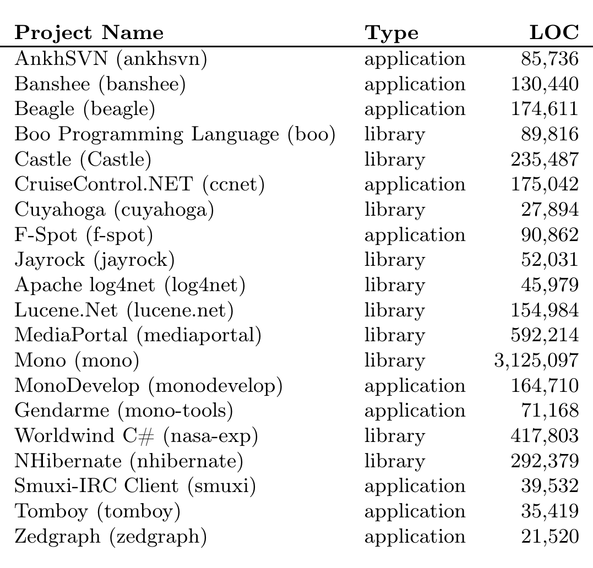

> **Image description:** A side-by-side bar chart (one pair per project) where the left bar (red) shows counts of raw (non-generic) collection usages and the right bar (blue) shows counts of parameterized (generic) type usages at each project’s last analyzed commit. Eleven of the twenty projects have larger blue bars (more parameterized types) while eight projects have larger red bars, and one project (log4net) shows no parameterized types. The largest totals appear in the mono, nhibernate, and mediaportal projects, supporting the paper’s finding that most C# projects tended to adopt System.Collections.Generic collections (i.e., parameterized types) more than legacy non-generic collections in many cases.

Table 1 – The 20 C# projects under investigation.

- The total number of lines of code in 20 C# projects (6,022,724 lines) was much smaller than that of 20 established Java projects (548,982,841 lines) that we analyzed previously [PBMH12]. We speculate that our C# projects were smaller than our Java projects both because the Java projects tended to be older and more mature.

- The first parameterized type in most of the projects appeared within one or two years of the official release of generics. The mono project was the first, introducing its first parameterized type in April 2004, while the lucene.net project was the last, introducing its first parameterized type in June 2008.

- The log4net project never used parameterized types, because although log4net was built on several frameworks, including .NET Framework 2.0, it appears that log4net does not use many features, such as generics, which are not supported in .NET 1.0 for backward compatibility [log07].

- That there did not appear to be a significant relationship between type of project and number of generics, by a two-tailed t-test. That is, libraries did not appear to use generics more or less than applications.

Although we analyzed all of these projects, throughout this paper, for the sake of brevity we focus our discussion on the top three projects based on the total number of parameterized types and raw types. We discuss the other 17 projects when these three projects are not adequately representative. The top three C# projects are as follows:

- mono - An implementation of the C# platform and .NET designed to allow developers to easily create cross-platform applications. This is the largest project, the oldest, and has the largest number of developers among the 20 projects.

---

- nhibernate - An object-relational mapping framework for .NET software projects. It has the 2nd largest total number of parameterized types and raw types, although it is the 4th largest project and has the 10th largest number of developers.
- mediaportal - A media center application for listening, recording, and organizing music, movies, radio, and TV. It has the 3rd largest total number of parameterized types and raw types, is the 2nd largest project, and has the 2nd largest number of developers.

### 4.3 Procedure

We reused our existing Java program analysis framework, written in Java and Python [PBMH12]. However, we modified the framework to enable it to analyze C# code by implementing a C# program extractor that extracts the information we needed to answer our research questions, such as the number of type casts, raw types, parameterized types, var type declarations. In order to implement the C# program extractor, we used NRefactory, a parser library for C# [nre13]. Our framework analyzes the code as follows: download the full history of each project from a remote development repository using Git or Subversion to a local machine; check out every version of every file from a project’s repository, store the different file revisions in an intermediate format, and transfer this information to a database; extract generics information from each file revision and populate the database server with this information; and finally analyze the data in the database in respect to each research question.

### 4.4 Data Characterization

#### 4.4.1 Project Adoption

To get an overview of adoption of the generics feature in C# projects, we investigate the usage of C# generics in the 20 selected projects. We measured the number of both parameterized types and raw types to observe how generics are adopted.

Figure 1 shows the total usage of raw types and parameterized types with the percentage of each type—the ratio of raw types to parameterized types—in a project on the date of the last commit that we analyzed. In C# projects, 11 projects have more parameterized types than raw types while 8 projects used more raw types than parameterized types, and only one project, log4net, did not use generics at all. In Java projects [PBMH12], 8 out of 20 established projects used more parameterized types than raw types, and 5 projects did not use generics at all. To determine whether the adoption rate of generics between the two groups (20 C# projects and 20 Java projects) is different, we used the t-test to compare the ratio of raw types to parameterized types, using a two-tailed distribution assuming unequal variance. From the result of the t-test (p > .05), we can conclude that there is no significant difference between the C# projects’ use of generics and that of Java projects. In the 19 projects using generics, we found that by the latest point in development, developers used more collections that existed solely in the System.Collections.Generic namespace than collections that had implementations that existed in both System.Collections and System.Collections.Generic. In other words, developers tended to use collections that only had generic versions.

---

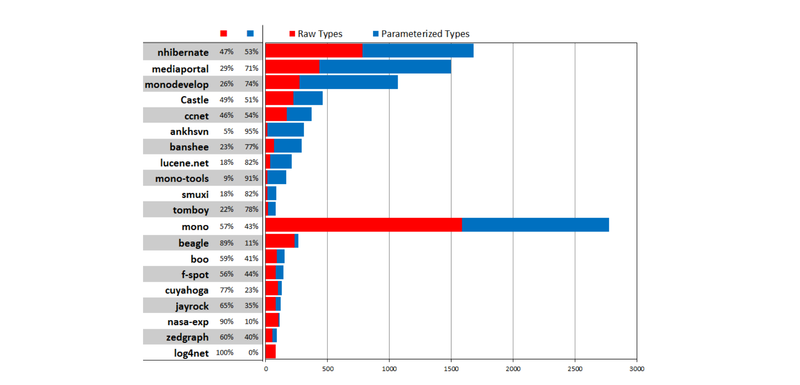

> **Image description:** A horizontal stacked-bar chart that compares counts of raw types (red, left segments) and parameterized (generic) types (blue, right segments) for 20 C# projects at the last analyzed commit. Each project row includes the percent split of raw vs. parameterized types (for example: nhibernate 47%/53%, mediaportal 29%/71%, monodevelop 26%/74%, ankhsvn 5%/95%, beagle 89%/11%, log4net 100%/0%). The mono project has by far the largest absolute volume of types (longest combined bar) while many projects toward the top of the list show a dominance of parameterized types; this visualizes the paper’s finding that 11 projects have more parameterized types than raw types and that log4net did not use generics at all.

Figure 1 – Total usage of raw and parameterized types. 11 projects (above the mono project) have more parameterized types (blue, right) than raw types (red, left).

| Type | Count |
|---|---:|
| ISet<string>* | 55 |
| List<string>* | 36 |
| List<int>* | 21 |
| IList<Student> | 19 |
| IList<string> | 17 |
| IDictionary<string,string> | 16 |
| ISet<T>* | 15 |
| IDictionary<string,TypedValue> | 15 |
| List<T>* | 14 |
| IList<Person> | 14 |
| IDictionary<string,Player> | 14 |
| IList<Parent> | 13 |
| List<Boolean>* | 12 |
| List<Object>* | 11 |
| List<TypedValue>* | 10 |
| List<IType>* | 10 |
| Dictionary<string,string>* | 10 |
| IDictionary<TKey,TValue> | 9 |
| IEnumerator<string> | 8 |
| IEnumerable<Column> | 8 |

Table 2 – Number of parameterizations of different generics in nhibernate.

### 4.4.2 Common Parameterized Types and Arguments

We next analyzed which parameterized types were used and what the common arguments were to those types. Table 2 shows the top 20 parameterized types with distinct type arguments in the nhibernate project. These 20 generic types cover about 43% of generics in the project. ISet<String> is the most used (23.1%) combination, while List is the most commonly used (37.7%) type.

---

As was the general trend in all projects, in nhibernate we found that the percentage of collections used that were only available generically (64.2%) is higher than that of collections that are available in both generic and non-generic versions (35.8%). An asterisk (*) next to a type name in Table 2 denotes the collections that are only available generically.

While the usage patterns of different generics vary from one project to the next, the List-family of types is the most used overall in the projects we studied. Similarly, in open-source Java projects we found that List-family types were the most popular [PBMH12].

We also investigated which type arguments were used. The int type is the most common argument in mono (36.0%) while string is the most common in nhibernate (53.9%) and mediaportal (39.9%). Overall, the string type is used widely in all projects, similar to our findings for Java [PBMH12].

## 5 Investigating C# generics

We next answer our six research questions (Section 4.1). Although we focus our discussion on C# generics, we also relate these results to Java generics [PBMH12].

### 5.1 RQ1: Do generics reduce casts?

To answer RQ1, we analyzed our data to determine whether an increase in generics coincides with a decrease in casts.

We first did this by analyzing plots that compare the number of generics against the number of casts. Figure 2 shows four lines: two dotted lines which represent the raw numbers of casts, and two solid lines which represent normalized values of casts and generics. The top two lines (in red) depict casts, while the bottom two represent generics (in blue). As in previous work [PBMH12], normalized values are calculated by finding the number of casts and generics and dividing that number by Halstead’s program length. Halstead’s program length is the sum of the total number of operators and operands in a program [Hal77]. To determine the number of operators and operands in the program we analyzed, we obtain the abstract syntax tree of each C# file. Then, each abstract syntax tree node is classified as either an operator, if it is defined as such in the C# language specification [C#12], or an operand otherwise. We used a Halstead metric rather than a lines-of-code metric, because Halstead’s program length is a measure of program size that abstracts away code formatting, whitespace, and comments, allowing us to more fairly compare projects that use different coding styles. Normalizing allows us to compare cast and generic usage across each project’s lifetime as each project grows. We have multiplied the normalized values by constants so that trends are more apparent in Figure 2. Because the absolute y-axis values are not themselves meaningful, we leave the y-axis unlabeled.

- The normalized value of casts tends to decrease consistently over time after a period of initial fluctuation. In some cases there are fluctuations in the middle of the graphs. For example, the nhibernate project has a big jump of the normalized value of casts in the middle of 2009 due to unusually high usage of casts and the mediaportal project has a small jump in the middle of 2006. However, the overall decrease in casts does not appear to be directly related to generics, since the

---

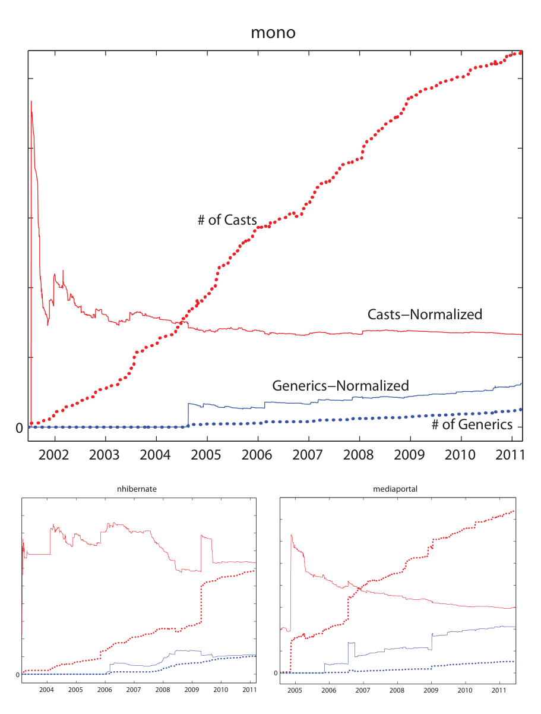

> **Image description:** Three time-series plots comparing casts and parameterized (generic) types for the mono project (large panel) with smaller panels for nhibernate and mediaportal. In each plot red traces show casts (dotted = raw count, solid = casts normalized by Halstead program length) and blue traces show generics (dotted = raw count, solid = normalized); the y-axis is unlabeled because the authors scaled normalized values for visibility. Across mono the raw number of casts (red dotted) rises monotonically to 2011 while the normalized casts (red solid) declines and then levels off; raw generics (blue dotted) appear later (around 2004) and increase slowly, with the normalized generics (blue solid) showing a steady upward trend. The smaller nhibernate and mediaportal panels illustrate similar patterns and highlight periods of inverse change (for example, nhibernate’s large spike in normalized generics corresponds to a sharp drop in normalized casts), supporting the paper’s claim that increases in generics often coincide with reductions in casts.

Figure 2 – Casts and parameterized types over time

> The normalized value of casts tended to decrease over time for all projects, regardless of whether or when generics were introduced.
> 
> - The normalized value of generics tends to increase over time. Nine projects show the number of generics increases monotonically, while the other projects show the number of generics increases steadily with occasional, small drops in the number of generics.
> 
> In addition to these general trends, several specific trends suggest that some relationship between generics and casts exists in several projects. For example, the nhibernate project shows that the normalized value of generics spikes from mid-2007 to mid-2008 while the normalized value of casts sharply decreases. We found such inverse relationships in several other projects as well, including cuyahoga between December 2007 and January 2008, ccnet between March 2009 and April 2009, and mono in the middle of 2004. A total of 8 out of 19 projects which used generics show this sharp inverse relationship at some point in their histories. At least for these projects, this implies that an increase in generics leads to a decrease in casts. However, evidence exists for the opposite case, with 4 projects showing both casts and generics increased concurrently at some point.
> 
> Besides visual inspection of the data, we assessed the strength of the relationship between generics and casts using Spearman’s rank correlation coefficient [MWL10]. For example, if Spearman’s coefficient is a negative value, then an increase in generics is correlated with a decrease in casts (an inverse correlation). Otherwise, it is a direct correlation. Based on our research question, we may expect that most projects exhibit an inverse correlation.

---

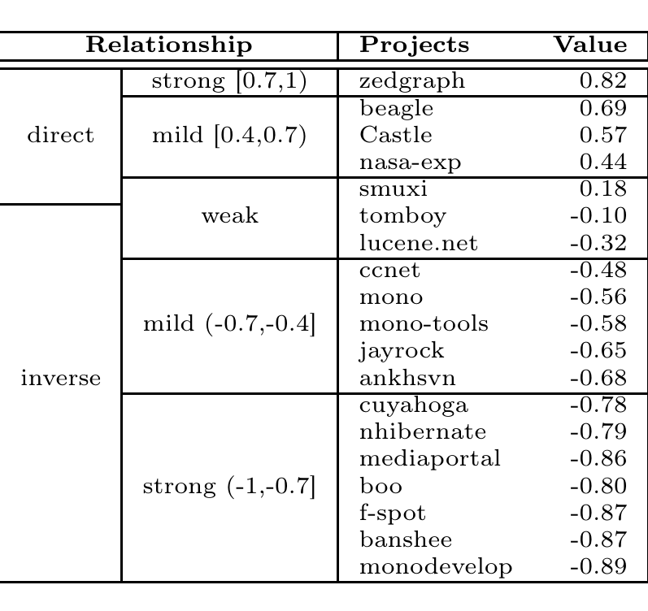

> **Image description:** A table of Spearman rank-correlation coefficients between generics (parameterized types) and casts for 19 C# projects, organized by relationship category and strength (direct strong/mild, weak, inverse mild/strong). Values span from a strong direct correlation 0.82 for zedgraph to a strong inverse −0.89 for monodevelop; other notable entries include mediaportal (−0.86), nhibernate (−0.79), beagle (0.69), and Castle (0.57). In total 12 of the 19 projects fall into the inverse categories (mild or strong), supporting the paper’s finding that most projects show an inverse relationship between generics use and casts, although several projects show weak or direct relationships.

Table 3 – The Spearman’s rank correlation coefficient (at right) for each project.

Table 3 shows Spearman’s rank correlation coefficient for each project. We note that 6 of the projects show a strong inverse relationship and 5 projects show a mild inverse relationship. On the other hand, 2 projects show a strong direct relationship and 3 projects show a mild direct relationship. In short, 12 (63.1%) out of 19 projects indicate an inverse relationship between the use of casts and the use of generics. Seven out of the 8 projects that showed the sharp inverse relationship by our visual inspection also show an inverse Spearman correlation. Of those 7 projects, the relationship was strong for both nhibernate and cuyahoga.

Overall, our results suggest that generics reduce casts in C#. This conclusion about C# generics is the same as our findings for Java [PBMH12]. Similar to Java, data from a small number of projects suggests that more generics sometimes coincides with more casts; further research is necessary to reconcile our research question with these outliers.

## 5.2 RQ2: Do generics prevent code duplication?

To determine whether generics prevent code duplication (RQ2), we analyzed the 20 projects in two different ways. First, we determined how many unique type arguments are used for each generic type. Second, we estimated how many lines of code were saved by using generics.

We first measure how many unique type arguments are used for each generic type defined in a project. There are 283 different generic types defined by developers at the latest point of development in all projects combined. The type that facilitated the most reuse was IEquatable in mono, which was parameterized with 30 different type arguments. However, most generic types were instantiated only once; 155 generic types (54.7%) are parameterized with only one type argument. This number is much higher than in Java, where the percentage of generic types parameterized with only one type argument was 38% [PBMH12].

We next estimated how many lines of code were saved by using generics. To answer RQ2, we count how many different type arguments of each generic type is instantiated by a developer. We then take the number of unique parameterizations (P) of each developer-defined generic type and count the lines of code (LOC) of each generic type at latest point of development. We use the same formula that we used

---

For Java [PBMH12] to estimate the total lines of duplicated code (D):
D = LOC * (P - 1)

For example, suppose that there is a generic class defined by a developer called MyStack<T> that is 100 lines long, and that it is instantiated with 3 different arguments in various places in the program: MyStack<int>, MyStack<string>, and MyStack<double>. Using the above formula, the total lines of duplicated code is 200. Note that this is a rough estimate of duplication; realistically, a developer that does not use generics may be able to remove duplication by creating a common superclass or extracting utility methods.

We estimated the number of lines of code in all generic types by calculating the mean lines of code for the top 20 developer-defined generic types, ordered by the number of unique type instantiations (the mean is 674 lines). We did this estimation because our framework did not automatically calculate the number of lines of code for all developer-defined generic types. Next, across all 20 projects, we found that generic types have a total of 633 distinct parameterized types instantiated from 275 generic types. This indicates that 358 class and interface duplicates were avoided.

Using our formula, we estimate that 241,292 lines of duplicated code would be avoided, which is 4.0% of the total number of lines of code in all 20 C# projects. This percentage of C# code duplication prevention is much higher than the percentage of Java code duplication prevention (0.02%) [PBMH12]. One reason is that the mean LOC of C# generic types (674 lines) were about twice that of Java generic types (378 lines). Another reason is that the mono project tended to make unusually heavy use of large generic types, and skewed the result somewhat. If we exclude the mono project from the estimation of the code duplication, we estimate that 24,198 lines (0.8%) of duplicated code would be prevented. Interestingly, this percentage is still more than an order of magnitude higher than the Java percentage (0.02%), even though the mean LOC (109 lines) of the C# generic types defined by developers is now three times smaller than that of Java.

Overall, our results suggest that C# generics reduce duplication. Although the total amount of duplication prevented is small relative to the size of the projects, more duplication is prevented in C# projects than in Java projects.

### 5.3 RQ3: Are generics used widely by developers?

Recall that C# generics are used by most projects in Section 4.4.1. Specifically, only one project never used generics at all, and 11 projects have higher usage of parameterized types than that of raw types. But how do different developers use generics?

To evaluate RQ3, we first examined commits that create or modify generics (parameterized types, generic type declarations, or generic method declarations) and those that create and modify raw types. We term these commits "associated" with generics or raw types, respectively. In total, 663 developers made 109,714 commits to the projects. Of those developers, 219 used generics (34.3%), 332 developers used raw types (52.0%), and 182 developers used both generics and raw types (28.2%). For each developer, the average number of commits that introduced or modified parameterized types is 40 commits and the average associated with raw types is 29 commits. The total number of commits associated with parameterized types is 8,782; the total number associated with raw types is 9,527. The data suggests that a smaller number of developers use parameterized types more frequently than the larger number of developers use raw types.

---

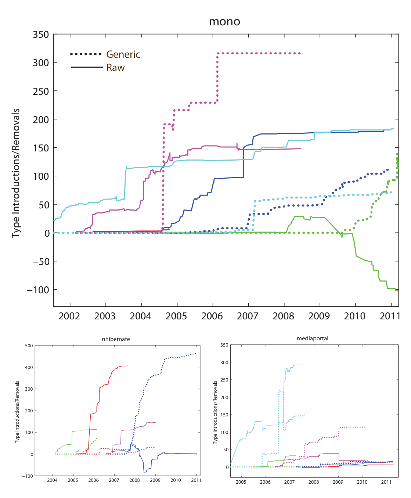

> **Image description:** Three time-series panels plot the top contributors’ introductions (up‑sloping) and removals (down‑sloping) of raw types (solid lines) and parameterized/generic types (dotted lines) over project history. Each colored pair of lines represents one of up to five most active developers; the mono panel shows large spikes in parameterized-type introductions (e.g., a purple dotted line climbing to ~320 around 2006–2007), indicating concentrated adoption by a few contributors. The nhibernate panel shows a strong early rise in raw-type activity (red solid ≈400 around 2006) followed later by a large increase in parameterized types (blue dotted rising toward ≈470), illustrating conversion/adoption dynamics. The mediaportal panel shows a similar concentrated effort (cyan lines) where many raw types are removed while generics are added during a short period (consistent with the paper’s reported large-scale conversion around 2009), supporting the authors’ observation that one or two developers often drive generics introduction or migration in these projects.

Figure 3 – Individual developers’ introduction and removal of parameterized types

Figure 3 shows the introduction and removal of both raw and parameterized types by the most active developers per project. By “most active”, we mean up to 5 developers who made the most commits and, as a group, committed more than 50% of the total commits. A dashed line represents the number of parameterized types while a solid line represents the number of raw types. An upward sloping line represents the introduction of parameterized types, while a downward sloping line represents removals. Pairs of lines with the same color denote the same developer. As was the case with Java projects, we observe that one or two developers show higher usage of generics in the projects as shown in Figure 3. This pattern was observed in the other C# projects such as ankhsvn, banshee, ccnet, f-spot, jayrock, and smuxi.

Based on this visual inspection, it appears that some developers dominate generics usage. To determine if there is a developer who uses generics significantly more on average than other developers, we conducted Fisher’s exact test [DWC04] (applying Benjamini-Hochberg procedure for p-value correction to control the false discovery rate [BH95]) for the top five developers, ordered by the number of parameterized types that developer contributed. We excluded 9 projects that had fewer than 3 developers and one project that did not use generics. We used the ratio of raw types to parameterized types at the latest point of development for each developer for the table values in Fisher’s exact test. In this test, we compared the ratio from the developer who contributed the most parameterized types against the ratio from the

---

other four developers. If all p-values are smaller than .05 for each developer, the top developer uses generics significantly more than the other developers.

The result was that there was no developer that used generics more than the others to a statistically significant degree (p > .05) in the following 10 projects: nhibernate, mono, monodevelop, mediaportal, ankhsvn, banshee, f-spot, mb-unit, mono-tools, tomboy. This means that, for these projects, although one developer may have used generics more than the others, that person did not do so to a level enough to "stand out" and other developers used parameterized types about as much as the top developer used them.

Overall, our results indicate that C# generics are used by a small pool of C# developers. Unlike Java generics, where a single developer in a project tended to use parameterized types significantly more than the other developers, in these C# projects, several developers per project made significant use of parameterized types.

### 5.4 RQ4: Are there large-scale conversions from raw types to generics?

Despite the benefits that generics may have, developers may not convert old code using raw types to use generics. On one hand, using generics may expose and correct dormant InvalidCastExceptions and help reduce duplication in existing code. On the other, developers may not migrate old code because they do not want to risk changing old code that already works. To evaluate whether developers perform such migrations (RQ4), we examined how many raw types are converted to parameterized types.

We begin with a visual inspection of the data. Figure 4 shows the number of raw types and parameterized types over time for three projects. The mono project shows a small conversion around January 2010, and then a leveling off of raw types and a steady increase in the number of generics. Similarly, the nhibernate project shows a conversion from December 2007 to June 2008, with a similar leveling off of raw types and a steady increase in generics. The mediaportal project shows a large scale conversion effort in January 2009, where more than 250 raw types are converted to parameterized types. Unlike the other two projects, all of the raw types from System.Collections were converted into their equivalent generic types from System.Collections.Generic.

We next estimate the number of conversions in each project. In each revision, if the number and type of parameterized types added to a method in the project equals the number and corresponding type of raw types removed in the same method, we count each raw type removed as a conversion. In mono, 1,938 raw types are added, but only 120 (6.2%) were converted. In nhibernate, 235 of 1,072 (21.9%) are converted and in mediaportal 324 of 885 (38.9%) are converted. Although the tomboy shows the highest conversion rate (72.4%), the project only had 29 raw types in total. In total, 6 projects show more than 10% conversion, 6 projects have between 0% and 10% conversion, and 7 projects have no conversion at all. Across all projects, about 14% of raw types were converted. In comparison, in Java that number was about 8%, although the difference between Java and C# was not statistically significant (Mann-Whitney U-test, p > .05).

Overall, our results suggest that most projects do not perform significant generic migrations in old code, although we do observe a few large-scale efforts in some projects. This finding is consistent with our findings for Java [PBMH12].

---

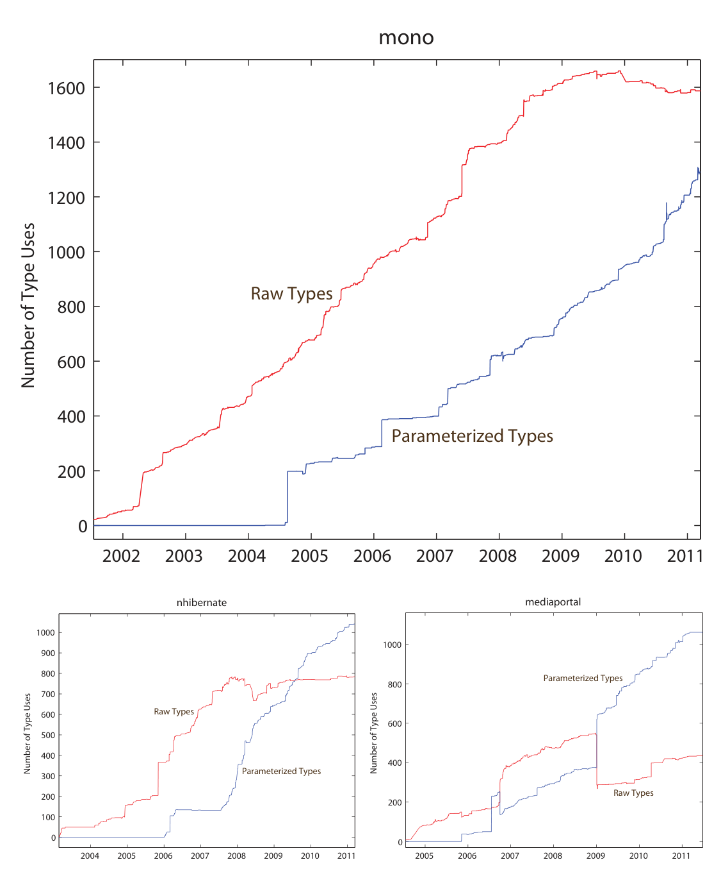

> **Image description:** Three time-series plots (x-axis: years ~2001–2011; y-axis: Number of Type Uses) compare raw types (red line, collections from System.Collections) and parameterized types (blue line, generics) for the mono (large top plot), nhibernate (bottom-left), and mediaportal (bottom-right) projects. In mono, raw types rise early and reach ≈1,600 uses by 2010 while parameterized types are introduced around 2004–2005 and grow to ≈1,300 by 2011, with raw usage leveling off near 2009–2010. In nhibernate the red (raw) curve plateaus around ~750–800 uses while the blue (parameterized) curve climbs sharply after 2007 and surpasses raw types (≈1,000 parameterized by 2011). In mediaportal a pronounced conversion is visible around 2009: parameterized types jump (eventually to ≈1,000) as raw types drop and then stabilize (~400–500). These specific traces illustrate the paper’s finding that some projects performed large-scale migrations from raw collections to generic (System.Collections.Generic) types while others show more gradual adoption. 

Figure 4 – The number of raw types and parameterized types over time.

### 5.5 RQ5: Do generics improve performance?

As we explained in Section 4.1, generics may improve the overall performance of a project because when value types are used as generic type arguments, values do not have to be converted to and from objects. To estimate whether performance could actually be improved in open-source C# projects (RQ5), we analyzed how many value types are used as generic type arguments in a project.

Figure 5 shows the percentage of value types used in parameterized types over time for three projects. In total, 17 out of 19 projects that used generics also used value types as generic type arguments. Of those 17, value types were used in 35.9% of parameterized types. After the project introduces generics, over time the overall usage of value types in each project remains more or less constant above 30% for most projects. According to the performance comparisons performed by Kennedy and Syme [KS01], use of value types with generics can provide a significant speedup compared to object conversion. For example, they showed that when int and double were used as generic type arguments in a small benchmark, they were able to achieve a speedup of 4.5 times and 5 times, respectively, compared to a similar benchmark without generics. This indicates that the performance of C# projects doubles while executing generic code that includes 30% value types in parameterized types, which are 4.5 times faster than reference types. Overall, our results suggest that C#’s

---

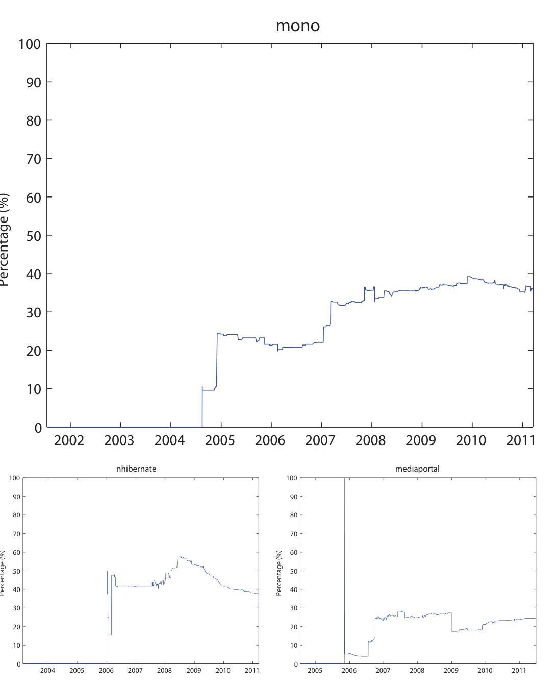

> **Image description:** Three time-series plots (large panel for mono, two smaller panels for nhibernate and mediaportal) show the percentage of generic type instantiations that use value types on the x-axis (years ~2002–2011) with the y-axis labeled Percentage (%). Mono rises from near 0% before 2005 to roughly 30–38% by 2008–2010, indicating steady adoption of value-type generics; nhibernate shows a peak around 50–58% in 2007–2008 followed by a gradual decline to ~35–40% by 2011. Mediaportal has an anomalous spike early (an artifact at ~2006) but otherwise climbs from single digits to about the mid-20% range after 2006. These trends illustrate the paper’s finding that most projects that adopt generics also use value types substantially (often ~30% of parameterized types), which can yield the performance benefits discussed in the text.

Figure 5 – The percentage of value types used in parameterized types over time.

Implementation of generics improve performance.

## 5.6 RQ6: Do developers prefer implicit generic type declarations?

As explained in Section 4.1, programmers can declare local variables with the var keyword instead of using explicitly typed generics. This may encourage the use of generics because redundancy can be reduced. At the same time, however, using the var keyword may reduce readability. Our research question (RQ6) is whether developers prefer to reduce redundancy by using the var keyword with generics. To answer this research question, we analyzed the projects looking for two different but equivalent programming statements, generic assignments that use var and assignments that do not use var:

```
var list = new List<String>();
List<String> list = new List<String>();
```

For simplicity, we limited our analysis to assignments where the variable is declared on the left-hand side of the expression and the right-hand side of the expression is a call to a constructor with one or more generic type arguments. We then examined how many var types are used over time by each developer in each project.

---

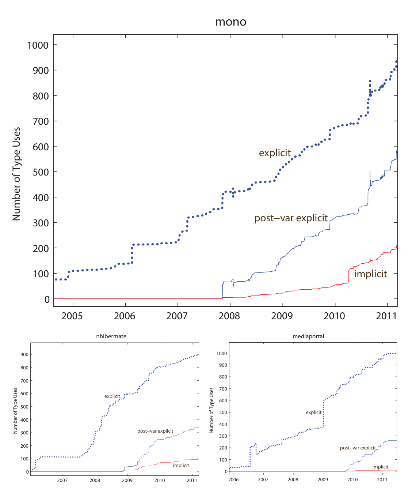

> **Image description:** Three time-series panels compare explicit parameterized type declarations (blue dotted), explicit declarations added after the project first adopted var (solid blue), and implicit var declarations (solid red) from ~2004–2011. In all three projects explicit uses dominate and grow steadily; post-var explicit additions begin after var was introduced (~2007–2008) and remain substantially larger than implicit uses. Implicit (var) declarations remain rare: by 2011 mono shows roughly ~900 explicit, ~580 post-var explicit, and ~200 implicit uses; nhibernate about ~900 explicit, ~350 post-var explicit, and ~100 implicit; mediaportal about ~1,000 explicit, ~270 post-var explicit, and only a few dozen implicit. These plots support the paper’s finding that few projects or developers adopted var for generic locals (only 4 of 19 projects used var; mono, nhibernate, mediaportal var percentages after first use were 25.7%, 22.1%, and 3.3%, respectively).

Figure 6 – The usage of implicit and explicit generic declarations over time.

Figure 6 shows the numbers of explicit types and implicit types over time. In the figure, explicit denotes parameterized types defined explicitly and implicit denotes parameterized types defined with var types. However, directly comparing these two is not a fair comparison, since implicit local variable typing was not available when these projects began. Therefore, in Figure 6, post-var explicit denotes that the number of explicit parameterized type declarations which are added after first introducing the var type in a project. Intuitively, post-var explicit represents a community choice not to use implicit typing. Looking at the figures, the number of post-var explicits are always larger than that of implicit. In fact, only 4 out of 19 projects use the var type with local parameterized type variables. The percentage of var types for each of mono, nhibernate, and mediaportal after their first use of var are 25.7%, 22.1%, and 3.3%, respectively. We also found that after using var for the first time, only 1 out of 30 developers continued to use var as their preferred way to declare generic local variables.

Although developers did not appear to use var very often, we were curious as to whether concision was important to developers at all. We postulated that if concision is important, developers would be more likely to use var when creating a Dictionary than when creating a List because declaring a Dictionary with generics is more verbose. We indeed found that this postulate is true: only 21% of Lists were declared with var while 49% of Dictionaries were.

---

Overall, the data and our analysis suggest that (1) the usage of implicit generics declaration is relatively low, (2) a small number of developers use var, and (3) developers prefer implicit generic declarations for succinct syntax. Based on the first two points, we conclude that our results suggest that developers do not prefer implicit type declarations when using generics. Although the number of implicit generic declarations is increasing steadily, the var type is not used widely by C# developers.

### 5.7 Threats to Validity

Our results have several limitations. First, our analysis of RQ1 is coarse-grained in that it looks at general cast and generic trends across whole codebases. With more sophisticated analysis, we may be able to identify individual casts that were removed due to using generics and compare that with other contexts for removal. Second, our analysis of RQ2 only applies to code duplication internal to a project. One factor that is not accounted for is that some generic library classes may be intended for client use. In those cases, we may be underestimating the amount of code duplication that is reduced. Third, our analysis of RQ4 is that our heuristic for identifying conversions from raw types to generics may have counted some changes as migrations when they were not and vice versa. However, we evaluated this heuristic in previous work and found that it was in fact quite precise [PBMH12]. Fourth, our analysis of RQ5 stems from our static analysis of performance. There may be other conditions that mask or dwarf the performance gains from value types during execution of the program. In the future, a dynamic analysis of these programs using their own unit tests would allow us to more accurately measure what performance gain developers can expect from using generics with value types. Fifth, because we examine var use in only a limited form for RQ6, there may be other dynamics we are not capturing. For example, developers may be less likely to use implicit declarations for storing the return value of a method call. In future work, a deeper semantic analysis could more closely examine these factors. Sixth, we included the Mono and MonoDevelop projects because they fit our criteria for project selection, yet because the developers of these projects are necessarily very familiar with C# language features, these two projects are likely not representative of the average C# project. Seventh, as we noted earlier, the projects we studied in C# were substantially smaller than the Java projects. This may have some confounding effects when we compare Java to C# generics for the projects we studied. Finally, the research questions in this paper were formulated and answered using quantitative research methods, meaning that we could observe trends, but only hypothesize why those trends exist. To confirm why those trends exist, we must use more qualitative research methods, such as interviews with the programmers who created the code.

## 6 Discussion

### 6.1 Design Choice Matters

In our study, we observed that generics were somewhat, though not statistically significantly, more widely used in C# than in Java (Section 4.4.1), and also that generics allowed more duplication to be eliminated in C# programs than in Java programs (Section 5). At least in the sense of adoption and duplication elimination, why was the introduction of generics in C# more successful than in Java?

---

One reason for the difference appears to be the way the language feature was introduced into the two languages. In Java, language designers allowed existing classes to be “generified” without forcing developers of those classes to use parameterized types, but instead gently encouraging them to do so with compiler warnings. At the same time, standard Java library maintainers took advantage of this and generified their collections library, presumably with the hope that the Java compiler’s warnings would encourage end developers to adopt generics. In contrast, C# took a different approach. While C# library designers offered generic versions of existing collections, they also offered a new set of generic collections. This essentially offered an additional incentive to use generics—if a developer wanted to use the new collections, they must learn to use generics.

Our results suggest that this C# incentive-based approach paid off based on the higher adoption rates and higher duplication-elimination, compared with Java. As evidence, as shown in Section 4.4.2, most generic types used in C# projects belong to the System.Collections.Generic namespace, types that must be used as parameterized types. This suggests that the newly introduced collections were valuable enough that developers were willing to use them, even if that meant they had to learn a new language feature. As a result, C# projects gain the benefits of generics from developers’ pains—"No pain, No gain."

On the other hand, our results suggest that generics in C# may have been a victim of their own success. Specifically, the rate of end-developer-defined generic types used with only one type argument was substantially higher than in Java; we found about half of these types were parameterized with only one type argument (Section 5.2). One explanation could be that these types were used largely in library code, that is, external developers were expected to parameterize these types with a variety of type arguments, even if the library’s own code did not. Another explanation is simply over-generalization: developers anticipated a class would be useful with a wider variety of type arguments than it actually was. From our own experience as developers, it is easy to fall into the trap of being so enamored with the power of a language feature that you use it in places where it would do something “cool,” even if it is not very useful.

## 6.2 Readability Over Concision

Before the study, we expected that developers would frequently use the var type to avoid repetition. Indeed, our finding about using var more commonly with the two-type argument Dictionary<TKey, TValue> than with the one-type argument List<T> suggests that readability is a factor. However, we were surprised that, overall, developers rarely used var, even after they learned how to use it. We speculate that part of the reason has to do with whether the code was meant to be read by others. If the code being written is closed source, is experimental, or is worked on by only one developer, then the use of var may be a more acceptable practice. In the projects we studied, which were open-source, mature, and multi-developer, the use of var may not have been seen as a collaboration-friendly programming construct. We plan on investigating the factors that lead to var use in future work by contacting C# developers directly.

---

## 6.3 Implications

Our results have implications for language design and in fact have already begun to inform language designers. As an example, TouchDevelop5, a language designed to enable easy development on mobile devices, currently has no support for generics. After we discussed our empirical results with the language’s designers, they chose not to add support for generics in an upcoming release. They concluded that adding generics would bring too much complexity for little gain and most functionality could be provided with special collection libraries based on our findings (1) that collections of strings (e.g., sets, lists, dictionaries) account for a large majority of generics use and (2) that developers use standard generic classes much more than they create them.

## 7 Conclusion

Throughout the empirical study of C# generics, we investigated the claimed benefits from language designers and whether the benefits hold in real open-source projects. We compared the results of C# generics with those of Java generics. The results suggest that the percentage of C# developers using generics is larger than that of Java developers using generics. Specifically, we showed that several benefits of the generics feature are manifested more clearly in C# than in Java. Based on these results and those for Ada and Java generics, we have found that developers may not always reap the benefits of language features in different implementations. While our results are interesting, there remain several limitations to our approach, and further research is necessary to validate whether our findings apply more broadly. Nonetheless, we hope that our experimental results can assist language designers in making evidence-based decisions when introducing language features, which in turn will amplify the benefits of those features in practice.

## A Appendix

In this Appendix, we show extended figures for all projects.

5 http://www.touchdevelop.com

---

## References

- [ada86] Jean D. Ichbiah, John G. P. Barnes, Robert J. Firth, and Mike Woodger. Rationale for the Design of the Ada Programming Language, 1986.

- [Aus99] Matthew H. Austern. Generic Programming and the STL: Using and Extending the C++ Standard Template Library. Addison-Wesley, 1999.

- [BH95] Y. Benjamini and Y. Hochberg. Controlling the false discovery rate: a practical and powerful approach to multiple hypothesis testing. Journal of the Royal Statistical Society. Series B (Methodological), 57(1):289–300, 1995.

- [Blo08] Joshua Bloch. Effective Java. Prentice-Hall, 2008.

- [BOSW98] Gilad Bracha, Martin Odersky, David Stoutamire, and Philip Wadler. Making the future safe for the past: Adding genericity to the Java programming language. In Conference on Object-Oriented Programming, Languages and Systems (OOPSLA), 1998.

- [BRJ05] Hamid Abdul Basit, Damith C. Rajapakse, and Stan Jarzabek. An empirical study on limits of clone unification using generics. In Proceedings of the Conference on Software Engineering and Knowledge Engineering (SEKE), 2005.

- [C#12] C# operators, 2012. http://msdn.microsoft.com/en-us/library/6a71f45d.aspx.

- [CCH+89] Peter Canning, William Cook, Walter Hill, Walter Olthoff, and John C. Mitchell. F-bounded polymorphism for object-oriented programming. In Proceedings of the Conference on Functional programming languages and computer architecture (FPCA), 1989. doi:http://doi.acm.org/10.1145/99370.99392.

- [DW05] Laurentiu Dragan and Stephen M. Watt. Performance analysis of generics in scientific computing. In Symposium on Symbolic and Numeric Algorithms for Scientific Computing (SYNASC), 2005. doi:10.1109/SYNASC.2005.56.

- [DWC04] Shirley Dowdy, Stanley Weardon, and Daniel Chilko. Statistics for Research, Third Edition. Wiley-Interscience, 2004.

- [Fra93] Michael Frankel. Enabling reuse with Ada generics. In Proceedings of the Washington Ada symposium on Ada: Ada’s role in software engineering (WADAS), pages 17–30, 1993. doi:http://doi.acm.org/10.1145/260096.260201.

- [Gen04] Gilad Bracha. Generics in the Java Programming Language, 2004. http://java.sun.com/j2se/1.5/pdf/generics-tutorial.pdf.

- [GJLS03] Ronald Garcia, Jaakko Jarvi, Andrew Lumsdaine, and Jeremy G. Siek. A comparative study of language support for generic programming. In Proceedings of the Conference on Object-oriented programming, systems, languages, and applications (OOPSLA), 2003. doi:10.1145/949305.949317.

- [Hal77] Maurice H. Halstead. Elements of Software Science. Operating and programming systems. Elsevier, 1977.

---

[IPW01] A. Igarashi, B.C. Pierce, and P. Wadler. A recipe for raw types. In Proceedings of Workshop on Foundations of Object-Oriented Languages (FOOL), 2001.

[Jon11] Jonathan Pryor, Comparing Java and C# Generics, 2011. http://www.jprl.com/Blog/archive/development/2007/Aug-31.html.

[Juv11] Juval Lowy, An Introduction to C# Generics, 2011. http://msdn.microsoft.com/en-us/library/ms379564%28v=vs.80%29.aspx.

[KS01] Andrew Kennedy and Don Syme. Design and implementation of generics for the .Net common language runtime. In Programming Language Design and Implementation (PLDI), 2001.

[log07] Logging Services, 2007. http://logging.apache.org.

[LSAS77] Barbara Liskov, Alan Snyder, Russell Atkinson, and Craig Schaffert. Abstraction mechanisms in Clu. Commun. ACM, 20(8):564–576, August 1977. doi:10.1145/359763.359789.

[MWL10] Jerome Myers, Arnold Well, and Robert Frederick Lorch. Research Design and Statistical Analysis, Third Edition. Routledge Academic, 2010.

[nre13] NRefactory, A parser library for C# and VB, 2013. http://wiki.sharpdevelop.net/NRefactory.ashx.

[PBMH12] Chris Parnin, Christian Bird, and Emerson Murphy-Hill. Adoption and use of java generics. Empirical Software Engineering, 2012. doi:10.1007/s10664-012-9236-6.

[RJ05] Gabriel Dos Reis and Jaakko Jarvi. What is generic programming? In Library-Centric Software Design LCSD, 2005.

[RSB05] Barbara G. Ryder, Mary Lou Soffa, and Margaret Burnett. The impact of software engineering research on modern programming languages. ACM Trans. Softw. Eng. Methodol., 14:431–477, October 2005. doi:http://doi.acm.org/10.1145/1101815.1101818.

[Ske10] Jon Skeet. C# in Depth, 2nd edition. Manning Publications, 2010.

[TIO00] TIOBE Programming Community Index, October 2000. http://www.tiobe.com/index.php/content/paperinfo/tpci/index.html.

[var10] Implicitly Typed Local Variables (C# Programming Guide), 2010. http://msdn.microsoft.com/en-us/library/bb384061.aspx.

## About the authors


> **Image description:** A color head-and-shoulders portrait of one of the paper’s authors, taken outdoors against a light brick or stone wall. The subject has short dark hair, rectangular eyeglasses, and wears a striped collared shirt beneath a dark blazer, looking slightly off to the right. This image appears in the paper’s "About the authors" section and accompanies the author’s biographical text.

Donghoon Kim is a PhD student in the Department of Computer Science at North Carolina State University, USA. His research is at the intersection of Software Engineering and Programming Languages. Previously, he had worked at Samsung Electronics, Korea (Republic of) after receiving his Master of Science Degree at Auburn University, USA. Contact him at dkim2@ncsu.edu, or visit http://www4.ncsu.edu/~dkim2/.

---


> **Image description:** A vertically cropped portrait showing the right half of an adult male’s face and upper torso against a painted wall. Visible features include short brown hair, a slight smile with a cheek dimple, and a dark sweater; the background contains green and red circular paint. The photograph appears as an author headshot in the paper’s “About the authors” section and is offset to the right with wide white margins on the page.

> **Emerson Murphy-Hill** is an assistant professor in the Department of Computer Science at North Carolina State University. His research interests include human-computer interaction and software tools. He holds a Ph.D. in Computer Science from Portland State University. Contact him at emerson@csc.ncsu.edu, or visit http://www.csc.ncsu.edu/faculty/emerson.


> **Image description:** A vertical, tightly cropped photographic portrait used in the paper’s “About the authors” section, showing only the right half of a person’s face and upper shoulder. The subject wears glasses and a dark jacket with a collared shirt; the background is an out-of-focus textured outdoor surface (appearing like moss-covered rock). The image is framed with white page margins on the left and top, indicating it is one of the small author headshots accompanying the paper’s biographies on page 26.

> **Chris Parnin** is a PhD student at the Georgia Institute of Technology. His research interests include psychology of programming and empirical software engineering. Contact him at chris.parnin@gatech.edu, or visit http://cc.gatech.edu/~vector.


> **Image description:** A cropped color headshot of an author from the paper’s “About the authors” section (page 26). The photograph shows the right half of a smiling adult male’s face and neck: short brown hair, light facial stubble, and a light-colored shirt; the left side of the image is mostly blank white space from the page layout. The background includes a dark diagonal element behind the head, and the crop omits the left eye and much of the surrounding context, indicating this is one of several small author portraits printed on that page.

> **Christian Bird** is a researcher in the empirical software engineering group at Microsoft Research. He is primarily interested in the relationship between software design, social dynamics, and processes in large development projects. Christian received his Ph.D. from U.C. Davis under Prem Devanbu and was a National Merit Scholar at BYU, where he received his B.S. in computer science. Contact him at cbird@microsoft.com, or visit http://www.cabird.com/.


> **Image description:** A small, cropped head-and-shoulders photograph placed at the right of the page, with a large white margin to the left. The person in the image wears a plain blue shirt and glasses and has hair gathered into short locks; only part of the face, shoulder and upper torso are visible against a faint, out-of-focus outdoor background. This image is one of the authors' portraits accompanying the paper’s "About the authors" section.

> **Ronald Garcia** is an assistant professor in the Department of Computer Science at University of British Columbia, Canada. His research interests include programming language semantics, design, and implementation, including language support for library-centric and modular software development, generic and generative programming, and domain specific languages and libraries. Contact him at rxg@cs.ubc.ca, or visit http://www.cs.ubc.ca/~rxg/.

## Acknowledgments

Thanks to Titus Barik, Xi Ge, Brittany Johnson, Da Young Lee, Jun Bum Lim, Yoonki Song, and Shundan Xiao, all of whom provided valuable feedback.

---

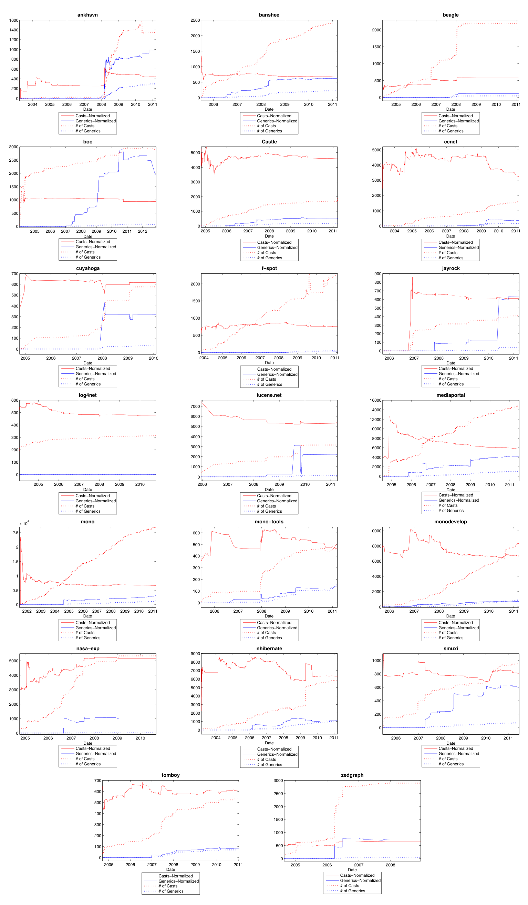

> **Image description:** A 5×4 grid of small time-series plots (one per project) showing four curves per plot: normalized casts (solid red), normalized generics (solid blue), raw number of casts (red dotted), and raw number of parameterized types (blue dotted). The x‑axis is time (early 2000s to 2011) and the y‑axis is unlabeled because normalized values were multiplied for visibility. Across most projects the red (casts) curves trend downward while the blue (generics) curves trend upward, illustrating the paper’s finding that normalized casts tend to decrease over time as generics increase; several projects (for example nhibernate, cuyahoga, ccnet, and mono) show sharp inverse spikes where a rapid rise in generics coincides with a pronounced drop in casts, while a few projects are outliers where casts and generics rise together.

Figure 7 – RQ1 - Cast and parameterized types for all projects (extended Figure 2)

Journal of Object Technology, vol. 12, no. 4, 2013

---

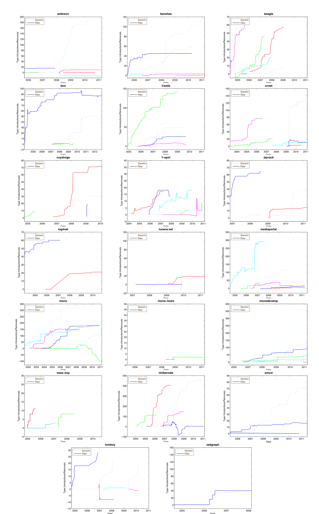

> **Image description:** A 4×5 grid of small time-series panels, one per C# project, plotting ‘Type Introductions/Removals’ (y‑axis) against Date (x‑axis). In each panel pairs of same‑colored lines show a single developer’s activity: a dashed line denotes parameterized (generic) type additions/removals and a solid line denotes raw type additions/removals; upward slopes indicate introductions and downward slopes indicate removals. The panels illustrate varied adoption patterns across projects — several projects (for example mono, nhibernate, mediaportal, and others named in the paper such as ankhsvn, banshee, ccnet, f‑spot, jayrock, smuxi) show one or two developers with steep increases in parameterized-type activity, while projects like log4net remain essentially flat. This multi‑panel figure supports the paper’s observation that a small number of developers tend to drive generics usage within many projects, though the exact temporal patterns differ by project.

Date Date

Figure 8 – RQ3 - Individual developers’ introduction and removal of parameterized types for all projects (extended Figure 3)  
Journal of Object Technology, vol. 12, no. 4, 2013

---

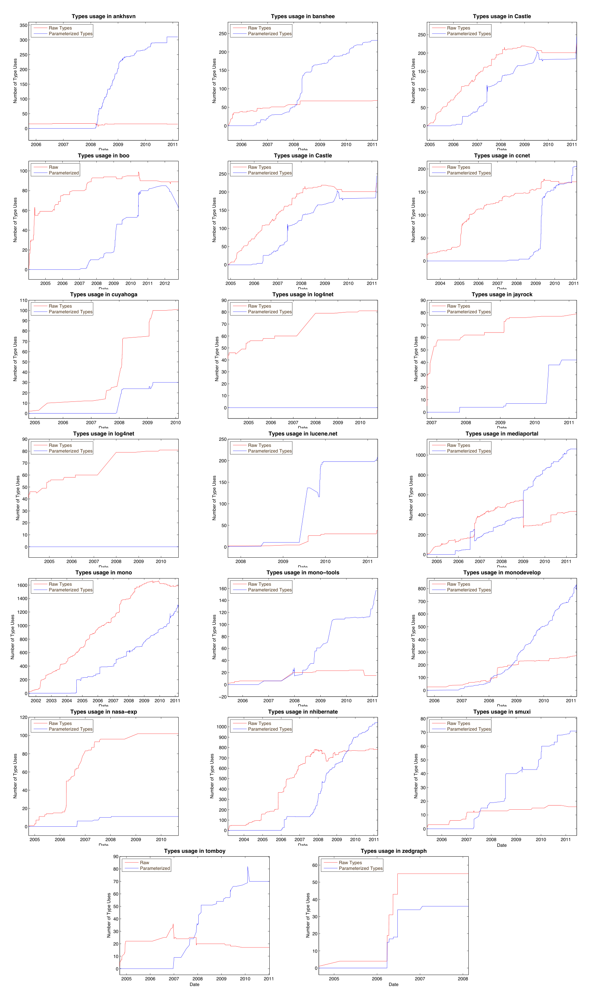

> **Image description:** A multi-panel figure of small time-series charts (one panel per project) showing counts of Raw Types (red lines) and Parameterized Types (blue lines) over time (x-axis: date; y-axis: number of type uses). Panels are titled with project names (e.g., ankhsvn, banshee, Castle, ccnet, log4net, mono, nhibernate, mediaportal, etc.) and illustrate diverse adoption patterns: some projects show sharp conversions where red declines while blue rises (notably mediaportal’s large conversion around January 2009 and nhibernate’s conversion from late 2007 to mid-2008), others show parameterized types growing without displacing raw types, and a few (e.g., log4net) show essentially no parameterized-type use. These per-project plots visually support the paper’s RQ4 findings that conversion rates vary widely—a small number of projects performed large-scale raw-to-generic migrations while most projects performed modest or no conversion (the paper reports about 14% of raw types converted across projects).

Figure 9 - RQ4 - The number of raw types and parameterized types for all projects (extended Figure 4)

Journal of Object Technology, vol. 12, no. 4, 2013

---

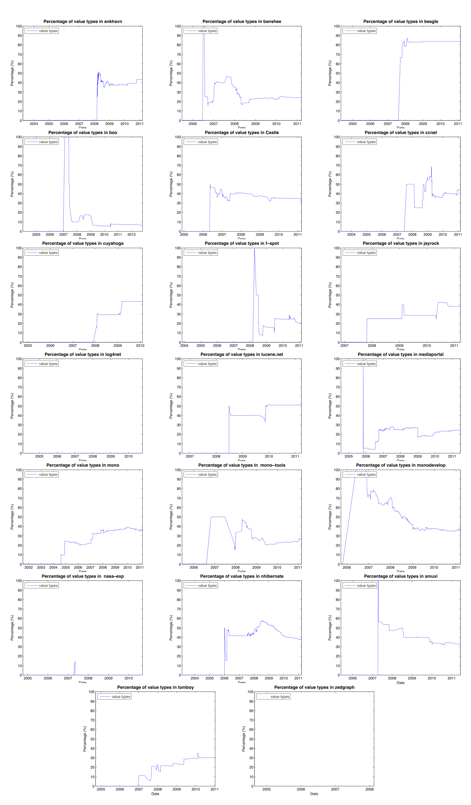

> **Image description:** A grid of small time-series plots (one panel per project) showing the percentage (y-axis, 0–100%) of parameterized types that use value (primitive) type arguments over time (x-axis, ~2004–2011). The figure documents per-project trajectories: some projects have near-zero or empty lines (projects that never used generics, e.g., log4net), while most projects show non‑zero usage that typically spikes when generics are introduced and then settles to a roughly stable level. As reported in the paper, 17 of 19 projects that used generics also used value types and value types accounted for about 35.9% of parameterized types overall; many panels therefore stabilize around the 30–50% range, though individual projects (for example mono and nhibernate) show different shapes and magnitudes of adoption across their histories.

Date Date

Figure 10 – RQ5 - The percentage of value types used in parameterized types for all projects (extended Figure 5)  
Journal of Object Technology, vol. 12, no. 4, 2013